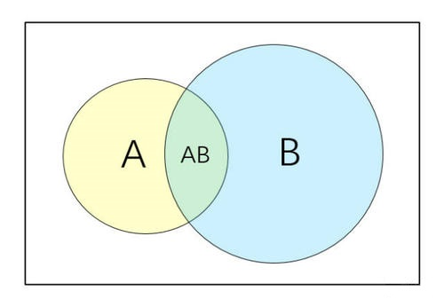
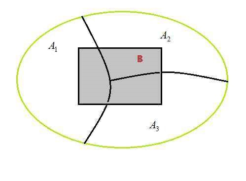

Chapter 2 基本概念

----
计算语言学有两种基本研究方法

- 基于规则的方法
	- 理论基础：乔姆斯基文法理论
- 基于统计的方法
	- 理论基础：数理统计，信息论
----
主要内容
1. 概率论基本概念
2. 信息论基本概念
---
#### 概率论基本概念

1. 概率
2. 条件概率
3. 乘法公式
4. 全概率公式
5. 贝叶斯公式
6. 最大似然估计
7. 二项式分布
8. 条件概率分布
9. 联合概率分布
10. 期望
11. 方差

----
概率是从随机实验中的事件到实数域的函数，用以 表示事件发生的可能性。如果用$P(A)$作为事件$A$的概率，$\Omega$是实验的样本空间，则概率函数必须满足如下公理：
- 公理1：`$P(A)\geq0$`（非负性） 
- 公理2：`$P(\Omega)=1$`（规范性）
- 公理3：如果对任意的`$i$`和`$j(i\neq j)$`,事件`$A_i$`和`$A_j$`不相交`$(A_i\bigcap A_j=\phi)$`,则有：`$P(\bigcup_{i=0}^\infty A_i)=\sum_{i=0}^\infty P(A_i)$`（可列可加性）

----

条件概率(Conditional probability)

在事件B发生的条件下事件A发生的概率：
$$
P(A|B)=\frac {P(A,B)}{P(B)}=\frac {\frac {n_{AB}}{N}}{\frac {n_B}{N}}=\frac{n_{AB}}{n_B}
$$
其中，`$n_B$`代表事件`$B$`出现的次数,`$n_{AB}$`代表事件`$A$`和`$B$`同时出现的次数。
`$N$`是试验总次数
----

----
乘法公式

- 设`$A$`、`$B\in S, P(A)>0$`,由`$P(B|A)=\frac {P(A,B)}{P(A)}$`可得`$P(A,B)=P(A)P(B|A)$`，称为事件`$A$`、`$B$`的概率乘法公式。
- 若`$P(B)>0$`,则还有`$P(AB)=P(B)P(A|B)$`
- 上式还可推广到三个事件的情况：`$P(ABC)=P(A)P(B|A)P(C|AB)$`
- 一般情况下，有下列公式：
- `$P(A_1A_2...A_n)=P(A_1)P(A_2|A_1)...P(A_n|A_1...A_{n-1})$`
- 注：乘法法则一般用于计算`$n$`个事件同时发生的概率

----

词性标注问题问题

- "a red apple"的词性序列为"det,adj,n",计算这三个词性出现的概率如下：
- `$P(det,adj,n)=P(det)\times P(adj|det)\times P(n|det,adj)$`
----
计算一个句子的概率如下：

`$P(w_1,w_2,...w_n)=P(w_1)\times P(w_2|w_1)\times ... P(w_n|w_1..w_{n-1})$`

其中，`$w_1,w_2,...w_n$`可以看做是组成句子的词，也可以看成是组成句子的字。
----
全概率公式

事件组`$A_1,A_2,...A_n$`(`$n$`可为`$\infty$`)称为样本空间`$S$`的一个划分，若一下条件满足：
1. `$\bigcup_{i=1}^nA_i=S$`
2. `$A_iA_j=\phi,(i\neq j)(i,j=1,2,...n)$`

----
定理

设`$A_1,A_2,...A_n$`是`$S$`的一个划分,且`$P(A_i)>0,(i=1,2,...,n)$`则对任何事件`$B\in S$`有:

`$P(B)=\sum_{i=1}^nP(A_i)P(B|A_i)$`
称为全概率公式。
----
全概率公式的使用

把事件`$B$`看作某一过程的结果,把`$A_1,A_2,...A_n$`看作该过程的若干个原因。根据历史资料,每一原因发生的概率已知,即`$P(A_n)$`已知,而且每一原因对结果的影响程度已知,即`$P(B|A_n)$`已知,则我们可用全概率公式计算结果发生的概率,即求`$P(B)$`
----
市场上有甲、乙、丙三家工厂生产的同一品牌产品,已知三家工厂的市场占有率分别为`$\frac{1}{4},\frac{1}{4},\frac{1}{2}$`,且三家工厂的次品率分别为 2%、1%、3%,试求市场上该品牌产品的次品率。设:
- `$B$`为买到一件次品的时间
- `$A_1$`:买到一件丙厂的产品
- `$A_2$`:买到一件丙厂的产品
- `$A_3$`:买到一件丙厂的产品

`$P(B)=P(BA_1)P(BA_2)P(BA_3)$`
`$=P(B|A_1)P(A_1)P(B|A_2)P(A_2)P(B|A_3)P(A_3)$`
`$=0.02\times \frac{1}{4}+0.01\times \frac{1}{4}+0.03\times \frac{1}{2} \approx 0.0225$`
----
贝叶斯公式

贝叶斯公式（Bayesian formula）在统计自然语言处理中占据着重要的地位。 
当直接计算条件概率`$P(B|A)$`比较困难，而`$P(A|B)$`已知或是容易计算时，可以使用贝叶斯公式通过`$P(A|B)$`来计算`$P(B|A)$`。
$$
P(B|A)= \frac{P(AB)}{P(A)}=\frac{P(A|B)P(B)}{P(A)}
$$
- `$P(B)$`为先验概率，是指根据以往经验和分析得到的概率；
- `$P(B|A)$`为后验概率，是指事情已经发生，求事件发生的原因由某因素引起的可能性的大小
- `$P(AB)$`为联合概率
----
从机器学习的角度，可以视`$A$`为特征、`$B$`为标签或类别，那么贝叶斯公式可以表示为：

$$P(类别|特征)=\frac{P(特征|类别)P(类别)}{P(特征)}$$其中，

- `$P(类别|特征)$`为已知样本具有特定特征的条件下，该样本属于指定类别的概率
- `$P(特征|类别)$`为已知样本属于指定类别的条件下，该样本具有特定特征的概率
- `$P(类别)$`为未知样本具有特定特征的条件下，该样本属于指定类别的概率
- `$P(特征)$`为未知样本属于指定类别的条件下，该样本具有特定特征的概率
----
贝叶斯用于文本分类问题

句子“我司代开正规发票”,其类别为垃圾邮件

$$
P(垃圾邮件|我司代开正规发票)
$$
$$=\frac{P(我,司,代开,正规,发票)P(垃圾邮件)}{P(我,司,代开,正规,发票)}
$$
----
设标签“垃圾邮件”为`$S$`
$$
P(我,司,代开,正规,发票|S)
$$
$$
\approx P(我|S)P(司|S)P(代开|S)P(正规|S)P(发票|S)
$$

- 这就是条件独立假设
- Bayes方法加上条件独立假设就是朴素贝叶斯方法(Naive Bayes)
----
朴素贝叶斯失去了词语之间的顺序信息。这就相当于把所有的词汇扔进到一个袋子里随便搅和，贝叶斯都认为它们一样。因此这种情况也称作词袋子模型(bag of words)。

----
最大似然估计(Maximum Likehood Estimation MLE)
----
信息论基本概念
信息量
自信息
联合自信息
条件自信息
熵(entropy)——平均自信息
条件熵
联合熵
相对熵
交叉熵
互信息
困惑度

----
人们普遍认为，Claude Elwood Shannon 在1948年发表的“通信的数学理论”（A Mathmatical Theory of Communication, BSTJ,1948）这篇里程碑性的文章标志着信息论的产生，而Shannon本人也成为信息论的奠基人。
Shannon理论基本任务是设计有效而可靠的通信系统。
熵是信息论中重要的基本概念。

----
信息论的研究内容
狭义信息论（经典信息论、香农信息论）
研究信息测度，信道容量以及信源和信道编码理论
一般信息论
研究信息传输和处理问题，除经典信息论外还包括噪声理论，信号滤波和预测，统计检测和估值理论，调制理论，信息处理理论和保密理论
广义信息论
除上述内容外，还包括自然和社会领域有关信息的内容，如模式识别，计算机翻译，心理学，遗传学，神经生理学
----
困惑度(perplexity)
在设计语言模型时，我们常用困惑度代替交叉熵衡量语言模型的好坏。给定语言`$L$`的样本 如下：

$$
L_1^n=l_1l_2...l_n
$$
`$L$`的困惑度为:

$$
PP_q=2^{H(L,q)}\approx 2^{{\frac {1}{2}}\log(l_1^n)}=[q(l_1^n)]^{\frac {1}{n}}
$$