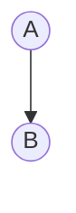
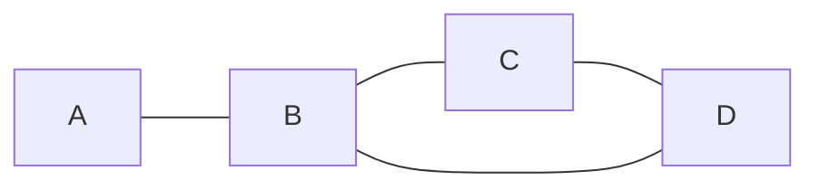

# 计算语言学基础理论

<br>
渤海大学文学院

朱波

zhubo812@gmail.com

----
### 成绩评定
1. 平时成绩：作业+出勤（30%）
2. 期末作业（70%）
----

### 学习目标

1. 具备<font color = yellow>以计算机为背景思考语言学问题</font>，对<u>语言知识</u>进行<font color = yellow>形式化描述</font>的能力；
2. 了解计算语言学的基本理论和自然语言处理中的常用模型及算法，初步具备从事相关领域研究工作的能力。

----

### 主要参考书目

1. Introduction to Natural Language Processing, Harris,M.D.,Reston Publishing Co.,1985

2. Speech and Language Processing, Jurafsky, D.&Martin,J.H., PrenticeHall,2000(中译本：自然语言处理综论，冯志伟等译，电子工业出版社，2005)

3. Foundations of Statistical Natural Language Processing, Manning, C.D.&Schütze, The MIT press, 1999(有中译本)

4. Natural Language Understanding,Allen,J.,TheBenjamins/CumminsPublishingCo.,1994(有中译本)

---- 

5. Natural Language Processing: An Introduction to Computational Linguistics, Gazdar, G.&Mellish, C.,AddisonWesley,1989.
6. 计算语言学概论，俞士汶主编，商务印书馆，2003.
7. 现代汉语语法信息词典详解，俞士汶等，清华大学出版社，2003
8. 自然语言理解，姚天顺，清华大学出版社，2002
9. 自然语言处理技术基础，王晓捷、常宝宝，北京邮电大学出版社，2002
----
10. 计算语言学，刘颖，清华大学出版社，2002
11. 计算语言学基础，冯志伟，商务印书馆，2001
12. 计算语言学导论，翁富良、王野翊，中国社会科学出版社，1998
13. 自然语言的计算机处理，冯志伟，上海外语教育出版社，1997
14. 自然语言处理，刘开瑛、郭炳炎，科学出版社，1991

----
### 相关学术期刊
1. Computational Linguistics
2. Machine Translation
3. International Journal of Corpus Linguistics
4. 中文信息学报(中文信息学会)
5. 计算机学报
6. 软件学报
7. 汉语语言与计算学报
----
###  相关学术会议
1. [Annual Meeting of the Association for Computational Linguistics(ACL)](https://www.aclweb.org/anthology/)
2. International Conferenceon Computational Linguistics(COLING)
3. 全国计算语言学联合学术会议(JSCL)[CCL历年论文集,NLP-NABD历年论文集](http://cips-cl.org/anthology)
4. 全国学生计算语言学研讨会(SWCL)

---

### 课程内容
1. 概述
2. 基本概念
3. 形式语言与自动机
4. 语言模型
5. 自动分词与词性标注
6. 句法分析
7. 语法理论
8. 语义计算
9. 机器翻译


---


## 概述

1. 计算语言学的性质及特点
2. 计算语言学的发展及学科位置

----
### 计算语言学的性质及特点
1. 计算语言学的<font color = yellow>定义</font>
2. 计算语言学的<font color = yellow>特点</font>
3. 计算语言学的<font color = yellow>研究方法</font>
4. 计算语言学对人们<font color = yellow>语言观的影响</font>

----
#### 定义


计算语言学的中心任务是开发研制出一种人类能用自己的语言与之自由交谈的智能计算机。

——(德国计算语言学家 Roland Hausser,*Foundations of Computational Linguistics*）

----
Question

计算机能理解、会思维吗？
----
英国天才的数学家、计算机科学家图灵（Turing）提出了“图灵测试”,即,如果有<font color = yellow>超过30%的测试者不能确定出被测试者是人还是机器</font>，那么这台机器就通过了测试，并被认为具有人类智能。


----
根据“图灵测试”的思想，计算机如果做到了下面四条中的一条，就可以认为它是智能的：
1. 问答（question-answering）
2. 生成文摘（summarizing）
3. 释义（paraphrase）
4. 翻译（translation）

----
#### 定义

计算语言学是通过建立形式化的计算模型，用计算机分析处理、理解并生成自然语言的学科。
----
自然语言生成（Nature Language Generation,NLG）

自然语言生成从知识库或逻辑形式等等机器表述系统去生成自然语言,可以说是一种将资料转换成自然语言表述的翻译器。
----
NLG一般通过多个子任务来解决问题。 一般可以分为以下六类：
1. 内容确定（Content determination）：决定在建文本中包含哪些信息；

2. 文本结构（Text structuring）：确定将在文本中显示的信息；

3. 句子聚合（Sentence aggregation）：决定在单个句子中呈现哪些信息；
----
4. 词汇化（Lexicalisation）：找到正确的单词和短语来表达信息；

5. 引用表达式生成（Referring expression generation）：选择单词和短语以识别域对象；

6. 语言实现（Linguistic realisation）：将所有单词和短语组合成格式良好的句子。
----
对计算语言学，也有广义和狭义两种理解。上述是狭义的理解。

广义的计算语言学不仅包括上述内容，还包括利用计算机研究自然语言的有关问题，如风格统计、词语计量研究等等。

----
| 作者   | 句平均词数 | 句平均字数 | 平均词长 |
| ------ | ---------- | ---------- | -------- |
| 巴金   | 24.75      | 40.65      | 1.642    |
| 倪海曙 | 15.79      | 24.05      | 1.523    |

----
《静静的顿河》的作者是…肖洛霍夫？克留柯夫？

1. 平均句长
2. 句长分档，每档百分比
3. 不同词类统计
4. 不同词类在句中的顺序
5. 某些词汇特点的统计
6. 比较样品中使用一次、二次、三次……的词
----
《红楼梦》的作者是一个人？还是两个人？

1. 上下文相关性（型例比/种次比）
2. 不同字符数的统计
3. 字符串的统计

----

##### 统计结果：
1. 前八十回<后四十回
2. 前八十回>后四十回
3. 前八十回双音节字符串<单音节字符串，后四十回双音节字符串>单音节字符串

----
##### 结论
作者应该是两个人

----
#### 语言计量研究的基本概念

- 词种（type）
- 词次（token）

----
句子“我明天要去上海看世博会，你去不去？” 的<font color = yellow>词种数</font>和<font color = yellow>词次数</font>分别是多少？
----
- 词种：9
- 词次：11
----
字符种？字符次？

----
#### 语言计量研究涉及的问题

1. 计量研究的目标是什么？
目标决定对象、方法和过程。

2. 如何得到数据？
需要掌握各种统计工具、计算方法。

3. 如何对数据进行分析？
综合运用各种知识挖掘数据背后潜藏的东西。


----
#### 计算语言学的特点

----
计算语言学的特点1

**元语言的形式化**
----
对象语言与元语言：

- 对象语言，就是你所要研究的那种语言;
- 元语言，是指研究者在研究描述对象（语言）时使用的语言。

----
**元语言的形式化**
1. 用自然语言作元语言的缺陷是歧义太多。
2. 数学公式、逻辑符号等都是形式化的元语言。
3. 形式化的元语言是人和计算机沟通的必要途径。
4. 计算语言学研究的是元语言应该如何设计才能更好地描述对象语言里的规律，而且计算机能够读懂。

----
**规则描述语言**

1. 一|这|那/Q1/ (a)/ n* = N4 [NP>N1 N2 of N3 N4]
2. a)/ n|r* = N2 [NP > N1 N2]
3. d/ a* = N2 [a > N1 N2]


----
计算语言学的特点2

**可操作性**

----
<font color = yellow>可操作性</font>是计算语言学最根本、最关键的方法论原则就是要指出各种语言形式出现和变换的条件。
----
所谓的<font color = yellow>条件</font>和与之想关联的<font color = yellow>动作</font>是一切计算机工作的最基本的方式，也是建立计算语言学语法的最基本、最关键的公式。
----
计算语言学的研究手段是计算，计算的<font color = yellow>表现形式</font>是算法。

算法是对解题方法的精确描述,可表示为一组有穷的操作规则。
1. 通用性：算法是针对一类问题的
2. 机械性：算法的每一步骤都是确定的
3. 有限性：算法必须在有限步骤内结束
4. 离散性：算法的输入及输出数据都是离散符号
----
N+N短语

- 偏正关系：学校图书馆、木头桌子
- 并列关系：工人农民、爸爸妈妈
- 复指关系：首都北京、鲁迅先生
- 主谓关系：今天星期二、鲁迅浙江人
----
今天星期六、今天三八节（主谓）

今天下午，今年三八节（偏正）？
----

计算语言学的特点3

**工程性**
----
1. 机器翻译（Machine Translation）
2. 文本分类（Text Classification）
3. 自动文摘（Automatic Text Abstraction）
4. 信息检索（Information Retrieval）
5. 信息提取（Information Extraction）
6. 语音合成（Speech Synthesis）
7. 语音识别（Speech Recognition）
8. ……
----
从本质上说，计算语言学是一门实验性、工程性的学科。
----
计算语言学的特点4

**语言研究的全局性、一般性**
----
歧义现象

- 咬死了猎人的狗（动宾/偏正，实例歧义）
- 咬死了猎人的鸡（动宾）
- 咬死了鸡的老虎（偏正）

VP + NP1 + 的 + NP2（格式歧义、潜在歧义）
----
#### 计算语言学的特点
1. 元语言的形式化
2. 可操作性
3. 工程性
4. 语言研究的全局性、一般性

----
#### 计算语言学的研究方法
----
1. 规则驱动的方法
2. 数据驱动的方法
3. 二者融合的方法

----
规则驱动的方法
1. 研究人员（例如语言学家）对语言的规律进行总结，形成规则形式的知识库。
2. 研制语言处理算法，利用这些规则对自然语言进行处理。
3. 研究人员根据处理结果，调整规则，改进处理效果。
----

根据如下6条规则，分析句子“The boy saw the girl with a telescope.”，并画出树形图。


1. `$S\rightarrow NP+VP$`
2. `$NP\rightarrow DET+N$`
3. `$NP\rightarrow NP+PP$`
4. `$VP\rightarrow VP+PP$`
5. `$VP\rightarrow V+NP$`
6. `$PP\rightarrow P+NP$`

----
<font color = yellow>规则驱动的方法的问题</font>

All grammar leak(Sapir1921)认为：

对于自然语言而言，不大可能写出一部完备的规则集，语言规则有很强的伸缩性。
一般而言，很多基于规则的系统不能满足真实语言文本处理的要求，而只能处理真实语言的某个很小的子集。
----
数据驱动的方法（统计方法）
----

All grammar leak(Sapir1921)

1. 建立可以反映语言使用情况的语料库；
2. 研究人员对自然语言进行统计；
3. 建模利用统计技术或机器学习技术，基于语料库训练统计语言模型；
4. 利用得到的模型设计算法对语言进行处理；
5. 根据处理效果改进模型，提高处理性能。

----

在数据驱动的方法中，语言模型通常体现为一组参数，这些参数通常表示某个语言形式发生的概率值。

对一个由三个词构成的字符串来说，其发生的概率可以表示为：`$P(w_3|w_1,w_2)$`

----
判断“今天是周末”和“今天是课堂”哪个句子概率大?

𝑃(周末│今天是)>𝑃(课堂│今天是)

----
<font color = yellow>数据驱动的方法（统计方法）的问题</font>

数据驱动的方法忽视了语言的深层结构。

----
二者融合的方法

1. 融合规则驱动、数据驱动的优劣不能简单评价
2. 很多研究人员（包括知名计算语言学家）建议如此
3. 已经提出了一些策略，但如何结合尚须进一步探索

----
两种方法的区别
----
1. 对研究对象语言知识的认识不同。

- 规则方法：语言知识在人的大脑里，即人的语言能力；(<font color = yellow>语言</font>)
- 统计方法：语言知识在语言数据之中。(<font color = yellow>言语</font>)

----
2. 获取语言知识的方法和途径不同。
- 规则方法：用内省方法，建立形式化的知识系统描述语言知识；
- 统计方法：用语料库方法，根据对语言数据的统计得到语言知识。
----
3. 使用语言知识K构建语言处理系统时使用的算法不同。

- 规则方法：发展出许多比较成熟的算法技术；
- 统计方法：主要使用概率统计模型的自然语言处理算法。
----
4. 对语言事实的评价不同。

- 规则方法：基于乔姆斯基的语言原则，语句是<font color = yellow>正确的/错误的</font>；
- 统计方法：基于先农(Shannon)的信息论,语句是<font color = yellow>常见的/罕见的</font>。


----
#### 计算语言学对人们语言观的影响
----
传统的语言观

- 语言是人类最重要的交际工具；
- 语言是一个符号系统。
----
 新的语言观

- 语言是人类最重要的交际工具；
- 语言是人类和计算机共同的表达知识、传递信息、实施控制的符号系统。
----
新的语言观

1. 语言是人类和计算机的共同的交际工具；
2. 语言是表达知识的最有效方法；
3. 语言是传递信息的最主要的载体；
4. 语言是实施控制的最方便的手段；
5. 语言是一个多层面的符号系统。
	- 语构层面:符号与符号之间的形式结构关系---句法学；
	- 语义层面:符号与其所指之间的意义关系---语义学；
	- 语用层面:符号与使用者之间的效用关系---语用学。
----
### 计算语言学的发展和学科位置
----
#### 计算语言学的发展

计算语言学的历史可以大致分为萌芽期、发展期和繁荣期三个阶段。

----
**1. 萌芽期**(1956年以前)

- <圣经•创世纪>巴别塔
- 20世纪30年代初，法国科学家阿尔楚尼（Artsouni）的“机械脑”（mechanicalbrain）;
- 1933年，苏联发明家特洛扬斯基（Tроянский）设计了语言翻译机.
- 1946年，美国宾夕法尼亚大学的埃克特（J.P.Eckert）和莫希来(J.W.Mauchly)设计并研制出世界上第一台电子计算机爱尼亚克(ENIAC)。
- 同年，美国洛克菲勒基金会副总裁韦弗(W.Weaver)和英国工程师布斯(A.D.Booth)在讨论电子计算机的应用范围时，就谈到了利用计算机进行语言自动翻译的想法。
- 1949年，韦弗发表题为《翻译》的备忘录，正式提出机器翻译问题。
- 1954年，美国乔治敦大学&IBM公司，用IBM-701计算机，进行了世界第一次机器翻译试验，把几个简单的俄语句子翻译成英语。

----
**机器翻译(Machine Translation,简称MT）**

机器翻译是利用计算机把一种语言的语句自动地转换为语义与之完全相同的另一种语言的语句。

----
| 源文   | 正确的译文 | 机器的译文 | 
| ------ | ---------- | ---------- | 
| How are you?   | 你好吗？      | 怎么是你？      |
| How old are you? | 你多大了？     | 怎么老是你      | 

----

**2. 发展期(1957-20世纪70年代初)**


早期：<font color = yellow>关键词</font>匹配为主流

- [1968年维金鲍姆（J·Weizenbaum）的ELIZA系统 （模拟心理医生、能与患者谈话的系统）](http://www.manifestation.com/neurotoys/eliza.php3)
----
中后期：以<font color = yellow>句法-语义分析</font>技术为主流

- 维诺格拉德于1972年在美国麻省理工学院建成著名的SHRDLU系统（积木世界）。 
----


下面是 SHRDLU系统中人和计算机之间的一段对话：
- <font color = yellow>Person</font>: Pick up a big red block.
	- <font color = red>Computer</font>: Ok. (does it)
- <font color = yellow>Person</font>: Grasp the pyramid.
	- <font color = red>Computer</font>: I don't understand which pyramid you mean.
- <font color = yellow>Person</font>: Find a block which is taller than the one you are holding and put it into the box.
	- <font color = red>Computer</font>: By "it", I assume you mean the block which is taller than the one I am holding.
----
商克(Schannk)及其学生于1973年在斯坦福大学 建成MARGIE系统。 

MARGIE系统能以推理或释义两种方式运行。在推理方式下，它接受一个输入句，然后利用 推理器生成这个句子所蕴涵的事实。
----

输入 <font color = yellow>John gave Mary some aspirin. </font>（约翰给玛丽一些阿司匹林。）


系统就可以作出推理： <font color = yellow>John believes Mary wants an aspirin. Mary is sick.</font> （约翰相信玛丽需要阿司匹林。玛丽病了。）

----
**在释义方式下，它将以尽可能多的等价方式来复 述输入的句子。**

- 如输入<font color = yellow>John killed Mary by chokingher.</font>(约翰扼杀了玛丽。)

- 系统就会复述出如下的句子：
	- <font color = yellow>John strangled Mary.</font>(约翰勒死了玛丽。) 
	- <font color = yellow>John choked Mary and she died because she was unable to breathe. </font>(约翰扼住玛丽的脖子，她因为不能呼吸就死了。）

----
李家治、陈永明等人建成的“古汉语机器理解系统——ACLUS”。

ACLUS能分析句法，能把《郑人买履》、《刻舟求剑》文言译成现代汉语，并回答故事中的语法和词义问题。
----

- <font color = yellow>问</font>：‘先度其足’中的‘度’是什么意思？ 
	- <font color = red>答</font>：‘度’是动词，是测量某种东西尺寸的意思。 
- <font color = yellow>问</font>：‘吾忘持度’中的‘度’是什么意思？ 
	- <font color = red>答</font>：‘度’是名词，是尺寸的意思。

----
范继淹、徐志敏等人建成的“TK——84汉语人机 对话实验系统”。这是一个铁路客运咨询系统。

- <font color = yellow>问</font>：从北京到大连有高铁吗？
	- <font color = red>答</font>：有。 
- <font color = yellow>问</font>：开往沈阳的快车都有卧铺吗？ 
	- <font color = red>答</font>：11次没有卧铺，其他都有。 
- <font color = yellow>问</font>：11次为什么没有卧铺？ 
	- <font color = red>答</font>：11次8点从北京开，18点49分到沈阳，卧铺没有必要。

----
**发展期理论建设方面的成果**

- 英国数学家图灵(A·M·Turing)与美国语言学家乔姆斯基 (N·Chomsky)的贡献

----
**发展期句法分析方面的成果**

- 乔姆斯基的<font color = yellow>短语结构语法</font>（phrase structure grammar，简称PSG）
- 伍兹的<font color = yellow>扩充转移网络</font>(augemented transition network,简称ATN)； 
- 卡普兰等的<font color = yellow>词汇功能语法</font>（Lexical-functional grammar，简称 LFG）； 马丁·凯依的<font color = yellow>功能合一语法</font>(functional unificational grammar，简称 FUG)；
- 盖兹达等的<font color = yellow>广义短语结构语法</font>(generalized phrase structure grammar,简称GPSG)等等。

----
**发展期语义分析方面的成果**

- 菲尔摩的<font color = yellow>格语法</font>（case grammar); 
- 威尔克斯的<font color = yellow>优选语义学</font>(preference semantics)
- 商克的<font color = yellow>概念依存理论</font>(Conception Dependency Theory, 简称CD理论)  
----

发展期的计算语言学逐渐融入了<font color = yellow>人工智能</font>的研究领域。研究方法上出现了<font color = yellow>基于规则</font>和<font color = yellow>基于统计(概率)</font>两种思想，并形成了两大阵营。

- 基于规则方法的<font color = yellow>符号派</font>(symbolic)
- 基于统计方法的<font color = yellow>随机派</font>(stochastic)。
----
- 以Chomsky为代表的符号派学者开始了形式语言理论和生成句法的研究，20世纪60年代末又进行了形式逻辑系统的研究。

- 随机派学者采用基于贝叶斯方法的统计学研究方法。但由于在人工智能领域中，这一时期多数学者注重研究推理和逻辑问题，只有少数学者在研究基于概率的统计方法和神经网络。因此，这一时期基于规则方法的研究明显多于基于概率方法的研究。
----
随着研究的深入，人们发现计算语言学的很多应用在短时间内无法解决，而的新问题新需求又不断地涌现。因此，计算语言学研究受到较大影响。从70年代开始，计算语言学的很多研究领域进入了低谷时期。
但尽管如此，计算语言学仍然在这期间取得了一些成果。例如，
- <font color = yellow>基于隐马尔可夫模型</font>(Hidden Markov Model, HMM);
- <font color = yellow>话语分析</font>(Discourse Analysis)。

之后，由于计算语言学研究者对于过去的研究进行了总结，有限状态模型和经验主义研究方法也开始复苏。

----
**3. 繁荣期**(20世纪70年代中后期-20世纪80年代末)

 繁荣期主要以<font color = yellow>机器翻译</font>的出现及发展为标志
----

- 1976年，加拿大蒙特利尔大学与加拿大联邦政府翻译局联合开发的实用性英法机器翻译系统TAUM-METEO正式投入使用，提供天气预报的翻译服务。
- 美国的SYSTRAN系统
- 日本富士通公司的ATLAS系统
- 德国西门子公司与美国德克萨斯大学联合开发的METAL系统
----
- 1988年由中国军事科学院开发、中国计算机软件与技术公司投入 市场的第一个机器翻译系统“译星1号”实现了商品化
- 中国社科院与北京高立公司联合开发的“高立英汉机器翻译系统”
- 中科院计算所开发的“863-IMT/EC智能型英汉机器翻译系统”
- 先是国防科技大学开发、后由深圳桑夏公司进一步开发的“桑夏译王英汉机器翻译系统”

----

**4. 融合期发展期**(20世纪90年代至今）

20世纪90年代中期以后，计算机的处理速度和存储量大幅增加，为计算语言学改善了物质基础，使得语言处理的商品化开发成为可能；另一方面，1994年Internet商业化和同期网络技术的发展使得基于自然语言的信息检索和信息抽取的需求变得尤为重要。

----
**Milestone**
- 2003年 神经概率语言模型
- 2008年 多任务学习
- 2013年 Word嵌入
- 2013年 NLP的神经网络
- 2014年 序列到序列模型
- 2015年 注意力机制
- 2015年 基于记忆的神经网络
- 2018年 预训练语言模型
----

<font color = yellow>神经概率语言模型（Neural Probabilistic language models）</font>

神经网络（Neural Network, NN）被应用于语言建模之前,主流语言模型是N-Gram模型，利用前面n个词语预测下一个单词。
神经网络语言模型引起广泛关注是在[Bengio et al. (2003)](https://jmlr.csail.mit.edu/papers/volume3/bengio03a/bengio03a.pdf)提出前向神经网络（Feed-forward Neural Network, FNN）语言模型之后.

----
神经概率语言模型以某个词语前面的n个词语作为输入向量。这样的向量现在被称为词嵌入（word embeddings）。这些词向量入被连接并输入隐含层，然后再将隐含层结果输入softmax层。
----

----
当前，语言模型中的前馈神经网络已经被<font color = yellow>递归神经网络</font>和<font color = yellow>长期短期记忆网络（LSTM）</font>所取代。

LSTM本身是一个强大的基础模型。能够更好地理解语言模型究竟捕捉了哪些信息，也是当前比较活跃的研究领域。近年来已经出现了许多基于LSTM的新语言模型。

----
<font color = yellow>放入最后</font>
语言建模是无监督学习的一种形式，Yann LeCun也将预测性学习称为获取常识的先决条件。关于语言建模最值得注意的方面可能是，尽管它很简单，但它是本文讨论的许多后期进展的核心：

- Word嵌入：word2vec的目标是简化语言建模。
- 序列到序列模型：这种模型通过一次预测一个单词来生成输出序列。
- 预训练语言模型：这些方法使用语言模型中的表示来进行转移学习。

这意味着NLP的许多重要最新进展可以归结为一种语言建模形式。为了做“真正的”自然语言理解，需要新的方法和模型。

----
<font color = yellow>多任务学习（Multi-task learning）</font>

多任务学习是在多个任务下训练的模型之间共享参数的方法。在神经网络中，这可以通过绑定不同层的权重来轻松完成。多任务学习的想法于年由Rich Caruana(1993)首次提出，
[Collobert,Jason(2008)](https://ronan.collobert.com/pub/matos/2008_nlp_icml.pdf)首次将多任务学习应用于NLP。在多任务学习框架下，词嵌入矩阵被两个在不同任务下训练的模型共享。

----


----
共享词嵌入使模型能够在单词嵌入矩阵中协作和共享一般的低级信息，这通常构成模型中最大数量的参数。[Collobert,Jason(2008)](https://ronan.collobert.com/pub/matos/2008_nlp_icml.pdf)证明了它在多任务学习中的应用。它引领了诸如预训练单词嵌入和使用卷积神经网络（CNN）之类的方法，这些方法仅在过去几年中被广泛采用。他们也因此获得了2018年机器学习国际会议（ICML）的“时间测试”奖。
----
多任务学习现在用于各种NLP任务，并且利用现有或“人工”任务已成为NLP指令集中的有用工具。虽然通常预先定义参数的共享，但是在优化过程期间也可以学习不同的共享模式。随着模型越来越多地评估多项任务以评估其泛化能力，多任务学习越来越重要，最近又有提出了多任务学习的专用基准。

----
<font color = yellow>词嵌入（Word embeddings）</font>

[Bengio et al. (2003)](https://jmlr.csail.mit.edu/papers/volume3/bengio03a/bengio03a.pdf)证明使用神经网络训练的语言模型可以生成更好的词向量,并且提出了很多优化训练的方法。

[Mikolov et al. (2003)](https://arxiv.org/pdf/1310.4546.pdf)通过删除隐藏层和近似目标来使这些单词嵌入的训练更有效。虽然这些变化本质上很简单，但它们与高效的word2vec（word to vector，用来产生词向量的相关模型）组合在一起，使得大规模的词嵌入模型训练成为可能。

;Word2vec有两种风格，可以在下面图中看到：CBOW（continuous bag-of-words）和skip-gram。它们的目标不同：一个基于周围的单词预测中心词，而另一个则相反。


;虽然捕获的关系word2vec具有直观且几乎神奇的质量，但后来的研究表明word2vec没有任何固有的特殊性：通过矩阵分解也可以学习单词嵌入和通过适当的调整，像SVD和LSA这样的经典矩阵分解方法可以获得类似的结果。

;从那时起，许多工作已经开始探索单词嵌入的不同方面（正如原始论文的引用次数所示）。尽管有许多发展，但word2ve仍然是一种流行的选择并且在今天被广泛使用。Word2vec的范围甚至超出了单词级别：带有负抽样的skip-gram，一个基于本地环境学习嵌入的方便目标，已被应用于学习句子的表示，甚至超越NLP到网络和生物序列等。

;一个特别令人兴奋的方向是将不同语言的单词嵌入投影到同一空间中以实现（零射击）跨语言转移。越来越有可能以完全无监督的方式（至少对于类似语言）学习良好的投影，这开启了低资源语言和无监督机器翻译的应用。

----
<font color=yellow>Neural networks for NLP</font>

2013、2014年标志着神经网络模型开始在NLP中被采用的时间。主要有以下三种类型：

- 卷积神经网络（Convolutional Neural Networks）
- 循环神经网络（Recurrent Neural Networks）
- 递归神经网络（Recursive Neural Networks）

----
递归神经网络（RNN）是处理NLP中普遍存在的动态输入序列的理想选择。Vanilla RNNs很快被经典的长期短期记忆网络（LSTM）所取代，后者证明其对消失和爆炸梯度问题更具弹性。在2013年之前，仍然认为RNN很难训练；Ilya Sutskever的博士论文是改变这一局面的一个关键例子。LSTM细胞的可视化可以在下图中看到。双向LSTM通常用于处理左右上下文。

----


----
随着卷积神经网络（CNN）被广泛用于计算机视觉，它们也开始应用于语言（Kalchbrenner等，2014；Kim等，2014）。用于文本的卷积神经网络仅在两个维度上操作，其中滤波器仅需要沿时间维度移动。下图显示了NLP中使用的典型CNN。

----

----

卷积神经网络的一个优点是它们比RNN更容易并行化，因为每个时间步的状态仅取决于本地环境（通过卷积运算）而不是像RNN中的所有过去状态。 CNN可以使用扩张的卷积扩展到更宽的感受域，以捕捉更广泛的背景（Kalchbrenner等，2016）。CNN和LSTM也可以组合和堆叠，并且可以使用卷积来加速LSTM。
RNN和CNN都将语言视为一个序列。然而，从语言学的角度来看，语言本质上是等级的：单词被组成高阶短语和子句，它们本身可以根据一组生产规则递归地组合。将句子视为树而不是序列的语言启发思想产生了递归神经网络。

----

----
<font color=yellow>序列到序列模型（Sequence-to-sequence models）</font>

2014年，Sutskever等人提出了序列到序列学习，一种使用神经网络将一个序列映射到另一个序列的通用框架。在该框架中，编码器神经网络逐符号地处理句子并将其压缩成矢量表示；然后，解码器神经网络基于编码器状态逐个预测输出符号，在每个步骤中将先前预测的符号作为预测下一个的输入.

----

----
机器翻译成了这个框架的杀手级应用。 2016年，谷歌宣布开始用神经MT模型替换其基于单片短语的MT模型（Wu等，2016）。根据Jeff Dean的说法，这意味着用500行神经网络模型替换500,000行基于短语的机器翻译代码。

由于其灵活性，该框架现在是自然语言生成任务的首选框架，不同的模型承担编码器和解码器的角色。重要的是，解码器模型不仅可以以序列为条件，而且可以以任意表示为条件。这使得例如基于图片生成描述（Vinyals等人，2015），基于表格的文本（Lebret等人，2016），基于源的描述、代码更改（Loyola等，2017），以及许多其他应用程序成为可能。

----

----
序列到序列学习甚至可以应用于NLP中常见的结构化预测任务，其中输出具有特定结构。为简单起见，输出是线性化的，如下面图10中的选区解析所示。神经网络已经证明了在给予选区解析的足够数量的训练数据（Vinyals等，2015）和命名实体识别（Gillick等，2016）等的情况下，能够直接学习产生这种线性化输出的能力。
----

----
用于序列和解码器的编码器通常基于RNN，但是可以使用其他模型类型。新架构主要来自机器翻译的工作，机器翻译将作为序列到序列架构的培养皿。最近的模型是深度LSTM（Wu等，2016）、卷积编码器（Kalchbrenner等，2016；Gehring等，2017）、变换器（Vaswani等，2017）将在下一个讨论部分，以及LSTM和变压器的组合（Chen等，2018）。

----
<font color=yellow>注意力机制（Attention）</font>

注意力（Bahdanau等，2015）是神经MT（NMT）的核心创新之一，也是使NMT模型优于基于经典短语的MT系统的关键思想。序列到序列学习的主要瓶颈是它需要将源序列的整个内容压缩成固定大小的矢量。注意通过允许解码器回顾源序列隐藏状态来减轻这种情况，然后将其作为加权平均值提供给解码器的附加输入。


----

----
注意力机制是神经网络机器翻译 (NMT) 的核心创新之一，广泛适用，并且可能对任何需要根据输入的某些部分做出决策的任务有用。它已被应用于句法分析（Vinyals等，2015）、阅读理解（Hermann等，2015）和单样本学习（Vinyals等，2016）等等。输入的甚至不需要是一个序列，可以包括其他表示，比如图像的描述。注意力的一个有用的副作用是，通过根据注意力量检查输入的哪些部分与特定输出相关，它提供了罕见的对模型内部运作机制的观察。


注意也不仅限于查看输入序列；自我注意可用于查看句子或文档中的周围单词以获得更多上下文敏感的单词表示。多层自我关注是Transformer架构的核心（Vaswani等，2017），这是目前最先进的NMT模型。 

（7）2015年 - 基于记忆的神经网络（Memory-based networks）

注意力可以看作是模糊记忆的一种形式，其中记忆由模型的过去隐藏状态组成，模型选择从记忆中检索的内容。有关注意事项及其与内存的关联的更详细概述，请查看此文章。已经提出了许多具有更明确记忆的模型。它们有不同的变体，例如神经图灵机（Neural Turing Machines）、记忆网络（Memory Network）、端到端的记忆网络（End-to-end Memory Newtorks）、动态记忆网络（DynamicMemory Networks）、神经可微计算机（Neural Differentiable Computer）、循环实体网络（RecurrentEntity Network）。
通常基于与当前状态的相似性来访问存储器，类似于注意机制，并且通常可以写入和读取存储器。模型在实现和利用内存方面有所不同。例如，端到端内存网络多次处理输入并更新内存以启用多个推理步骤。神经图灵机还具有基于位置的寻址，允许他们学习简单的计算机程序，如排序。基于内存的模型通常应用于任务，其中保留较长时间跨度的信息应该是有用的，例如语言建模和阅读理解。存储器的概念非常通用：知识库或表可以用作存储器，而存储器也可以基于整个输入或其特定部分来填充。
（8）预训练语言模型（Pretrained language models）

预训练的词嵌入与上下文无关，仅用于初始化模型中的第一层。最近几个月，一系列监督任务被用于预训练神经网络（Conneau等，2017；McCann等，2017； Subramanian等，2018）。相比之下，语言模型只需要未标记的文本；因此，培训可以扩展到数十亿单词的语料、新域和新语言。2015年首次提出了预训练语言模型（Dai＆Le，2015）;直到最近，它们才被证明对各种各样的任务都有益。语言模型嵌入可以用作目标模型中的特征（Peters等，2018），或者可以对目标任务数据微调语言模型（Ramachandran等，2017； Howard＆Ruder，2018）。添加语言模型嵌入比许多不同任务的最新技术有了很大的改进。


----
已经展示了预训练语言模型，可以用更少的数据进行学习。由于语言模型仅需要未标记的数据，因此对于标记数据稀缺的低资源语言尤其有用。

----
其他里程碑：
其他一些发展不如上面提到的那么普遍，但仍然具有广泛的影响。
比如基于字符的描述（Character-based representations），在字符上使用CNN或LSTM来获得基于字符的单词表示是相当普遍的，特别是对于形态学丰富的语言和形态信息很重要或具有许多未知单词的任务。据我所知，基于特征的表示首先用于序列标记（Lample等，2016；Plank等，2016）。基于字符的表示减少了必须以增加的计算成本处理固定词汇表的需要，并且能够实现诸如完全基于字符的NMT之类的应用（Ling等人，2016； Lee等人，2017）。
对抗学习（Adversarial learning）已经全面入侵和颠覆了及其计算领域，并且在NLP中也以不同的形式使用。对抗性示例越来越广泛地被广泛使用，不仅作为探测模型和理解其失败案例的工具，而且还使它们更加强大（Jia＆Liang，2017）。 （虚拟）对抗性训练，即最坏情况的扰动（Miyato等，2017; Yasunaga等，2018）和域对抗性损失（Ganin等，2016; Kim等，2017）是有用的正规化的形式可以同样使模型更加坚稳。生成对抗网络（GAN）对于自然语言生成来说，还不是太有效（Semeniuta等，2018），但是例如在匹配分布时是有用的（Conneau等，2018）。
强化学习（Reinforcement learning）已经被证明对于具有时间依赖性的任务是有用的，例如在训练期间选择数据（Fang等，Wu等，2018）和建模对话（Liu等，2018）。RL对于直接优化诸如反向强化学习在奖励太复杂而无法指定的环境中可能是有用的，例如视觉叙事（Wang等，2018）。
----
非神经网络方向的里程碑：
在1998年以及随后的几年中，引入了FrameNet项目（Baker等，1998），这导致了语义角色标记的任务，这是一种浅层语义分析，至今仍在积极研究中。在21世纪初期，与自然语言学习会议（CoNLL）共同组织的共同任务催化了核心NLP任务的研究，如分块（Tjong Kim Sang等，2000），命名实体识别（Tjong Kim Sang等，2003），以及依赖性解析（Buchholz等，2006）等。许多CoNLL共享任务数据集仍然是当今评估的标准。
2001年，引入了条件随机区域（CRF; Lafferty等，2001），这是最具影响力的序列标记方法之一，在ICML 2011中获得了时间测试奖.CRF层是核心部分目前最先进的模型用于序列标记问题与标签相互依赖性，如命名实体识别（Lample等，2016）。
2002年，提出了双语评估替代研究（BLEU； Papineni等，2002）度量，这使得MT系统能够扩展，并且仍然是目前MT评估的标准度量。同年，引入了结构化先行者（Collins，2002），为结构化感知工作奠定了基础。在同一次会议上，引入了情感分析，这是最受欢迎和广泛研究的NLP任务之一（Pang等，2002）。这三篇论文都获得了2018年NAACL的时间测试奖。
2003年引入了潜在的dirichlet分配（LDA； Blei等，2003），这是机器学习中使用最广泛的技术之一，它仍然是进行主题建模的标准方法。2004年，提出了新的最大边际模型，它们更适合捕获结构化数据中的相关性而不是SVM（Taskar等，2004a； 2004b）。
2006年，OntoNotes（Hovy等，2006）引入了一个具有多个注释和高交互注入协议的大型多语言语料库。 OntoNotes已被用于培训和评估各种任务，例如依赖性解析和共参考解析。 Milne和Witten（2008）在2008年描述了维基百科如何用于丰富机器学习方法。到目前为止，维基百科是用于训练ML方法的最有用的资源之一，无论是用于实体链接和消歧，语言建模，作为知识库还是各种其他任务。
2009年，提出了远程监督的想法（Mintz等，2009）。远程监督利用来自启发式或现有知识库的信息来生成可用于从大型语料库中自动提取示例的噪声模式。远程监督已被广泛使用，并且是关系提取，信息提取和情感分析以及其他任务中的常用技术。


---
基本概念

----
计算语言学有两种基本研究方法

- 基于规则的方法
	- 理论基础：乔姆斯基文法理论
- 基于统计的方法
	- 理论基础：数理统计，信息论
----
主要内容
1. 概率论基本概念
2. 信息论基本概念
----
概率论基本概念
概率
条件概率
最大似然估计
乘法公式
全概率公式
贝叶斯法则
二项式分布
条件概率分布
联合概率分布
期望
方差
----
概率是从随机实验中的事件到实数域的函数，用以 表示事件发生的可能性。如果用`$P(A)$`作为事件`$A$`的概 率，`$\Omega$`是实验的样本空间，则概率函数必须满足如下公理：<br> 
公理1：`$P(A)\geq0$`<br> 
公理2：`$P(\Omega)=1$`<br> 
公理3：如果对任意的`$i$`和`$j(i\neq j)$`,事件`$A_i$`和`$A_j$`不相交`$(A_i\bigcap A_j=\phi)$`,则有：`$P(\bigcup_{i=0}^\infty A_i)=\sum_{i=0}^\infty P(A_i)$`<br> 


----
信息论基本概念
信息量
自信息
联合自信息
条件自信息
熵(entropy)——平均自信息
条件熵
联合熵
相对熵
交叉熵
互信息
困惑度

----
人们普遍认为，Claude Elwood Shannon 在1948年发表的“通信的数学理论”（A Mathmatical Theory of Communication, BSTJ,1948）这篇里程碑性的文章标志着信息论的产生，而Shannon本人也成为信息论的奠基人。
Shannon理论基本任务是设计有效而可靠的通信系统。
熵是信息论中重要的基本概念。

----
信息论的研究内容
狭义信息论（经典信息论、香农信息论）
研究信息测度，信道容量以及信源和信道编码理论
一般信息论
研究信息传输和处理问题，除经典信息论外还包括噪声理论，信号滤波和预测，统计检测和估值理论，调制理论，信息处理理论和保密理论
广义信息论
除上述内容外，还包括自然和社会领域有关信息的内容，如模式识别，计算机翻译，心理学，遗传学，神经生理学
----
困惑度(perplexity)
在设计语言模型时，我们常用困惑度代替交叉熵衡量语言模型的好坏。给定语言`$L$`的样本 如下：

$$
L_1^n=l_1l_2...l_n
$$
`$L$`的困惑度为:

$$
PP_q=2^{H(L,q)}\approx 2^{{\frac {1}{2}}\log(l_1^n)}=[q(l_1^n)]^{\frac {1}{n}}
$$
---
形式语言与自动机


# 形式语言与自动机
----
主要内容
1. 基本概念
2. 语言研究的形式化
2. 形式语言学


### 3.1 基本概念

#### 3.1.1树（Tree）
一个连通的无回路的==无向图==称为树（或称自由树）。 
如果树中有一个结点被特别地标记，则这棵树被称之为==根树==，这个被特别标记的结点被称之为==根结点==。
----
##### 图1

----

----
##### 图2
```
graph TD;
C((C))--> D((D))
C((C))--> E((E))
```
----
##### 图3
```
graph TD;
A((A))--> B((B))
A((A))--> C((C))
C((C))--> D((D))
C((C))--> E((E))
```

----
#### 3.1.2 字符串（String）
字符串定义：假定`$\sum$`是字符的有限集合，它的每一个元素称之为字符。由`$\sum$`中字符相连而成的有限序列被称之为`$\sum$`上的字符串（或称符号串，或称链）。特殊地，不包括任何字符的字符串称为空串，记作`$\epsilon$` 
**符号串的长度**:符号串中符号的个数。符号串`$x$`的长 度用`$|x|$`表示。
`$|\epsilon|=0$`包括空串的`$\sum$`上字符串的全体记为`$\sum ^*$`
----
**字符串的操作**
假定`$\sum$`是字符的有限集合，`$x,y$`是`$\sum$`上的符号串
1. 字符串的链接：
把`$y$`的各个符号写在x的符号之后得到的符号串称为`$x$`与`$y$`的连接，记作`$xy$`。 
> **例** 
>`$\sum =\{a,b,c\},x=ab,y=cba$` 
那么，`$xy=abcba$`
----
2. 字符串指数操作
设`$x$`是符号串，把`$x$`自身连接`$n$`次得到的符号串，即`$z=xx...x$`，当`$x$`的数量为`$n$`时，称为`$x$`的`$n$`次方，记做`$x^n$`<br>
注意：`$x^0=\epsilon$`
----
> **例** 
> 如果`$x=a$`,则`$x^1=a,x^2=aa,x^3=aaa$` 
> 如果`$x=ab$`,则`$x^0=\epsilon,x^3=ababab$`
----
3. 字符串集合的乘机
设`$A,B$`是符号串的集合，则`$A,B$`的乘积定义为：`$AB=\{xy|x\in A,y\in B\}$`，相应地，`$A^0=\{\epsilon\},A^n=A^{n-1}A=AA^{(n-1)}$`

> **例** 
> 设`$A=\{aa,bb\},B=\{cc,dd,ee\}$`
> 则`$AB=\{aacc,aadd,aaee,bbcc,bbdd,bbee\}$`
> `$A^2=\{aaaa,aabb,bbaa,bbbb\}$`

----
#### 3.1.3 正则表达式(Regular Expression)
正则表达式是操作字符串的逻辑公式。用定义好的字符集或其组合表示规则字符串。

正则式对应于`$\sum$`上的一些子集(正则集)，并通过递归定义:
1. 空集`$\phi$`和空字符串`$\epsilon$`是正则式，它们的正则集分别为`$\phi$`和`$\{\epsilon\}$`
2. 任何`$x\in \sum,x$`是正则式，它对应的正则集是`$\{x\}$`
3. `$X,Y$`是`$\sum$`上的正则式，并且它们对应的正则集分别为`$U,V$`，那么,`$X|Y,X\cdot Y$`和`$X^*$`也是正则式，且它们对应的正则集分别为`$U\cup V,U\cdot V$`和`$U*$`
----
> **例**
> 假设`$\sum=\{0,1\}$`,那么,0和1都是正则表达式。 
> 如果令`$x=0,y=1$`,那么,`$y^*=1^*$`也是正则式，对应的正则集为：`$U=\{\epsilon,1,11,...\}$` 
> `$xy^*=01^*$`也是正则式，且它对应的正则集： 
> `$V=\{0,01,011,0111,...\}$`
> `$x|y^*=\{x\}\cup U=\{0,\epsilon,1,11,111,...\}$`
----
#### 3.1.4 正则表达式与有限状态图
正则表达式可以用有向图表示，图的结点是状态，有一个起始结点和一个终止结点。起始结点只有出边，终止结点用双圆圈表示。边上的符号表示从一个状态到另一个状态结点允许出现的字符，这种图称之为有限状态图。正则式`$01^*$`对应的有限状态图为：
----
```
graph LR
0((0))--> B((1))
B((1))--> B((1))

```
----
#### 3.1.4 栈(stack)
栈是一种线性表，`$A=A_0,A_1,...A_k$`。`$A_0$`是栈底,`$A_k$`是栈顶,当栈为空时`$A_0$`既是栈顶也是栈底。


`$A_k$`(Top) |
:---:|
... | 
`$A_2$` | 
`$A_1$` | 
`$A_0$`(Bottom) | 

----
### 3.2 语言的形式化

1. 形式语法(formal grammar)
2. 形式理论(formal theory)
3. 形式化的语法(formalized grammar)
4. 形式化的理论 (formalized theory)
----
汉语、英语等自然语言不是形式语言，但可以用符号、公式等形式化的手段来研究其语法，这种语法称“形式化的语法”，有时也称“形式语法”；这样表达的理论称“形式化的理论”，有时也称“形式理论”。

形式逻辑、数学公式、计算机程序等人工语言都可以视为为形式语言。这种语言的语法是形式语法。
----
##### 语言描述的三种途径
1. 穷举法—— 只适合句子数目有效的语言。
1. 语法描述—— 生成语言中合格的句子。
1. 自动机—— 对输入的句子进行检验，区别哪些是语言中的句子，哪些不是语言中的句子。
----
#### 3.2.1 形式语言的定义
- 按照一定规律构成的句子和符号串的有限或无限的集合。(Chomsky)
- 语言可以被看成一个抽象的数学系统。(吴蔚天)

“==形式==”这一术语在语言学中至少有两个不同的含义：
1. 形式可与内容、语义相对，指语言单位的外部表现，为语言意义的物质载体，是语言中可听得着、可看得见的部分，包括语音单位的外形及排列顺序、分布、结构等。这一“形式”是与“意义(meaning)”相对的。
2. “形式”指语言中抽象的关系结构。它要靠符号、公式，把具体现象抽象化、概念化。我们说的“语言的形式化”指的就是这一意义。这一“形式”是与“实体（substance）”相对的。
----
#### 3.2.2 语言形式化的可能性和必要性
1. 必要性<br>
它既是计算机处理自然语言的需要，也是语言研究提高科学性、可靠性的需要。
> 如
> “这句话是假的。”语义悖论的出现是因为同一自然语言在这个句子内既是对象语言，又是元语言。
----
2. 可能性
袁毓林先生把自然语言和形式语言进行比较以后认为：
- 形式语言至少具有三个特点：
1. 基本单元的明确性；
1. 运算和关系的明确性；
1. 优先级的明确性。
- 自然语言在这三个方面是极不明确的。
----
**语言范畴的边界不明确**
1. 语素、词、词组的界限不是十分明确的。
> 例如<br>
> 蝴蝶、蝶泳、蝶形花
> 鸡蛋、鸵鸟蛋、咸鸭蛋
----
2. 词类之间的界限也不是十分清楚的。
1. 凡受“很”修饰而不能带宾语的谓词是形容词。
2. 凡不受“很”修饰或能带宾语的谓词是动词。
> 例如<br>
> "我大他三岁" "我高你一头"<br>
> (\*)不(\*)<br>
> (\*)了没有<br>
> 比N(\*)<br>
----
3. 句子合格性的界限也是模糊的。
> 例如<br>
>一片树叶飘落在了我的帽子上<br>

**结构关系难于定义**
> 例如1<br>
> 台上坐着主席团---(状-动-主？主-动-宾? 状-动-宾?)<br>
> 主席团坐在台上---(主-动-宾？ 主-动-补？)

> 例如<br>
> 小王推开了门---(施事)
> 右手推开了门---(施事？/工具？)
> 北风吹开了门---(?)
----
4. 层次不外现

> 例如<br>
> 三个工厂的推销员
----
```
graph LR

A(三个工厂的)--> B(推销员)

C(三个)--> D(工厂的推销员)
```
----
> 例如<br>
> 不严肃地批评孩子的家长
----
```
graph LR

A(不严肃地)--> B(批评孩子的)
B(批评孩子的)--> C(家长)
C(家长)-->X(NP)

E(不严肃地)--> F(批评)
F(批评)--> G(孩子的家长)
G(孩子的家长)-->Y(VP)

H(不)--> I(严肃地批评孩子的)
I(严肃地批评孩子的)--> J(家长)
J(家长)-->Z(NP)

K(不)--> L(严肃地批评)
L(严肃地批评)--> M(孩子的家长)
M(孩子的家长)-->W(VP)
```
----
**在词和短语层面层次的不外现**

汉语 |英语
:---:|:---:
鸡蛋 | egg
鸭蛋 | duck's egg
--|--
管理家务 | manage household(动)
管理家务 | managerial personnel(形)
企业管理 | management of enterprises(名)
----
**VP+NP1+的+NP2**
> 例如<br>
> a. 穿着红衣服的姑娘<br>
> b. 穿着节日的盛装<br>
> c. 咬死了猎人的狗<br>
----
```
graph LR
A(穿着红衣服的)--> B(姑娘)
B(姑娘)-->W(NP)

C(穿着)--> D(节日的盛装)
D(节日的盛装)-->X(VP)

E(咬死了猎人的)--> F(狗)
F(狗)-->Y(NP)
G(咬死了)--> H(猎人的狗)
H(猎人的狗)-->Z(VP)
```
----
**VP+NP1+的+NP2 是一个潜在的歧义结构，转化为现实歧义要满足三个条件：**
1. NP1在语义上可以做VP的受事；
2. NP2在语义上也可做VP的受事, 在 NP1为VP的受事时, NP2又可做VP的施事;
3. NP1和NP2之间在语义上存在领属和被领属关系, NP1是领属者, NP2是被领属者.
----
**问题的关键在于:**
- NP1与V是否具有语义搭配性
- 如果我们在规则中加进去这项语义限制，那么具有搭配性的ａ归结为NP，不具有搭配性的ｂ则归结为VP；
- 但要确定ｃ仅仅靠结构内的语义分析就不够了，还要靠上下文语境的分析。
----
**小结**<br>
从理论上说，自然语言的形式化，不仅是必要的，也是可能的。但由于我们现在对自然语言，尤其是汉语的研究还很不深入，很不透彻，对句法语义关系以及人们对语言的认知理解缺乏精细的刻画，所以距离自然语言形式化的描写、距离计算机对非受限的自然语言理解的真正实现还有一段遥远的路程。这中间虽然也有待于计算机技术的进一步提高，但最主要的还是语言学问题。一方面，我们要找到最适合自然语言形式化描写的切入理论，另一方面，更重要的，是我们必须扎扎实实地从一点一滴的语言事实开始研究，为计算机理解自然语言提供有效的语言学支持。
----
课外阅读：[Last Words: What Science Underlies Natural Language Engineering?](https://www.aclweb.org/anthology/J09-4012.pdf)<br>
主要观点：当代的自然语言工程里，语言学整体上是缺位的！在下文中，我想呼吁语言学回归计算语言学。


----
#### 3.2.3 形式化的方法的条件
1. ==高度的抽象化==。形式化方法所表达的内容必须是语言的语法、语音、语义等系统的一般的、概括的、抽象的原则与规则，而不是上述系统中个别现象的具体描述。也就是说，形式化方法的目的是从具体语言现象中抽象出一般的规律并总结出形式化的理论。
2. ==元语言的形式化==。形式化方法的主要工具是形式语言（可以是数学语言、逻辑语言等），也就是说，形式化方法要用形式语言作元语言，而不能用自然语言作元语言。
3. ==过程的严密化==。即形式化方法的运用过程必须具有数学与逻辑的严密性。
----
#### 3.2.4 语言描述的三种途径
1. 穷举法——只适合句子数目有效的语言。
2. 语法描述——生成语言中合格的句子。
3. 自动机——对输入的句子进行检验，区别哪些是语言中的句子，哪些不是语言中的句子。
----
#### 3.2.5 形式语言的直观意义
形式语言是用来精确地描述语言(包括人工语言和自然语言)及其结构的手段。形式语言学也称==代数语言学==。<br>

以重写规则`$\alpha\rightarrow \beta$`的形式表示为例。其中，`$\alpha,\beta$`均为 字符串。顾名思义：字符串`$\alpha$`可以被改写成`$\beta$`。一个初步的字符串通过不断地运用重写规则,就可以得到另一个字符串。通过选择不同的规则并以不同的顺序来运用这些规则,就可以得到不同的新字符串。
----
#### 3.3 形式语法
句子“学生学习语言学。”
```
graph TD
A(学生)-->A1(N)
A1(N)-->A2(NP)
A2(NP)-->S
B(学习)-->B1(V)
B1(V)-->B2(VP)
C(语言学)-->C1(N)
C1(N)-->C2(NP)
C2(NP)-->B2
B2-->S
```
> 推导过程：
> 1. `$句子\Rightarrow 名词短语+动词短语$`
> 2. `$动词短语\Rightarrow 动词+名词短语$`
> 3. `$名词短语\Rightarrow 名词$`
> 4. `$动词\Rightarrow 学习$`
> 5. `$名词\Rightarrow 学生$`
> 6. `$名词\Rightarrow 语言学$`

----
> 形式化推导过程：
> 1. `$S\Rightarrow NP+VP$`
> 2. `$VP\Rightarrow V+NP$`
> 3. `$NP\Rightarrow P$`
> 4. `$V\Rightarrow 学习$`
> 5. `$N\Rightarrow 学生$`
> 6. `$N\Rightarrow 语言学$`

- 句法树和重写规则都是形式语法常用的描述方法。从中可以看出乔姆斯基从结构主义语言学汲取的营养。
- 生成语言学与结构主义语言学的根本区别在于它把一种语言描写的方法转化成了一种解释语言生成的机制。

----
#### 3.3.1 形式语法的定义
形式语法是一个4元组`$G=\{N,\Sigma,P,S\}$`,<br>
其中,`$N$`是是==非终结符==的有限集合(有时也叫变量集或句法种类集)；<br>
`$\Sigma$`是==终结符==的有限集合,`$N\bigcap \Sigma=\Phi;V=N\bigcup\Sigma$`称总词汇表;<br>
`$P$`是一组==重写规则==的有限集合：`$P=\{\alpha\rightarrow\beta\}$`,其中,`$\alpha,\beta$`是`$V$`中元素构成的串，但`$\alpha$`中至少应含有一个非终结符号;<br>
`$S\in N$`称为==句子符或初始符==。 

> **例**
> `$G=(\{A,S\},\{0,1\},P,S)$`<br>
> P：<br>
> `$S\rightarrow 0A10$`<br>
> `$A\rightarrow 00A1$`<br>
> `$A\rightarrow 1$`

----
- 语言分析涉及的内容：
1. 句法范畴。如名词短语(NP)、动词短语(VP)、名词(N)、动词(V)等，用以表示句法单位的类别；
1. 词。例如：“学生”“学习”“语言学等”。它们是句子切分的最终结果；
1. 句法成分之间的关系。如句子由名词短语和动词短语组成，动词短语由动词和名词短语组成等；
1. 句子(S)。在语法分析中，“句子”这个语法范畴具有特殊性，它是句子切分和分析的出发点。

```
graph LR
A(句法范畴)---B(非终极词汇集)
C(词)---D(终极词汇集)
E(句法成分之间的关系)---F(重写规)
G(句)---H(起始符)

```


----
#### 3.3.2 推导的定义
设：`$G={N,\Sigma,P,S}$`是一个文法在`$(N\bigcup \Sigma)^*$`上定义关系`$\Rightarrow_G$`(直接派生或推导)如下：
> 如果`$\alpha \beta \gamma$`是`$(N\bigcup \Sigma)^*$`中的符号串，且`$\beta \rightarrow \delta$`是`$P$`的生产式，那么`$\alpha \beta \gamma \Rightarrow_G \alpha \beta \gamma$`

- 用`$\Rightarrow_G^+$`(按非一般方式派生)表示`$\Rightarrow_G$`的传递闭包(非空集合上的关系)，也就是`$(N\bigcup \Sigma)^*$`上的符号串`$\xi_i$`到`$\xi_{i+1}$`的`$n\{n \geq 1\}$`步推导或派生。
- 用`$\Rightarrow_G^*$`(派生)表示`$\Rightarrow_G$`的自反和传递闭包，也就是`$(N\bigcup \Sigma)^*$`上的符号串`$\xi_i$`到`$\xi_{i+1}$`经过`$n\{n \geq 1\}$`步推导或派生。
- 如果清楚文法`$G$`所产生的推导步骤,符号`$\Rightarrow_G^+$`或`$\Rightarrow_G^*$`可以省略不写。
----
> **例**
> `$G=(V_n,V_t,P,S)$`<br>
> `$V_n=(S,A,B,C)$`<br>
> `$V_t=(a,v,c)$`<br>
> P：<br>
> `$1.S\rightarrow ABC$`<br>
> `$2.A\rightarrow aA$`<br>
> `$3.A\rightarrow a$`<br>
> `$4.B\rightarrow Bb$`<br>
> `$5.B\rightarrow b$`<br>
> `$6.BC\rightarrow Bcc$`<br>
> `$7.ab\rightarrow ba$`<br>
----
```
graph TD
A(S) --规则1--> B(ABC)
B --规则3--> C(aBC)
C --规则6--> D(aBcc)
D --规则5--> E(abcc)
E --规则7--> F(bacc)
```
这个派生过程被称为“完全的派生”，它从起始符Ｓ开始，一直到产生出一个终端语符列bacc来，才得以终止。因为只有bacc才能满足以下三个条件：
1. 它完全由终端语符组成；
1. 它不能再被语法中任何重写规则改写了；
1. 它是语法自Ｓ开始作派生的最后一行。

上例中，规则2与规则4可以无限重复，这样`$Ｇ$`的终极语符列的集合可写为`$b^na^mcc(n\ge1,m\ge1)$`。其中，b的个数，即`$n$`的值等于使用规则4的次数加1；`$a$`的个数，即`$m$`的值等于使用规则2的次数加1。

----
##### 最左推导、最右推导和规范推导
1. 约定每步推导中只改写最左边的那个非终结符， 这种推导称为“最左推导”。
2. 约定每步推导中只改写最右边的那个非终结符， 这种推导称为“最右推导”。最右推导也称规范推导。
----
> 例
> 文法`$G=\{\{E,F,T\},\{a,+,*,(,)\},P,E\}$`<br>
> 其中,`$\{E,F,T\}$`是非终极符号,`$\{a,+,*,(,)\}$`是终极符号<br>
> 规则`$P$`如下:
> 1. `$E\rightarrow E+T|T$`
> 2. `$T\rightarrow T*F|F$`
> 3. `$F\rightarrow (E)|a$`
>
> 分别按照最左推导和最右推导得到字符串`$a+a*a$`
----
> 最左推导：
> 1. `$E\Rightarrow E+T$`
> 2. `$E+T\Rightarrow T+T$`
> 3. `$T+T\Rightarrow F+T$`
> 4. `$F+T\Rightarrow a+T$`
> 5. `$a+T\Rightarrow a+T*F$`
> 6. `$a+T*F\Rightarrow a+F*F$`
> 7. `$a+F*F\Rightarrow a+a*F$`
> 8. `$a+a*F\Rightarrow a+a*a$`
----
> 最右推导：
> 1. `$E\Rightarrow E+T$`
> 2. `$E+T\Rightarrow E+T*F$`
> 3. `$E+T*F\Rightarrow E+T*a$`
> 4. `$E+T*a\Rightarrow E+F*a$`
> 5. `$E+F*a\Rightarrow E+a*a$`
> 6. `$E+a*a\Rightarrow T+a*a$`
> 7. `$T+a*a\Rightarrow F+a*a$`
> 8. `$F+a*a\Rightarrow a+a*a$`
----
#### 3.3.4 形式语法的特点
1. 高度的形式化和抽象化。
2. 形式语法是一套演绎系统。
3. 形式语法具有算法的特点。
----
- 算法的特点
1. 通用性：算法是针对一类问题的
1. 机械性：算法的每一步骤都是确定的
1. 有限性：算法必须在有限步骤内结束
1. 离散性：算法的输入及输出数据都是离散符号
----
#### 3.3.5 形式语法的类型
##### 上下文有关文法(CSG, context-sensitive grammar)
如果`$P$`中的规则满足如下形式：<br>
`$\alpha A\beta\rightarrow \alpha \gamma \beta$`，其中`$A\in N,\alpha,\beta,\gamma \in (N \bigcup \Sigma)*$`，且`$\gamma$`至少包含一个字符，则称该文法为上下文有关文法或称1型文法。
> 例<br>
> 文法`$G=\{N,\Sigma,P,S\}$`,非终极符号`$N=\{S,A,B,C\}$`,终极符号 `$\Sigma=\{a,b,c\}$`
,规则`$P$`如下：<br>
> 1. `$S\rightarrow ABC$`
> 2. `$A\rightarrow aA|a$`
> 3. `$B\rightarrow bB|b$`
> 4. `$BC\rightarrow Bcc$`<br>
> 
> 求文法`$G$`生成的句子的集合。
>
>
> `$L(G)=\{a^nb^mc^2\},(n\geq 1,m\geq 3),(n\geq 1,m\geq 1)$`
----
##### 上下文无关文法(CFG, context-free grammar)
如果`$P$`中的规则满足如下形式：<br>
`$A\rightarrow a$`,其中`$A\in N, a\in (N \bigcup \Sigma)^*$`则称该文法为上下文无关文法或2型文法。

> 例<br>
> 文法`$G=\{N,\Sigma,P,S\}$`,非终极符号`$N=\{S,A,B\}$`,终极符号 `$\Sigma=\{a,b\}$`
,规则`$P$`如下：<br>
> 1. `$S\rightarrow ABC$`
> 2. `$A\rightarrow aA|a$`
> 3. `$B\rightarrow bB|b$`
> 4. `$C\rightarrow BA|c$`<br>
> 
> 求文法`$G$`生成的句子的集合。
>
>
> `$L(G)=\{a^nb^ma^kc^a\},(n\geq 1,m\geq 3),(n\geq 1,m\geq 1,k\geq 0,a\in\{0,1\})$`
----

##### 正则文法
如果文法`$G=\{N,\Sigma,P,S\}$`中的规则`$P$`满足如下形式：<br>
`$A\rightarrow Bx$`,或`$A\rightarrow x$`,其中`$A,B\in N,x \in \Sigma$`,则称该文法为正则文法(简写为`$FSG$`)或称3型文法。

> 例<br>
> 文法`$G=\{N,\Sigma,P,S\}$`,非终极符号`$N=\{S,A,B\}$`,终极符号 `$\Sigma=\{a,b\}$`
,规则`$P$`如下：<br>
> 1. `$S\rightarrow aA$`
> 2. `$A\rightarrow aA$`
> 3. `$A\rightarrow bbB$`
> 4. `$B\rightarrow bB$`
> 5. `$B\rightarrow b$`<br>
>
>求文法`$G$`生成的句子的集合。
>
>
> `$L(G)=\{a^nb^m\},(n\geq 1,m\geq 3)$`
----
##### 无约束文法
如果`$P$`中的规则满足如下形式：<br>
`$\alpha \rightarrow \beta$`,其中,`$\alpha, \beta$`是字符串,则称`$G$`为无约束文法,或称0型文法。

每一个正则文法都是上下文无关 文法,每一个上下无关文法都是上下文有关 文法,而每一个上下文有关文法都是0型文法。即： 
`$L(G_0)\supseteq L(G_1)\supseteq L(G_2) \supseteq L(G_3)$`

----
文法类型 | 文法名称 | 示例
---|---|---
0型文法 | 无约束文法 |`$AB\rightarrow CD$`;`$AB\rightarrow C$`
1型文法 | 上下文相关文法|`$aBa\rightarrow aba$`
2型文法 | 上下文无关文法|`$A\rightarrow a$`
3型文法 | 正则文法|`$A\rightarrow aB$`;`$A\rightarrow a$`


----

#### 3.3.6 用树形图表示上下文无关文法生成的句子
上下文无关文法产生一个句子的派生树的步骤如下： 
1. 对于`$\forall_x\in N\bigcup\Sigma$`给一个标记作为节点,`$S$`作为树的 根节点。
2. 如果一个节点的标记为`$A$`,并且它至少有一个除它自身以外的后裔，则`$A\in N$`
3. 如果一个节点的标记为`$A$`,他的`$k(k>0)$`个直接后裔节点按从左到右的次序依次标记为`$A_1,A_2,...,A_k$`则`$A\rightarrow A_1,A_2,...,A_k$`一定是`$P$`中的一个产生式。
----

> 例 
> 文法`$G=\{\{S,A\}\},\{a,b\},P,S\}$`,规则`$P$`如下：<br>
> 1. `$S\rightarrow bA$`
> 2. `$S\rightarrow bAA$`
> 3. `$A\rightarrow a$`
> `$G$`产生句子`$bbaa$`可以由下面的生树表示:

```
graph TD
A(("S"))-->B((A))
A(("S"))-->C((b))
B(("A"))-->D((b))
B(("A"))-->E((A))
B(("A"))-->F((A))
E((A))-->G((a))
F((A))-->H((a))

```
----
> 例 
> `$G=\{V_n,V_t,P,S\}$` 
> `$V_n=\{S,NP,VP\}$` 
> `$V_t=\{n,r,v,a\}$` 
> 规则`$P$`如下： 
> 1. `$S\rightarrow NP+VP$`
> 1. `$NP\rightarrow n$`
> 1. `$NP\rightarrow r$`
> 1. `$NP\rightarrow a+NP$`
> 1. `$VP\rightarrow v$`
> 1. `$VP\rightarrow vNP$`
> 1. `$r\rightarrow$`我
> 1. `$v\rightarrow $`喜欢
> 1. `$a\rightarrow $`红
> 1. `$n\rightarrow $`苹果
> 
> 根据文法`$G$`生成句子"我喜欢红苹果"，并画出树形图。
----
```
graph TD
A(S)-->B1(NP)
A(S)-->B2(VP)
B1(NP)-->C1(r)
C1(r)-->D1(我)
B2(VP)-->C2(v)
C2(v)-->D2(喜欢)
B2(VP)-->C3(NP)
C3(NP)-->D3(a)
D3(a)-->E1(红)
C3(NP)-->D4(NP)
D4(NP)-->E2(n)
E2(n)-->F1(苹果)
```
----

#### 3.3.7 上下文无关文法的二义性
一个文法`$G$`,如果存在某个句子有不只一棵分析树与之对应,那么称这个文法是二义的。
> 例<br>
> 文法`$G(E)$`的规则如下： 
> 1. `$E\rightarrow E+E$`
> 2. `$E\rightarrow E\times E$`
> 3. `$E\rightarrow E$`
> 4. `$E\rightarrow E-E$`
> 5. `$E\rightarrow i$` 
>
> 生成句子`$i+i\times i$`有两棵对应的分析树。

----
##### 图1：
```
graph TD
A((E))-->B((E))
A((E))-->C((+))
A((E))-->D((E))
B((E))-->E((i))
D((E))-->F((E))
D((E))-->G((x))
D((E))-->H((E))
F((E))-->I((i))
H((E))-->J((i))
```
----
##### 图2：
```
graph TD
A((E))-->B((E))
A((E))-->C((+))
A((E))-->D((E))
B((E))-->F((E))
B((E))-->G((x))
B((E))-->H((E))
F((E))-->I((i))
H((E))-->J((i))
D((E))-->E((i))
```


----
> 例<br>
> 句子"The boy saw a girl in a park with a telescope."有多少意义?

```
graph TD
A(The boy saw a girl in a park with a telescope.)
A-->B1(NP)
A-->B2(VP)
B1-->C1(Det)
B1-->C2(n)
B2(VP)-->C3(VP)
C3(VP)-->D1(VP)
D1(VP)-->E1(v)
D1(VP)-->E2(NP)
E2(NP)-->F1(Det)
E2(NP)-->F2(n)
C3(VP)-->D2(PP)
D2(PP)-->C5(P)
D2(PP)-->C6(NP)
C6(NP)-->D3(Det)
C6(NP)-->D4(n)
B2(VP)-->C4(PP)
C4(PP)-->D5(p)
C4(PP)-->D6(NP)
D6(NP)-->E3(Det)
D6(NP)-->E4(n)


```


----
### 3.3 有限自动机
作为描述语言的一种途径，自动机对输入的句子进行检验，区别哪些是语言中的句子，哪些不是语言中的句子。
----
#### 3.3.1 确定的有限自动机(Definite Automata, DFA) 
确定的有限自动机`$M$`是一个五元组：`$M=(\Sigma,Q,\delta,q_0,F)$`,其中,<br>
`$\Sigma$`是输入符号的有穷集合; <br>
`$Q$`是状态的有限集合; <br>
`$q_0$`是初始状态,`$q_0\in Q$`; <br>
`$F$`是终止状态集合,`$F\subseteq Q$`; <br>
`$\delta$`是`$Q$`与`$\Sigma$`的直积`$Q\times \Sigma$`到`$Q$`(下一个状态)的映射。<br>
它支配着有限状态控制的行为，有时也称为状 态转移函数。

```
graph TD
A(有限控制器)--输入头-->B(a,a,b,a,b,b,a/输入带/)
```
处在状态`$q_0\in Q$`中的有限控制器从左到右依次从
输入带上读入字符。开始时有限控制器处在状态`$q_0$`，
并注视`$\Sigma^*$`中一个链的最左符号。映射`$\delta(q,a)=q'(q,q'\in Q,a\in \Sigma)$` 表示在状态`$q$`时，若输入符号为`$a$`，则
自动机进入状态`$q'$`并且将输入头向右移动一个字符。
----
##### 状态变换图
映射`$\delta(q,a)=q'$`可以由状态变换图描述。
```
graph LR
A((q))--a-->B((q'))
```
为了明确起见，终止状态用双圈表示，起始状态用有“开始”标记的箭头表示。
----
#### 3.3.1 DFA定义的语言
如果一个句子`$x$`使得有限自动机`$M$`有`$\delta(q_0,x)=p$`,`$p\in F$`,那么,称句子`$x$`被`$M$`接受。由`$M$`定义的语言`$T(M)$`就是被`$M$接受的句子的全集。即：

`$T(M)=\{x|\delta(q_0,x)\in F\}$`
----

#### 3.3.2 不确定的有限自动机(Non-definite Automata, NFA)
不确定的有限自动机`$M$`是一个五元组：`$M=(\Sigma,Q,\delta,q_0,F)$`其中,<br>
`$\Sigma$`是输入符号的有穷集合; <br>
`$Q$`是状态的有限集合; <br>
`$q_0$`是初始状态,`$q_0\in Q$`; <br>
`$F$`是终止状态集合,`$F\subseteq Q$`; <br>
`$\delta$`是`$Q$`与`$\Sigma$`的直积`$Q\times \Sigma$`到`$Q$`的幂集`$2^Q$`的映射。
----
##### NFA与DFA的区别
NFA与DFA的唯一区别是:在NFA中`$\delta(q,a)$`
是一个状态集合,而在DFA中`$\delta(q,a)$`是一个状态。
```
graph TD
A((q0))--0,1-->A
A--1-->B((q1))
B--1-->C((q2))
C--0,1-->C
A--0-->D((q3))
D--0-->F((q4))
F--0,1--> F
```
该自动机为不确定自动机；句子`$x=01011$`可以被接受。
----
##### NFA与DFA的关系

NFA与DFA的唯一区别是：在NFA`$\delta(q,a)$`中是一个状态集合，而在DFA 中`$\delta(q,a)$`是一个状态。 

----
定理:设L是一个被NFA所接受的句子的集合，则存在一个DFA，它能够接受L。 
说明：由于DFA与NFA 所接受的是同样的链集，所以一般情况下无需区分它们，二者统称为有限自动机(Finite Automata, FA)。
----
##### 正则文法与有限自动机的关系
定理:若`$G=(V_N,V_T,P,S)$`是一个正则文 法，则存在一个有限自动机`$M=(\Sigma,Q,\delta,q_0,F)$`,使得`$T(M)=L(G)$`。

由`$G$`构造`$M$`的一般步骤：
1. 令`$\Sigma =V_T,Q=V_N\bigcup{T},q_0=S$`,其中`$T$`是一个新增加的非终结符。
2. 如果在`$P$`中有产生式`$S\rightarrow \epsilon$`,则`$F=\{S,T\}$`,否则`$F=\{T\}$`
3. 如果在`$P$`中有产生式`$B\rightarrow a, B\in V_N, a\in V_T$`,则`$T\in \delta(B,a)$`。
4. 3. 如果在`$P$`中有产生式`$B\rightarrow aC, B,C\in V_N, a\in V_T$`,则`$C\in \delta(B,a)$`。
5. 对于每一个`$a\in V_T$`,有`$\delta(T,a)=\phi$`。
----
> 例 <br>
> 给定正则文法`$G=\{V_N,V_T,P,S\}$`, 
> 其中,`$V_N=\{S,B\},V_T=\{a,b\}$` 
> `$P=\{S\rightarrow aB, B\rightarrow bS|aB|a\}$`构造与`$G$`等价的NFA
> 1. 设`$NFAM=(\Sigma,Q,\delta,q_0,F)$` 
> 根据上述步骤有: 
> `$\Sigma=V_T=\{a,b\}$` 
> `$Q=V_N\bigcup\{T\}=\{S,B,T\}$` 
> `$q_0=S$` 
> `$F=\{T\}$`
> 2. 映射`$\delta$`为`$\delta(S,a)=\{B\}$`(因为有规则`$S\rightarrow aB$`)
> `$\delta(S,b)=\phi$` 
> `$\delta(B,a)=\{B,T\}$`(因为有`$B\rightarrow aB,B\rightarrow a$`) 
> `$\delta(B,b)=\{S\}$`(因为有`$B\rightarrow bS$`) 
> `$\delta(T,a)=\phi$` 
> `$\delta(T,b)=\phi$` 

----
定理：若`$M=(\Sigma,Q,\delta,q_0,F)$`是一个有限自动机，则存在正则文法`$G=(V_N,V_T,P,S)$`使`$L(G)=T(M)$`。
由`$M$`构造`$G$`的一般步骤:
1. 令`$V_N=Q,V_T=\Sigma,S=q_0$`;
2. 如果`$C\in \delta(B,a),B,C\in Q, a\in \Sigma$`,则在`$P$`中有产生式`$B\rightarrow aC$`;
3. 如果`$C\in \delta(B,a),C\in F$`,则在`$P$`中有产生式`$B\rightarrow a$`; 
----
等价的NFA的状态变换图为：
```
graph LR
A(开始)-->B((S))
B--a-->C((B))
C--a-->D((T))
C--a-->C
C--a-->B
```
结论：对于任意一正则文法，总可以构造一个识别器——DFA。
----

#### 3.3.3 下推自动机(Push-Down Automata, PDA) 
PDA 可以看成是一个带有附加的下推存储器的有 限自动机,下推存储器是一个栈。 
定义:一个不确定的PDA可以表达成一个7元组,即`$M=(\Sigma,Q,\Gamma,\delta,q_0,F)$`其中, 
`$\Sigma$`是输入符号的有穷集合; 
`$Q$`是状态的有限集合; 
`$q_0\in Q$`是初始状态; 
`$\Gamma$`为下推存储器符号的有穷集合; 
`$Z_0\in \Gamma$`为最初出现在下推存储器顶端的开始符号; 
`$F$`是终止状态集合`$F\subseteq Q$`; 
`$\delta$`是从`$Q\times(\Sigma\bigcup\{\epsilon\})\times\Gamma$`到`$Q\times\Gamma*$`的子集的映射。
----
##### 映射关系`$\delta$`的解释
映射关系`$\delta(q,a,Z)=\{(q_1,\gamma_1),(q_2,\gamma_2),...,(q_m,\gamma_m)\}$`其中, 
`$q_1,q_2,...,q_m\in Q$` 
`$a\in\Sigma$` 
`$Z\in\Gamma$` 
`$\gamma_1,\gamma_2,...,\gamma_m\in\Gamma*$` 
该映射的意思是：当PDA处于状态`$q$`,面临输入符号`$a$`时，自动机将进入到`$q_i,i=1,2,...,m$`状态,并以`$\gamma_i$`来代替下推存储器（栈）顶端符号`$Z$`,同时将输入头 指向下一个字符。当`$Z$`被`$\gamma_i$`取代时,`$\gamma_i$`的符号按照 从左到右的顺序依次从下向上推入到存储器。 
特殊情况下，`$\delta(q,\epsilon,Z)=\{(q_1,\gamma_1),(q_2,\gamma_2),...,(q_m,\gamma_m)\}$`时，输入头位置不移动,只用于处理下推存储器内部的操作,叫作"`$\epsilon$`移动"。
----
#### 3.2.4 语言与识别器的对应关系 
识别器是有穷地表示无穷语言的另一种方法。每一个语言的句子都能被一定的识别器所接受。


语言类型 | 识别器类型
:-: | :-: 
0型 | 图灵机
1型 | 线性带限自动机
2型 | 下推自动机
3型 | 有限自动机


----
#### 3.3.5 语言与文法类型的约定
如果一种语言能由几种文法所产生，则把这种语言称为在这几种文法中受限制最多的那种文法所产生的语言。 

> 例<br>
> 文法`$G=\{\{S,A,B\}\},\{a,b\},P,S\}$`,非终极符号`$N=\{S,A,B,C\}$`,终极符号 `$\Sigma=\{a,b,c\}$`
,规则`$P$`如下：<br>
> 1. `$S\rightarrow aB$`
> 2. `$S\rightarrow bA$`
> 3. `$A\rightarrow aS$`
> 4. `$A\rightarrow bAA$`
> 5. `$A\rightarrow a$`
> 6. `$B\rightarrow bS$`
> 7. `$B\rightarrow aBB$`
> 8. `$B\rightarrow b$`

`$G$`为上下文无关文法。 `$L(G)=\{$` 等数量的a和b构成的链`$\}$`
----
#### 3.3.6 句型与句子 
殊符号串为文法`$G=\{N,\Sigma,P,S\}$`的句型如下：
1. `$S$`是一个句型；
2. 如果`$\alpha \beta \gamma$`是一个句型，且`$\beta \rightarrow \sigma$`是`$P$`的生产式，则`$\alpha \sigma \gamma$`也是一个句型；
- 文法`$G$`的不含非终结符的句子形式称为`$G$`生成的句子。由文法`$G$`生成的语言，记作`$L(G)$`,指`$G$`生成的所有句子的集合。即`$L(G)=\{x|x \in \Sigma, S \Rightarrow_G^*x\}$`


----
####  思考与练习
1. 人工语言与自然语言有什么不同？ 
2. “形式”是什么意思？什么叫语言研究的形式化方法？
3. 语言研究的形式化方法需要满足哪些条件？
4. 简述语言研究形式化的必要性和可能性。
5. 形式语言学的创始人是谁？奠基作品是什么？
6. 语言体系与数学体系是否具有可比性？为什么？
7. 乔姆斯基是如何证明“语言是句子的无限的集合”的？
8. 形式语法具有哪些构成要素？
9. 形式语法的特点是什么？
10. 举例说明上下文相关语法与上下文无关语法的不同。
11. 什么叫自动机？举例说明有限自动机是如何识别语句的。