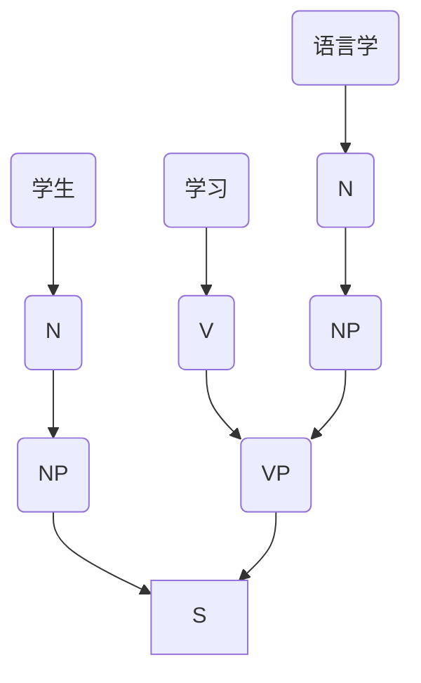
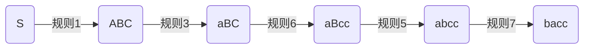
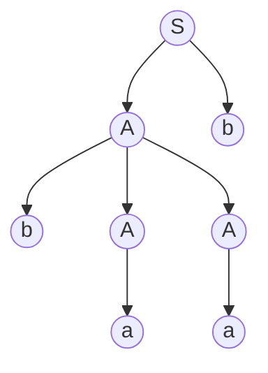
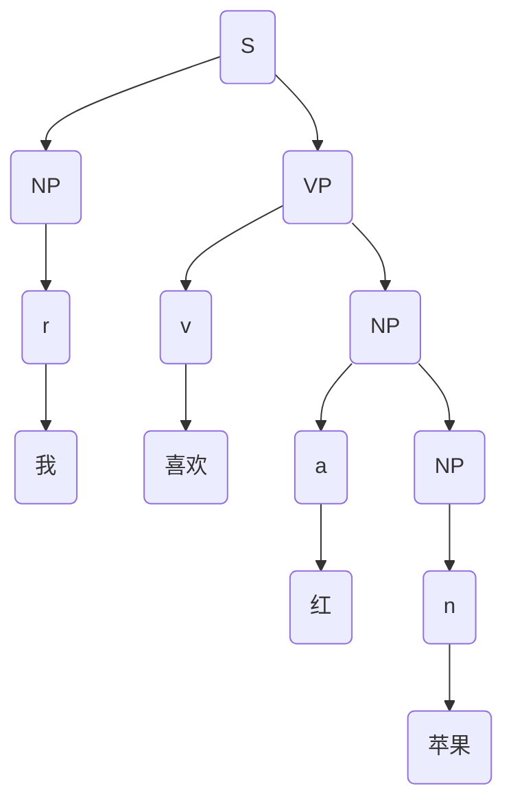
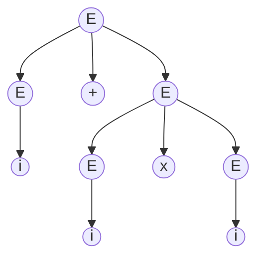
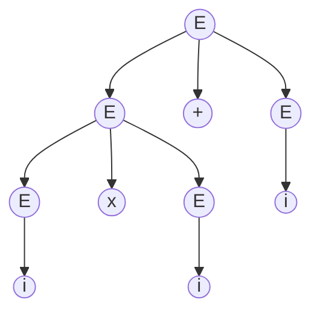
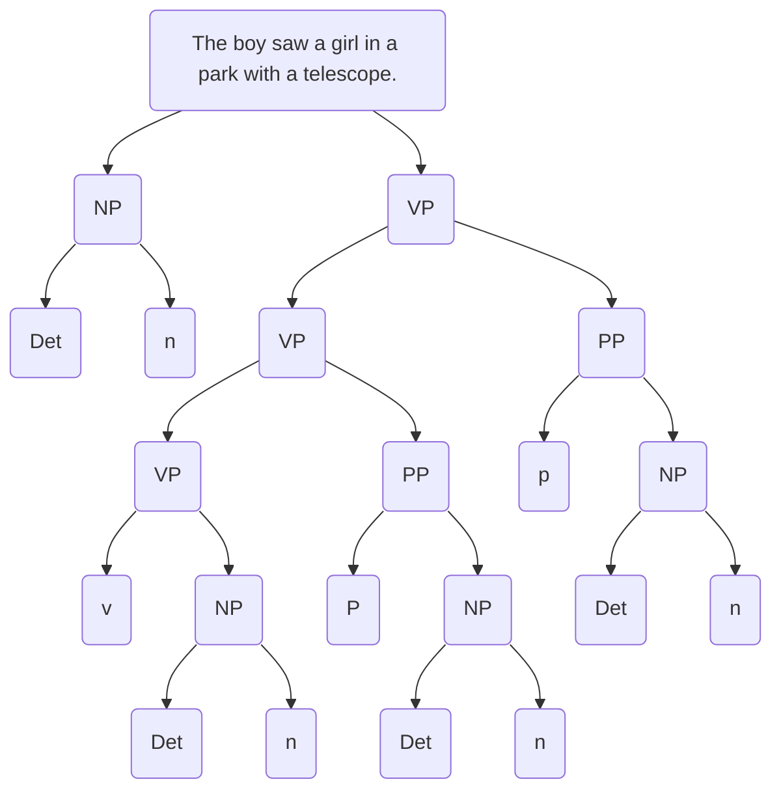

# 3 形式语言与自动机
----
主要内容
1. 基本概念
2. 语言研究的形式化
3. [形式语法](#/4/49)
4. 自动机

----

### 3.1 基本概念
----
#### 树（Tree）
一个连通的无回路的**无向图**称为树（或称自由树）。 
如果树中有一个结点被特别地标记，则这棵树被称之为根树，这个被特别标记的结点被称之为**根结点**。
----
<div class="firstTest mermaid" >
       graph LR;
        A-->B;
</div>
----

<div class="sec mermaid">
       graph LR;
        A---B;
        B---C;
        C---D;
        B---D;
</div>
----
<div class="firstTest mermaid">
       graph TD;
        C((C))--> D((D));
        C((C))--> E((E));
</div>
----
<div class="firstTest mermaid">
       graph TD;
        A((A))--> B((B));
        A((A))--> C((C));
        C((C))--> D((D));
        C((C))--> E((E));
</div>


----
#### 字符串（String）
字符串定义：假定`$\Sigma$`是字符的有限集合，它的每一个元素称之为字符。由`$\Sigma$`中字符相连而成的有限序列被称之为`$\Sigma$`上的字符串（或称符号串，或称链）。不包括任何字符的字符串称为空串，记作`$\epsilon$` 
**符号串的长度**:符号串中符号的个数。符号串`$x$`的长度用`$|x|$`表示。
`$|\epsilon|=0$`包括空串的`$\Sigma$`上字符串的全体记为`$\Sigma ^*$`
----
#### 字符串的操作
假定`$\Sigma$`是字符的有限集合，`$x,y$`是`$\Sigma$`上的符号串
1. 字符串的链接：
把`$y$`的各个符号写在x的符号之后得到的符号串称为`$x$`与`$y$`的连接，记作`$xy$`。 
> **例** 
>`$\Sigma =\{a,b,c\},x=ab,y=cba$` 
那么，`$xy=abcba$`
----
2. 字符串指数操作

设`$x$`是符号串，把`$x$`自身连接`$n$`次得到的符号串，即`$z=xx...x$`，当`$x$`的数量为`$n$`时，称为`$x$`的`$n$`次方，记做`$x^n$`<br>
注意：`$x^0=\epsilon$`
----
> **例** 
> 如果`$x=a$`,则`$x^1=a,x^2=aa,x^3=aaa$` 
> 
> 如果`$x=ab$`,则`$x^0=\epsilon,x^3=ababab$`
----
3. 字符串集合的乘机

设`$A,B$`是符号串的集合，则`$A,B$`的乘积定义为：`$AB=\{xy|x\in A,y\in B\}$`，相应地，`$A^0=\{\epsilon\},A^n=A^{n-1}A=AA^{(n-1)}$`
----
> **例** 
> 设`$A=\{aa,bb\},B=\{cc,dd,ee\}$`
> 则`$AB=\{aacc,aadd,aaee,bbcc,bbdd,bbee\}$`
> `$A^2=\{aaaa,aabb,bbaa,bbbb\}$`

----
#### 正则表达式(Regular Expression)
正则表达式是操作字符串的逻辑公式。用定义好的字符集或其组合表示规则字符串。
----
正则式对应于`$\Sigma$`上的一些子集(正则集)，并通过递归定义:
1. 空集`$\phi$`和空字符串`$\epsilon$`是正则式，它们的正则集分别为`$\phi$`和`$\{\epsilon\}$`
2. 任何`$x\in \Sigma,x$`是正则式，它对应的正则集是`$\{x\}$`
3. `$X,Y$`是`$\Sigma$`上的正则式，并且它们对应的正则集分别为`$U,V$`，那么,`$X|Y,X\cdot Y$`和`$X^*$`也是正则式，且它们对应的正则集分别为`$U\cup V,U\cdot V$`和`$U*$`
----
> **例**
> 假设`$\Sigma=\{0,1\}$`,那么,0和1都是正则表达式。 
> 如果令`$x=0,y=1$`,那么,`$y^*=1^*$`也是正则式，对应的正则集为：`$U=\{\epsilon,1,11,...\}$` 
> `$xy^*=01^*$`也是正则式，且它对应的正则集： 
> `$V=\{0,01,011,0111,...\}$`
> `$x|y^*=\{x\}\cup U=\{0,\epsilon,1,11,111,...\}$`
----


#### 栈(stack)
栈是一种线性表，`$A=A_0,A_1,...A_k$`。`$A_0$`是栈底,`$A_k$`是栈顶,当栈为空时`$A_0$`既是栈顶也是栈底。

----
`$A_k$`(Top) |
:---:|
... | 
`$A_2$` | 
`$A_1$` | 
`$A_0$`(Bottom) | 

----
### 3.2 语言的形式化

1. 形式语法(formal grammar)
2. 形式理论(formal theory)
3. 形式化的语法(formalized grammar)
4. 形式化的理论 (formalized theory)
----
汉语、英语等自然语言不是形式语言，但可以用符号、公式等形式化的手段来研究其语法，这种语法称“形式化的语法”，有时也称“形式语法”；这样表达的理论称“形式化的理论”，有时也称“形式理论”。

形式逻辑、数学公式、计算机程序等人工语言都可以视为为形式语言。这种语言的语法是形式语法。
----

#### 形式语言的定义
- 按照一定规律构成的句子和符号串的有限或无限的集合。(Chomsky)
- 语言可以被看成一个抽象的数学系统。(吴蔚天)

----

“**形式**”这一术语在语言学中至少有两个不同的含义：
1. 形式可与内容、语义相对，指语言单位的外部表现，为语言意义的物质载体，是语言中可听得着、可看得见的部分，包括语音单位的外形及排列顺序、分布、结构等。这一“形式”是与“意义(meaning)”相对的。
----
2. “形式”指语言中抽象的关系结构。它要靠符号、公式，把具体现象抽象化、概念化。我们说的“语言的形式化”指的就是这一意义。这一“形式”是与“实体（substance）”相对的。
----

#### 语言形式化的可能性和必要性
1. 必要性
它既是计算机处理自然语言的需要，也是语言研究提高科学性、可靠性的需要。
----

> 例如
> “这句话是假的。”语义悖论的出现是因为同一自然语言在这个句子内既是对象语言，又是元语言。
----
2. 可能性
袁毓林先生把自然语言和形式语言进行比较以后认为：
- 形式语言至少具有三个特点：
1. 基本单元的明确性；
2. 运算和关系的明确性；
3. 优先级的明确性。
- 自然语言在这三个方面是极不明确的。
----
**语言范畴的边界不明确**
1. 语素、词、词组的界限不是十分明确的。
> 例如
> 蝴蝶、蝶泳、蝶形花
> 鸡蛋、鸵鸟蛋、咸鸭蛋
----
2. 词类之间的界限也不是十分清楚的。
- 凡受“很”修饰而不能带宾语的谓词是形容词。
- 凡不受“很”修饰或能带宾语的谓词是动词。
----

例如
> 1. "我大他三岁" "我高你一头"
> 2. (\*)不(\*)
> 3. (\*)了没有
> 4. 比N(\*)
----
3. 句子合格性的界限也是模糊的。例如

>一片树叶飘落在了我的帽子上
----

**结构关系难于定义**
例如
> 1. 台上坐着主席团---(状-动-主？主-动-宾? 状-动-宾?)
> 2. 主席团坐在台上---(主-动-宾？ 主-动-补？)
----

例如

> 1. 小王推开了门---(施事)
> 2. 右手推开了门---(施事？/工具？)
> 3. 北风吹开了门---(?)
----

4. 层次不外现。例如

> 三个工厂的推销员
- 三个工厂的/推销员
- 三个/工厂的推销员

----
例如

> 不严肃地批评孩子的家长


- 不严肃地/批评孩子的/家长--NP
- 不严肃地/批评/孩子的家长--VP
- 不/严肃地批评孩子的/家长--NP
- 不/严肃地批评/孩子的家长--VP

----
**在词和短语层面层次的不外现**

汉语 |英语
:---:|:---:
鸡蛋 | egg
鸭蛋 | duck's egg
----
汉语 |英语
:---:|:---:
管理家务 | manage household(动)
管理家务 | managerial personnel(形)
企业管理 | management of enterprises(名)
----
**VP+NP1+的+NP2**
例如

- 穿着红衣服的姑娘
- 穿着节日的盛装
- 咬死了猎人的狗
----

- 穿着红衣服的--> 姑娘--> NP
- 穿着--> 节日的盛装-->VP
- 咬死了猎人的--> 狗-->NP
- 咬死了--> 猎人的狗-->VP

----
**VP+NP1+的+NP2 是一个潜在的歧义结构，转化为现实歧义要满足三个条件：**
1. NP1在语义上可以做VP的受事；
2. NP2在语义上也可做VP的受事, 在 NP1为VP的受事时, NP2又可做VP的施事;
3. NP1和NP2之间在语义上存在领属和被领属关系, NP1是领属者, NP2是被领属者.
----
**问题的关键在于:**
- NP1与V是否具有语义搭配性
- 如果我们在规则中加进去这项语义限制，那么具有搭配性的ａ归结为NP，不具有搭配性的ｂ则归结为VP；
- 但要确定ｃ仅仅靠结构内的语义分析就不够了，还要靠上下文语境的分析。
----

#### 小结
从理论上说，自然语言的形式化，不仅是必要的，也是可能的。但由于我们现在对自然语言，尤其是汉语的研究还很不深入，很不透彻，对句法语义关系以及人们对语言的认知理解缺乏精细的刻画，所以距离自然语言形式化的描写、距离计算机对非受限的自然语言理解的真正实现还有一段遥远的路程。这中间虽然也有待于计算机技术的进一步提高，但最主要的还是语言学问题。
----

一方面，我们要找到最适合自然语言形式化描写的切入理论，另一方面，更重要的，是我们必须扎扎实实地从一点一滴的语言事实开始研究，为计算机理解自然语言提供有效的语言学支持。
----
课外阅读：[Last Words: What Science Underlies Natural Language Engineering?](https://www.aclweb.org/anthology/J09-4012.pdf)

主要观点：当代的自然语言工程里，语言学整体上是缺位的！


----
#### 3.2.3 形式化的方法的条件
1. <font color=yellow>高度的抽象化</font>。形式化方法所表达的内容必须是语言的语法、语音、语义等系统的一般的、概括的、抽象的原则与规则，而不是上述系统中个别现象的具体描述。也就是说，形式化方法的目的是从具体语言现象中抽象出一般的规律并总结出形式化的理论。
----

2. <font color=yellow>元语言的形式化</font>。形式化方法的主要工具是形式语言（可以是数学语言、逻辑语言等），也就是说，形式化方法要用形式语言作元语言，而不能用自然语言作元语言。
3. <font color=yellow>过程的严密化</font>。即形式化方法的运用过程必须具有数学与逻辑的严密性。
----
#### 语言描述的三种途径
1. 穷举法——只适合句子数目有效的语言。
2. 语法描述——生成语言中合格的句子。
3. 自动机——对输入的句子进行检验，区别哪些是语言中的句子，哪些不是语言中的句子。
----
#### 形式语言的直观意义
形式语言是用来精确地描述语言(包括人工语言和自然语言)及其结构的手段。形式语言学也称<font color=yellow>代数语言学</font>。
----

以重写规则`$\alpha\rightarrow \beta$`的形式表示为例。其中，`$\alpha,\beta$`均为 字符串。顾名思义：字符串`$\alpha$`可以被改写成`$\beta$`。一个初步的字符串通过不断地运用重写规则,就可以得到另一个字符串。通过选择不同的规则并以不同的顺序来运用这些规则,就可以得到不同的新字符串。
----

#### 3.3 形式语法
句子“学生学习语言学。”



----


----
> 推导过程：
> 1. `$句子\Rightarrow 名词短语+动词短语$`
> 2. `$动词短语\Rightarrow 动词+名词短语$`
> 3. `$名词短语\Rightarrow 名词$`
> 4. `$动词\Rightarrow 学习$`
> 5. `$名词\Rightarrow 学生$`
> 6. `$名词\Rightarrow 语言学$`

----
> 形式化推导过程：
> 1. `$S\Rightarrow NP+VP$`
> 2. `$VP\Rightarrow V+NP$`
> 3. `$NP\Rightarrow N$`
> 4. `$V\Rightarrow 学习$`
> 5. `$N\Rightarrow 学生$`
> 6. `$N\Rightarrow 语言学$`
----
- 句法树和重写规则都是形式语法常用的描述方法。
	- 从中可以看出乔姆斯基从结构主义语言学汲取的营养。
- 生成语言学与结构主义语言学的根本区别在于它把一种语言描写的方法转化成了一种解释语言生成的机制。

----
#### 形式语法的定义
形式语法是一个4元组`$G=\{N,\Sigma,P,S\}$`
----
其中,`$N$`是是<font color=yellow>非终结符</font>的有限集合(有时也叫变量集或句法种类集)；

----
`$\Sigma$`是<font color=yellow>终结符</font>的有限集合,`$N\bigcap \Sigma=\Phi;V=N\bigcup\Sigma$`称总词汇表;
----
`$P$`是一组<font color=yellow>重写规则</font>的有限集合：`$P=\{\alpha\rightarrow\beta\}$`,其中,`$\alpha,\beta$`是`$V$`中元素构成的串，但`$\alpha$`中至少应含有一个非终结符号;
----
`$S\in N$`称为<font color=yellow>句子符或初始符</font>。 
----
> **例**
> `$G=(\{A,S\},\{0,1\},P,S)$`<br>
> P：<br>
> - `$S\rightarrow 0A10$`
> - `$A\rightarrow 00A1$`
> - `$A\rightarrow 1$`

----
#### 推导的定义
设：`$G={N,\Sigma,P,S}$`是一个文法在`$(N\bigcup \Sigma)^*$`上定义关系`$\Rightarrow_G$`(直接派生或推导)如下：
> 如果`$\alpha \beta \gamma$`是`$(N\bigcup \Sigma)^*$`中的符号串，且`$\beta \rightarrow \delta$`是`$P$`的生产式，那么`$\alpha \beta \gamma \Rightarrow_G \alpha \delta \gamma$`
----

- 用`$\Rightarrow_G^+$`(按非一般方式派生)表示`$\Rightarrow_G$`的传递闭包(非空集合上的关系)，也就是`$(N\bigcup \Sigma)^*$`上的符号串`$\xi_i$`到`$\xi_{i+1}$`的`$n\{n \geq 1\}$`步推导或派生。
- 用`$\Rightarrow_G^*$`(派生)表示`$\Rightarrow_G$`的自反和传递闭包，也就是`$(N\bigcup \Sigma)^*$`上的符号串`$\xi_i$`到`$\xi_{i+1}$`经过`$n\{n \geq 1\}$`步推导或派生。
- 如果清楚文法`$G$`所产生的推导步骤,符号`$\Rightarrow_G^+$`或`$\Rightarrow_G^*$`可以省略不写。
----


$$G=(V_n,V_t,P,S)$$
$$V_n=(S,A,B,C)$$
$$V_t=(a,v,c)$$
----
#### P：
1. `$S\rightarrow ABC$`
2. `$A\rightarrow aA$`
3. `$A\rightarrow a$`
4. `$B\rightarrow Bb$`
5. `$B\rightarrow b$`
6. `$BC\rightarrow Bcc$`
7. `$ab\rightarrow ba$`
----

----

#### P：
1. `$S\rightarrow ABC$`
2. `$A\rightarrow aA$`
3. `$A\rightarrow a$`
4. `$B\rightarrow Bb$`
5. `$B\rightarrow b$`
6. `$BC\rightarrow Bcc$`
7. `$ab\rightarrow ba$`
----
这个派生过程被称为“完全的派生”，它从起始符Ｓ开始，一直到产生出一个终端语符列bacc来，才得以终止。因为只有bacc才能满足以下三个条件：

----
1. 它完全由终端语符组成；
2. 它不能再被语法中任何重写规则改写了；
3. 它是语法自`$Ｓ$`开始作派生的最后一行。

----

上例中，规则2与规则4可以无限重复，这样`$Ｇ$`的终极语符列的集合可写为`$b^na^mcc(n\ge1,m\ge1)$`。其中，b的个数，即`$n$`的值等于使用规则4的次数加1；`$a$`的个数，即`$m$`的值等于使用规则2的次数加1。

----
##### 最左推导、最右推导和规范推导
1. 约定每步推导中只改写<font color=yellow>最左边</font>的那个非终结符， 这种推导称为“最左推导”。
2. 约定每步推导中只改写<font color=yellow>最右边</font>的那个非终结符， 这种推导称为“最右推导”。最右推导也称规范推导。
----

文法`$G=\{\{E,F,T\}, \{a,+,*,(,)\},P,E\}$`

其中,`$\{E,F,T\}$`是非终极符号,`$\{a,+,*,(,)\}$`是终极符号,规则`$P$`如下:
1. `$E\rightarrow E+T|T$`
2. `$T\rightarrow T*F|F$`
3. `$F\rightarrow (E)|a$`
----
分别按照最左推导和最右推导得到字符串`$a+a*a$`
----
> 最左推导：
> 1. `$E\Rightarrow E+T$`
> 2. `$E+T\Rightarrow T+T$`
> 3. `$T+T\Rightarrow F+T$`
> 4. `$F+T\Rightarrow a+T$`
> 5. `$a+T\Rightarrow a+T*F$`
> 6. `$a+T*F\Rightarrow a+F*F$`
> 7. `$a+F*F\Rightarrow a+a*F$`
> 8. `$a+a*F\Rightarrow a+a*a$`
----
> 最右推导：
> 1. `$E\Rightarrow E+T$`
> 2. `$E+T\Rightarrow E+T*F$`
> 3. `$E+T*F\Rightarrow E+T*a$`
> 4. `$E+T*a\Rightarrow E+F*a$`
> 5. `$E+F*a\Rightarrow E+a*a$`
> 6. `$E+a*a\Rightarrow T+a*a$`
> 7. `$T+a*a\Rightarrow F+a*a$`
> 8. `$F+a*a\Rightarrow a+a*a$`
----
#### 形式语法的特点
1. 高度的形式化和抽象化。
2. 形式语法是一套演绎系统。
3. 形式语法具有算法的特点。
----
#### 算法的特点
1. 通用性：算法是针对一类问题的
1. 机械性：算法的每一步骤都是确定的
1. 有限性：算法必须在有限步骤内结束
1. 离散性：算法的输入及输出数据都是离散符号
----
#### 形式语法的类型
----
##### 无约束文法
如果`$P$`中的规则满足如下形式：
`$\alpha \rightarrow \beta$`,其中,`$\alpha, \beta$`是字符串,则称`$G$`为无约束文法,或称0型文法。

任何0型文语言都是递归可枚举的,反之,递归可枚举集必定是一个0型语言。

----

##### 上下文有关文法(CSG, context-sensitive grammar)


在0型文法的基础上每一个`$\alpha \rightarrow \beta$`,都有`$|\beta| \geq |\alpha|$`。这里的`$|\beta|$`表示的是`$\beta$`的长度。 

如有`$A \rightarrow Ba$`则`$|\alpha|=1$`,`$|\beta|=2$`符合1型文法要求。反之,如`$aA \rightarrow a$`则不符合1型文法。 
----
- 例
文法`$G=\{N,\Sigma,P,S\}$`,非终极符号`$N=\{S,A,B,C\}$`,终极符号 `$\Sigma=\{a,b,c\}$`,规则`$P$`如下：
1. `$S\rightarrow ABC$`
2. `$A\rightarrow aA|a$`
3. `$B\rightarrow bB|b$`
4. `$BC\rightarrow Bcc$`

求文法`$G$`生成的句子的集合。
----
`$L(G)=\{a^nb^mc^2\},(n\geq 1,m\geq 3),(n\geq 1,m\geq 1)$`
----
##### 上下文无关文法(CFG, context-free grammar)
2型文法是在1型文法的基础上,再满足：每一个`$\alpha \rightarrow \beta$`都有`$\alpha $`是非终结符。如`$A \rightarrow Ba$`,符合2型文法要求。

如`$Ab \rightarrow Bab$`虽然符合1型文法要求,但不符合2型文法要求，因为其`$\alpha=Ab$`，而`$Ab$`不是一个非终结符。
----
- 例
文法`$G=\{N,\Sigma,P,S\}$`,非终极符号`$N=\{S,A,B\}$`,终极符号 `$\Sigma=\{a,b\}$`,规则`$P$`如下：
1. `$S\rightarrow ABC$`
2. `$A\rightarrow aA|a$`
3. `$B\rightarrow bB|b$`
4. `$C\rightarrow BA|c$`

求文法`$G$`生成的句子的集合。
----

`$L(G)=\{a^nb^ma^kc^a\}$`,

`$(n\geq 1,m\geq 3)$`,

`$(n\geq 1,m\geq 1,k\geq 0,a\in\{0,1\})$`
----

##### 正则文法
它是在2型文法的基础上满足:

`$A\rightarrow \alpha$` |  `$B\alpha$`(左线性)或`$A \rightarrow \alpha | \alpha B$`（右线性）

----

例
文法`$G=\{N,\Sigma,P,S\}$`,非终极符号`$N=\{S,A,B\}$`,终极符号 `$\Sigma=\{a,b\}$`,规则`$P$`如下：
1. `$S\rightarrow aA$`
2. `$A\rightarrow aA$`
3. `$A\rightarrow bbB$`
4. `$B\rightarrow bB$`
5. `$B\rightarrow b$`

求文法`$G$`生成的句子的集合。
----

`$L(G)=\{a^nb^m\},(n\geq 1,m\geq 3)$`
----
每一个正则文法都是上下文无关文法,每一个上下无关文法都是上下文有关 文法,而每一个上下文有关文法都是0型文法。即： 
`$L(G_0)\supseteq L(G_1)\supseteq L(G_2) \supseteq L(G_3)$`
----
文法类型 | 文法名称 | 示例
---|---|---
0型文法 | 无约束文法 |`$AB\rightarrow CD$`;`$AB\rightarrow C$`
1型文法 | 上下文相关文法|`$aBa\rightarrow aba$`
2型文法 | 上下文无关文法|`$A\rightarrow a$`
3型文法 | 正则文法|`$A\rightarrow aB$`;`$A\rightarrow a$`

----

#### 3.3.6 用树形图表示上下文无关文法生成的句子
上下文无关文法产生一个句子的派生树的步骤如下： 
1. 对于`$\forall_x\in N\bigcup\Sigma$`给一个标记作为节点,`$S$`作为树的y根节点。
2. 如果一个节点的标记为`$A$`,并且它至少有一个除它自身以外的后裔，则`$A\in N$`
3. 如果一个节点的标记为`$A$`,他的`$k(k>0)$`个直接后裔节点按从左到右的次序依次标记为`$A_1,A_2,...,A_k$`则`$A\rightarrow A_1,A_2,...,A_k$`一定是`$P$`中的一个产生式。
----

例 
文法`$G=\{\{S,A\}\},\{a,b\},P,S\}$`,规则`$P$`如下：
1. `$S\rightarrow bA$`
2. `$A\rightarrow bAA$`
3. `$A\rightarrow a$`
`$G$`产生句子`$bbaa$`可以由下面的生树表示:
----

----
例 
`$G=\{V_n,V_t,P,S\}$` 
`$V_n=\{S,NP,VP\}$` 
`$V_t=\{n,r,v,a\}$` 
规则`$P$`如下： 
1. `$S\rightarrow NP+VP$`
1. `$NP\rightarrow n$`
1. `$NP\rightarrow r$`
1. `$NP\rightarrow a+NP$`
1. `$VP\rightarrow v$`
1. `$VP\rightarrow vNP$`
1. `$r\rightarrow$`我
1. `$v\rightarrow $`喜欢
1. `$a\rightarrow $`红
1. `$n\rightarrow $`苹果
----
根据文法`$G$`生成句子"我喜欢红苹果"，并画出树形图。
----

----

----

#### 3.3.7 上下文无关文法的二义性
一个文法`$G$`,如果存在某个句子有不只一棵分析树与之对应,那么称这个文法是二义的。
----
例
文法`$G(E)$`的规则如下： 
1. `$E\rightarrow E+E$`
2. `$E\rightarrow E\times E$`
3. `$E\rightarrow E$`
4. `$E\rightarrow E-E$`
5. `$E\rightarrow i$` 

生成句子`$i+i\times i$`有两棵对应的分析树。

----


----

----


----


----
句子

"The boy saw a girl in a park with a telescope."

有多少意义?
----

----


----
### 自动机

1. 图灵机
2. 线性界限自动机
3. 下推自动机
4. 有限自动机
----
#### 图灵机

- 图灵机在计算机科学中的地位
	- 自动机的最高形式
	- 现代电子计算机的理论模型
	- 可计算性和计算复杂性的判断基准
----
从机械装置的角度来说，图灵机由一条可以（向右）无限延长的输入带、一个有限状态控制装置和一个连接控制器与输入带的读写头组成，如图所示


----
有限状态控制器的状态转换和动作规则是图灵机的核心要素。图灵机在当前状态下扫描到带上的一个字符时，要执行3件工作：
1. 进行状态转换；
2. 读写头在带上的当前格写上新的字符；
3. 决定读写头向左还是向右移动一格。
----
图灵机`$M$`是一个七元组：

`$M=(\Sigma,Q,\delta,\Gamma,q_0,B,F)$`,

其中,`$\Sigma$`是输入符号的有穷集合;
`$Q$`是状态的有限集合;`$q_0$`是初始状态,`$q_0\in Q$`;`$\Gamma$`是带符号集;
`$F$`是终止状态集合,`$F\subseteq Q$`;`$B(B\in F)$`
`$\delta$`是`$Q$`与`$\Sigma$`的直积`$Q\times \Sigma$`到`$Q$`(下一个状态)的映射。
它支配着有限状态控制的行为,有时也称为状态转移函数。
----
#### 线性界限自动机
----
1. 线性界限自动机的`$\sigma$`中包括两个特殊符号#和$，分别表示输入链的左端和右端结束标志。
2. 线性界限自动机`$M$`的格局，以及两个格局之间转移关系的定义与图灵机的相同。
3. 线性界限自动机与图灵机的唯一不同是对读/写头位置的限制。
----
4. 在线性界限自动机中，对于读/写超出输入字符串长度范围时，转移动作没有定义。
5. 对于任何状态`$q\in Q$`和`$A\in\Gamma$`，如果映射`$\delta(q,A)$`包含的成员(下一个状态)不超过一个，则线性界限自动机是确定的。

如果`$L$`是一个上下文相关语言，则L由一个不确定的线性界限自动机所接受。反之，如果L被一个线性界限自动机所接受，则L是一个上下文相关语言。
----
#### 下推自动机(Push-Down Automata, PDA) 

PDA可以看成是一个带有附加的下推存储器的有 限自动机,下推存储器是一个栈。

----

定义:一个不确定的PDA可以表达成一个7元组,即`$M=(\Sigma,Q,\Gamma,\delta,q_0,F)$`其中, 
`$\Sigma$`是输入符号的有穷集合; 
`$Q$`是状态的有限集合; 
`$q_0\in Q$`是初始状态; 
`$\Gamma$`为下推存储器符号的有穷集合; 
`$Z_0\in \Gamma$`为最初出现在下推存储器顶端的开始符号; 
`$F$`是终止状态集合`$F\subseteq Q$`; 
`$\delta$`是从`$Q\times(\Sigma\bigcup\{\epsilon\})\times\Gamma$`到`$Q\times\Gamma*$`的子集的映射。
----
### 有限自动机
作为描述语言的一种途径，自动机对输入的句子进行检验，区别哪些是语言中的句子，哪些不是语言中的句子。
----

#### 3.3.1 确定的有限自动机(Definite Automata, DFA) 
----

确定的有限自动机`$M$`是一个五元组：

`$M=(\Sigma,Q,\delta,q_0,F)$`,

其中,`$\Sigma$`是输入符号的有穷集合;
`$Q$`是状态的有限集合;`$q_0$`是初始状态,`$q_0\in Q$`;
`$F$`是终止状态集合,`$F\subseteq Q$`;`$\delta$`是`$Q$`与`$\Sigma$`的直积`$Q\times \Sigma$`到`$Q$`(下一个状态)的映射。
它支配着有限状态控制的行为,有时也称为状态转移函数。
----

处在状态`$q_0\in Q$`中的有限控制器从左到右依次从
输入带上读入字符。开始时有限控制器处在状态`$q_0$`，
并注视`$\Sigma^*$`中一个链的最左符号。映射`$\delta(q,a)=q'(q,q'\in Q,a\in \Sigma)$` 表示在状态`$q$`时，若输入符号为`$a$`，则
自动机进入状态`$q'$`并且将输入头向右移动一个字符。
----
##### 状态变换图
映射`$\delta(q,a)=q'$`可以由状态变换图描述。
<!--
```mermaid
graph LR
A((q))--a--\>B((q'))
```
-->


<!--为了明确起见，终止状态用双圈表示，起始状态用有“开始”标记的箭头表示。-->
----
#### 3.3.1 DFA定义的语言
如果一个句子`$x$`使得有限自动机`$M$`有`$\delta(q_0,x)=p$`,`$p\in F$`,那么,称句子`$x$`被`$M$`接受。

由`$M$`定义的语言`$T(M)$`就是被`$M$`接受的句子的全集。即,

`$T(M)=\{x|\delta(q_0,x)\in F\}$`

----

#### 不确定的有限自动机(Non-definite Automata, NFA)

----
不确定的有限自动机`$M$`是一个五元组：

`$M=(\Sigma,Q,\delta,q_0,F)$`

其中,`$\Sigma$`是输入符号的有穷集合;`$Q$`是状态的有限集合;`$q_0$`是初始状态,`$q_0\in Q$`;`$F$`是终止状态集合,`$F\subseteq Q$`;`$\delta$`是`$Q$`与`$\Sigma$`的直积`$Q\times \Sigma$`到`$Q$`的幂集`$2^Q$`的映射。
----
##### NFA与DFA的关系
设L是一个被NFA所接受的句子的集合，则存在一个DFA，它能够接受L。由于DFA与NFA所接受的是同样的链集，所以一般情况下无需区分它们，二者统称为有限自动机(Finite Automata, FA)。
----
NFA与DFA的唯一区别是:

在NFA中`$\delta(q,a)$`
是一个状态集合,而在DFA中`$\delta(q,a)$`是一个状态。
----

<!--
```mermaid
graph TD
A((q0))--0,1--/>A
A--1--/>B((q1))
B--1--/>C((q2))
C--0,1--/>C
A--0--/>D((q3))
D--0--/>F((q4))
F--0,1--/> F
```
-->

该自动机为不确定自动机,
----
句子`$x=01011$`可以被接受。

<!--
##### 正则文法与有限自动机的关系
若`$G=(V_N,V_T,P,S)$`是一个正则文法，则存在一个有限自动机`$M=(\Sigma,Q,\delta,q_0,F)$`,使得`$T(M)=L(G)$`。

由`$G$`构造`$M$`的一般步骤：
1. 令`$\Sigma =V_T,Q=V_N\bigcup{T},q_0=S$`,其中`$T$`是一个新增加的非终结符。
2. 如果在`$P$`中有产生式`$S\rightarrow \epsilon$`,则`$F=\{S,T\}$`,否则`$F=\{T\}$`
3. 如果在`$P$`中有产生式`$B\rightarrow a, B\in V_N, a\in V_T$`,则`$T\in \delta(B,a)$`。
4. 如果在`$P$`中有产生式`$B\rightarrow aC, B,C\in V_N, a\in V_T$`,则`$C\in \delta(B,a)$`。
5. 对于每一个`$a\in V_T$`,有`$\delta(T,a)=\phi$`。

例如，给定正则文法`$G=\{V_N,V_T,P,S\}$`, 

其中,`$V_N=\{S,B\},V_T=\{a,b\}$`,

`$P=\{S\rightarrow aB, B\rightarrow bS|aB|a\}$`

构造与`$G$`等价的NFA


1. 设`$NFA=(\Sigma,Q,\delta,q_0,F)$` 根据上述步骤有: 

`$\Sigma=V_T=\{a,b\}$`,
`$Q=V_N\bigcup\{T\}=\{S,B,T\}$`,

`$q_0=S$` ,`$F=\{T\}$`

2. 映射`$\delta$`为`$\delta(S,a)=\{B\}$`(因为有规则`$S\rightarrow aB$`),`$\delta(S,b)=\phi$` 
,`$\delta(B,a)=\{B,T\}$`(因为有`$B\rightarrow aB,B\rightarrow a$`) 
,`$\delta(B,b)=\{S\}$`(因为有`$B\rightarrow bS$`) 
,`$\delta(T,a)=\phi$` 
,`$\delta(T,b)=\phi$` 

定理：若`$M=(\Sigma,Q,\delta,q_0,F)$`是一个有限自动机，则存在正则文法`$G=(V_N,V_T,P,S)$`使`$L(G)=T(M)$`。
由`$M$`构造`$G$`的一般步骤:
1. 令`$V_N=Q,V_T=\Sigma,S=q_0$`;
2. 如果`$C\in \delta(B,a),B,C\in Q, a\in \Sigma$`,则在`$P$`中有产生式`$B\rightarrow aC$`;
3. 如果`$C\in \delta(B,a),C\in F$`,则在`$P$`中有产生式`$B\rightarrow a$`; 
等价的NFA的状态变换图为：


```mermaid
graph LR
A(开始)--\>B((S))
B--a--\>C((B))
C--a--\>D((T))
C--a--\>C
C--a--\>B
```
结论：对于任意一正则文法，总可以构造一个识别器——DFA。
-->


<!--

##### 映射关系`$\delta$`的解释
映射关系`$\delta(q,a,Z)=\{(q_1,\gamma_1),(q_2,\gamma_2),...,(q_m,\gamma_m)\}$`其中, 
`$q_1,q_2,...,q_m\in Q$` 
`$a\in\Sigma$` 
`$Z\in\Gamma$` 
`$\gamma_1,\gamma_2,...,\gamma_m\in\Gamma*$` 
该映射的意思是：当PDA处于状态`$q$`,面临输入符号`$a$`时，自动机将进入到`$q_i,i=1,2,...,m$`状态,并以`$\gamma_i$`来代替下推存储器（栈）顶端符号`$Z$`,同时将输入头 指向下一个字符。当`$Z$`被`$\gamma_i$`取代时,`$\gamma_i$`的符号按照 从左到右的顺序依次从下向上推入到存储器。 
特殊情况下，`$\delta(q,\epsilon,Z)=\{(q_1,\gamma_1),(q_2,\gamma_2),...,(q_m,\gamma_m)\}$`时，输入头位置不移动,只用于处理下推存储器内部的操作,叫作"`$\epsilon$`移动"。

-->

----
#### 语言与识别器的对应关系 
识别器是有穷地表示无穷语言的另一种方法。每一个语言的句子都能被一定的识别器所接受。


语言类型 | 识别器类型 | 文法类型
:-: | :-: | :-: 
0型 | 图灵机 | 无约束文法
1型 | 线性界限自动机 | 上下文有关文法
2型 | 下推自动机 | 上下文无关文法
3型 | 有限自动机 | 正则文法


<!--

#### 3.3.5 语言与文法类型的约定
如果一种语言能由几种文法所产生，则把这种语言称为在这几种文法中受限制最多的那种文法所产生的语言。 

例如,文法`$G=\{\{S,A,B\}\},\{a,b\},P,S\}$`,非终极符号`$N=\{S,A,B,C\}$`,终极符号 `$\Sigma=\{a,b,c\}$`
,规则`$P$`如下：

1. `$S\rightarrow aB$`
2. `$S\rightarrow bA$`
3. `$A\rightarrow aS$`
4. `$A\rightarrow bAA$`
5. `$A\rightarrow a$`
6. `$B\rightarrow bS$`
7. `$B\rightarrow aBB$`
8. `$B\rightarrow b$`

`$G$`为上下文无关文法。 `$L(G)=\{$` 等数量的a和b构成的链`$\}$`

#### 3.3.6 句型与句子 
殊符号串为文法`$G=\{N,\Sigma,P,S\}$`的句型如下：
1. `$S$`是一个句型；
2. 如果`$\alpha \beta \gamma$`是一个句型，且`$\beta \rightarrow \sigma$`是`$P$`的生产式，则`$\alpha \sigma \gamma$`也是一个句型；
- 文法`$G$`的不含非终结符的句子形式称为`$G$`生成的句子。由文法`$G$`生成的语言，记作`$L(G)$`,指`$G$`生成的所有句子的集合。即`$L(G)=\{x|x \in \Sigma, S \Rightarrow_G^*x\}$`
-->
----

语言分析涉及的内容：
1. 句法范畴。如名词短语(NP)、动词短语(VP)、名词(N)、动词(V)等，用以表示句法单位的类别；
1. 词。例如：“学生”“学习”“语言学等”。它们是句子切分的最终结果；
1. 句法成分之间的关系。如句子由名词短语和动词短语组成，动词短语由动词和名词短语组成等；
1. 句子(S)。在语法分析中，“句子”这个语法范畴具有特殊性，它是句子切分和分析的出发点。
----
|  语言分析   | 自动机  |
|  ----  | ----  |
| 句法范畴  | 非终极词汇集 |
| 词  | 终极词汇集 |
| 句法成分之间的关系  | 重写规 |
| 句子  | 起始符 |

----
####  思考与练习
1. 人工语言与自然语言有什么不同？ 
2. “形式”是什么意思？什么叫语言研究的形式化方法？
3. 语言研究的形式化方法需要满足哪些条件？
4. 简述语言研究形式化的必要性和可能性。
5. 形式语言学的创始人是谁？奠基作品是什么？
6. 语言体系与数学体系是否具有可比性？为什么？
7. 乔姆斯基是如何证明“语言是句子的无限的集合”的？
8. 形式语法具有哪些构成要素？
9. 形式语法的特点是什么？
10. 举例说明上下文相关语法与上下文无关语法的不同。
11. 什么叫自动机？举例说明有限自动机是如何识别语句的。

---
## 4 语言模型
----
### 主要内容
1. 基本概念
2. 参数估计
3. 数据平滑
4. 语言模型的自适应
5. 神经概率语言模型
6. 语言模型的评价方法
7. 语言模型的应用

----
### 基本概念
大规模语料库的出现为自然语言统计处理方法的实现提供了可能，统计方法的成功使用推动了语料库语言学的发展。

基于大规模语料库和统计方法可以用于发现语言使用的普遍规律，通过机器学习自动获取语言知识推测未知语言现象。

如何计算一个句子出现的概率？
----
例如：
“人不能两次踏入同一条河流，因为无论是这条河还是这个人都已经不同。”

- 以句子为单位计算其在所有使用过的句子中的概率？

- 根据句子构成单位计算其联合概率？

----
#### 什么是语言模型

$$
P(s)=P(w_1)\times P(w_2|w_1)\times P(w_3|w_1w_2)\times ...
$$
$$
\times P(w_n|w_1...w_{n-1})
=\prod P(w_i|w_1...w_{i-1})
$$
当`$i=1$`时,`$P(w_1|w_0)=P(w_1)$`,这就是语言模型。
----
需要注意的是
- `$w_i$`可以是字、词、短语或词类等等，称为统计基元。通常以“词”代称。  
- `$w_i$`的概率由 `$w_i...w_{i-1}$`决定,由特定的一组`$w_i...w_{i-1}$`构成的一个序列，称为`$w_i$`的历史。
----
问题：

随着历史基元数量的增加，不同的“历史”(路径)成指数增长。对于第`$i(i>1)$`个统计基元,历史基元的数量为`$i-1$`个。如果共有`$L$`个不同的基元,如词表。理论上每一个词语都有可能出现在1到`$i-1$`的位置上，第`$i$`个基元就有`$L_{i-1}$`中不同的历史。这样，在考虑所有`$L_{i-1}$`种不同历史的情况下产生的第`$i$`个基元的概率，模型中就会有`$𝐿_𝑚$`个自由参数`$P(w_n|w_1...w_{n-1})$`  
如果`$L=5000,m=3$`,自由参数的数目为1250亿！

----
解决办法：

- 减少历史基元的个数,将`$w_iw_2...w_{i-1}$`映射到等价类 `$S(w_iw_2...w_{i-1})$`使等价类的数目远远小于原来不同历史基元的数目。

- 则有：  
`$P(w_i|w_1...w_{i-1})=P(w_i|S(w_1...w_{i-1}))$`


这就是划分等价类的方法

----
#### N元语言模型

这种情况下的语言模型称为n元文法(n-gram)。
1. 当`$n=1$`时,即出现在第`$i$`位上的基元`$w_i$`独立于历史,n-gram 被称为一阶马尔柯夫链(uni-gram 或monogram)
2. 当`$n=2$`时,n-gram被称为2阶马尔柯夫链(bi-gram)
3. 当`$n=3$`时,n-gram被称为3阶马尔柯夫链(tri-gram)

----

为了保证条件概率在`$i=1$`时有意义,同时为了保证句子内所有字符串的概率和为 1,即`$\Sigma_sp(s)=1$`,可以在句子首尾两端增加两个标志:
<BOS>`$w_1w_2...w_m$`<EOS>不失一般性，对于`$n>2$`的n-gram`$P(s)$`可以分解为：
$$
P(s)= \prod_{i=1}^{m+1}P(w_i|w_{i-n+1}^{i-1})
$$
其中,`$w_i^j$`表示词序列`$w_i...w_j$`,约定`$w_0$`为<BOS>,`$w_{m+1}$`为<EOS>。
----
例如，给定句子："John read a book"
- 首先，增加标记：\<BOS\> John read a book \<EOS\>

- 然后，2元文法的概率为：
`$P(John\ read\ a\ book) = $`
`$P( John|<BOS> )\times P(read | John)$`
`$\times P(a|read)\times P(book|a)\times P(<EOS> | book )$`
----

例如，给定拼音串：ta shi yan jiu sheng wu de

可能的汉字串:  
1. 踏实研究生物的  
2. 他实验救生物的  
3. 他使烟酒生物的  
4. 他是研究生雾的  
5. … …
----

如果使用2-gram：

`$P(CString1) =P(踏实|<BOS>)\times P(研究|踏实)\times$`
`$P(生物|研究)\times P(的|生物)\times P(<EOS>|的)$`

`$P(CString2) =P(他|<BOS>)\times P(实验|他)\times P(救|实验)$`
`$\times P(生物|救)\times P(的|生物)\times P(<EOS>|的)$`

`$P(CString3) =P(他|<BOS>)\times P(是|他)\times P(研究|是)$`
`$\times P(生物|研究)\times P(的|生物)\times P(<EOS>|的)$`
……
----
#### N元语法模型生成字符串的规模
当语料汉字的总数为`$N$`时
- 一元语法：
	1. 样本空间为`$N$`
	2. 只选择使用频率最高的汉字
- 二元语法：
	1. 样本空间为`$N^2$`
	2. 效果比一元语法明显提高

微软拼音输入法基于n-gram  
对汉字而言四元语法效果会好一些
----
例如,汉语分词问题  

给定汉字串：他是研究生物的。  
- 可能切分出的字符串组合：  

1. 他|是|研究生|物|的  
2. 他|是|研究|生物|的  
----
如果使用2-gram：  

`$P(Seg1)=P(他|<BOS>)\times P(是|他)\times P(研究生|是)$`
`$\times P(物|研究生)\times P(的|物|)\times P(<EOS>|的) $` 

`$P(Seg2)=P(他|<BOS>)\times P(是|他)\times P(研究|是)$`
`$\times P(生物|研究)\times P(的|生物|)\times P(<EOS>|的)$`
----
#### 问题：如何获得n元语法模型？

----
#### 两个重要概念：
- 训练语料(training data)：用于建立模型，确定模型参数的已知语料。
- 最大似然估计(maximum likelihood Evaluation,MLE)：用相对频率计算概率的方法。
参数：用来计算`$p(w|h)$` 的数值,从训练语料数据中得到
----

#### 数据准备
- 去掉格式符号
- 定义词的边界
- 定义句子边界(插入\<BOS\>和\<EOS\>等记号)
- 字母的大小写（保留、忽略或者智能识别）
- 数字（保留、替换为\<num\>等）
- ……
----
#### n-gram参数估计
对于n-gram,参`$P(w_i|w_{i-n+1}^{i-1})$`数可由最大似然估计求得
$$
P(w_i|w_{i-n+1}^{i-1})=f(w_i|w_{i-n+1}^{i-1})=\frac{c(w_{i-n+1}^i)}{\sum_{w_i}c(w_{i-n+1}^i)}
$$
----
其中,`$\sum_{w_i}c(w_{i-n+1}^i)$`是历史字符串`$w_{i-n+1}^{i-1}$`在给定语料中出现的次数,即`$c(w_{i-n+1}^{i-1})$`,不论`$w_i$`是什么。  
`$P(w_i|w_{i-n+1}^{i-1})$`是在给定`$w_{i-n+1}^{i-1}$`的条件下`$w_i$`出现的相对频率,分子为`$w_{i-n+1}^{i-1}$`与`$w_i$`同现的次数。

----
例如，给定训练语料：  
- “John read Moby Dick”  
- “Mary read a different book”  
- “She read a book by Carl”  
----
根据二元文法求句子的概率,把语料处理成如下：  

- \<BOS\> John read Moby Dick\<EOS\>  
- \<BOS\> Mary read a different book\<EOS\>  
- \<BOS\> She read a book by Carl\<EOS\>  
----
- `$P(John|<BOS>)=\frac{c(<BOS>\ John)}{\sum_wc(<BOS>\ w)}=\frac{1}{3}$`  
- `$P(read|John)=\frac{c(John\ read)}{\sum_wc(John\ w)}=\frac{1}{1}$`  
- `$P(a|read)=\frac{c(read\ a)}{\sum_wc(read\ w)}=\frac{2}{3}$`  
- `$P(book|a)=\frac{c(a\ book)}{\sum_wc(a\ w)}=\frac{1}{2}$`  
- `$P(<EOS>|book)=\frac{c(book\ <EOS>)}{\sum_wc(book\ w)}=\frac{1}{2}$`
- `$P(John\ read\ a\ book)=\frac{1}{3}\times 1\times \frac{2}{3}\times \frac{1}{2}\times \frac{1}{2}\approx 0.06$`

----
- `$P(Carl\ read\ a\ book)=?$`  
`$P(Carl\ read\ a\ book)=P(Carl|<BOS>)\times $`
`$P(read|Carl)\times P(a|read)\times$`
`$ P(book|a)\times P(<EOS>|book)$`  
- `$P(Carl|<BOS>)=\frac{c(<BOS>\ Carl)}{\sum_wc(<BOS>\ w)}=\frac{0}{3}=0$`  
- `$P(read|Carl)=\frac{c(Carl\ read)}{\sum_wc(Carl\ w)}=\frac{0}{1}=0$`  
- `$P(Carl\ read\ a\ book)=0$` 
----
<!--
  

-->
#### 问题:数据稀疏(Data Sparsness)

----
- 给定训练样本中未观察到的事件赋以0概率。
- 若某n-gram在训练语料中没有出现,则该n-gram的概率必定是0。
----
- 最直接的解决的办法是扩大训练语料的规模。但是无论怎样扩大训练语料，都不可能保证所有的词在训练语料中均出现。
----
- 由于训练样本不足而导致所估计的分布不可靠的问题，称为数据稀疏问题。
- 在NLP领域中，数据稀疏问题永远存在，不太可能有一个足够大的训练语料，因为语言中的大部分词都属于低频词。

----

#### 解决数据稀疏问题
对语言而言，由于数据稀疏的存在，最大似然估计(MLE) 不是一种很好的参数估计办法。 
----
#### 最大似然估计

例S = \<BOS\> He can buy you the can of soda  \<EOS\>   
- Unigram: (8 words in vocabulary)  
	- `$p_1(He) = p_1(buy) = p_1 (you) = p_1 (the) = p_1(of) = p_1(soda)= 0.125  $`  
	- `$ p_1(can) = 0.25$`
----  
- Bigram:  
	- `$p_2(He|<BOS>)=p_2(can|He) = 1$`  
	- `$p_2(buy|can)=p_2(of|can) = 0.5$`
	- `$,p_2(you|buy)= 1,...$`

----
1. 解决办法: 平滑技术
- 把在训练样本中出现过的事件的概率适当减小。即从大于0的MLE概率估算`$p(w)$`中得到`$p'(w)$`,`$p'(w)<p(w)$`
- 把减小得到的概率密度分配给训练语料中没有出现过的事件。即
`$\sum(p(w)-p'(w))=D$`
把`$D$`分配到`$p(w)=0$`的事件中，保证`$\sum p'(w)=1$`,这个过程有时也称为discounting(减值)
----
2. 基本目标：测试样本的语言模型困惑度越小越好。
3. 基本约束：`$\sum_{w_i}P(w_i|w_1,w_2,...,w_{i-1})=1$`
----
- 困惑度是交叉熵的指数形式
- 交叉熵
$$
H_p(T)=\frac{1}{W_T}\log P(T)
$$
其中，`$W_T$`是测试文本的词数。

- 困惑度
$$Perplexity=2^{H(T)}$$
----
例  
S = \<BOS\> It was the greatest buy of all \<EOS\>  

`$H_S(p_1)=H_S(p_2)=H_S(p_3) =\infty$`  
原因是：  
1. 所有的unigram除了`$p_1(the)$`, `$p_1(buy)$`, `$p_1(of)$`都是0
2. 所有bigram的概率都是 0.  
3. 所有trigram的概率都是 0.  

我们希望使每个概率都是非零的

----
### 数据平滑
目前已经提出了很多数据平滑技术，如：
- Add-one 平滑
- Add-delta 平滑
- Witten-Bell平滑
- Good-Turing平滑
- Church-Gale平滑
- Jelinek-Mercer平滑
- Katz平滑
- ……
----

#### Add-one平滑(Laplace’s law)
基本思想: 每一种情况出现的次数加1. 
`$count_{new}(n-gram)=count_{old}(n-gram) + 1$`  
没有出现过的n-gram的概率不再是0
----

平滑后的概率计算公式为：
$$
P_{addone}(w_1w_2..w_n)=\frac{c(w_1w_2...w_n)+1}{N+V}
$$

其中,`$N$`为训练语料中所有的n-gram的数量(token)  
`$V$`为所有的可能的不同的n-gram的数量(type)  

----
全部概率之和为：  
$$
\sum P_{addone}(w_1w_2...w_n)=\sum \frac{c(w_1w_2...w_n)+1}{N+V}
$$
$$
=\frac {\sum {c(w_1w_2...w_n)+1}}{N+V}
=\frac {N+V}{N+V}=1
$$
其中，`$T$`为训练数据,`$V$`为词表,`$w$`为词

Add-one平滑方法是出现n次的词，假设出现n+1次，这种方法最简单但效果较差。
----


#### Add-one平滑的问题
1. 训练语料中未出现的n-gram的概率不再为0,而是一个大于0的较小的概率值。
2. 但由于训练语料中未出现n-gram数量太多,平滑后,所有未出现的n-gram占据了整个概率分布中的一个很大的比例。
----
#### Add-one平滑的问题
3. 因此，在NLP中,Add-one给训练语料中没有出现过的n-gram分配了太多的概率空间。
4. 认为所有未出现的n-gram概率相等,这是否合理？
5. 出现在训练语料中的那些n-gram,都增加同样的频度值,这是否公平？(低频、高频)
----

各种平滑方法的详细介绍和比较请参阅

[Stanley Chen的研究相关研究](http://www.cs.cmu.edu/~sfc/html/publications.html)

----


### 4.4 语言模型的自适应
- 一方面,在训练语言模型时所采用的语料往往来自多种不同的领域,这些综合性语料难以反映不同领域之间在语言使用规律上的差异,而语言模型恰恰对于训练文本的类型、主题和风格等都十分敏感；
- 另一方面,`$n$`元语言模型的独立性假设的前提是一个文本中的当前词出现的概率只与它前面相邻的`$n-1$`个词相关,但这种假设在很多情况下是明显不成立的。
----
#### 4.4.1  数据平滑的问题
1. 跨领域的脆弱性
2. 独立性假设的无效性
3. 提高语言模型对语料的领域、主题、类型等因素的适应性
----
#### 4.4.2 自适应方法
1. 基于缓存的语言模型(cache-based LM)
2. 基于混合方法的语言模型
3. 基于最大熵的语言模型
----
#### (1) 基于缓存的语言模型(cache-based LM)
该方法针对的问题是：在文本中刚刚出现过的一些词在后边的句子中再次出现的可能性往往较大，比标准的n-gram模型预测的概率要大。针对这种现象，cache-based自适应方法的基本思路是：语言模型通过n-gram的线性插值求得：

$$
\hat P(w_i|w_1^{i-1})=\lambda\hat P_{Cache}(w_i|w_1^{i-1})
$$
$$
+(1-\lambda)\hat P_{n-gram}(w_i|w_{i-n+1}^{i-1})
$$
----
通常的处理方法是：在缓存中保留前面的`$K$`个单词，每个词的概率（缓存概率）用其在缓存中出现的相对频率计算得出：
$$
\hat P_{Cache}(w_i|w_1^{i-1})=\frac{1}{k}\sum_{j=i-K}^{i-1}I_{w_j=w_i}
$$
其中,`$I_{\epsilon}"$`为指示器函数(indicator function),如果`$\epsilon$`表示的情况出现，则`$I_{\epsilon}=1$`否则`$I_{\epsilon}=0$`
----
这种方法的缺陷是，缓存中一个词的重要性独立于该词与当前词的距离。P. R. Clarkson等人(1997) 的研究表明，缓存中每个词对当前词的影响随着与该词距离的增大呈指数级衰减，因此：
$$
\hat P_{Cache}(w_i|w_1^{i-1})=\beta\sum_{j=1}^{i-1}I_{w_i=w_j}e^{-\alpha(i-j)}
$$
----
$$
\sum_{w_i\in V}P_{Cache}(w_i|w_1^{i-1})=1
$$
其中,`$beta$`衰减率,`$e$`为归一化常数,以使得,`$V$`为词汇表
----
#### (2) 基于混合方法的语言模型
该方法针对的问题是：由于大规模训练语料本身是异源的(heterogenous)，来自不同领域的语料无论在主题(topic)方面，还是在风格(style)方面，或者两者都有一定的差异，而测试语料一般是同源的(homogeneous)，因此，为了获得最佳性能，语言模型必须适应各种不同类型的语料对其性能的影响。

----
处理方法:将语言模型划分成`$N$`个子模型`$M_1,M_2,...,M_n$`整个语言模型的概率通过下面的线性插值公式计算得到。
`$
\hat P(w_i|w_1^{i-1})=\sum_{j=1}^n\lambda_j\hat P_{M_j}(w_i|w_1^{i-1})
$`
其中,`$0\leq\lambda\leq 1,\sum_{j=1}\lambda_j=1$`值可以通过EM算法计算出来
----
1. 对训练语料按来源、主题或类型等聚类；
1. 在模型运行时识别测试语料的主题或主题的集合；
1. 确定适当的训练语料子集，并利用这些语料建立特定的语言模型；
1. 利用针对各个语料子集的特定语言模型和线性插值，获得整个语言模型。

----

#### (3) 基于最大熵的语言模型
基本思想:通过结合不同信息源的信息构建一个语言模型。每个信息源提供一组关于模型参数的约束条件，在所有满足约束的模型中，选择熵最大的模型。

----

### 4.5 神经概率语言模型
统计语言模型的目标是学习一种语言中词序列的联合概率函数，但是由于维数灾难的问题让这变得困难。  
n-gram模型是一种近似策略，作了一个马尔可夫假设：认为目标词`$w_i$`的条件概率只与其之前的`$n-1$`个词有关。一个词序列会被测视为与之前训练中出现的所有词序列都不同。通过训练重叠的短的词序列的联系从而得到泛化模型。
----
#### 4.5.1 基本思想
通过学习词的词向量，把每个句子的语义指数告诉模型，从而解决维数灾难的问题。这个模型同时也会学习每个词的词向量和这个词序列的概率函数，并用这种方式表达。如果出现此前从没见过的词序列，并且与出现过的句子在意思上相似有着相似的单词，则它会有一个较高的概率，因此这样就会获得泛化。显著的改善了最先进的n元语法模型，并且这个方法允许使用更长的上下文。
----
#### 4.5.2 相关概念

1. One-Hot Representation（独热）
2. Distributed Representation
----
1. One-Hot Representation（独热）
最早的词向量是很冗长的，大小为整个词汇表的大小，对于每个具体的词汇表中的词，它使用是词向量维度将对应的位置置为1。
比如我们有下面的5个词组成的词汇表，词"Queen"的序号为2， 那么它的词向量就是[0,1,0,0,0]。同样的道理，词"Woman"的词向量就是[0,0,0,1,0]。这种词向量的编码方式我们一般叫做one-hot representation.
----
#### One-Hot Representation存在的问题
最大的问题是我们的词汇表一般都非常大，比如达到百万级别，这样每个词都用百万维的向量来表示简直是内存的灾难。这样的向量其实除了一个位置是1，其余的位置全部都是0，表达的效率不高。
----
2. Distributed Representation
基本思想是通过训练，将每个词都映射到一个较短的词向量上来。所有的这些词向量就构成了向量空间，进而可以用普通的统计学的方法来研究词与词之间的关系。这种向量可以表示为：
[0.792, −0.177, −0.107, 0.109, −0.542, …]。
维度以50维和100维比较常见
----
#### 4.5.3 基本结构
神经概率语言模型可以分为四层，即输入层，embedding层，隐藏层，输出层。（也可以分为三层，即把embedding层当做输入层，然后隐藏层、输出层，其实在实际操作中实际的输入就是embedding层（词向量））
----
##### CBOW模型

----
##### skip-gram模型

----
1. 输入层  
用词在词表中的位置（下标），比如几个单词：我 是 教师，在词表中的位置是[3,220]，只要存这几个下标就行了。然后根据下标去embedding层的矩阵中找对应的行。
----
2. embedding层
embedding层实际上是一个矩阵，这个矩阵又叫look-up table。这个矩阵长这个样子，`$|V|$`行数为 ，就是词表的大小，列数为`$h_1$`，即每个词向量的维度，这个维度一般要比one-hot表示的词向量（维度为词表大小）小很多。矩阵的值开始时随机初始化。这样矩阵的每一行就为一个词向量（BP(back propagation)后，每行都是`$h_1$`的实数），可以用来表示一个单词。
----
3. 隐藏层
用的sigmoid函数作为激活函数，bengio的论文中用的tanh函数
4. 输出层
输出层用的softmax函数

----
### 4.6 语言模型的评价方法

- 最佳方法:  
 将语言模型用于某一个应用中，例如拼写检查、机器翻译等

----
- 困惑度(Perplexity):   
假定测试语料`$T$`由`$n$`个句子组成`$T={S_1,S_2,...,S_n }$`则整个测试语料的概率为:
$$
P(T)=\prod_{i=1}^nP(S_i)
$$
----
以对数形式表示的测试语料的概率为：
$$
\log P(T)=\log \prod_{i=1}^nP(S_i)=\sum_{i=1}^n\log P(S_i)
$$
----
测试语料的交叉熵为：
$$
H_p(T)=-\frac{1}{W_T}\log_2P(T)=-\frac{1}{W_T}\sum_{i=1}^n\log_2P(S_i)
$$
----
困惑度(Perplexity): 
$$
P(T)=2^{H_p(T)}
$$
----
### 4.7 语言模型的应用
----
#### 汉语分词问题
方法描述,设对于待切分的句子`$S=z_1,z_2,...z_m,W=w_1,w_2,...,w_k(1\leq k\leq n)$`是一种可能的切分。那么
$$
W=\arg \max P(W|S)=
$$
$$
\arg \max P(W)P(S|W)\cong \arg \max P(W)
$$
----

<!--
#### 4.7.2 word2vec
基本思想是通过训练将每个词映射成`$K$`维实数向量(`$K$`一般为模型中的超参数)，通过词之间的距离（比如 cosine相似度、欧氏距离等）来判断它们之间的语义相似度.其采用一个三层的神经网络，输入层-隐层-输出层。有个核心的技术是根据词频用Huffman编码
-->

### 语言模型的进展
参阅[Two decades of statistical language modeling:  where do we go from here](https://kilthub.figshare.com/articles/Two_Decades_of_Statistical_Language_Modeling_Where_Do_We_Go_From_Here_/6611138/files/12103316.pdf)
----

### 练习
阅读《统计自然语言处理基础》第6章例子，下载该书配套的[Austen 语料库(包括训练集和测试集)](http://nlp.stanford.edu/fsnlp/)。

尝试利用MLE、Good turing估计建立Austen语料库的bigram模型。并将计算结果与参考书给出的部分结果进行比较。
