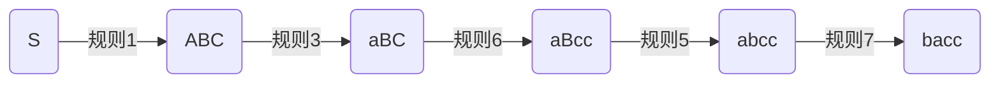
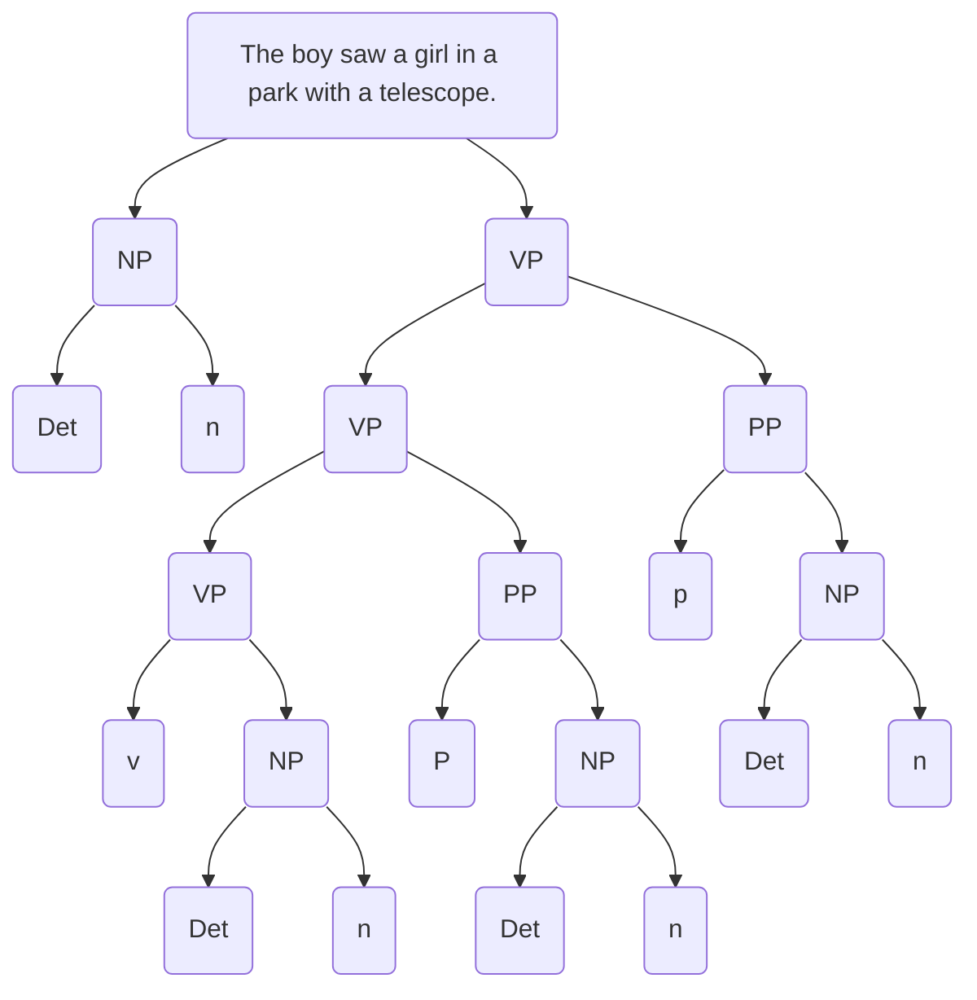

## 第三章 形式语言与自动机
~~~~
主要内容
1. 基本概念
2. 语言研究的形式化
3. [形式语法](#/4/49)
4. 自动机

~~~~

### 3.1 基本概念
~~~~
#### 树（Tree）
一个连通的无回路的**无向图**称为树（或称自由树）。 
如果树中有一个结点被特别地标记，则这棵树被称之为根树，这个被特别标记的结点被称之为**根结点**。

~~~~

~~~~


~~~~


~~~~
#### 字符串（String）
字符串定义：假定`$\Sigma$`是字符的有限集合，它的每一个元素称之为字符。由`$\Sigma$`中字符相连而成的有限序列被称之为`$\Sigma$`上的字符串（或称符号串，或称链）。不包括任何字符的字符串称为空串，记作`$\epsilon$` 
**符号串的长度**:符号串中符号的个数。符号串`$x$`的长度用`$|x|$`表示。
`$|\epsilon|=0$`包括空串的`$\Sigma$`上字符串的全体记为`$\Sigma ^*$`
~~~~
#### 字符串的操作
假定`$\Sigma$`是字符的有限集合，`$x,y$`是`$\Sigma$`上的符号串
1. 字符串的链接：
把`$y$`的各个符号写在x的符号之后得到的符号串称为`$x$`与`$y$`的连接，记作`$xy$`。 
示例 
`$\Sigma =\{a,b,c\},x=ab,y=cba$`,那么,`$xy=abcba$`
~~~~
2. 字符串指数操作

设`$x$`是符号串，把`$x$`自身连接`$n$`次得到的符号串，即`$z=xx...x$`，当`$x$`的数量为`$n$`时，称为`$x$`的`$n$`次方，记做`$x^n$`<br>
注意：`$x^0=\epsilon$`
~~~~
示例 

如果`$x=a$`,则`$x^1=a,x^2=aa,x^3=aaa$` 

如果`$x=ab$`,则`$x^0=\epsilon,x^3=ababab$`
~~~~
3. 字符串集合的乘机

设`$A,B$`是符号串的集合，则`$A,B$`的乘积定义为：`$AB=\{xy|x\in A,y\in B\}$`，相应地，`$A^0=\{\epsilon\},A^n=A^{n-1}A=AA^{(n-1)}$`
~~~~
示例 
设`$A=\{aa,bb\},B=\{cc,dd,ee\}$`,则

`$AB=\{aacc,aadd,aaee,bbcc,bbdd,bbee\}$`

`$A^2=\{aaaa,aabb,bbaa,bbbb\}$`

~~~~
#### 正则表达式(Regular Expression)
正则表达式是操作字符串的逻辑公式。用定义好的字符集或其组合表示规则字符串。
~~~~
正则式对应于`$\Sigma$`上的子集(正则集)，通过递归定义:
1. 空集`$\phi$`和空字符串`$\epsilon$`是正则式，它们的正则集分别为`$\phi$`和`$\{\epsilon\}$`
2. 任何`$x\in \Sigma,x$`是正则式，它对应的正则集是`$\{x\}$`
3. `$X,Y$`是`$\Sigma$`上的正则式，并且它们对应的正则集分别为`$U,V$`，那么,`$X|Y,X\cdot Y$`和`$X^*$`也是正则式，且它们对应的正则集分别为`$U\cup V,U\cdot V$`和`$U*$`
~~~~
示例
假设`$\Sigma=\{0,1\}$`,那么,0和1都是正则表达式。 

如果令`$x=0,y=1$`,那么,`$y^*=1^*$`也是正则式，对应的正则集为：`$U=\{\epsilon,1,11,...\}$` 

`$xy^*=01^*$`也是正则式，且它对应的正则集：

`$V=\{0,01,011,0111,...\}$`

`$x|y^*=\{x\}\cup U=\{0,\epsilon,1,11,111,...\}$`
~~~~


#### 栈(stack)
栈是一种线性表，`$A=A_0,A_1,...A_k$`。`$A_0$`是栈底,`$A_k$`是栈顶,当栈为空时`$A_0$`既是栈顶也是栈底。

~~~~
`$A_k$`(Top) |
:---:|
... | 
`$A_2$` | 
`$A_1$` | 
`$A_0$`(Bottom) | 

~~~~
### 3.2 语言的形式化

1. 形式语法(formal grammar)
2. 形式理论(formal theory)
3. 形式化的语法(formalized grammar)
4. 形式化的理论 (formalized theory)
~~~~
汉语、英语等自然语言不是形式语言，但可以用符号、公式等形式化的手段来研究其语法，这种语法称“形式化的语法”，有时也称“形式语法”；这样表达的理论称“形式化的理论”，有时也称“形式理论”。

形式逻辑、数学公式、计算机程序等人工语言都可以视为为形式语言。这种语言的语法是形式语法。
~~~~

#### 形式语言的定义
- 按照一定规律构成的句子和符号串的有限或无限的集合。(Chomsky)
- 语言可以被看成一个抽象的数学系统。(吴蔚天)

~~~~

“**形式**”这一术语在语言学中至少有两个不同的含义：
1. 形式可与内容、语义相对，指语言单位的外部表现，为语言意义的物质载体，是语言中可听得着、可看得见的部分，包括语音单位的外形及排列顺序、分布、结构等。这一“形式”是与“意义(meaning)”相对的。
~~~~
2. “形式”指语言中抽象的关系结构。它要靠符号、公式，把具体现象抽象化、概念化。我们说的“语言的形式化”指的就是这一意义。这一“形式”是与“实体（substance）”相对的。
~~~~

#### 语言形式化的可能性和必要性

1. 必要性

它既是计算机处理自然语言的需要，也是语言研究提高科学性、可靠性的需要。
~~~~

示例

“这句话是假的。”语义悖论的出现是因为同一自然语言在这个句子内既是对象语言，又是元语言。
~~~~
2. 可能性

袁毓林先生把自然语言和形式语言进行比较以后认为：
- 形式语言至少具有三个特点：
1. 基本单元的明确性；
2. 运算和关系的明确性；
3. 优先级的明确性。
- 自然语言在这三个方面是极不明确的。
~~~~
**语言范畴的边界不明确**
1. 语素、词、词组的界限不是十分明确的。


- 例如
  - 蝴蝶、蝶泳、蝶形花
  - 鸡蛋、鸵鸟蛋、咸鸭蛋
~~~~
2. 词类之间的界限也不是十分清楚的。
- 凡受“很”修饰而不能带宾语的谓词是形容词。
- 凡不受“很”修饰或能带宾语的谓词是动词。
~~~~

例如

1. "我大他三岁" "我高你一头"
2. (\*)不(\*)
3. (\*)了没有
4. 比N(\*)
~~~~
3. 句子合格性的界限也是模糊的。

例如

一片树叶飘落在了我的帽子上
~~~~

**结构关系难于定义**
- 例如
1. 台上坐着主席团---(状-动-主？主-动-宾? 状-动-宾?)
2. 主席团坐在台上---(主-动-宾？ 主-动-补？)
~~~~

例如

1. 小王推开了门---(施事)
2. 右手推开了门---(施事？/工具？)
3. 北风吹开了门---(?)
~~~~

4. 层次不外现。

例如，三个工厂的推销员

三个工厂的/推销员

三个/工厂的推销员

~~~~
例如

- 不严肃地批评孩子的家长
  - 不严肃地/批评孩子的/家长--NP
  - 不严肃地/批评/孩子的家长--VP
  - 不/严肃地批评孩子的/家长--NP
  - 不/严肃地批评/孩子的家长--VP

~~~~
**在词和短语层面层次的不外现**

汉语 |英语
:---:|:---:
鸡蛋 | egg
鸭蛋 | duck's egg
~~~~
汉语 |英语
:---:|:---:
管理家务 | manage household(动)
管理家务 | managerial personnel(形)
企业管理 | management of enterprises(名)
~~~~
**VP+NP1+的+NP2**
例如

- 穿着红衣服的姑娘
- 穿着节日的盛装
- 咬死了猎人的狗
~~~~

- 穿着红衣服的--> 姑娘--> NP
- 穿着--> 节日的盛装-->VP
- 咬死了猎人的--> 狗-->NP
- 咬死了--> 猎人的狗-->VP

~~~~
**VP+NP1+的+NP2 是一个潜在的歧义结构，转化为现实歧义要满足三个条件：**
1. NP1在语义上可以做VP的受事；
2. NP2在语义上也可做VP的受事, 在 NP1为VP的受事时, NP2又可做VP的施事;
3. NP1和NP2之间在语义上存在领属和被领属关系, NP1是领属者, NP2是被领属者.
~~~~
**问题的关键在于:**
- NP1与V是否具有语义搭配性
- 如果我们在规则中加进去这项语义限制，那么具有搭配性的ａ归结为NP，不具有搭配性的ｂ则归结为VP；
- 但要确定ｃ仅仅靠结构内的语义分析就不够了，还要靠上下文语境的分析。
~~~~

#### 小结
从理论上说，自然语言的形式化，不仅是必要的，也是可能的。但由于我们现在对自然语言，尤其是汉语的研究还很不深入，很不透彻，对句法语义关系以及人们对语言的认知理解缺乏精细的刻画，所以距离自然语言形式化的描写、距离计算机对非受限的自然语言理解的真正实现还有一段遥远的路程。这中间虽然也有待于计算机技术的进一步提高，但最主要的还是语言学问题。
~~~~

一方面，我们要找到最适合自然语言形式化描写的切入理论，另一方面，更重要的，是我们必须扎扎实实地从一点一滴的语言事实开始研究，为计算机理解自然语言提供有效的语言学支持。
~~~~
课外阅读：[Last Words: What Science Underlies Natural Language Engineering?](https://www.aclweb.org/anthology/J09-4012.pdf)

主要观点：当代的自然语言工程里，语言学整体上是缺位的！


~~~~
#### 3.2.3 形式化的方法的条件
1. <font color=yellow>高度的抽象化</font>。形式化方法所表达的内容必须是语言的语法、语音、语义等系统的一般的、概括的、抽象的原则与规则，而不是上述系统中个别现象的具体描述。也就是说，形式化方法的目的是从具体语言现象中抽象出一般的规律并总结出形式化的理论。
~~~~

2. <font color=yellow>元语言的形式化</font>。形式化方法的主要工具是形式语言（可以是数学语言、逻辑语言等），也就是说，形式化方法要用形式语言作元语言，而不能用自然语言作元语言。
3. <font color=yellow>过程的严密化</font>。即形式化方法的运用过程必须具有数学与逻辑的严密性。
~~~~
#### 语言描述的三种途径
1. 穷举法——只适合句子数目有效的语言。
2. 语法描述——生成语言中合格的句子。
3. 自动机——对输入的句子进行检验，区别哪些是语言中的句子，哪些不是语言中的句子。
~~~~
#### 形式语言的直观意义
形式语言是用来精确地描述语言(包括人工语言和自然语言)及其结构的手段。形式语言学也称<font color=yellow>代数语言学</font>。
~~~~

以重写规则`$\alpha\rightarrow \beta$`的形式表示为例。其中，`$\alpha,\beta$`均为 字符串。顾名思义：字符串`$\alpha$`可以被改写成`$\beta$`。一个初步的字符串通过不断地运用重写规则,就可以得到另一个字符串。通过选择不同的规则并以不同的顺序来运用这些规则,就可以得到不同的新字符串。
~~~~

#### 3.3 形式语法
句子“学生学习语言学。”

~~~~


~~~~
> 推导过程：
> 1. `$句子\Rightarrow 名词短语+动词短语$`
> 2. `$动词短语\Rightarrow 动词+名词短语$`
> 3. `$名词短语\Rightarrow 名词$`
> 4. `$动词\Rightarrow 学习$`
> 5. `$名词\Rightarrow 学生$`
> 6. `$名词\Rightarrow 语言学$`

~~~~
> 形式化推导过程：
>
> 1. `$S\Rightarrow NP+VP$`
> 2. `$VP\Rightarrow V+NP$`
> 3. `$NP\Rightarrow N$`
> 4. `$V\Rightarrow 学习$`
> 5. `$N\Rightarrow 学生$`
> 6. `$N\Rightarrow 语言学$`
~~~~
- 句法树和重写规则都是形式语法常用的描述方法。
	- 从中可以看出乔姆斯基从结构主义语言学汲取的营养。
- 生成语言学与结构主义语言学的根本区别在于它把一种语言描写的方法转化成了一种解释语言生成的机制。

~~~~
#### 形式语法的定义
形式语法是一个4元组`$G=\{N,\Sigma,P,S\}$`
~~~~
其中,`$N$`是是<font color=yellow>非终结符</font>的有限集合(有时也叫变量集或句法种类集)；

~~~~
`$\Sigma$`是<font color=yellow>终结符</font>的有限集合,`$N\bigcap \Sigma=\Phi;V=N\bigcup\Sigma$`称总词汇表;
~~~~
`$P$`是一组<font color=yellow>重写规则</font>的有限集合：`$P=\{\alpha\rightarrow\beta\}$`,其中,`$\alpha,\beta$`是`$V$`中元素构成的串，但`$\alpha$`中至少应含有一个非终结符号;
~~~~
`$S\in N$`称为<font color=yellow>句子符或初始符</font>。 
~~~~
示例
`$G=(\{A,S\},\{0,1\},P,S)$`

P：
- `$S\rightarrow 0A10$`
- `$A\rightarrow 00A1$`
- `$A\rightarrow 1$`

~~~~
#### 推导的定义
设：`$G={N,\Sigma,P,S}$`是一个文法在`$(N\bigcup \Sigma)^*$`上定义关系`$\Rightarrow_G$`(直接派生或推导)如下：
> 如果`$\alpha \beta \gamma$`是`$(N\bigcup \Sigma)^*$`中的符号串，且`$\beta \rightarrow \delta$`是`$P$`的生产式，那么`$\alpha \beta \gamma \Rightarrow_G \alpha \delta \gamma$`
~~~~

- 用`$\Rightarrow_G^+$`(按非一般方式派生)表示`$\Rightarrow_G$`的传递闭包(非空集合上的关系)，也就是`$(N\bigcup \Sigma)^*$`上的符号串`$\xi_i$`到`$\xi_{i+1}$`的`$n\{n \geq 1\}$`步推导或派生。
- 用`$\Rightarrow_G^*$`(派生)表示`$\Rightarrow_G$`的自反和传递闭包，也就是`$(N\bigcup \Sigma)^*$`上的符号串`$\xi_i$`到`$\xi_{i+1}$`经过`$n\{n \geq 1\}$`步推导或派生。
- 如果清楚文法`$G$`所产生的推导步骤,符号`$\Rightarrow_G^+$`或`$\Rightarrow_G^*$`可以省略不写。
~~~~


$$G=(V_n,V_t,P,S)$$
$$V_n=(S,A,B,C)$$
$$V_t=(a,v,c)$$
~~~~
#### P：
1. `$S\rightarrow ABC$`
2. `$A\rightarrow aA$`
3. `$A\rightarrow a$`
4. `$B\rightarrow Bb$`
5. `$B\rightarrow b$`
6. `$BC\rightarrow Bcc$`
7. `$ab\rightarrow ba$`
~~~~

~~~~

#### P：
1. `$S\rightarrow ABC$`
2. `$A\rightarrow aA$`
3. `$A\rightarrow a$`
4. `$B\rightarrow Bb$`
5. `$B\rightarrow b$`
6. `$BC\rightarrow Bcc$`
7. `$ab\rightarrow ba$`
~~~~
这个派生过程被称为“完全的派生”，它从起始符Ｓ开始，一直到产生出一个终端语符列bacc来，才得以终止。因为只有bacc才能满足以下三个条件：

~~~~
1. 它完全由终端语符组成；
2. 它不能再被语法中任何重写规则改写了；
3. 它是语法自`$Ｓ$`开始作派生的最后一行。

~~~~

上例中，规则2与规则4可以无限重复，这样`$Ｇ$`的终极语符列的集合可写为`$b^na^mcc(n\ge1,m\ge1)$`。其中，b的个数，即`$n$`的值等于使用规则4的次数加1；`$a$`的个数，即`$m$`的值等于使用规则2的次数加1。

~~~~
##### 最左推导、最右推导和规范推导
1. 约定每步推导中只改写<font color=yellow>最左边</font>的那个非终结符， 这种推导称为“最左推导”。
2. 约定每步推导中只改写<font color=yellow>最右边</font>的那个非终结符， 这种推导称为“最右推导”。最右推导也称规范推导。
~~~~

文法`$G=\{\{E,F,T\}, \{a,+,*,(,)\},P,E\}$`

其中,`$\{E,F,T\}$`是非终极符号,`$\{a,+,*,(,)\}$`是终极符号,规则`$P$`如下:
1. `$E\rightarrow E+T|T$`
2. `$T\rightarrow T*F|F$`
3. `$F\rightarrow (E)|a$`
~~~~
分别按照最左推导和最右推导得到字符串`$a+a*a$`
~~~~
> 最左推导：
> 1. `$E\Rightarrow E+T$`
> 2. `$E+T\Rightarrow T+T$`
> 3. `$T+T\Rightarrow F+T$`
> 4. `$F+T\Rightarrow a+T$`
> 5. `$a+T\Rightarrow a+T*F$`
> 6. `$a+T*F\Rightarrow a+F*F$`
> 7. `$a+F*F\Rightarrow a+a*F$`
> 8. `$a+a*F\Rightarrow a+a*a$`
~~~~
> 最右推导：
> 1. `$E\Rightarrow E+T$`
> 2. `$E+T\Rightarrow E+T*F$`
> 3. `$E+T*F\Rightarrow E+T*a$`
> 4. `$E+T*a\Rightarrow E+F*a$`
> 5. `$E+F*a\Rightarrow E+a*a$`
> 6. `$E+a*a\Rightarrow T+a*a$`
> 7. `$T+a*a\Rightarrow F+a*a$`
> 8. `$F+a*a\Rightarrow a+a*a$`
~~~~
#### 形式语法的特点
1. 高度的形式化和抽象化。
2. 形式语法是一套演绎系统。
3. 形式语法具有算法的特点。
~~~~
#### 算法的特点
1. 通用性：算法是针对一类问题的
1. 机械性：算法的每一步骤都是确定的
1. 有限性：算法必须在有限步骤内结束
1. 离散性：算法的输入及输出数据都是离散符号
~~~~
#### 形式语法的类型
~~~~
##### 无约束文法
如果`$P$`中的规则满足如下形式：
`$\alpha \rightarrow \beta$`,其中,`$\alpha, \beta$`是字符串,则称`$G$`为无约束文法,或称0型文法。

任何0型文语言都是递归可枚举的,反之,递归可枚举集必定是一个0型语言。

~~~~

##### 上下文有关文法(CSG, context-sensitive grammar)


在0型文法的基础上每一个`$\alpha \rightarrow \beta$`,都有`$|\beta| \geq |\alpha|$`。这里的`$|\beta|$`表示的是`$\beta$`的长度。 

如有`$A \rightarrow Ba$`则`$|\alpha|=1$`,`$|\beta|=2$`符合1型文法要求。反之,如`$aA \rightarrow a$`则不符合1型文法。 
~~~~
例如，文法`$G=\{N,\Sigma,P,S\}$`,非终极符号`$N=\{S,A,B,C\}$`,终极符号 `$\Sigma=\{a,b,c\}$`,规则`$P$`如下：
1. `$S\rightarrow ABC$`
2. `$A\rightarrow aA|a$`
3. `$B\rightarrow bB|b$`
4. `$BC\rightarrow Bcc$`

求文法`$G$`生成的句子的集合。
~~~~
`$L(G)=\{a^nb^mc^2\},(n\geq 1,m\geq 3),(n\geq 1,m\geq 1)$`
~~~~
##### 上下文无关文法(CFG, context-free grammar)
2型文法是在1型文法的基础上,再满足：每一个`$\alpha \rightarrow \beta$`都有`$\alpha $`是非终结符。如`$A \rightarrow Ba$`,符合2型文法要求。

如`$Ab \rightarrow Bab$`虽然符合1型文法要求,但不符合2型文法要求，因为其`$\alpha=Ab$`，而`$Ab$`不是一个非终结符。
~~~~
例如，文法`$G=\{N,\Sigma,P,S\}$`,非终极符号`$N=\{S,A,B\}$`,终极符号 `$\Sigma=\{a,b\}$`,规则`$P$`如下：
1. `$S\rightarrow ABC$`
2. `$A\rightarrow aA|a$`
3. `$B\rightarrow bB|b$`
4. `$C\rightarrow BA|c$`

求文法`$G$`生成的句子的集合。
~~~~

`$L(G)=\{a^nb^ma^kc^a\}$`,

`$(n\geq 1,m\geq 3)$`,

`$(n\geq 1,m\geq 1,k\geq 0,a\in\{0,1\})$`
~~~~

##### 正则文法
它是在2型文法的基础上满足:

`$A\rightarrow \alpha$` |  `$B\alpha$`(左线性)或`$A \rightarrow \alpha | \alpha B$`（右线性）

~~~~

例如，文法`$G=\{N,\Sigma,P,S\}$`,非终极符号`$N=\{S,A,B\}$`,终极符号 `$\Sigma=\{a,b\}$`,规则`$P$`如下：
1. `$S\rightarrow aA$`
2. `$A\rightarrow aA$`
3. `$A\rightarrow bbB$`
4. `$B\rightarrow bB$`
5. `$B\rightarrow b$`

求文法`$G$`生成的句子的集合。
~~~~

`$L(G)=\{a^nb^m\},(n\geq 1,m\geq 3)$`
~~~~
每一个正则文法都是上下文无关文法,每一个上下无关文法都是上下文有关 文法,而每一个上下文有关文法都是0型文法。即： 
`$L(G_0)\supseteq L(G_1)\supseteq L(G_2) \supseteq L(G_3)$`
~~~~
文法类型 | 文法名称 | 示例
---|---|---
0型文法 | 无约束文法 |`$AB\rightarrow CD$`;`$AB\rightarrow C$`
1型文法 | 上下文相关文法|`$aBa\rightarrow aba$`
2型文法 | 上下文无关文法|`$A\rightarrow a$`
3型文法 | 正则文法|`$A\rightarrow aB$`;`$A\rightarrow a$`

~~~~

#### 3.3.6 用树形图表示上下文无关文法生成的句子
上下文无关文法产生一个句子的派生树的步骤如下： 
1. 对于`$\forall_x\in N\bigcup\Sigma$`给一个标记作为节点,`$S$`作为树的y根节点。
2. 如果一个节点的标记为`$A$`,并且它至少有一个除它自身以外的后裔，则`$A\in N$`
3. 如果一个节点的标记为`$A$`,他的`$k(k>0)$`个直接后裔节点按从左到右的次序依次标记为`$A_1,A_2,...,A_k$`则`$A\rightarrow A_1,A_2,...,A_k$`一定是`$P$`中的一个产生式。
~~~~

例如，文法`$G=\{\{S,A\}\},\{a,b\},P,S\}$`,规则`$P$`如下：
1. `$S\rightarrow bA$`
2. `$A\rightarrow bAA$`
3. `$A\rightarrow a$`
`$G$`产生句子`$bbaa$`可以由下面的生树表示:
~~~~

~~~~
例如，
`$G=\{V_n,V_t,P,S\}$` 
`$V_n=\{S,NP,VP\}$` 
`$V_t=\{n,r,v,a\}$` 
规则`$P$`如下： 
1. `$S\rightarrow NP+VP$`
1. `$NP\rightarrow n$`
1. `$NP\rightarrow r$`
1. `$NP\rightarrow a+NP$`
1. `$VP\rightarrow v$`
1. `$VP\rightarrow vNP$`
1. `$r\rightarrow$`我
1. `$v\rightarrow $`喜欢
1. `$a\rightarrow $`红
1. `$n\rightarrow $`苹果
~~~~
根据文法`$G$`生成句子"我喜欢红苹果"，并画出树形图。


~~~~

#### 3.3.7 上下文无关文法的二义性
一个文法`$G$`,如果存在某个句子有不只一棵分析树与之对应,那么称这个文法是二义的。
~~~~
例如，文法`$G(E)$`的规则如下:  
1. `$E\rightarrow E+E$`
2. `$E\rightarrow E\times E$`
3. `$E\rightarrow E$`
4. `$E\rightarrow E-E$`
5. `$E\rightarrow i$`  

生成句子`$i+i\times i$`有两棵对应的分析树。

~~~~


~~~~


~~~~
句子

"The boy saw a girl in a park with a telescope."

有多少意义?
~~~~

~~~~


~~~~
### 自动机

1. 图灵机
2. 线性界限自动机
3. 下推自动机
4. 有限自动机
~~~~
#### 图灵机

- 图灵机在计算机科学中的地位
	- 自动机的最高形式
	- 现代电子计算机的理论模型
	- 可计算性和计算复杂性的判断基准
~~~~
从机械装置的角度来说，图灵机由一条可以（向右）无限延长的输入带、一个有限状态控制装置和一个连接控制器与输入带的读写头组成，如图所示


~~~~
有限状态控制器的状态转换和动作规则是图灵机的核心要素。图灵机在当前状态下扫描到带上的一个字符时，要执行3件工作：
1. 进行状态转换；
2. 读写头在带上的当前格写上新的字符；
3. 决定读写头向左还是向右移动一格。
~~~~
图灵机`$M$`是一个七元组：

`$M=(\Sigma,Q,\delta,\Gamma,q_0,B,F)$`,

其中,`$\Sigma$`是输入符号的有穷集合;
`$Q$`是状态的有限集合;`$q_0$`是初始状态,`$q_0\in Q$`;`$\Gamma$`是带符号集;
`$F$`是终止状态集合,`$F\subseteq Q$`;`$B(B\in F)$`
`$\delta$`是`$Q$`与`$\Sigma$`的直积`$Q\times \Sigma$`到`$Q$`(下一个状态)的映射。
它支配着有限状态控制的行为,有时也称为状态转移函数。
~~~~
#### 线性界限自动机
~~~~
1. 线性界限自动机的`$\sigma$`中包括两个特殊符号#和$，分别表示输入链的左端和右端结束标志。
2. 线性界限自动机`$M$`的格局，以及两个格局之间转移关系的定义与图灵机的相同。
3. 线性界限自动机与图灵机的唯一不同是对读/写头位置的限制。
~~~~
4. 在线性界限自动机中，对于读/写超出输入字符串长度范围时，转移动作没有定义。
5. 对于任何状态`$q\in Q$`和`$A\in\Gamma$`，如果映射`$\delta(q,A)$`包含的成员(下一个状态)不超过一个，则线性界限自动机是确定的。

如果`$L$`是一个上下文相关语言，则L由一个不确定的线性界限自动机所接受。反之，如果L被一个线性界限自动机所接受，则L是一个上下文相关语言。
~~~~
#### 下推自动机(Push-Down Automata, PDA) 

PDA可以看成是一个带有附加的下推存储器的有 限自动机,下推存储器是一个栈。

~~~~

定义:一个不确定的PDA可以表达成一个7元组,即`$M=(\Sigma,Q,\Gamma,\delta,q_0,F)$`其中, 
`$\Sigma$`是输入符号的有穷集合; 
`$Q$`是状态的有限集合; 
`$q_0\in Q$`是初始状态; 
`$\Gamma$`为下推存储器符号的有穷集合; 
`$Z_0\in \Gamma$`为最初出现在下推存储器顶端的开始符号; 
`$F$`是终止状态集合`$F\subseteq Q$`; 
`$\delta$`是从`$Q\times(\Sigma\bigcup\{\epsilon\})\times\Gamma$`到`$Q\times\Gamma*$`的子集的映射。
~~~~
### 有限自动机
作为描述语言的一种途径，自动机对输入的句子进行检验，区别哪些是语言中的句子，哪些不是语言中的句子。
~~~~

#### 3.3.1 确定的有限自动机(Definite Automata, DFA) 
~~~~

确定的有限自动机`$M$`是一个五元组：

`$M=(\Sigma,Q,\delta,q_0,F)$`,

其中,`$\Sigma$`是输入符号的有穷集合;
`$Q$`是状态的有限集合;`$q_0$`是初始状态,`$q_0\in Q$`;
`$F$`是终止状态集合,`$F\subseteq Q$`;`$\delta$`是`$Q$`与`$\Sigma$`的直积`$Q\times \Sigma$`到`$Q$`(下一个状态)的映射。
它支配着有限状态控制的行为,有时也称为状态转移函数。
~~~~

处在状态`$q_0\in Q$`中的有限控制器从左到右依次从
输入带上读入字符。开始时有限控制器处在状态`$q_0$`，
并注视`$\Sigma^*$`中一个链的最左符号。映射`$\delta(q,a)=q'(q,q'\in Q,a\in \Sigma)$` 表示在状态`$q$`时，若输入符号为`$a$`，则
自动机进入状态`$q'$`并且将输入头向右移动一个字符。
~~~~
##### 状态变换图
映射`$\delta(q,a)=q'$`可以由状态变换图描述。
<!--
```mermaid
graph LR
A((q))--a--\>B((q'))
```
-->


<!--为了明确起见，终止状态用双圈表示，起始状态用有“开始”标记的箭头表示。-->
~~~~
#### 3.3.1 DFA定义的语言
如果一个句子`$x$`使得有限自动机`$M$`有`$\delta(q_0,x)=p$`,`$p\in F$`,那么,称句子`$x$`被`$M$`接受。

由`$M$`定义的语言`$T(M)$`就是被`$M$`接受的句子的全集。即,

`$T(M)=\{x|\delta(q_0,x)\in F\}$`

~~~~

#### 不确定的有限自动机(Non-definite Automata, NFA)

~~~~
不确定的有限自动机`$M$`是一个五元组：

`$M=(\Sigma,Q,\delta,q_0,F)$`

其中,`$\Sigma$`是输入符号的有穷集合;`$Q$`是状态的有限集合;`$q_0$`是初始状态,`$q_0\in Q$`;`$F$`是终止状态集合,`$F\subseteq Q$`;`$\delta$`是`$Q$`与`$\Sigma$`的直积`$Q\times \Sigma$`到`$Q$`的幂集`$2^Q$`的映射。
~~~~
##### NFA与DFA的关系
设L是一个被NFA所接受的句子的集合，则存在一个DFA，它能够接受L。由于DFA与NFA所接受的是同样的链集，所以一般情况下无需区分它们，二者统称为有限自动机(Finite Automata, FA)。
~~~~
NFA与DFA的唯一区别是:

在NFA中`$\delta(q,a)$`
是一个状态集合,而在DFA中`$\delta(q,a)$`是一个状态。
~~~~

<!--
```mermaid
graph TD
A((q0))--0,1--/>A
A--1--/>B((q1))
B--1--/>C((q2))
C--0,1--/>C
A--0--/>D((q3))
D--0--/>F((q4))
F--0,1--/> F
```
-->

该自动机为不确定自动机,
~~~~
句子`$x=01011$`可以被接受。

<!--
##### 正则文法与有限自动机的关系
若`$G=(V_N,V_T,P,S)$`是一个正则文法，则存在一个有限自动机`$M=(\Sigma,Q,\delta,q_0,F)$`,使得`$T(M)=L(G)$`。

由`$G$`构造`$M$`的一般步骤：
1. 令`$\Sigma =V_T,Q=V_N\bigcup{T},q_0=S$`,其中`$T$`是一个新增加的非终结符。
2. 如果在`$P$`中有产生式`$S\rightarrow \epsilon$`,则`$F=\{S,T\}$`,否则`$F=\{T\}$`
3. 如果在`$P$`中有产生式`$B\rightarrow a, B\in V_N, a\in V_T$`,则`$T\in \delta(B,a)$`。
4. 如果在`$P$`中有产生式`$B\rightarrow aC, B,C\in V_N, a\in V_T$`,则`$C\in \delta(B,a)$`。
5. 对于每一个`$a\in V_T$`,有`$\delta(T,a)=\phi$`。

例如，给定正则文法`$G=\{V_N,V_T,P,S\}$`, 

其中,`$V_N=\{S,B\},V_T=\{a,b\}$`,

`$P=\{S\rightarrow aB, B\rightarrow bS|aB|a\}$`

构造与`$G$`等价的NFA


1. 设`$NFA=(\Sigma,Q,\delta,q_0,F)$` 根据上述步骤有: 

`$\Sigma=V_T=\{a,b\}$`,
`$Q=V_N\bigcup\{T\}=\{S,B,T\}$`,

`$q_0=S$` ,`$F=\{T\}$`

2. 映射`$\delta$`为`$\delta(S,a)=\{B\}$`(因为有规则`$S\rightarrow aB$`),`$\delta(S,b)=\phi$` 
,`$\delta(B,a)=\{B,T\}$`(因为有`$B\rightarrow aB,B\rightarrow a$`) 
,`$\delta(B,b)=\{S\}$`(因为有`$B\rightarrow bS$`) 
,`$\delta(T,a)=\phi$` 
,`$\delta(T,b)=\phi$` 

定理：若`$M=(\Sigma,Q,\delta,q_0,F)$`是一个有限自动机，则存在正则文法`$G=(V_N,V_T,P,S)$`使`$L(G)=T(M)$`。
由`$M$`构造`$G$`的一般步骤:
1. 令`$V_N=Q,V_T=\Sigma,S=q_0$`;
2. 如果`$C\in \delta(B,a),B,C\in Q, a\in \Sigma$`,则在`$P$`中有产生式`$B\rightarrow aC$`;
3. 如果`$C\in \delta(B,a),C\in F$`,则在`$P$`中有产生式`$B\rightarrow a$`; 
等价的NFA的状态变换图为：

结论：对于任意一正则文法，总可以构造一个识别器——DFA。
-->

~~~~
#### 语言与识别器的对应关系 
识别器是有穷地表示无穷语言的另一种方法。每一个语言的句子都能被一定的识别器所接受。


语言类型 | 识别器类型 | 文法类型
:-: | :-: | :-: 
0型 | 图灵机 | 无约束文法
1型 | 线性界限自动机 | 上下文有关文法
2型 | 下推自动机 | 上下文无关文法
3型 | 有限自动机 | 正则文法


~~~~

语言分析涉及的内容：
1. 句法范畴。如名词短语(NP)、动词短语(VP)、名词(N)、动词(V)等，用以表示句法单位的类别；
1. 词。例如：“学生”“学习”“语言学等”。它们是句子切分的最终结果；
1. 句法成分之间的关系。如句子由名词短语和动词短语组成，动词短语由动词和名词短语组成等；
1. 句子(S)。在语法分析中，“句子”这个语法范畴具有特殊性，它是句子切分和分析的出发点。
~~~~
|  语言分析   | 自动机  |
|  ----  | ----  |
| 句法范畴  | 非终极词汇集 |
| 词  | 终极词汇集 |
| 句法成分之间的关系  | 重写规 |
| 句子  | 起始符 |

~~~~
####  思考与练习
1. 人工语言与自然语言有什么不同？ 
2. “形式”是什么意思？什么叫语言研究的形式化方法？
3. 语言研究的形式化方法需要满足哪些条件？
4. 简述语言研究形式化的必要性和可能性。
5. 形式语言学的创始人是谁？奠基作品是什么？
6. 语言体系与数学体系是否具有可比性？为什么？
7. 乔姆斯基是如何证明“语言是句子的无限的集合”的？
8. 形式语法具有哪些构成要素？
9. 形式语法的特点是什么？
10. 举例说明上下文相关语法与上下文无关语法的不同。
11. 什么叫自动机？举例说明有限自动机是如何识别语句的。
