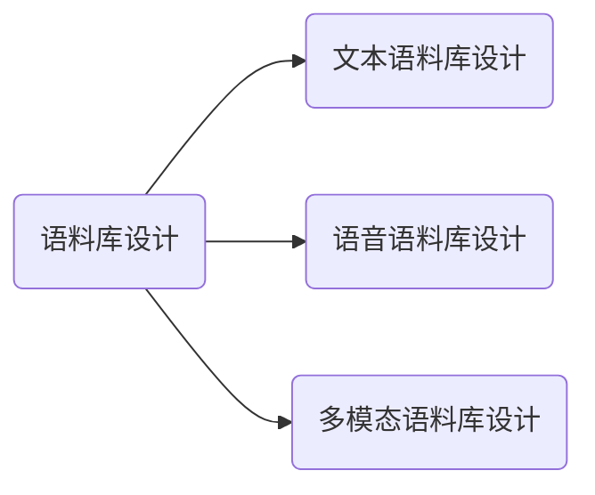

# 语料库语言学

1. 语料库语言学概述
2. 语料库的开发与建设
3. 语料库的标注
4. 语料库在语言研究中的应用

## 1. 语料库语言学概述
1. 语料库语言学的定义
2. 语料库的分类
3. 语料库的发展及现状
4. 语料库语言学对语言学理论及研究方法的影响

### 1.1 语料库语言学的定义

- 根据篇章材料对语言的研究称为语料库语言学。K. Aijmer & B. Aitenberg, 1991
- 以语料为语言描写的起点或以语料为验证有关语言的假说的方法称为语料库语言学。D. Crystal, 1991
- 基于现实生活中语言运用的实例进行的语言研究称为语料库语言学。T. McEnery& A. Wilson, 1996

语料库是存放语言材料的仓库（或数据库）。而语料库语言学则是
一种以语料库为基础的语言研究方法，它包含两层含义：

1. 利用语料库对语言的某个方面进行研究，也就是说“语料库语言学”不是一个新学科的名称，而仅仅反映了一个新的研究手段。
2. 依据语料库所反映出来的语言事实对现行语言学理论进行批判，提出新的观点或理论。

### 1.2 语料库语言学的分类

- 用途：通用语料库、专用语料库；
- 介质：文字语料库、声音语料库；
- 语体：书面语语料库、口语语料库；
- 时间：共时语料库、历时语料库；
- 状态：静态语料库、动态语料库；
- 语种：单语语料库、双语语料库、多语语料库；
- 用途：平行语料库、非平行语料库；母语语料库、外语学习者语料库；
- 处理程度：生语料库、熟语料库。
- 多模态语料库

### 1.3 语料库语言学的发展史

- 计算机化以前时期，可称之为传统语料库时期
- 计算机化以后时期，可称之为现代语料库时期
- 语言信息处理的深入发展，是语料库语言学产生的学科需要
1. 第一代（1970－80年代）
2. 第二代（1980－90年代）
3. 第三代（1990年代）
4. 第四代 ？

### 1.3.1 传统语料库
**为词典编撰、语法研究而收集的语料库**
- 牛津英语词典(Oxford English Dictionary):  
1928年 引证400万条 卡片1100万张
- 韦伯斯特新国际词典(Webster’s New International Dictionary):  
1961年第三版 新旧引证1000多万条

**为教学目的而编制的书面语料库和词表**
- 陈鹤琴《语体文应用字汇》，商务印书馆，1928年。   
做过两次统计:  
第一次统计使用了六种材料，包含554,478个汉字的 语料，得出不同汉字4261个；  
第二次使用包含34,818个汉字的语 料，得出与4261个汉字相异的汉字458个。

**为语言调查而收集的方言库**
- 19、20世纪英、美等国都做过大型的方言调查，调查的结果形成几个大规模的方言库
- 在我国，运用语料的研究方法可以追溯到周秦，如我国汉语方言学的第一部著作《輶轩使者绝代语释别国方言》是扬雄经过27年的艰苦努力而写成.

**语料库语言学的问题**
1957年，乔姆斯基的《句法理论》(Syntactic Structures)及其以后的一系列论著的发表，语料库研究的发展被完全否定、 受到剧烈震荡：

- 乔姆斯基(Chomsky)认为，语言研究的主要目标是建立一种能够反映说话人心理现实的语言认知模式。……语料从本质上只是外在化的话语的汇集,基于语料的研究所建立的经验模式充其量只能对语言能力作出部分解释,因而语料不是语言学家从事语言研究的得力工具。——**基于语料库的研究方法有误**
- 短语结构语法具有递归性：自然语言的句子是无限的，任何有限的语料都不能穷尽语言。——**语料是不完整、不充分的**

**传统语料库语言学发展的过渡期**
- 英国伦敦大学学院(University College London )的语言学家夸克（Quirk）开创了新一代的语料库。他在1959年建立英国英语口语和书面语的“英语用法调查”（the Survey of EnglishUsage，简称SEU）语料库的计划，目的是要对英语进行全面的 描写。
- 1961年，弗朗西斯（N. Francis）和库塞拉（H. Kucera）为首的一批语言学家和计算机专家汇集在美国的布朗大学合作建成了世界上最早的机读语料库，即布朗语料库（Brown Corpus）。
- 1975年，斯沃特威克（Svartvik）与他在隆德大学的同事把SEU语料库中的口语部分转变为计算机可读的形式，最后建立了“伦敦—隆德英语口语语料库”（LLC）。

### 1.3.2 现代语料库
#### 第一代语料库
1. 布朗语料库（Brown Corpus）
2. LOB语料库（The Lancaster-Oslo/Bergen Corpus）
3. LLC语料库（London-Lund Corpus of Spoken English）
4. 兰开斯特/IBM英语口语语料库（Lancaster /IBM spoken English corpus)

#### 第二代语料库
1. COBUILD语料库（Collins Birmingham University International Language Database）
2. 英国国家语料库（British National Corpus, BNC）
3. 国际英语语料库（ International Corpus of English）
4. 朗文语料库(Longman Corpus Network)

#### 第三代语料库
1. 特大型语料库  
美国Lexis-Nexis公司的机储文件已经达到15亿件，有1.5万亿字符，并且以每周950万件的速度递增

2. 动态监控语料库  
国际互联网上，英国COBUILD语料库每周向电子邮件用 户发送Word Watch（词语监察）的邮件，报告社会用语的 动态变化情况

3. ACL/DCI美国计算语言学学会数据采集计划  
美国计算语言学学会(The Association for Computational Linguistics,即ACL)倡议的数据采集计划 (Data Collection Initiative,即DCI)，其宗旨是向非赢利的学术团体提供语料，用标准通用置标语言SGML统一置标,以便于数据交换(Liberman, M.Y. 1990)

4. 语言资源联盟(Linguistic Data Consortium)  
1992年在美国宾夕法尼亚大学(University of Pennsylvania)建立，它的目的是构建、收集和发布用于研发的语音和文本数据库、词典以及其他资源

5. UPenn树库（宾州树库）  
由宾夕法尼亚（Pennsylvania）大学计算机系的M.Marcus主持，到1993年完成了近300万词的英语句子的句法结构标注。

6. [ELRA——欧洲语言资源学会(European Language Resources Association)](http://www.elra.info/en/)  
1995年在卢森堡成立，开展以语言技术为主的语言资源收集、监测、评估、鉴定、宣传、开发与利用工作，定期召 开语言资源与评估国际学术会议(LREC, Language Resources and Evaluation Conference)，出版会刊《语言资源与评估》，力求语言资源建设和评估的科学化

7. [TELRI——跨欧洲语言资源基础建设学会(Trans-European Language Resources Infrastructure](http://telri.nytud.hu/)
- 1995年由欧洲共同体（European Commission）提供经费支持创立，其总部挂靠在德国曼海姆的德语研究所（IDS），负责人Wolfgang Teubert ； 
- 2000年以后挂靠在英国的伯明翰大学语料库语言学研究所;
- 目的是为商业机构、研究团体和大学提供研发平台，为自然语言处理提供单语种和多语种的语言资源;
- 主要任务是协调欧洲的多语言信息处理和多语言语料库的建设;
- 已建成柏拉图（Plato）的《理想国》（Politeia）多语语料库、计算工具和资源的研究文档TRACTOR（Research Archive of Computational Tools and Resources）、以及欧洲语言词库EUROVOCA

8. GML——全球语言监测网(Global Language Monitor)
- 其主要任务是 记录、分析和追踪世界语言的发展趋势，特别是全球英语的发展 趋势；
- 每年利用“可预测量化指标（the Predictive Quantities Indicator,即PQI）”公布在英语的语言生活中产生广泛影响的语言现象,包括各种新词语、流行语、外来语以及政治性错误用语等
- 可预测量化指标（PQI）是GLM的创始人为保罗—帕亚克（Paul JJ Payack）提出的一种专有算法，它能对英语词汇在全球纸质及广播媒体、互联网等传媒中的使用频率进行跟踪，预测其长期发展趋势和短期变化等

#### 第三代中文语料库
#### 现代汉语语料库
清华大学计算机系负责，国家八五项目，主要收录文学著作和科技文献，第一期100万字语料为1000个文本，每个文本不少于1000字，总库量超过1000万字,语料库系统可以自动分词并自动标注词性、短语、句型等。
#### ZW大型通用汉语语料库系统
清华大学中文系，语料库分为0－3四个级别，0级为生语料，1－3级分别为经过自动分词和自 动标注词性、短语及句型成分的不同程度的熟语料。到1994年6月语料库已经采集2500万字，已经对100万字的语料进行了句 型自动分析和分布统计。

#### 台湾中央研究院平衡语料库 
#### 北京大学语料库	
#### 现代汉语语法研究语料库
#### 媒体语言语料库
…… ……

---
### 1.4 语料库语言学对语言学理论和研究方法的影响
### 1.4.1 现代语料库产生的原因
1. 传统语言学研究方法的落后性是语料库语言学产生的内在动力
- 语料的客观性不强
- 语料占有量不大，覆盖面不宽 
- 工作量大，效率不高
- 语料的共享性不够

2. 计算机运算速度和存储容量的巨大增长是语料库方法日趋流行的物质基础

3. 语言信息处理的深入发展，是语料库语言学产生的学科需要

### 1.4.2 语料库的理论价值
1. 语料库方法将改变传统的语言研究方法

2. 语料库语言学的产生将改变语言研究的观念

3. 语料库语言学的产生使语言研究日趋深入、精细

### 1.4.3 语料库的应用价值
1. 语料库将成为词典编纂的强大技术手段，并由此产生了计算词典学

2. 语料库为字频统计、词频统计、语言文字规范化研究、语法研究等提供了前所未有的先进方法，也提供了前所未有的丰富的语言资源

3. 语料库使大规模真实文本的自动处理得以实现

---
## 2 语料库的开发与建设
1. 语料库的设计
2. 语料库数据采集
3. 数据校验与转换
4. 语言信息标注
5. 语料库的管理、使用和维护
6. 语料库建设中的著作权问题

> 任何语料库研究均开始于语料库体的建立，语料库的设计及选材几乎控制以后所要做 的一切基于语料库的研究工作，研究结果的好坏只与语料库的建设质量有关。  
> *John Sinclair，1991*

### 2.1 语料库的设计

- 从介质的角度考虑，即语言依存的媒介。

- 语料库的用途
- 语料库的框架
    - 语料的分布(Zipf's Law),描述语料库的平衡性及代表性
- 语料库的规模

### 2.1.1 语料库的设计规范
**语料库的元数据** (Metadata)是指能够描述语料库属性的信息,一般作为描述语料数据的字段信息。

1. 规范化与反规范化  
减少了数据冗余，节约了存物理储空间，加快了增、删、改的速度。有时为了提高某些查询或应用的性能而可以破坏规范规则，即反规范化。
2. 数据表分类明晰  
数据表功能单一。基本数据表：描述业务实体的基本信息。例如，数据源基本信息：网站、文本类别、日期等。
3. 字段设计原则
- 一般来说，应该使用能正确存储和表示数据的最小类型。如果不确定需要什么数据类型，则选择不会超出范围的最小类型。
- 选择更简单的数据类型。例如，比较整数的代价小于比较字符，因为字符集和排序规则使字符比较更复杂。
- 尽可能把字段定义为 NOT NULL。对于字段能否NULL，应该在SQL建表脚本中明确指明，不应使用缺省。
- 一个表中的字段不要太多，理论上不要超过80个。
- 数据库中所有布尔型中数值0表示为假；数值1表示为真
- 当字段定义为字符串类型时使用VARCHAR2而不用NVARCHAR
- 字段尽可能有默认值，字符型的默认值为一个空字符值串，数字型的默认值为数值0。

4. 键设计原则
- 所有的键都必须唯一

5. 索引设计原则
- 日期、类别等数据尽量创建索引
- 全文索引要视数据库的情况而定

### 2.2 语料库数据采集
**网络爬虫**又名“网络蜘蛛”，是通过网页的链接地址来寻找网页，从网站某一个页面开始，读取网页的内容，找到在网页中的其它链接地址，然后通过这些链接地址寻找下一个网页，这样一直循环下去，直到按照某种策略把互联网上所有的网页都抓取完为止的技术。

#### 2.2.1采集的数据类型可以分为以下4类：
- 文本
- 音频
- 视频
- 图像

#### 2.2.2 数据采集范围
- 抽样
- 全覆盖

#### 2.2.3 基于网络爬虫的语料采集方法
1. 确定抓取目标数据
2. 解析web页面结构
3. 选择抓取工具(Jsoup,Selenium,第三方工具包)
4. 选择存储介质(MySQL,MongoDB,ES,SQLServer等数据库)
5. 选择数据分析工具(分词系统,句法分析器等)
6. 更新语料库

#### 2.2.4 网络新闻数据采集流程
1. 确定抓取目标数据
2. 查找并解析**聚合页**
3. 抓取网络新闻页面URL
4. 解析网络新闻页面，获取所需要的数据
5. 存入数据库

#### 2.2.4.1  网络语料抓取示例

##### 例1 新浪新闻
1. [新浪新闻聚合页](https://news.sina.com.cn/roll/#pageid=153&lid=2509&k=&num=50&page=1)
2. [新浪新闻指定日期(2017-03-10)新闻聚合页面的链接](https://feed.mix.sina.com.cn/api/roll/get?pageid=153&lid=2509&etime=1489075200&stime=1489161600&ctime=1489161600&date=2017-03-10&k=&num=50&page=1&r=0.7165126183520762&callback=jQuery111208518310292969371_1553870530484&_=1553870530487)
3. 将unicode编码转为汉字，并解析JSON数据
4. 解析出单篇新闻数据的URL,以此URL重复第二步和第三步，得到单篇新闻的内容
5. 根据语料库介质(数据库)进行数据转换及格式化，然后保存

##### 例2 人民日报
1. [人民日报聚合页](http://paper.people.com.cn/rmrb/index.html)
2. 循环版面链接，解析并抓取单篇新闻的URL
3. 抓取单篇新闻的内容
4. 根据语料库介质(数据库)进行数据转换及格式化，然后保存

##### 例3 知乎数据
1. 安装[zhihu-oauth](https://github.com/7sDream/zhihu-oauth)或其他第三方工具包
2. 登陆知乎
3. 根据指定的话题ID、问题ID或者用户ID抓取需要的数据
4. 格式化并解析JSON数据
5. 根据语料库介质(数据库)进行数据转换及格式化，然后保存

##### 例3 新浪微博数据
1. 下载[SinaSpider](https://github.com/LiuXingMing/SinaSpider)或其他第三方工具包
2. 登陆新浪微博
3. 根据指定的话题ID或者用户ID抓取需要的数据
4. 格式化并解析JSON数据
5. 根据语料库介质(数据库)进行数据转换及格式化，然后保存

#### 2.2.4.1  常用数据使用教程
1. [MySQL](http://www.runoob.com/mysql/mysql-tutorial.html)教程,[Python3操作MySQL](http://www.runoob.com/python3/python3-mysql.html)
2. [MongoDB](http://www.runoob.com/mongodb/mongodb-tutorial.html)教程,[Python3操作MongoDB](http://www.runoob.com/python3/python-mongodb.html)

---

### 2.3 数据校验与转换
来源不同，又属同一类型的数据在存入数据库前需要保证数据完整性、同一性。
#### 2.3.1 数据校验
通常情况下，语料库的数据来自网络文本、视频文件、音频文件、图片以及纸质文本。  
**网络文本**是从web页面中提取而来，当前web前端技术日新月异，同一网站改版周期越来越短，这就要求研究者人工判断抓取的数据在格式、内容等方面是否正确。

#### 2.3.1 数据转换

### 2.4 语言信息标注

### 2.5 语料库的管理、使用和维护
1. 增删改查(依托具体使用的数据库)
2. 基于Web的应用程序
3. 创建索引程序
4. 数据备份

### 2.6 语料库建设中的著作权问题
### 2.6.1 语料库著作权问题
语料库建设中,要解决原始语料的著作权问题,加工后的语料的著作权问题、语料库的著作权问题 《中华人民共和国著作权法》(以下简称《著作权法》)中与语料库的著作权有关的内容。
1. 语料库中的书面语语料和口语语料许多都是受著作权法保护的作品
2. 有些不受《著作权法》保护的语料，可以免费使用，不受《著作权法》保护的作品包括法律、法规、国家机关的决议、决定和其他具 有立法、行政、司法性质的文件及盲文正式译文
3. 语料标注和建设语料库的权力属于作品的使用权
4. 语料库建设应该得到语料著作权人所授予的许可使用权
5. 不带商业目的、为科研服务的语料库对语料的使用应争取列入到合理使用的范围
6. 语料库建设的目的纯粹是为科学研究服务，不带任何商业目的，语料也常常是原作品的一部分，语料库的使用和传播范围很小，一般不可能影响原作品的商业市场
7. 加工后的语料属于《著作权法》保护的作品，著作权属于语料库建设单位
8. 语料库属于《著作权法》保护的编辑作品，著作权属于编辑人
9. 语料库的著作权属于语料库建设单位

### 2.6.2 解决语料库著作权的方法
1. 与著作权所有单位联合开发语料库
2. 直接向著作权单位购买
3. 征集免费语料

---
## 3 语料库的标注
### 3.1 词性标注
#### 3.1.1 词性标记集
**中科院ICTCLAS分词汉语词性标记集**

1. n 名词

nr 人名

nr1 汉语姓氏

nr2 汉语名字

nrj 日语人名

nrf 音译人名

ns 地名

nsf 音译地名

nt 机构团体名

nz 其它专名

nl 名词性惯用语

ng 名词性语素

2. 时间词(1个一类，1个二类)

t 时间词

tg 时间词性语素

3. 处所词(1个一类)

s 处所词
4. 方位词(1个一类)

f 方位词

5. 动词(1个一类，9个二类)

v 动词

vd 副动词

vn 名动词

vshi 动词“是”

vyou 动词“有”

vf 趋向动词

vx 形式动词

vi 不及物动词（内动词）

vl 动词性惯用语

vg 动词性语素

6. 形容词(1个一类，4个二类)

a 形容词

ad 副形词

an 名形词

ag 形容词性语素

al 形容词性惯用语
7. 区别词(1个一类，2个二类)

b 区别词

bl 区别词性惯用语

8. 状态词(1个一类)

z 状态词
9. 代词(1个一类，4个二类，6个三类)

r 代词

rr 人称代词

rz 指示代词

rzt 时间指示代词

rzs 处所指示代词

rzv 谓词性指示代词

ry 疑问代词

ryt 时间疑问代词

rys 处所疑问代词

ryv 谓词性疑问代词

rg 代词性语素

10. 数词(1个一类，1个二类)

m 数词

mq 数量词

11. 量词(1个一类，2个二类)

q 量词

qv 动量词

qt 时量词

12. 副词(1个一类)

d 副词

13. 介词(1个一类，2个二类)

p 介词

pba 介词“把”

pbei 介词“被”

14. 连词(1个一类，1个二类)

c 连词

cc 并列连词

15. 助词(1个一类，15个二类)

u 助词

uzhe 着

ule 了 喽

uguo 过

ude1 的 底

ude2 地

ude3 得

usuo 所

udeng 等 等等 云云

uyy 一样 一般 似的 般

udh 的话

uls 来讲 来说 而言 说来

uzhi 之

ulian 连 （“连小学生都会”）

16. 叹词(1个一类)

e 叹词
17. 语气词(1个一类)

y 语气词(delete yg)

18. 拟声词(1个一类)

o 拟声词

19. 前缀(1个一类)

h 前缀

20. 后缀(1个一类)

k 后缀

21. 字符串(1个一类，2个二类)

x 字符串

xx 非语素字

xu 网址URL

22. 标点符号(1个一类，16个二类)

w 标点符号

wkz 左括号，全角：（ 〔 ［ ｛ 《 【 〖 〈 半角：( [ { <

wky 右括号，全角：） 〕 ］ ｝ 》 】 〗 〉 半角： ) ] { >

wyz 左引号，全角：“ ‘ 『

wyy 右引号，全角：” ’ 』

wj 句号，全角：。

ww 问号，全角：？ 半角：?

wt 叹号，全角：！ 半角：!

wd 逗号，全角：， 半角：,

wf 分号，全角：； 半角： ;

wn 顿号，全角：、

wm 冒号，全角：： 半角： :

ws 省略号，全角：…… …

wp 破折号，全角：—— －－ ——－ 半角：--- ----

wb 百分号千分号，全角：％ ‰ 半角：%

wh 单位符号，全角：￥ ＄ ￡ ° ℃ 半角：$

**北大词性标记集**

词性编码|词性名称|注解
---|---|---
Ag|形语素|形容词语素。形容词代码为a，语素代码为g前面置以A
a|形容词|取英语形容词adjective的第1个字母
ad|副形词|直接作状语的形容词。形容词代码a和副词代码d并在一起
an|名形词|具有名词功能的形容词。形容词代码a和名词代码n一起
b|区别词|取汉字“别”的声母
c|连词|去英语连词conjunction的第1个字母
Dg|副语素|副词性语素。副词代码为d，语素代码g前面置以D
d|副词|取adverb的第2个字母，因其第1个字母已用于形容词
e|叹词|取英语叹词exclamation的第1个字母。
f|方位词|取汉字“方”
g|语素|绝大多数语素都能作为合成词的“词根”，取汉字“根”的声母
h|前接成分|取英语head的第1个字母
i|成语|取英语成语idiom的第1个字母
j|简称略语|取汉字“简”的声母
k|后接成分| 
l|习用语|习用语尚未成为成语，有点“临时性”，取“临”的声母
m|数词|取英语numeral的第3个字母，n，u已有他用
Ng|名语素|名词性语素。名词代码为n，语素代码g前面置以N
n|名词|取英语名词noun的第1个字母
nr|人名|名词代码n和“人(ren)”的声母并在一起
ns|地名|名词代码n和处所词代码s并在一起
nt|机构团体|“团”的声母为t，名词代码n和t并在一起
nz|其他专名|“专”的声母的第1个字母为z，名词代码n和z并在一起
o|拟声词|取英语拟声词onomatopoeia的第1个字母。
p|介词|取英语介词prepositional的第1个字母
q|量词|取英语quantity的第1个字母
r|代词|取英语代词pronoun的第2个字母，因p以用于介词
s|处所词|取英语space的第1个字母
Tg|时语素|时间词性语素。时间词代码为t，在语素的代码g前面置以T
t|时间词|取英语time的第1个字母
u|助词|取英语助词auxiliary
Vg|动语素|动词性语素。动词代码为v。在语素代码g前面置以V
v|动词|取英语动词verb的第1个字母。
vd|副动词|直接作状语的动词。动词和副词的代码并在一起。
vn|名动词|指具有名词功能的动词。动词和名词的代码放在一起。
w|标点符号| 
x|非语素字|非语素字只是一个符号，字母x通常用于代表未知数、符号
y|语气词|取汉字“语”的声母
z|状态词|取汉字“状”的声母的前一个字母。
un|未知词|不可识别词及用户自定义词组。取英文Unknown首两个字母。（非北大标准，CSW分词中定义）

哈工大分词标记集

词性编码|词性名称|示例
---|---|---
a|adjective|美丽|
b|other noun-modifier|大型, 西式
c|conjunction 和, 虽然|
d|adverb|很|
e|exclamation |哎
g|morpheme| 茨, 甥| 
h|prefix|阿, 伪| 
i|idiom|百花齐放| 
j|abbreviation| 公检法 
k|suffix|界, 率| 
m|number|一, 第一|
n|general noun| 苹果|
nd|direction noun|右侧|
nh|person name| 杜甫, 汤姆
ni|organization name|保险公司
nl|location noun|城郊
ns|geographical name|北京
nt|temporal noun|近日, 明代
nz|other proper noun|诺贝尔奖
o|onomatopoeia| 哗啦
p|preposition|在, 把
q|quantity| 个
r|pronoun|我们
u|auxiliary|的, 地
v|verb| 跑, 学习
wp|punctuation|，。！
ws|foreign words|CPU
x|non-lexeme|萄, 翱

#### 3.2.1 句法标注

**斯坦福句法树的相关标记**

ROOT：要处理文本的语句

IP：简单从句

NP：名词短语

VP：动词短语

PU：断句符，通常是句号、问号、感叹号等标点符号

LCP：方位词短语

PP：介词短语

CP：由‘的’构成的表示修饰性关系的短语

DNP：由‘的’构成的表示所属关系的短语

ADVP：副词短语

ADJP：形容词短语

DP：限定词短语

QP：量词短语

NN：常用名词

NR：固有名词

NT：时间名词

PN：代词

VV：动词

VC：是

CC：表示连词

VE：有

VA：表语形容词

AS：内容标记（如：了）

VRD：动补复合词

CD: 表示基数词

DT: determiner 表示限定词

EX: existential there 存在句

FW: foreign word 外来词

IN: preposition or conjunction, subordinating 介词或从属连词

JJ: adjective or numeral, ordinal 形容词或序数词

JJR: adjective, comparative 形容词比较级

JJS: adjective, superlative 形容词最高级

LS: list item marker 列表标识

MD: modal auxiliary 情态助动词

PDT: pre-determiner 前位限定词

POS: genitive marker 所有格标记

PRP: pronoun, personal 人称代词

RB: adverb 副词

RBR: adverb, comparative 副词比较级

RBS: adverb, superlative 副词最高级

RP: particle 小品词 

SYM: symbol 符号

TO:”to” as preposition or infinitive marker 作为介词或不定式标记 

WDT: WH-determiner WH限定词

WP: WH-pronoun WH代词

WP$: WH-pronoun, possessive WH所有格代词

WRB:Wh-adverb WH副词
 
**关系表示**

abbrev: abbreviation modifier，缩写

acomp: adjectival complement，形容词的补充；

advcl : adverbial clause modifier，状语从句修饰词

advmod: adverbial modifier状语

agent: agent，代理，一般有by的时候会出现这个

amod: adjectival modifier形容词

appos: appositional modifier,同位词

attr: attributive，属性

aux: auxiliary，非主要动词和助词，如BE,HAVE SHOULD/COULD等到

auxpass: passive auxiliary 被动词

cc: coordination，并列关系，一般取第一个词

ccomp: clausal complement从句补充

complm: complementizer，引导从句的词好重聚中的主要动词

conj : conjunct，连接两个并列的词。

cop: copula。系动词（如be,seem,appear等），（命题主词与谓词间的）连系

csubj : clausal subject，从主关系

csubjpass: clausal passive subject 主从被动关系

dep: dependent依赖关系

det: determiner决定词，如冠词等

dobj : direct object直接宾语

expl: expletive，主要是抓取there

infmod: infinitival modifier，动词不定式

iobj : indirect object，非直接宾语，也就是所以的间接宾语；

mark: marker，主要出现在有“that” or “whether”“because”, “when”,

mwe: multi-word expression，多个词的表示

neg: negation modifier否定词

nn: noun compound modifier名词组合形式

npadvmod: noun phrase as adverbial modifier名词作状语

nsubj : nominal subject，名词主语

nsubjpass: passive nominal subject，被动的名词主语

num: numeric modifier，数值修饰

number: element of compound number，组合数字

parataxis: parataxis: parataxis，并列关系

partmod: participial modifier动词形式的修饰

pcomp: prepositional complement，介词补充

pobj : object of a preposition，介词的宾语

poss: possession modifier，所有形式，所有格，所属

possessive: possessive modifier，这个表示所有者和那个’S的关系

preconj : preconjunct，常常是出现在 “either”, “both”, “neither”的情况下

predet: predeterminer，前缀决定，常常是表示所有

prep: prepositional modifier

prepc: prepositional clausal modifier

prt: phrasal verb particle，动词短语

punct: punctuation，这个很少见，但是保留下来了，结果当中不会出现这个

purpcl : purpose clause modifier，目的从句

quantmod: quantifier phrase modifier，数量短语

rcmod: relative clause modifier相关关系

ref : referent，指示物，指代

rel : relative

root: root，最重要的词，从它开始，根节点

tmod: temporal modifier

xcomp: open clausal complement

xsubj : controlling subject 掌控者

**哈工大依存句法标记集**

关系类型|Tag|Description|Example
---|---|---|---
主谓关系 |SBV |subject-verb |我送她一束花 (我 <-- 送)
动宾关系 |VOB |直接宾语，verb-object |我送她一束花 (送 --> 花)
间宾关系 |IOB |间接宾语，indirect-object |我送她一束花 (送 --> 她)
前置宾语 |FOB |前置宾语，fronting-object |他什么书都读 (书 <-- 读)
兼语 |DBL |double |他请我吃饭 (请 --> 我)
定中关系 |ATT |attribute |红苹果 (红 <-- 苹果)
状中结构 |ADV |adverbial |非常美丽 (非常 <-- 美丽)
动补结构 |CMP |complement |做完了作业 (做 --> 完)
并列关系 |COO |coordinate |大山和大海 (大山 --> 大海)
介宾关系 |POB |preposition-object |在贸易区内 (在 --> 内)
左附加关系 |LAD |left adjunct |大山和大海 (和 <-- 大海)
右附加关系 |RAD |right adjunct |孩子们 (孩子 --> 们)
独立结构 |IS |independent structure |两个单句在结构上彼此独立
核心关系 |HED |head |指整个句子的核心

#### 3.3.1 语义标注

|标记|说明|
|:---:|:---:|
|ADV|adverbial, default tag ( 附加的，默认标记 )|

BNE|beneficiary ( 受益人 )
CND|condition ( 条件 )
DIR|direction ( 方向 )
DGR|degree ( 程度 )
EXT|extent ( 扩展 )
FRQ|frequency ( 频率 )
LOC|locative ( 地点 )
MNR|manner ( 方式 )
PRP|purpose or reason ( 目的或原因 )
TMP|temporal ( 时间 )
TPC|topic ( 主题 )
CRD|coordinated arguments ( 并列参数 )
PRD|predicate ( 谓语动词 )
PSR|possessor ( 持有者 )
PSE|possessee ( 被持有 )

---
## 4 语料库在语言研究中的应用