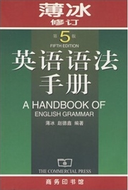
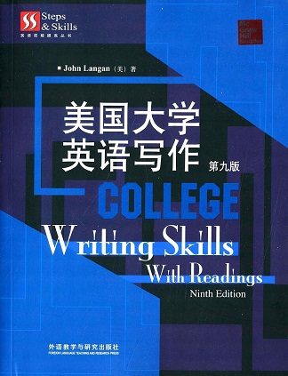

## 英语写作与翻译

朱波

@@@

### 课程考核

1. 平时成绩（出勤，作业30%）
2. 考试成绩（期末考试70%）

~~~~

### 课程内容

- 以英语语法学习、训练开始，逐步拓展到考研英语的翻译与写作
- 翻译部分（34学时）
- 写作部分（20学时）

~~~~

#### 语法部分
1. 名词、冠词、代词、数词、形容词、副词
2. 英语动词（非谓语）+动词的时态
3. 助动词+情态动词
4. 语态
5. 虚拟语气
6. 介词
~~~~
7. 连词 感叹词
8. 简单句与复合句
9. 定语从句
10. 名词性从句
11. 主谓一致
12. it用法
13. 强调与倒装
~~~~
#### 翻译实践环节
14. 考研英语翻译
~~~~

#### ESSAY WRITING
15. PARTERNS OF ESSAY WRITING DEVELOPMENT
16. SPECIAL SKILLS
17. HANDBOOK OF SENTENCE SKILLS
18. READING FOR WRITING
19. 考研写作真题
~~~~
#### 参考书目

~~~~
