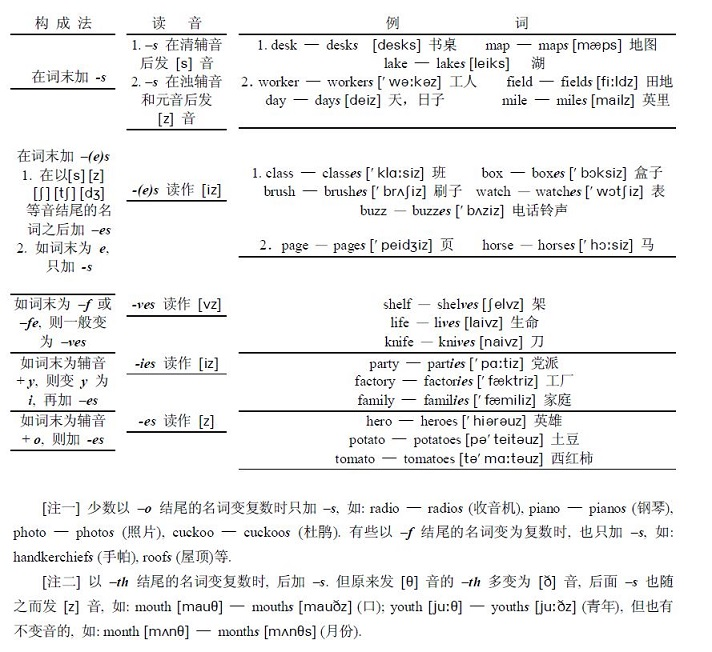
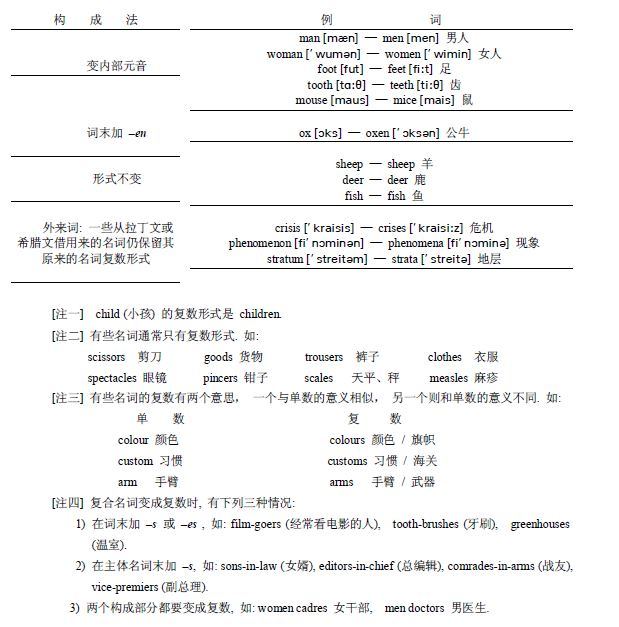
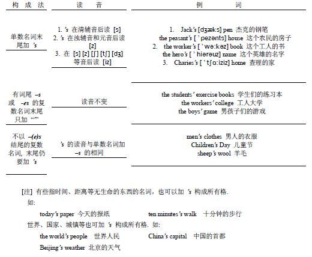
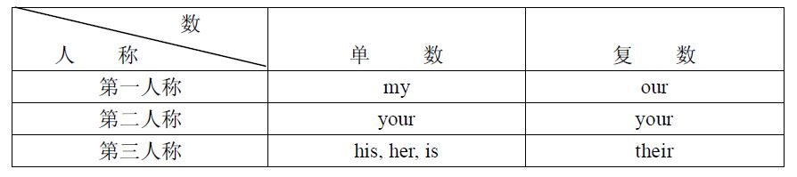
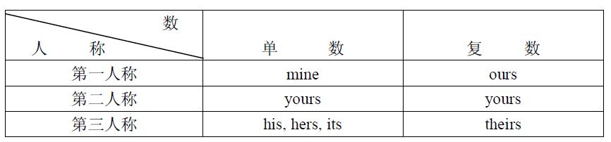
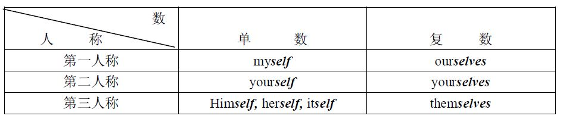
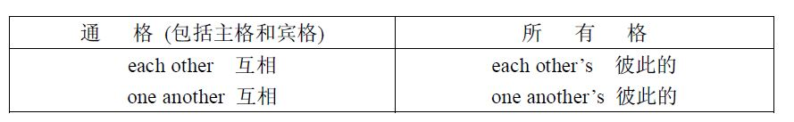
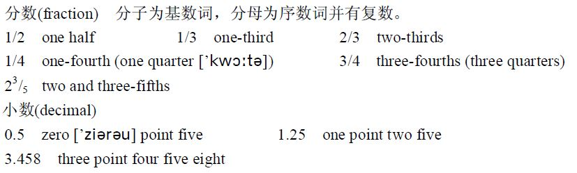

## 第一章 名词冠词代词数词
@@@
### 第一节 名词
~~~~
#### 一、什么是名词

- 表示人、事物、地点或抽象概念的名称的词，叫做名词。
~~~~
- 如: 
   - worker/工人
   - socialism/社会主义     
   - pencil/铅笔
   - proletariat/无产阶级
   - Beijing/北京
   - time/时间

~~~~
#### 二、名词的种类

英语名词可分为两大类：

1. 普通名词（common noun），普通名词是某一类人、某一类事物、某种物质或抽象概念的名称。
- 如:
   - soldier/士兵
   - water/水
   - peasant/农民
   - struggle/斗争
   - machine/机器
   - communism/共产主义
~~~~

2. 专有名词 (proper noun)，专有名词是个别的人、团体、地方、机构或事物的名称。其中实词的第一个字母必须大写.  
- 如:
   - Korea/朝鲜
   - Karl Marx/卡尔马克思
   - London/伦敦
   - the Communist Party of China/中国共产党
   - Yang Zirong/杨子荣
   - the Great Hall of the People/人民大会堂
   - the Ministry of Foreign Affairs/外交部
~~~~
3. 普通名词的种类    普通名词可进一步分为:类名词、集体名词、物质名词、抽象名词

~~~~
3.1 类名词 (class noun)   类名词表示人或事物属于某一类。

- 如:
   - tractor/拖拉机
   - panda/熊猫
   - factory/工厂
   - teacher/教师
   - student/学生
~~~~
3.2 集体名词 (collective noun)集体名词是一些人或物的总称。
- 如: class/阶级、班
   - herd/兽群
   - party/党派
   - army/军队
~~~~

3.3 物质名词 (material  noun)物质名词表示物质或不具备确定形状和大小的个体的实物。
- 如:
   - steel/钢
   - grain/粮食
   - fire/火
   - cotton/棉花
~~~~
3.4 抽象名词 (abstract noun)抽象名词表示动作、状态、品质或其他抽象概念。
- 如: 
   - happiness/幸福
   - life/生活
   - labour/劳动
   - dictatorship/专政

~~~~
1. 名词又可分为可数名词 (countable  noun)  与不可数名词 (uncountable  noun)。
   - 可数名词有单、复数之分。
   - 不可数名词一般不分单数和复数。 
   - 类名词和集体名词一般是可数的。  
   - 抽象名词、物质名词和专有名词一般是不可数的。 
   - 有少数名词既可用作不可数名词, 又可用作可数名词,但意义有所不同。 
~~~~
- 如:
| word|  用作不可数名词 | 用作可数名词  |
|  ----  | ----  |----  |
| Glass  | 玻璃 | 玻璃杯 |
| Paper  | 纸 | 报纸、文件 |
| Tin  | 锡 | 罐头 |
| Copper  | 铜 | 铜币 |
~~~~

#### 三、名词的数

英语可数名词有单数 (singular number)  和复数 (plural number)  两种形式,
1. 表示一个人或事物用单数
2. 表示一个以上的人或事物用复数。

- 如: 
   - book—books/书
   - country—countries/国家 
   - bus—buses/公共汽车
   - boy—boys/男孩
~~~~
##### 名词复数的构成法

绝大多数名词的复数形式由在单数形式后面加 -s  或 -es  构
成.  现将一般构成名词复数的方法及其读音规则列表如下:
~~~~

~~~~
英语里有一些名词的复数形式是不规则的,现列表于下:

~~~~
##### 物质名词

物质名词是不可数名词，一般只有单数形式,  但表示不同的类别时,  可用复数.如:  teas  (各种茶),  steels  (各种钢),  fruits  (各种水果), grasses  (各种草)等.  snows,  sands,  waters则分别表示连绵不断的“雪”(积雪)、“沙”（即沙漠）和“水”（即江水、海水）。
~~~~
##### 抽象名词
抽象名词一般为不可数名词，但有些抽象名词则是可数名词。  

- 如: 
   - hope—hopes/希望
   - idea—ideas/想法
   - job—jobs/工作
   - day—days/日、天

~~~~
注意：抽象名词表示具体事例时，也可用复数。 
- 如:
   - worry—worries/忧愁
   - need—needs/需要
   - dislike—dislikes/厌恶
   - joy—joys/欢乐
~~~~

#### 四、名词的格
格（case）是名词或代词具有的形式及其变化，表示与其他词的关系。英语的名词有三个格:  主格(nominative case),  宾格(objective case)和所有格(possessive case)。但英语的名词除所有格形式的变化外,  主格和宾格都没有形式变化。  名词在句中是主格或是宾格,  主要通过它在句中的作用和位置来确定。  
~~~~
例如:
1. Every written sentence should begin with a capital letter. (每个书写出来的句子开头都要用大写字母.)
   - sentence在句中作主语,是主格;letter是介词with的宾语,是宾格.
2. The workers are helping the commune to set up a farm tool factory. (工人们正在帮助公社修建一座农具厂.)
   - workers  是主语,  故作主格;  commune  是 are  helping  的宾语,  故是宾格.
~~~~
##### 表示有生命的东西的名词的所有格
表示有生命的东西的名词（人或动物）的末尾,  加上 ’s  即构成所有格,  可放在另一名词之前,  作定语用.  

- 如: 
- the people’s commune/人民公社
- Xiao Wang’s note-book/小王的笔记本
- Children’s books/儿童读物
- My father’s room/我父亲的房间

~~~~
构成名词所有格的方法见下表:

~~~~

##### 表示无生命东西的名词的所有关系

一般与 of  结成短语.

- 如:
   - the door of the room/房间的门
   - the title of the film/影片的名字
~~~~
注意：表示有生命的东西的名词, 有时也用 of  构成短语,  表示所有关系.
- 如:
   - The death of Stalin/斯大林逝世
   - The son of a poor peasant/贫农的儿子

~~~~
##### 名词所有格与它所修饰的名词的逻辑关系

名词所有格在逻辑上可能是它所修饰的名词的主语,  也可能是它所修饰的名词的宾语。
~~~~
1. 名词所有格是它所修饰的名词的逻辑主语  
- 如:  
   - the  doctor’s  arrival  医生的到来, 
   - the Party’s concern for the  younger generation  党对年青一代的关怀,
   - the hatred of the people for the enemy  人民对敌人的仇恨.
~~~~
2. 名词所有格是它所修饰的名词的逻辑宾语  

- 如: 
   - the reactionary rule’s overthrow  反动统治的被推翻,
   - the occupation of the city by the enemy  敌人对该城的占领,
   - the recognition of Mozambique by the Chinese Government中国政府对莫桑比克的承认,
   - the exploitation of the third world by the superpowers  超级大国对第三世界的剥削.

~~~~
##### “of+名词所有格”

以上两种所有格的形式可以结合起来,  构成“ of+所有格”形式，表示部分观念或感情色彩.  
1. 表示部分观念，如:
   -  a friend of my sister’s (= one of my sister’s friends)  我妹妹的一个朋友;    
   - a picture of Comrade Chang’s  张同志(具有的照片中)的一张照片(比较: a picture of Comrade Chang  张同志本人的照片,  即照片上是张同志的像).
2. 表示感情色彩，如: 
   - this lovely child of your aunt’s  你婶母的这个可爱的孩子.

~~~~

##### 名词所有格所修饰的词的省略

1. 名词所有格所修饰的词,往往可以省略，以免重复，如:
   - The dictionary is not mine, but Comrade Wang’s. (这本词典不是我的,  是王同志的.)

2. 名词所有格后面指地点等的名词,  有的习惯上可省去不用.  如: 
   - I met him at the barber’s (shop).(我在理发馆遇见了他)
   - I went to my uncle’s (house) yesterday.(我昨天到我叔叔家去了)
~~~~

#### 五、名词的性
现代英语的名词在语法上没有特定的表示性 (gender)  的形式.  但有一部分名词,  也可分为阳性（masculine）、阴性 (feminine)和中性(neuter).  一般地讲,  表示男人或雄性动物的名词属于阳性,  表示女人或雌性动物的名词属于阴性,  表示非生物及抽象概念的名词属于中性.  当它们由代词来代替时,  分别用 he(his), she(her), it(its).
~~~~
下面是各个性的名词的例词:
1. 阳性:  hero  (男英雄),    father  (父亲),    son  (儿子),    nephew  (侄儿),    bridegroom  (新郎), cook (公鸡), bull (公牛).
2. 阴性:  heroine  (女英雄),    mother  (母亲),    daughter  (女儿),    niece  (侄女),    bride  (新娘), hen (母鸡), cow (母牛).
3. 中性: lamp (灯),    kindness (仁慈),    friendship (友谊),    house (房屋).

4. 注意：英语中有不少名词不分性,  如:  person  人,     parent  父母亲,    cousin  堂(表)兄弟,  堂(表)姐妹, worker  工人,    secretary  书记,  秘书,    nurse  护士,    horse  马,    pig  猪等.
~~~~
##### 英语名词表示性有下列一些特点:
1. 用不同的名词来表示不同的性,  如:
   - 阳性:    boy (男孩),    uncle (叔父),    nephew (侄儿),    king (国王),    gentleman (先生), boar (公猪).
   - 阴性:    girl  (女孩),    aunt  (婶母),    niece  (侄女),    queen  (王后),    lady (女士),    sow  (母
~~~~
2. 在阳性名词后加 –ess  来构成阴性名词,  如:
   - 阳性:    actor (男演员),    host (男主人),    steward (男服务员),    prince (王子).
   - 阴性:    actress (女演员),    hostess (女主人),    stewardess (女服务员),    princess (公主).

~~~~
3. 不分性的名词如要表示所指人物的性别,可在其前面加 woman, man, girl, boy等词,

- a girl student  女学生
- a man driver  男司机
- a woman worker  女工
~~~~
- 以 man  和 woman  开头的名词变成复数时,一般用 men  和 women.如:  women workers, men drivers.
- man  和 woman  的单复数也可放在另一名词之后,  构成复合词,  表示阴、阳性,  如: 
   - militiaman  男民兵        militiawoman    女民兵
   - militiamen  男民兵        militiawomen    女民兵

~~~~

#### 六、名词的用法

名词在句子里可用作下列各种句子成分：
1. 作主语
Women are a great force in the revolution.    (妇女是革命的一支伟大力量)
His father joined the ranks of the revolution in 1938.    (他父亲于一九三八年参加革命) 
2. 作宾语
We love our socialist homeland.    (我们热爱我们的社会主义祖国) Have you finished the exercise?    (你做完练习了吗？)
The graduates will go to work in the countryside.    (这些毕业生将要去农村工作) They live and work with the 
peasants.    (他们和农民同住同劳动)
~~~~
3. 作表语
Comrade Wang is a scientist.    (王同志是个科学家)
4. 作宾语补足语  即在另一作宾语的名词或代词之后,  两者一起构成复合宾语.
They elected Comrade Chen leader of the Party group.    (他们选陈同志为党小组长) Everybody called him Uncle 
Liu.      (大家都叫他刘大伯)
~~~~
5. 作定语
   - 名词所有格作定语,  如:  the  People’s  Republic  of  China    中华人民共和国,      Lei Feng’s diary雷锋日记,    
  China’s industry    中国的工业.
   - 名词不改变词形,  修饰另一名词,  如:  vegetable  plot  菜地,      Party  member  党员,  university student    大学生,      the labour movement    工人运动.
~~~~
6. 作状语  多限于表示时间和距离等概念的名词.  如:
He works long hours.    (他一天工作很长的时间)
We walked 100 li a day on our training march.    (我们拉练时每天步行一百里) This luggage weighs 20 kilograms.   (这件行李重二十公斤)
The ‘Panda’ transistor radio cost me one hundred yuan.    (我买这架熊猫牌半导体收音
机花了一百元)

@@@

### 第二节 冠词
~~~~
#### 一、什么是冠词
~~~~
冠词（article）是虚词,放在名词之前,用来说明名词所指的人或事物。一般没有句子重音。
~~~~
#### 二、冠词的种类
冠词分不定冠词(indefinite article)和定冠词(definite article)
~~~~
1. 不定冠词a, an
   - a和an均用在单数名词之前,  表示某一类人或事物中的“一个”,  相当于汉语的“一”,  但不强调数目观念.
   - a用在辅音之前, an用在元音之前。 a book, an hour
   - 字母u读作 [ju:] 时, 由于第一个音[j]是辅音, 故前面用a, 不用an。例如a useful book, a university, an unhappy day/不幸的一天
   - a 和an 在句中分别弱读作 [ə] 和[ən].
~~~~ 
2. 定冠词 the
   - 表示某一类人或事物中的“某一个”或“某一些”,  相当于汉语的“这”或“那”.
   - 不论单数名词或复数名词,也不论可数名词或不可数名词,  前面都可以用 the.
   - 在元音前读 [ði], 辅音前读 [ðə], 例如the evening [ði’i:vniŋ],the book, the unit, the yard.
~~~~

#### 三、冠词的用法
1. 不定冠词的用法
2. 定冠词的用法
3. 专有名词前定冠词的用法
4. 抽象名词和物质名词前冠词的用法
5. 不用冠词的场合
~~~~
##### 1.不定冠词的用法

- 1.1 指人或事物的某一种类
   - Xiao Xu’s father is a miner. (小徐的父亲是矿工.)  意指不是其他工人. 
   - Give me a ballpen, please. (请给我一支圆珠笔)  意指非钢笔或其他.
~~~~
- 1.2 指某一类人或事物中的任何一个.
   - A steel worker makes steel. (钢铁工人炼钢)  意即任何一个钢铁工人都炼钢.
   - A triangle has three angles. (三角形有三个角)  意即任何一个三角形都有三个角.
~~~~
- 1.3 指某人或某物,但不具体说明何人或何物.
   - He has just come back from a Beijing factory. (他刚从北京某工厂回来) 
   - A PLA man wants to see you. (有个解放军要见你)
   - A comrade from the Ministry of Education will speak to us next week. (教育部的一位同
志下星期来给我们讲话)
~~~~
- 1.4 不定冠词还可指“事物的单位”,  如“每日”“每斤”等.
   - The Chinese Export Commodities Fair is held in Guangzhou twice a year. (中国出口商品交易会每年在广州举行两次)
   - The doctor told him to take the medicine three times a day. (医生叫他一天吃三次药)
~~~~
##### 2.定冠词的用法
- 2.1 特指某（些）人或某（些）事物,  这是定冠词 the  的基本用法.
   - This is the house where Lu Xun once lived. (这是鲁讯曾经住过的房子)  区别于其他房子.
   - The book on the desk is an English dictionary. (书桌上的那本书是一本英语词典)  特指桌上的那本书.  
~~~~
- 2.2 指说话人与听话人彼此所熟悉的人或事物.
   - Open the door, please. (请开门.)    双方都知道指的是哪个门.
   - Comrade Wang is in the office. (王同志在办公室里)  双方都知道指的哪个办公室.
   - Let’s meet at the railway station. (  我们在火车站碰头吧)  双方都知道指的是哪一个火车站.
~~~~
- 2.3 复述上文提过的人或事物.
   - Last night I read a story and a play. The story is about the Long March and the play about the  1923  railway  strike.  (昨晚我读了一篇故事和一个剧本,那篇故事是关于长征的,剧本是关于一九二三年铁路工人大罢工的)
~~~~
- 2.4 表示世界上独一无二的事物.  
   - the  sun
   - the  moon
   - the  earth
   - the  sky
   - the world
~~~~
- 2.5 定冠词 the  有时可用于单数可数名词之前,  表示某一类人或事物. 
   - The compass was invented in ancient China. (古代中国发明了指南针)
   - The transistor radio is very popular in China. (半导体收音机在中国很流行)
~~~~
- 2.6 表示阶级、党派的名词前必须用 the.
   - the Chinese Communist Party  中国共产党
   - the  working  class  工人阶级
   - the  Communist  Youth League  共产主义青年团

~~~~
- 2.7 定冠词与某些形容词连用,  使形容词名词化,  代表某一类人或事物.  
   - the poor穷人
   - the  rich  富人
   - the  wounded  伤员
   - the  beautiful  美丽的事物

~~~~
- 2.8 在序数词、形容词最高级和表示方位的名词前，常用定冠词 the. 
   - Shanghai is the biggest city in China. (上海是中国最大的城市)
   - January is the first month of the year.  （一月是一年中的第一个月份）
   - The sun rises in the east. (日出东方)

~~~~
- 2.9 演奏乐器时，乐器的名称前常用定冠词 the.
   - At the Children’s  Palace,  some children learn to play the piano, other  learn to play the violin. 
(在少年宫里，有的小孩学弹钢琴，有的学拉小提琴)

~~~~
- 2.10下面一些说法中习惯上须用定冠词 the.
   - in the morning
   - in the afternoon
   - in the evening
   - to go to the theatre (cinema)  到剧院（电影院）去看戏（电影）
~~~~
##### 3. 专有名词前定冠词的用法
- 3.1 专有名词前一般不用冠词
   - Shanghai  上海
   - Britain  英国
~~~~
- 3.2 在江河、海洋、山脉、群岛的名称前
   - the Yellow River  黄河
   - the Baltic (Sea)  波罗的海
   - the Pacific (Ocean)  太平洋
   - the Atlantic (Ocean)  大西洋
   - the Xisha Islands  西沙群岛
   - the Himalayas  喜马拉雅山
~~~~
- 3.3 在含有普通名词的专有名词前
   - 3.3.1 某些国名前
      the  People’s  Republic  of  China
      the  United  States  of America
   - 有些国名并不含有普通名词，但也用定冠军词。如：the Philippines菲律宾
~~~~
- 3.3.2 某些机关团体等组织名称前
   - the  National  People’s  Congress   全国人大代表大会
   - the  State  Council  国务院
   - the United Nations  联合国
- 3.3.3 朝代、时代的名称前
   - the Tang dynasty  唐朝
   - the Warring States period  战国时代
~~~~
- 3.4 在某些建筑物的名称前
   - the Great wall  长城
   - the Beijing Zoo  北京动物园
   - the Museum of Chinese History  中国历史博物馆
~~~~
- 3.5 在报纸、杂志、旅馆等名称前
   - the People’s Daily  人民日报
   - the Beijing Hotel  北京饭店
~~~~
- 3.6 在姓名复数形式前，指一家人
   - The Lius have moved to Tianjin.  刘家已经搬到天津去住了
   - The Greens came to China for a visit last year.  格林一家去年来中国访问过
~~~~
##### 4. 抽象名词和物质名词前冠词的用法
- 4.1 抽象名词和物质名词表示一般概念时，前面通常不用冠词，但特指时，则须用定冠军词。
   - He is fond of music. (他喜欢音乐)
   - Did you like the music of the film? (你喜欢这个影片的音乐吗？)
   - Science is making rapid progress in China. (中国科学正在飞速发展)
   - Physics is the science of matter and energy. (物理学是研究物质和能量的科学)
~~~~
- 4.2 抽象名词和物质名词如果具体化，表示一个具体情况或动作或某一类物质时，前面可用不定冠词。
   - It is a great joy to live in China.  （生活在中国真幸福）
   - Mao-tai is a famous Chinese liquor. (茅台是一种中国的名酒)
   - She built a fire. (她生了个火)
   - Have a smoke?    (抽支烟吧？)

~~~~
##### 5. 不用冠词的场合
- 5.1 专有名词、抽象名词和物质名词前一般不用冠词
   - Canada  加拿大
   - Japanese  日语
   - love  爱
   - hatred  恨
~~~~
- 5.2 名词前已有作定语用的 this, that, my, your, whose, some, any, no, each, every  等代词时，不用冠词。如：
   - That is my cap.    （那是我的帽子）
   - She is in charge of this workshop. (她负责这个车间)
~~~~
- 5.3 季节、月份、星期几等名称前，一般不用冠词
   - Winter has come.    （冬天来了）
   - We have mathematics on Monday.    (我们星期一有数学课)
   - 注意季节前有时也用冠词，in the spring  在春季， 当然也可说 in spring.
~~~~
- 5.4 复数名词表示某一类人或事物，不用冠词
   - They are workers.
   - We are soldiers.
   - 单数名词则用 a(an), He is a worker.    I am a soldiers.
~~~~
- 5.5 称呼语前面不用冠词，表示头衔和职务（如果这种职务只有一人担任）的名词的前面也常不用冠词。
   - What does this word mean, Father?    (  这个词是什么意思，爸爸？) 
   - He is secretary of the Party branch.    (  他是党支部书记)
~~~~
- 5.6 在某些固定词组里，名词之前常不用冠词。
   - by  air  乘飞机
   - at  night  夜间
   - in  fact  事实上
   - in  danger  在危险中
   - after  school放学后
   - at home  在家中  
~~~~
- 5.7 三餐饭的名称前，常不用冠词。
   - Have you had breakfast?    (你吃过早餐了吗？)
   - After lunch we usually have a nap. (午餐后我们一般都睡午觉) 
   - What did you have for supper? (你晚饭吃什么了？)
~~~~
- 5.8 球类运动、棋类游戏等名词前不用冠词。
   - My younger brother likes to play table tennis. (我弟弟喜欢打乒乓球) 
   - Let’s go and watch them play chess. ( 让我们去看他们下棋去)
~~~~
- 5.9 节日、假日等名称之前不用冠词。
   - New   Year’s   Day  元旦
   - National   Day  国庆节
   - May  Day  五一劳动节
   - Children’s Day  儿童节
~~~~
- 5.10 报纸和文章的标题常常省去冠词。
   - Bosses Force Deadlock on Pay Increase Talks.    (老板们使要求增加工资的谈判陷于僵局)
   - 报纸的标题, bosses  前省去 the, deadlock  前省去 a,    pay increase talks  前省去 the.

@@@
### 第三节 代词

~~~~
#### 一、什么是代词
- 代词（pronoun）是代替名词的词
- 代词在句子中可作主语、宾语和表语, His book is on the table.
- 有些代词和形容词一样，可作定语
- 格的变化  有些代词有格的变化，I/me
- 单复数形式 有些代词有单数和复数形式，少数代词的复数形式和名词的复数形式的变化规则相同。如：one—ones, other—others.
- 有或没有冠词 代词之前一般不用冠词，只有少数例外。如：the other, the others, a few, a little 等。
~~~~
#### 二、 代词的种类
1. 人称代词（personal pronoun）
   - 主格：I, he, she, it, we, you, they.
   - 宾格：me, him, her, it, us, you, them.
2. 物主代词（possessive pronoun）
   - 形容词性物主代词：my, his, her, its, our, your, their.
   - 名词性物主代词：mine, his, hers, its, ours, yours, theirs.
~~~~
3. 自身代词 (self-pronoun)myself, yourself, himself, herself, itself, ourselves, yourselves, themselves, oneself.
4. 相互代词（reciprocal pronoun） each other,    one another.
5. 指示代词（demonstrative pronoun） this, that, these, those, such, same.
6. 疑问代词（interrogative pronoun） who, whom, whose, which, what.
~~~~
7. 关系代词（relative pronoun） who, whom, whose, which, that.
8. 不定代词（indefinite pronoun） some, something, somebody, someone, any, anything, anybody, anyone,no, nothing, nobody, no one,
every, everything, everybody, everyone.each,  many,  much,  little,  a  little,  few,  a  few,  other,  another,  all,  none,  one,  both,  either, neither.
~~~~
#### 三、人称代词
- 表示“我”、“他”、“你”、“我们”、“你们”、“他们”等的词，叫做人称代词。
- 性数格及人称的差别
~~~~
##### 人称代词的用法
1. 主格-主语 You are student.
2. 主格-表语 It is you.
3. 作及物动词的宾语 Please help us.
4. 作介词的宾语 I'd like to talk with you.
~~~~
#### 四、物主代词
表示所有关系的代词叫做物主代词，也可叫做代词所有格。物主代词有形容词性物主代词和名词性物主代词两种
~~~~
- 形容词性物主代词

~~~~
- 名词性物主代词

~~~~
##### 物主代词的用法
1. 形容词性物主代词用作定语
2. 名词性物主代词用作主语、宾语和表语
~~~~
- 形容词性物主代词用作定语
   - I love my work in the commune.  （我喜欢我在公社的工作）
   - How many students are there in his class? (他班上有多少学生？)
~~~~
- 名词性物主代词用作主语
   - Her book is cheap and mine is expensive
   - Our room is on the first floor, and theirs is on the second.  （我们的房间在一层，他们的在二层）
~~~~
- 名词性物主代词用作宾语
   - I didn’t borrow her dictionary. I borrowed his.  （我没有借她的字典，我借的是他的）
~~~~
- 名词性物主代词用作表语
   - Whose pencil is this?
   - It is hers.    （这是谁的铅笔？ 是她的。）
   - These tools are ours.  （这些工具是我们的）
   
~~~~  
#### 五、反身代词
~~~~
表示反射（指一个动作回射到该动作执行者本身）或强调（即用来加强名词或代词的语气）的代词叫做自身代词。
~~~~

~~~~
##### 反身代词的用法
1. 在句中作宾语，表示动作回到动作执行者本身。
   - The kid is too young to look after herself. 
2. 在句中作名词或代词的同位语，用来加强名词或代词的语气，作“亲自”、“本人”解。在句中它可置于名词、代词之后，也可置于句子末尾。
   - The desk itself is not so heavy. (书桌本身并不重)
~~~~
#### 六、相互代词
~~~~
- 表示相互关系的代词叫做相互代词

~~~~
##### 相互代词的用法
~~~~
- 6.1 相互代词作宾语
   - Do you often see one another/each other?    (你们彼此常见面吗？)
~~~~
- 6.2 作定语时须用所有格
   - We are interested in one another’s work. (我们关心彼此的工作)
~~~~
- 6.3 each  和 other 有时可以分开用
   - Each tried to persuade the other to stay at home. (两个人都彼此劝说对方留在家里)
~~~~
#### 七、指示代词
~~~~
- 指示代词表示“这个”“那个”“这些”“那些”等指示概念的代词叫做指示代词。指示代词有：this  这个, that  那个, these  这些, those  那些, such  如此的，如此的事物, same同样的，同样的事物, it  那个，这个。
~~~~
##### 指示代词this, these, that, those  在句中的功能
~~~~
- 7.1 在句中的用法相当于名词和形容词，可作主语、表语、宾语和定语
   - This is a plane. (这是一架飞机) this  作主语。
   - Oh, it’s not that.  （噢，问题不在那儿） that  作表语。
   - How do you like these?  （你喜欢这些吗？） these  作宾语。
   - This book is about Chinese traditional medicine.  （这是一本关于中医的书）this  作定语。
~~~~
##### 指示代词this, these, that, those的用法
~~~~
- 7.2 this(these)一般用来指在时间或空间上较近的事物，that(those)则指时间或空间上较远的事物。
   - This is a sickle and that is an axe. (这是一把镰刀，那是一把斧子)
~~~~
- 7.3 有时 that  和 those 指前面讲到过的事物，this 和 these 则指下面将要讲到的事物。
   - I had a bad cold. That’s why I didn’t come.  （我伤风很厉害，所以我没有来）
   - What I want to say is this: Pronunciation is very important in learning English. 
~~~~
- 7.4 有时为了避免重复提到过的名词，常可用 that 或 those 代替。
   - The climate of Shenyang is just as good as that of Beijing. 
~~~~
- 7.5 this 和 that 有时作状语用，表示“程度”，意谓“这么”和“那么”。
   - The book is about this thick. (那本书大约有这么厚) 
   - I don’t want that much. (我不要那么多)
~~~~
- 7.6 it  指人时亦可作为指示代词看待。指示代词 it 在汉语中不必译出。
   - Who is it?  — It’s me.
~~~~
- 7.7 such(如此的)和 same(同样的)也是指示代词，其单、复数的形式相同。它们在句中可作定语、相当于名词作主语等成分
   - The foreign visitors said they had never seen such a beautiful city before. （外宾说他们从来没有看过这样美丽的城市）
   - Such were his words. (这就是他讲的话) such 在句中作主语。
~~~~
- The same can be said of the other article.  （另一篇文章也是同样情况）same 在句中作主语。
- Take from the drawer such as you need.（你需要什么，就从抽屉里拿吧）such 作宾语。
- His name and mine are the same.  （他和我同名）same 在句中作表语。
~~~~
#### 八、 疑问代词
~~~~
- 疑问代词有 who（谁、主格）,  whom（谁、宾格）,  whose（谁的、所有格）, what（什么）和 which（哪个、哪些）等。
- 在特殊疑问句中，疑问代词一般都放在句首，并在句中作为某一句子成分
   - Who told you so?  （是谁告诉你的）who  作主语。
   - Whom are you talking about? （你们在说谁）whom 作宾语
~~~~
##### 疑问代词可以引导一个间接疑问句
- 间接疑问句在句中可作主语、宾语、表语等。另一方面，这个疑问代词本身在间接疑问句中又担任一定的句子成分。
   - Who will be in charge of the work is still not decided.    (谁将负责这项工作，现在还没有决定)  疑问代词who 引导一个主语从句，它本身又在句中作主语。
   - Do you know what his name is? （你知道他叫什么名字吗）疑问代词 what 引导下一个宾语从句，而它本身又在从句中作表语。
~~~~
#### 九、 关系代词
~~~~
1. 什么是关系代词
   -  关系代词有 who, whose, whom, that, which 等，用来引导定语从句。它们在定语从句中可作主语、宾语、定语或表语；另一方面它们又代表主句中为定语从句所修饰的那个名词或代词（这样的名词和代词叫做先行词）。
      - He is the student whom  you have been looking for. (他就是你要找的那位同学)  关系代词 whom 
~~~~
#### 十、 不定代词
~~~~
##### 10.1 什么是不定代词
   - 不是指明代替任何特定名词（或形容词）的代词叫做不定代词。
~~~~
- some/一些（可数或不可数）
   - somebody/某人
   - someone/某人
   - something/某物、某事
~~~~
- any/一些，任何（可数或不可数）
   - anybody/任何人
   - anyone/任何人
   - anything/任何事物
~~~~
- no/无（可数或不可数）
   - nobody/无人
   - no one/无一人
   - nothing 无物
~~~~
- every/每个
   - everybody/每人，大家，人人
   - everyone/每人
   - everything/每一个事物，一切
~~~~
- all/全体
- both/两个
- neither/没有人或物（指两个当中）
- none/没有人或物（指两个以上）
- either/任何一个（指两个当中）
- each/每个
- other(s)/另一个（些）
- another/另外一个，又一个
- much/很多（不可数）
- many/很多（可数）
- few/很少（可数）
- a few/一些，几个（可数）
- little            很少（不可数）
- a little/一些（不可数）
- one/一个（人或物）
~~~~
##### 10.2 不定代词的用法
- 不定代词大都可代替名词和形容词，在句中可用作主语、宾语、表语和定语。
~~~~
- 作主语
   - Both of them are student. (他们两人都是学生) 
   - Is everybody here? (都到了吗？)
~~~~
- 作宾语
   - I know little about the novel.  （关于这本小说我知道的很少）
   - I am speaking for myself, not for others. (我只代表自己，不代表别人发言)
~~~~
- 作表语
   - That’s all for today. Class is dismissed.  （今天就讲这一些。现在下课）
   - It’s too much.  （太多了）
~~~~
- 作定语
   - Study well and make progress every day.   （好好学习，天天向上）
   - He has some English books. (他有一些英文书)

@@@
### 第四节 数词
~~~~
#### 1. 定义和特征
- 表示“多少”和“第几”的词，叫做数词（numeral）.
- 数词与不定代词相似，其用法或者相当于形容词，或者相当于名词
~~~~
#### 2. 基数词
- 基数词  表示“多少”的词叫做基数词（cardinal numeral）.  
   - one, twenty 等。
- 序数词  表示“第几”的词叫做序数词（ordinal numeral）.  
   - first, twentieth 等。
~~~~
#### 3. 基数词的用法
- 基数词在句中可作主语、宾语、定语、表语
~~~~
- 基数词作主语
   - Two plus nine is eleven.  （二加九等于十一)
   - Four times six is twenty-four.    （四乘六得二十四）
~~~~
- 基数词作宾语
   - Give me five.
~~~~
- 基数词作定语
   - There are sixty students in our class
~~~~
- 基数词作表语
He is just twenty. 
~~~~
#### 4. 序数词
~~~~
1. 英语序数词 1—19 中，除 first,  second,  third 有特殊形式外，其余均由在基数词后加-th 构成。
2. 有几个序数词加-th 时拼法不规则，它们是：fifth, eighth, ninth, twelfth.
3. 十位整数的序数词的构成方法是：先将十位整数基数词的词尾-ty 中的 y 变成 i，然后加-eth [iθ].
4. 基数词“几十几”变成序数词时，仅将个位数变成序数词，十位数不变。如：基数词 twenty-one 变成序数词 twenty-first.
5. 序数词的缩写形式是由阿拉伯数码后加上序数词的最后两个字母构成。如：82nd,93rd.
~~~~
#### 5. 序数词的用法
- 序数词在句中可作主语、宾语、定语、表语
~~~~
- 序数词主语
   - The first is better than the second.  （第一个比第二个要好）
~~~~
- 序数词宾语
   - He was among the first to arrive.  （他是首批到达的）
~~~~
- 序数词定语
   - China exploded its first atom bomb in October 1964.  （中国于 1964 年十月爆炸了第一颗原子弹）
~~~~
- 序数词表语
   - Tom is always the first to get to the laboratory in the morning.  （tom每天早晨总是第一个先到实验室来）
~~~~
#### 5. 编号用基数词
- Lesson One
- Exercise 4  （读作four）
- Room 302 (读作three o two)
- page 78 (读作 seventy-eight)
- Tel. No. 89-1586  （读作 Telephone Number eight nine one five eight six）
~~~~
#### 6. 分数和小数

~~~~
#### 7. 五.年、月、日、时刻表示法
1. 年、月、日表示法
2. 时刻表示法
~~~~
##### 7.1 年、月、日表示法
- 年代,年代前用介词 in
   - in 2022
- 月份,月份开头第一个字母须大写，表示“在某月”时，月份前面用介词 in
   - (in) August      Aug.
- 日期,用序数词（前面须用定冠词 the）表示，“在某日”前面用介词 on
   - (on) the first
- 某年某月某日
   - in August 2022
   - on August 26, 2022
~~~~
- 时刻表示法,英语通常用 at 所引导的短语来表示时刻
   - We get up at six (at six o’clock). 
   - The workers begin work at eight.
~~~~
- 表示“几点过几分”，如果分钟在半小时之内的，则在小时与分钟数间用介词 past
   - eleven past seven
   - a quarter past eight
   - half past nine