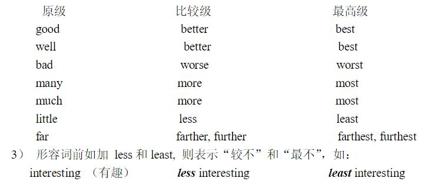
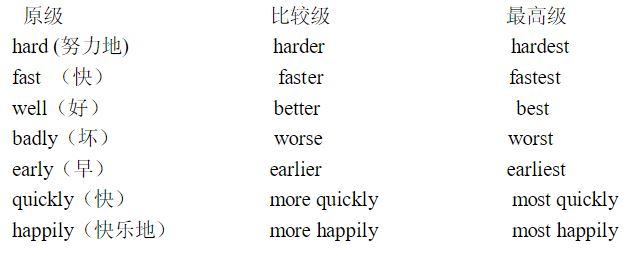

## 第二章 形容词副词动词

@@@
### 第一节 形容词、副词
~~~~
#### 一、形容词
- 形容词（adjective）用来修饰名词，表示名词的属性，一般放在它所修饰的名词之前。如：*red* star, the *beautiful* picture, *political* power.
~~~~
#### 1. 形容词的用法
- 形容词在句中可作定语、表语、宾语补足语、相当于名词
~~~~
- 1.1 形容词做定语
	- He is a good boy.
	- She is a pretty girl.
~~~~
- 1.2 形容词做表语
	- The apple taste good.
	- The box is empty.
~~~~
- 1.3 形容词做宾语补足语或复合宾语
	- We keep our rooms clean and tidy. 
	- Have you got everything ready for the journey? 
~~~~
- 1.3 the+形容词相当于名词
	- The doctor worked day and night to save the sick and the wounded

~~~~
#### 2. 形容词的位置
- 形容词一般须放在它所修饰的名词之前。但如有一个以上的形容词修饰名词，这些形容词的位置即由它们和被修饰名词的关系的密切程度来决定。一般说来，关系最密切的最靠近被修饰的名词，关系较远的离被修饰的名词也较远。
~~~~
- 口诀1
	- 大小、长短、形状+年龄、新旧+颜色+国籍、出处+材料+用途、类别
	- A beautiful short new red Chinese woollen coat.一件漂亮的中式新的短装红羊毛外套
~~~~
- a strong, swift horse (一匹又壮又快的马)
- many happy and healthy children （很多幸福而健康的儿童）many 是修饰词。
- that young Russian fighter （那个年轻的俄罗斯战士）
- a short and militant article （一篇简短有力的文章）militant 较 short 词长，固放在后面。
~~~~

- 口诀2
	- 大哥限描大，二哥形龄颜，小弟籍物类，同站名词前。
	- 限：限定词。the，my，a，this… 
	- 描：描绘性形容词。brave，beautiful，lovely，nice… 
	- 大：大小、高低、长短等形容词。big，large，small…
~~~~
- 形：形状。round，square…
- 龄：年龄大小、新旧、年代等。young，old，new…
- 颜：颜色。red，blue，green…
- 籍：国籍、地区、出处。Chinese，America，Japanese…
- 物：物质材料的形容词。golden，wooden，wax…
- 类：表示类别、用途。medical，chemical，writing…
~~~~
- 一个旧的很漂亮的黑色的日本式的方形木制小写字桌。
~~~~
- A pretty little square old black Japanese wooden writing desk.
~~~~
#### 3. 形容词的比较等级及其形式
- 英语形容词比较等级（degrees of comparison）一般有两个：即 比较级（comparative degree）和最高级(superlative degree). 不加比较的形容词通常称为原级（positive degree），形容词的比较级形式是：“形容词 + 后缀-er”或“单词
more + 形容词”。它们的最高级形式是：“形容词 + 后缀-est”或“单词 most + 形容词”
~~~~
- 3.1 规则变化

~~~~

~~~~
- 3.2 不规则变化

~~~~
#### 4. 形容词比较级的用法
- 比较级用于二者的比较，其结构是：含有形容词比较级
的主句 + 从属连词 than 导的从句（从句中常省去意义上和主句相同的部分）
- Tom is stronger than Jerry. 
~~~~
#### 5. 形容词最高级的用法
- 形容词最高级用于二者以上的比较，其结构一般是：定冠词 the + 形容词最高级 + 名词 + 表示范围的短语或从句。
~~~~
- This is the best film (that) I have ever seen. （这是我看过的最好的电影）that 在口语中一般省略。
~~~~

#### 二、副词
副词（adverb）修饰动词、形容词和其他副词等，说明时间、地
点、程度、方式等概念。如：often （往往）， here (这里)， very （很）， quickly (很快地)。
~~~~
#### 1. 副词的构成
- 1.1 本身就是副词 如：now（现在），there（那里），rather（相当）
- 1.2 由形容词加词尾-ly 变来。如：happily（幸福地），firmly（坚决地）
- 1.3 与形容词同形early adj. 早的 adv. 早；long adj. 长的，长久的 adv. 长久地
~~~~
#### 2. 副词的种类
- 2.1普通副词(ordinary adverb) 如：together (一起) well （好） seriously（认真地） slowly （慢） 
- 2.2 疑问副词（interrogative adverb） 如：when (何时) where（何地） how（如何） why（为何） 
- 2.3 关系副词（relative adverb） 如：where, when.
- 2.4 连接副词（conjunctive adverb）如：then（然后） so（所以） therefore（所以） however（然而） hence（所以）

~~~~
- 汉译英“我怀念我们成为最好朋友的日子。”
~~~~
-  I missed the days *when* we were best friends.
-  I missed the days *in which* we were best friends.
~~~~
- 汉译英“这就是他们到达的火车站。”
~~~~
- This is the train station where they arrive.
- This is the train station at which they arrive.
- where经常与in/at/on + which 替换使用
~~~~
#### 3. 副词的用法
- 3.1 做状语（这是副词在句子中的主要功用）
- 3.2 做表语
- 3.3 做定语
~~~~
- 3.1 做状语
	- It is raining hard. （雨下得很大）
	- Don’t drive too fast. （车子不要开得太快）
~~~~
- 3.2 做表语
	- Is he up? （他起床了没有？）
	- She is out. （她出去了）
~~~~
- 3.3 做定语
	- Life here is full of joy. （这儿的生活充满了欢乐）here 修饰名词 life.
~~~~
#### 4. 副词的位置
- 4.1 修饰动词时，有三种位置。
	- 修饰动词，表示时间、地点、程度、方式、频度等。一般位于动词之后，如果动词有宾语，则要位于宾语之后。频度副词常位于助动词和连系动词be 之后或实义动词之前。
~~~~
- 汉译英
	- 他跑的很快。
	- 我大声地说英语。
	- 汤姆上学总迟到。
~~~~
- He runs fast. 
- I speak English loudly.
- Tom is always late for school.
~~~~
- 4.2 修饰形容词和副词时，须放在被修饰词之前。
	- It is a rather difficult job.（这是一件颇为困难的工作）rather 修饰形容词 difficult.
	- He runs very fast. （他跑得很快）very 修饰副词 fast.
- 4.3 副词作定语时，一般放在被修饰的名词之后。
	- The peasants there are busy digging a canal now.（那里的农民现在正忙于修水渠）
~~~~
#### 5. 副词的比较等级
和形容词同形的副词的形式变化与形容词完全相同。但以
词尾-ly 结尾的副词（early 中的-ly 不是词尾）须用 more 和 most. 另外，须注意下面例词中
well, badly 的不规则变化。
~~~~

~~~~
#### 6. 副词比较等级的用法
- 6.1 副词比较级的用法与形容词比较级相似。
	- She plays table tennis better than I. （她乒乓球打得比我好）从句中省略了 play table tennis.
	- They speak less fluently but more correctly than we do.（他们讲得不如我们流利，但比我们正确）
- 6.2 副词最高级用法，除副词前可以不用 the 外（用也可以），其余与形容词最高级相同。
	- He rans the fastest.
	- He swims the best in our Class.
~~~~
#### 7. 比较等级的一些特殊用法
有几个形容词和副词的比较级和最高级有两种不同形式，而且意义也不同。

~~~~
- 举例说明：
	- Beijing is one of the oldest cities in the world.（北京是世界上最古老的城市之一）
	- My elder brother is in college. He is two years older than I. （我哥哥在上大学，他比
我大两岁）
	- They reached the place later than we.（他们到达那儿比我们晚）
	- Who spoke last? （是谁最后发言的？）
	- What is the latest news about the sports meet? （关于运动会最近有什么消息？）
~~~~
#### 8.as ... as; not so ... as 或 not as ...as
- 8.1 表示“相等”用 as...as.
	- This knife is as sharp as that one. （这把刀跟那把一样快）
	- Chen is as tell as I. （陈和我一般高）
	- German is as difficult a language as English. （德语和英语一样难学） as 后面的形容词如作定语，而被定语修饰的名词有不定冠词 a 时，冠词 a 须放在形容词之后
	- I have never seen so beautiful a place as Guilin before. （我过去从未见
过桂林这样美丽的地方）
~~~~
- 8.2 表示“不相等”用 not so...as 或 not as ...as. 
	- Tian An Men Square was not so big as it is now. （天安门广场过去没有现在这样大）
	- The Atlantic Ocean is not as big as the Pacific Ocean. （大西洋没有太平洋大）
~~~~
#### 9. 表示“几倍于”
- Beijing is ten times as big as my home town. （北京有我的家乡十个大）
- Asia is four times as large as Europe. （亚洲比欧洲大三倍）
~~~~
#### 10. 表示程度
- 可用 much, far, still, even, a little, no, any, a great deal 等状语来修饰
形容词和副词的比较级。
	- The Yellow River is long, but the Changjiang River is even longer. (黄河长，长江更长)
	- We are much better off now. （我们的生活比过去好得多）
~~~~
#### 11. “比较级 + and +比较级”（后面不可接 than 从句）可用来表示“越来越...”
- The days are getting longer and longer. （白天越来越长了）
- He is becoming more and more interested in sports. （他对运动越来越有兴趣了）
~~~~
#### 12. the more ... the more 的用法 “越...，就越...”。
- The more, the better. （越多越好）
- The harder you work, the more you will learn. （你越努力，就越学得多）
- The greater the mass of a body, the greater is its inertia. （物体的质量越大，它的惯性就越大）
~~~~
#### 13. more than 和 less than“多于”“少于”
- We fulfilled our production plan for this year in less than ten months. （我们用了不到十
个月就完成了本年度生产计划）
- Our country has established diplomatic relations with more than one hundred countries.
（我国已经和一百多个国家建立了外交关系）
~~~~
#### 14. no more than “只不过”和 not more than“不多于”
- There are no more than ten tickets left. (剩下不到十张票) no more than 有票少的意思
- This main avenue was not more than eight or ten feet wide. 这条主道的宽度不过八到十英尺。
- This room is no more than that. （这个房间并不比那个大）有两个房间都不大的含义。
- This room is not bigger than that one. （这个房间不比那个大）没有两个房间都不大或都不小的含义
~~~~
#### 15. no less than “不亚于”和 not less than“不少于” 
- There were no less than a thousand people at the meeting. （到会的有一千人之多）有到会人多的含义。
- There were not less than one thousand people at the meeting. （到会的至少有一千人）没有到会多或人少的含义。
~~~~
#### 16. all the better 和 so much the better“因此而更...”
- If that is so, all the better. （果真如此，那就更好）
- If he will come, so much the better. （如果他愿意来，那更好）
~~~~
#### 17. 最高级有时不表示比较,只表示“非常”或“在很大程度上”
- He helped us with the greatest pleasure. （农民非常乐意帮助我们）
- It is a most important question. (a most = a very) （这是一个很重要的问题）

@@@

### 第二节 动词
~~~~
- 动词（verb）是表示动作或状态的词。
	- 表示动作：swim (游泳)， overthrow （推翻）
	- 表示状态：have, be
- 英语动词有时态、语态、语气等形式上的变化。
~~~~
#### 1. 限定动词和非限定动词
限定动词和非限定动词从是否被主语所限定来分，动词有限定动词（finiteverb）和非限定动词（non-finite verb）两大类。
~~~~
##### 1.1 限定动词用作句子的谓语动词，并被主语所限定，有人称和数的变化。
- He is a driver. （他是一个司机）
- Facts are more eloquent than words. （事实胜于雄辩）
- We have friends all over the world. （我们的朋友遍天下）
- We love our great socialist motherland. （我们热爱伟大的社会主义祖国）
~~~~
##### 1.2 非限定动词有动词不定式、动名词和分词三种，在句子里都不能单独作谓语动词，故不被主语所限定，没有人称和数的变化。
- I am pleased to meet you. （我很高兴与你相识）to meet 为动词不定式。
- Smoking is harmful to the health. （吸烟对身体有害）smoking为动名词。
- The People’s Liberation Army is always a fighting force. （人民解放军永远是一个战斗队）fighting为分词
~~~~
#### 2. 实义动词、连系动词、情态动词和助动词
- 实义动词、连系动词、情态动词和助动词从其含义来分，``动词有实义动词（notional verb）、连系动词（link verb）、情态动词（modal verb）和助动词（auxiliary verb）四类。
~~~~
##### 2.1 实义动词
- 实义动词有完全的词义，并能独立作谓语动词。如：
	- In 1977 the People’s Republic of China celebrated its 28th anniversary. （一九七七年中华人民共和国庆祝建国二十八周年）
	- He likes to go for a long walk on Sundays.（他喜欢星期日出去作长距离散步）
~~~~
##### 2.2连系动词
连系动词在句中作谓语动词，后面跟表语。英语连系动词有be（是），seem (似乎)，look（看来），become（变成），get（变得），grow（变得），feel（感到），turn（变得、变成），appear（显得），remain（仍旧是）等。
~~~~
- It is never too late to mend. （改过不嫌晚）
- It was a close game. （那场球赛比分很接近）
- The child looks very healthy.
- Keep quiet, please! （请安静）
- The tape recorder seems all right. （这架录音机好象没有毛病）
- The problem remained unsolved until last year.（问题到去年才解决）
~~~~
##### 2.3情态动词
情态动词有can（能），may（可以、也许），must（必须）等及其过去式could, might 等，表示能力、义务、必要、猜测等说话人的语气或情态。情态动词只能和动词原形一起构成谓语动词。
~~~~
##### 2.4助动词
助动词有shall, will, have, be, should, would, do等。它们只能和主要动词
一起构成各种时态、语态、语气等动词形式，以及否定和疑问等结构中的谓语动词。
~~~~
#### 3.及物动词和不及物动词
从是否需要宾语来分，实义动词又有及物动词和不及物动词两类。
~~~~
##### 3.1及物动词(transitive verb) 
后面必须跟宾语才完整的实义动词，叫做及物动词。
~~~~
- I believe that the committee will consider our suggestion.（我相信委员会将会考虑我们的建议）
- “How long can I keep the book?” Li asked. （李问：这本书我可以借多久）
- I don’t think that it will be very hot today.（我看今天不会很热）
- Crude oil contains many useful substances.（原油含有许多有用的物质）
~~~~
##### 3.2不及物动词(intransitive verb) 
本身意义完整后面不须跟宾语的实义动词，叫做不及物动词。
~~~~
- Birds fly. （鸟会飞）
- It happened in June 1932.（这件事发生于一九三二年六月）
- My watch has stopped. （我的表停了）
- She spoke at the meeting yesterday evening.（她在昨天晚上的会上发了言）
- Did you sleep well last night?（你昨天晚上睡得好吗？）
~~~~
##### 3.3 兼作及物动词和不及物动词英语里有不少实义动词可以兼作及物动词和不及物动词。
这样的动词又有两种不同的情况：
1. 兼作及物动词和不及物动词时，意义不变。试比较：
	- Shall I begin at once? （我可以立刻开始吗？）begin作不及物动词。
	- She began working as a librarian after she left school. （她毕业后当图书馆管理员）began作及物动词。
	- When did they leave Beijing? （他们是什么时候离开北京的？）leave作及物动词。
	- They left last week. （他们是上周离开的）left 作不及物动词。
2. 兼作及物动词和不及物动词时，有时意义不尽相同。如：
	- Wash your hands before meals. （饭前要洗手）
	- Does this cloth wash well? （这布经得起洗吗？）
~~~~
##### 3.4与汉语的比较
有时英语动词的及物和不及物的用法，与汉语的用法不一样，请注意下列两种情况。
1. 有的动词在英语里只能用作不及物动词，而汉语则可用作及物动词。如：arrive（到达），agree（同意），listen（听）。英语里这些动词后面常接介词。
	- We arrived at the factory at noon. （我们于中午到达工厂）句中at 不能省去。(比较：We reached the factory at noon)
	- Everybody listened to the report with great interest. （每个人都很有兴趣地听报告）句中to不能省去。（比较：We all heard the report.）
	- Do they agree to the plan? （他们同意这个计划吗？）句中to不可省去。
~~~~
2. 有的动词在英语里能用作及物动词，而在汉语里则不能用作及物动词。如：serve（为…服务）。
	- Our children are taught to serve the people whole-heartedly. （我们的儿童被教以全心全意为人民服务）
~~~~
- 需要注意的是，有时不及物动词后面可以跟形容词或名词。如：
	- The sun rose red. （旭日东升）
	- Don’t marry young. （不要早婚）
	- Dongsheng went away quite a child and returned a grown man. （东生走的时候还很小，回来的时候已经是一个成年人了）

~~~~
#### 4.短语动词
动词常和某些其他词类用在一起，构成固定词组，形成所谓短语动词（phrasal verb）。和动词一样，短语动词也可分为及物和不及物两种。短语动词可以作一个整体看待，同一般动词一样使用。
~~~~
##### 4.1动词+ 介词
这类短语动词用作及物动词，后面须跟宾语。
- The small boy insisted on going to the park. (这个小孩坚持要去公园)
- Do you often listen to broadcasts in English? （你常听英语广播吗？）
- Look at the children. Aren’t they lovely? （看看这些孩子们。他们多么可爱呀！）
- We stand for self-reliance. （我们主张自力更生的）

这一类短语动词还有很多，如：depend on (upon)（依靠），wait on（服侍），look for（寻找），
deal with（对待），look after（照料），wait for（等待）等。
~~~~
##### 4.2动词+ 副词
这类短语动词有的用作及物动词，有的用作不及物动词。
- I always get up as soon as the bell rings.（我总是一打铃就起床）get up 为不及物。
- Look out, there’s a car coming! （当心，来汽车了）look out为不及物。
- Have you handed in your exercises already? （你已经交练习了吗？）handed in 为及物。
- Please don’t forget to put on your coat; it’s cold outside.（请不要忘记穿上衣，外面很冷）put on及物。

~~~~
这一类的短语动词还有很多，如：put out（扑灭），eat up（吃光），wake up（醒来），
set off（出发），come up（走近）， go on（继续），lock up（禁闭），give up（放弃）等。
~~~~
- “动词+ 副词”这类短语动词和上面第一类“动词+ 介词”的不同之处在于：“动词 +介词”用作及物动词，后面须跟宾语。“动词+ 副词”则有的及物，有的不及物；用作及物动词而宾语为人称代词或自身代词时，副词往往放在宾语之后。如：
- Please wake me up at five tomorrow. （请在明天早上五点唤醒我）
- The landlord locked her up in a small dark room. （地主把她关在一间小黑屋子里）
- If you have done your exercises, please hand them in. （如果你们练习做完了请交来）

~~~~
这类短语动词有不少可兼作及物和不及物动词用。如：
- He took off his hat when he entered the office. （他进办公室后脱下帽子）took off 及物。
- The plane took off at seven sharp. （飞机在七点整起飞）took off 不及物。
- If you can’t come, please ring up and let us knows.(你如来不了，请来电话告诉我们一声）ring up 不及物。
~~~~

##### 4.3动词 + 副词+ 介词
短语动词“动词+ 副词”之后有的可以再加一个介词，形成另一种短语动词。这类短语动词用作及物动词。如：
- Do not give up hope. We must go on with the experiment.（不要失望，我们必须继续试验）to go on with 继续。
- He came up to me.（他走到我跟前）to come up to 走近。

这类短语动词还有：look down upon（看不起），do away with（去掉），put up with（忍受）等。
~~~~
##### 4.4动词+ 名词+ 介词
这类短语动词也是及物的，如：
- He shook hands with all the guests at the banquet. (他在宴会上和宾客一一握手)
- Pay attention to the temperature of the stored rice.（注意仓库里的稻谷的温度）
- Her job is taking care of the babies.（她的工作是照顾婴儿）

这一类短语动词还有：put an end to（结束），take notice of（注意），catch hold of（抓住），lose sight of（看不见），make use of（利用）等。

~~~~
- 这类短语动词中的名词之前，可用形容词作定语。如：
	- The nurses took good care of the patients. （这些护士很好地看护了病人）
	- We must pay close attention to English pronunciation.（我们必须密切注意英语语音）
- “be + 形容词+ 介词”，如：be afraid of （害怕），be fond of （喜爱），be angry with（生…的气）等，也可看作是一种短语动词。

~~~~
#### 5.动词的基本形式（principal forms of the verb）

英语动词的四种基本形式它们是动词原形（root form of the verb），过去式(pasttense form)，过去分词(past participle)和现在分词（present participle）。这四种形式和助动词一起构成动词的时态、语态和语气。原形过去式过去分词现在分词
- work worked worked working
- write wrote written writing
- have had had having
- do did done doing
~~~~
##### 5.1 动词原形
动词原形就是词典中一般给的动词的形式，如：be, have, do, work, study等。
~~~~
##### 5.2动词过去式和过去分词的构成有规则的和不规则的两种。
规则动词(regular verb)的过去式和过去分词，由在原形后面加词尾-ed 构成。关于动词原形加-ed 的方法和读音见下表：
~~~~

~~~~
- 少数双音节的动词，尽管重音在第一个音节，仍双写末尾的辅音字母，然后再加-ed. 如：
	- Travel — travelled (traveled) level — levelled (leveled)
	- Total — totalled (totaled) model — modelled (modeled)

- 不规则动词（irregular verb）的过去式及过去分词的形式是不规则的。这些动词数量虽不很多，但都是比较常用的，必须熟记。
~~~~
##### 5.3动词的现在分词由动词原形加词尾-ing构成。其构成方法如下：
1. 一般情况下，直接加-ing：
	- go — going （去） stand — standing （站立）
	- ask — asking （问） answer — answering （回答）
	- study — studying （学习） be — being (是)
	- see — seeing （看）
~~~~
- 和名词复数、动词第三人称现在一般时加-s(-es)不同，动词末尾如为“辅音字母+ y”时，y
不变，其后直接加-ing；如：
	- studying[ˈstʌdiɪŋ] flying [ˈflaɪɪŋ] carrying ['kærɪɪŋ]
- 动词结尾为辅音字母r 时，加-ing, r在此必须发音。如：
	- enter [ˈentə] — entering ['entərɪŋ] （进入）
	- answer [ˈɑːnsə] — answering ['ɑ:nsərɪŋ]
	- wear [weə] — wearing [ˈweərɪŋ] （穿）
~~~~
2. 以不发音的e结尾的动词，去掉e，再加-ing. 如：
	- come — coming write — writing
	- take — taking become — becoming
~~~~
3. 动词是闭音节的单音节词，或是以重读闭音节结尾的多音节词，而末尾只有一个辅音字母时，这个辅音字母须双写，然后再加-ing. 如：
	- sit — sitting run — running
	- stop — stopping begin — beginning
	- forget — forgetting admit — admitting (承认)
~~~~
- send, think, accept 等动词虽是闭音节或以重读闭音节结尾，但末尾有一个以上的辅音字母，因
此，这个辅音字母不双写，应直接加-ing. 如： 
	- sending, thinking, accepting.
- 少数双音节的动词，重音在第一音节，仍要双写末尾的辅音字母。如：
	- travel — travelling (traveling) level — levelling (leveling)
	- total — totalling (totaling) model — modelling (modeling) 
~~~~
- 少数几个以-ie结尾的动词，须将ie变作y, 再加ing. 如：
	- die — dying (死) tie — tying (捆、缚、系)
	- lie — lying （躺、说谎）

