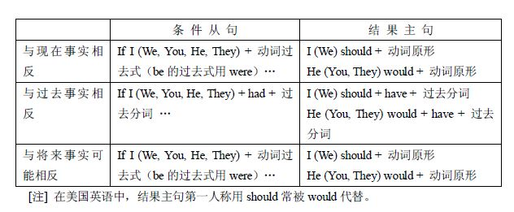

## 第六章 语气和虚拟语气
~~~~
1. 语气及其种类
2. 虚拟语气
3. 虚拟语气的其他用法
@@@
### 1 语气及其种类
- 语气(mood) 是一种动词形式，表示讲话人对某一行为或事情的看法和态度。
- 语气的种类语气可分为下列三种：直接语气(indicative mood) ，祈使语气(imperative mood) 和虚拟语气(subjunctive mood)
~~~~
#### 1 直接语气(indicative mood) 
- 表示讲话人认为他所说的话是一个事实。如：
	- There are two sides to every question.（每个问题都有两个方面）
	- Jinzhou is famous for its apples.（锦州以产苹果闻名）
	- Comrade Zhang Side had a deep love for the Party.（张思德同志对党怀有浓厚的爱）
~~~~
#### 2 祈使语气(imperative mood) 
- 表示讲话人对对方的请求或命令。如：
	- Bring along your exercise books tomorrow.（明天把练习本带来）
	- Take yourself at home.（请随便，不要客气）
	- Don’t move!（不许动）
	- Don’t be late.（不要迟到）
	- Be quite!（请安静）
~~~~
#### 3 虚拟语气(subjunctive mood)

1. 什么是虚拟语气
2. 虚拟语气的动词形式
3. 虚拟语气常用在表示条件的从句和表示结果的主句中
4. 虚拟语气在条件从句和结果主句中的用法
5. 省掉if的条件从句结构
6. 虚拟语气和情态动词
7. 有时条件从句中的动作和结果主句中的动作，发生的时间不一致
8. 用直陈语气表示条件和结果
9. 省去从句或主句的虚拟结构
~~~~
- 虚拟语气是一种特殊的动词形式，用来表示说话人所说的话不是一个事实，而只是一种愿望、假设、怀疑、建议、猜测、可能或纯粹的空想等。如：
	- If I were not so busy, I would go with you.（假如我不太忙，我会和你一起去）表“假设”
	- I wish Lao Li were here. He would know how to fix the machine.（老李在这儿就好了，他会把机器修好）表“愿望”
	- He suggests that we should all go to see the film.（他建议我们都去看电影）表“建议”
~~~~
##### 3.2 虚拟语气的动词形式
- 比较特殊，共有下列七种：
1. 动词原形（用于一切人称和数）
2. 动词的过去式（用于一切人称和数，be的过去式一律用were）
3. had + 过去分词（用于一切人称和数）
4. should + 动词原形（用于一切人称和数）
5. should have + 过去分词（用于一切人称和数）
6. should（第一人称），would（第二、三人称）+ 动词原形
7. should（第一人称）、would（第二、三人称）+ have + 过去分词
~~~~
- 注意：上述某些动词原形和直接语气的某些动词形式相同，但它们的用法及其所表示的时间概念则完全两样，二者切不可混淆。
~~~~
##### 3.3 虚拟语气常用在表示条件的从句和表示结果的主句中
现将条件从句和结果主句各自的动词形式列表如下：

~~~~
##### 3.4 虚拟语气在条件从句和结果主句中的用法
1. 表示与现在事实相反的条件和结果。如：
- If I were you, I should go and see the dentist at once.（假如我是你的话，我会马上去看牙科医生）说明事实上我不是你。
- If there were no gravity, we should not be able to walk.（假若没有引力，我们就不能行走）
~~~~
- If they had time, they would study Italian too.（假如他们有时间的话，他们也会学意大利语的）说明事实上他们没有时间。
- If she knew German, she would read Marx and Engels in the original.（假如她懂德语，她会读马克思和恩格斯的原著）
- He would tell me if he knew, but he does not know anything about it.（假如他知道的话，他会告诉我的，但是他一点也不知道）
~~~~
2. 表示与过去事实相反的条件和结果。如：
- I should have died of hunger if the Communist Party had not come in 1949.（要是一九四九年共产党不来的话，我是会饿死的）
- If you had come a few minutes earlier, you would have met him.（要是你早来几分钟的话，你就见到他了）
~~~~
- If she hadn’t been so strict with herself, she wouldn’t have made such great progress.（她要是对自己要求不严格，她就不会有这样大的进步）
- If he hadn’t lived among the workers for so many years, he wouldn’t have been able to write such a good novel.（假如他不是和工人一起生活这么多年，他不可能写出这样好的小说）
~~~~
3. 表示与将来事实可能相反的条件和结果。其用法和表示与现在事实相反的条件和结果相同。如：
- If it were Sunday tomorrow, I should go to see my friends there.（明天要是星期天，我会去看望在那里的我的朋友）
- If you dropped the glass, it would break. （杯子掉下来会打碎的）
- What would happen if I put the paper in the fire? — It would burn. （我若把纸放在火上会怎么样？ 纸会烧着）
~~~~
- 注意：在表示与将来事实可能相反的条件从句中，亦可用were to + 动词原形（比较正式，常用于书面表示）和should + 动词原形。如：
- If you were to come tomorrow, I might have time to see you.（你如果明天来的话，我或许会时间见你）
- If it should rain tomorrow, what would we do?（明天万一下雨，我们怎么办）
- If I were to see her tomorrow, I would tell her about your decision.（我明天如果见到她，就把你的决定告诉他）
~~~~
##### 3.5 省掉if的条件从句结构
- 在笔语中条件从句有时可以不用连词if, 而把were, had或should移至主语之前，但如从句没有were, had 或should, 则不能这样做。如：
- Should he come, tell him to ring me up.（他要是来了，让他给我打个电话）
- Were I in your position, I would go. (如果我处于你的地位，我就去)
- Had they not helped us, our experiment would have failed.（如果没有他们的帮助，我们的试验是会失败的）
~~~~
- 注意：有时虚拟条件并不用条件从句而用介词短语、动词不定式等来表示。如：
- Without contradiction nothing would exist.（没有矛盾就没有世界）
- We could not have done the work well without your help. （要是没有你的帮助，我们不可能做好这工作）
- It would be a good idea to go swimming at the Summer Palace.（到颐和园去游泳，倒是个好主意）
- All this would have been impossible in the old society.（这一切在旧社会是不可能有的）
~~~~
##### 3.6 虚拟语气和情态动词
虚拟结构（不论从句或主句）常可用情态动词的过去式，即could, might, would等加不带to的动词不定式或不带to的动词不定式完成式，来作谓语动词。这些情态动词除表示虚拟结构外，本身还有独立的意思：could 能够，might 或许，would愿意、决心。如：
- If I were you, I would go.（如果我是你，我就愿意去）
- If he were here, he might agree with you.（假如他在这里，他可能会同意你）
~~~~
- I would help you if I could.（假如我能够的话，我一定帮助你）
- If it had not been for the Party’s instructions, we could not have succeeded.（如果不是党的指示，我们是不可能成功的）
~~~~
##### 3.7 有时条件从句中的动作和结果主句中的动作，发生的时间不一致
- 这时，动词的形式应根据它所表示的时间加以调整。如：
- If he had followed the doctor’s advice, he would be quite all right now.（他当时若是听医生的话，现在就会痊愈了）从句说明过去，主句说明现在。
~~~~
- If I were you, I would have gone to the theatre.（假如我是你，我会去看话剧的）从句的时间包括现在，主句说明过去。
- If you hadn’t helped me, I couldn’t have finished it on time and most likely I would be still working now.（假若你没有帮助我，我不可能按时完成工作，很可能现在还在干哩）从句说明过去，主句说明过去和现在。
~~~~
##### 3.8 用直陈语气表示条件和结果
- 在现代英语中，多用直陈语气表示条件和结果。直陈语气的条件的结果所表示的往往是事实。如不是事实，其可能性也较虚拟语气要大。如：
- If it rains tomorrow, we shall not go out.（假如明天下雨的话，我们就不出去）
- We must follow the mass line if we want to do our work well.（如果我们要把工作做好，就必须走群众路线）
~~~~
- If the train leaves at eight thirty, there is no time to lose.（火车如果是八点半开，我们得抓紧时间了）
- If the rain stops, I’ll go for a swim.（如果雨停了，我就去游泳）
~~~~
##### 3.9 省去从句或主句的虚拟结构
- 虚拟结构中的从句或主句有时形式上可以省略，但意义上却仍存在。
1. 省去了条件从句的虚拟结构：
2. 省去了结果主句的虚拟结构（常用以表示愿望）。
~~~~
1. 省去了条件从句的虚拟结构：
- That would be fine.（那就太好了）省去了if you should do it 或类似条件。
- You might stay here forever.（你可以永远呆在这）省去了if you wanted to或类似条件。
- I would not have done it.（我是不会作那件事的）省去了if I were you 或类似条件。
~~~~
- 注意： 虚拟结构中省去的从句有时并不容易找出。如：
- Who would have thought of it?（谁会想到是这样的呢）
~~~~
2. 省去了结果主句的虚拟结构（常用以表示愿望）。如：
- If only I could help you！（假如我能帮助你，那该是多好啊）
- If only he were here!（假如他在这里该多好啊）
- If only he had not left!（如果他没有走，那就好了）
- If only I were ten years younger!（我要是能年轻十岁该多好啊）
- If only the wind would stop!（风要是停了该多好）
~~~~
### 3 虚拟语气的其他用法
1. 虚拟语气用在主语从句中
2. 虚拟语气用在宾语从句中
3. 虚拟语气用在状语从句中
4. 在It is time (that) …句型中
5. 虚拟语气用在简单句中
~~~~
#### 3.1 虚拟语气用在主语从句中
- 在It is natural (necessary, strange, important) that …这类句型里，that 所引导的主语从句中的谓语动词常用should加动词原形。如：
- It is important that we should speak politely.（我们说话要有礼貌，这是很重要的）
- It is imperative that we should practice criticism and self-criticism.（应当进行批评与自我批评）
~~~~
- It is quite natural that he should think so.（他这样想是很自然的事）
- It is strange that he should have gone away without telling us.（真奇怪，他没有通知我们就走掉了）
- It is necessary that the question should be settled at once.（必须马上解决这个问题）
~~~~
#### 3.2 虚拟语气用在宾语从句中
- 下列两种宾语从句须用虚拟语气：
1. 在动词wish 后的宾语从句（常常省去连词that），表示不可实现的愿望。
2. 动词demand（要求），suggest（建议），order（命令），insist（坚持），propose（建议）等后面的宾语从句，用should（用于所有的人称）加动词原形来表示虚拟语气。
~~~~
1. 在动词wish 后的宾语从句（常常省去连词that），表示不可实现的愿望。从句中的动词如用过去式，则表示说话人现在存在的一桩遗憾事；如用过去完成式，则表示已经发生的一件遗憾事：
- I wish I were a PLA soldier.（但愿我是个解放军战士）类似：I am sorry I am not.
- I wish I knew how to operate the machine（ 我要是会操作这架机器该有多好啊）类似：I’m sorry I don’t know.
~~~~
- I wish he hadn’t gone.（他要是没走该多好）类似：I’m sorry he has gone.
- We wish you had come to our New Year’s party.（我们真希望你来参加我们的新年联欢会）类似：but you did not.
~~~~
- 动词wish 如果是过去式，后面宾语从句的动词的虚拟语气形式不变，仍用过去式或过去完成式。如：
- She wished she knew how to drive a car.（她但愿会开车）
- I wished I hadn’t been so forgetful. Then I shouldn’t have missed the talk.（我要不是这样忘事该有多好，那我就不会没有去听报告了）
~~~~
- 注意：有时在宾语从句中可用would或might加动词原形，表示有可能实现的愿望。如：
- I wish he might stay with me.（我希望他和我住在一起）
- He wishes I would go with him.（他希望我和他一起去）
- I wish you would be quite.（我希望你安静一些）
~~~~
2. 动词demand（要求），suggest（建议），order（命令），insist（坚持），propose（建议）等后面的宾语从句，用should（用于所有的人称）加动词原形来表示虚拟语气。如：
- I suggest that we should hold a meeting tonight.（我建议今晚开个会）
~~~~
- The chairman proposed that we should discuss the question.（主席提议我们讨论这个问题）
- Most students insist that they should have more English classes.（多数同学坚持要多上英语课）
~~~~
- 注意：这种结构往往不用should, 只用动词原形（用于所有人称）。如上面三例只用hold, discuss, have,不用should hold, should discuss, should have. 又如：
- I suggest that we make a new experiment.（我建议进行新的试验）
- I propose that the matter be put to the vote at once.（我提议把这个问题马投票表决）
~~~~
#### 3.3 虚拟语气用在状语从句中
- 由 as if 或as though所引导的状语从句表示比较或方式时，从句中的谓语动词用虚拟语气。动词形式用动词的过去式(be 用were)或had + 过去分词。如：
- My mother looked after the orphan as if he were her own child.（我母亲照料这个孤儿象自己孩子一样）
- You speak as if you had really been there.（你谈得好象你真的到过那里似的）
~~~~
- It looks as if it might rain. （天好象要下雨似的）
- 注意：连词lest和in case 所引导的状语从句中的谓语动词亦用虚拟语气
~~~~
#### 3.4 在It is time (that) …句型中
- 从句里的谓语动词常用虚拟语气表示将来，动词形式用动词的过去式。意思是“该干某件事了，时间已经有些晚了”。如：
- It is time we left. (我们该走了)
- It is time we went to bed.（我们该睡觉了）
- It is time we summed up our results.（我们该总结我们的成绩了）
~~~~
#### 3.5 虚拟语气用在简单句中
- 下面是虚拟语气用在简单句中较常见的两种情况：
1. 动词原形live用在long live …中
2. may 用在句子开头，表示“祝愿”（多用在正式的文体中）
~~~~
1. 动词原形live用在long live中。如：
- Long live the Communist Party the China.
- Long live the People.
- live在此也是虚拟语气的一种动词形式，不可改为lives
~~~~
2. may 用在句子开头，表示“祝愿”（多用在正式的文体中）。如：
- May good luck be yours.（祝你顺利）
- May you be happy.（祝你快乐）
- May you do even better.（祝你取得更大成就）
~~~~
### 练习
1. I have often thought it would be a blessing if each human being were stricken blind and deaf for a few days at some time during his early adult life. Darkness would make him more appreciative of sight; silence would teach him the joys of sound.
~~~~
2. It would have been just as satisfactory if I ____ in class. I learned nothing at home.
- A. had stayed
- B. stayed
- C. was staying
- D. would stay
~~~~
3. Tourism is an odd thing. You fly off to a strange land, eagerly abandoning all the comforts of home, and then expend time and money in a futile attempt to recapture the comforts that you wouldn't have lost if you hadn't left home in the first place.
~~~~
4. Sometimes I have thought it would be an excellent rule to live each day as if we should die tomorrow. Such an attitude would emphasize sharply the values of life.
~~~~
5. There is a real possibility that these animals could be frightened, ____ a sudden loud noise.
- A. being there
- B. should there be
- C. there was
- D. there having been
~~~~
6. For example, they do not compensate for gross social inequality, and thus do not tell how able an underprivileged youngster might have been had he grown up under more favorable circumstances.
~~~~

