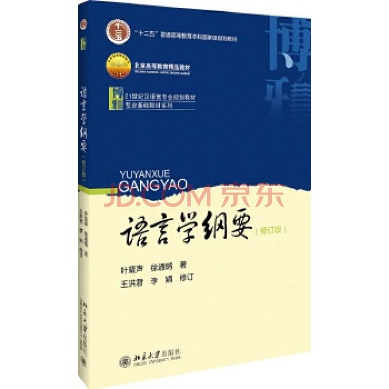

## 语言学概论

主讲教师：朱波

@@@
语言学概论是普通高校汉语言文学专业的必修基础理论课。它用**比较和描写的方法**从理论上研究**人类所有语言的共同规律**，在学科分类中属于普通语言学。作为一门课程，它所介绍的是普通语言学的**基本原理和基础知识**。
~~~~
通过语言学概论课的教学，进一步提高学生掌握和运用语言的能力，培养学生运用语言理论**解释分析** *语言现象*的能力，为今后从事语言教学和研究工作，或在语言学方面继续深造奠定理论基础。

@@@

~~~~

~~~~
- 教育部高等师范教育面向21世纪教学内容和课程体系改革计划项目（JS053B）
- 国家语言文字应用研究“十一五”规划重点研究项目（ZD115--03）
- 辽宁省哲学社会科学成果奖二等奖
- 辽宁省首批“十二五”普通高等教育本科规划教材
- 辽宁省普通高等学校精品教材

~~~~
- 导言
- 第一章 语言的功能
- 第二章 语言是符号系统
- 第三章 语音和音系 
- 第四章 语法
- 第五章 语义和语用 
- 第六章 文字 
- 第七章 语言演变与语言分化 
- 第八章 语言的接触 
- 第九章 语言系统的演变 

@@@
### 导言

1. 语言学的对象和学科性质
2. 语言学在科学体系中的地位
3. 语言学的应用价值 

@@@

### 对象和学科性质指的是什么？

~~~~
对象指的就是研究对象

- 语言学的研究对象就是**语言**
~~~~
语言学的任务和目的，就是描述和分析客观存在的语言事实，通过这种事实的描述和分析，探讨并揭示语言的发展规律，以此指导人们的语言实践，使人们更好地掌握和使用语言，让语言在人类生活的各个方面产生更大的效益。
~~~~
语言学研究成果在语言教学、语言政策、语言康复医疗、人工智能等领域具有重要作用。
~~~~
性质本身是指事物本身所具有的特征，作为一个学科，研究对象决定了学科性质
@@@
### 什么是语言学？
语言学，顾名思义，是研究语言的科学。语言是语言学的研究对象

- 语言学的学科性质，就是指语言学在众多学科里是**以语言作为专门研究对象的一门社会科学**。

~~~~

1. 语言学是一门社会科学 
2. 语言学是一门基础科学。 
3. 语言学是开放性学科。

@@@
### 2 语言学在科学体系中的地位
- 语言学与人文社会科学
- 语言学与现代自然科学

@@@
### 3 语言学的应用价值
~~~~
语言是一种复杂的现象，由于研究目的、角度、方法等因素的影响，形成了不同的语言学分支 
~~~~
语言的基础研究
~~~~
根据研究对象的不同
1. 个别语言学和普通语言学
    - 个别语言学是以一种或几种具体语言为研究对象，又叫具体语言学。
    - 普通语言学以人类所有语言为研究对象，研究语言共有规律，从而形成语言的普遍理论，又叫一般语言学。语言学概论就是普通语言学的入门课。
~~~~
根据研究内容时限的不同

2. 共时语言学和历时语言学
    - 共时语言学研究语言在一定发展阶段的状况，是对语言的横向研究。
    - 历时语言学研究语言在各个阶段的发展变化，着重探讨语言的历史发展及其规律，是对语言的纵向研究，例如汉语史、英语史等。
~~~~
根据**研究方法**的不同

3. 历史比较语言学和对比语言学

    - 用比较的方法对有亲属关系的语言进行研究，称为历史比较语言学。
    - 用对比的方法对没有亲属关系的语言进行研究，称为对比语言学。
~~~~
根据**研究方面**的不同

4. 微观语言学和宏观语言学
    - 微观语言学对语言系统内部的各个结构要素进行研究。例如语音学、音位学、词汇学、语义学、语法学、词法学、句法学等。
    - 宏观语言学是对语言整体进行的研究。
~~~~
语言的应用研究
~~~~
语言的应用研究统称为应用语言学，它着重解决现实中与语言有关的各种实际问题，把语言学的基础研究成果转化为社会效益。根据研究范围的不同，应用语言学有狭义和广义之分。
~~~~
1. 狭义应用语言学

狭义应用语言学主要以**语言教学**问题为研究对象，基本可以看作是语言教学的理论与方法的科学。语言教学包括第一语言教学即本族语的教学和第二语言教学即外族语的教学。第一语言的学习非常重要，因为它是学习各门知识的基础和手段，也是进行各种交际活动的工具。第二语言教学包括本族人学习外族语及教外族人学习本族语。

~~~~
2. 广义应用语言学

广义应用语言学是把语言学的研究成果同有关学科的某些实用研究结合起来，着重解决有关学科及语言学本身所涉及的应用方面的问题。它主要包括语言统计、信息传递、自动控制、情报检索、机器翻译、人机对话、人工智能、自然语言理解、语言文字信息处理等。此外，还涉及到语言规划、语言的使用等问题。

随着社会科学技术的发展，应用语言学的领域会越来越广阔。
~~~~
语言的交叉研究
~~~~
语言的交叉研究大体上可以分为三大类：

- 第一类是研究语言和社会文化的关系的学科。
- 第二类是研究语言与思维认知的关系的学科。
- 第三类是研究语言在各个领域的实际应用的学科。
@@@
### 请同学们思考下列问题：

1. 什么是语言学？概述语言学在现代科学体系中的地位和作用。
2. 以实例说明语言学同文学的关系。
3. 为什么说在现代科学体系中语言学是领先和关键的学科？

