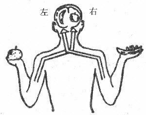
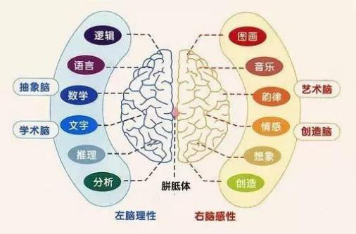
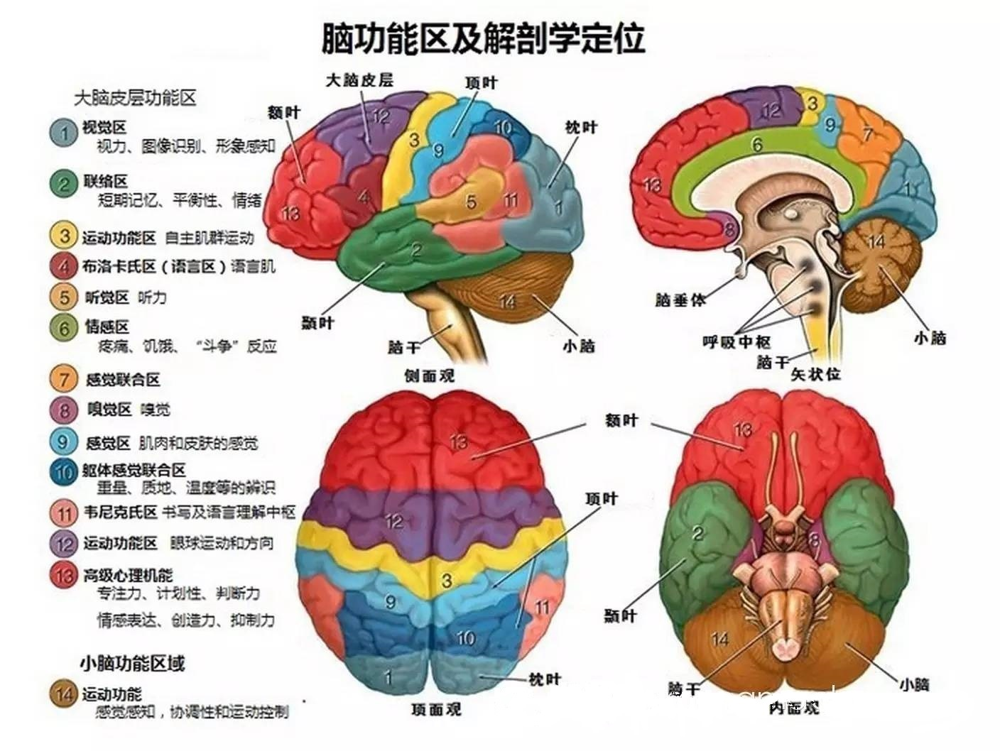

## 第一章　语言的功能

主讲教师：朱波
~~~~

世间万物，按其本质属性来看，分为两大现象：**自然现象**和**社会现象**。自然现象是有人类之前就存在着的，它们自发地产生、发展、消亡着，如大海、山川、动物、植物等。
~~~~
社会现象则依赖于人类社会而存在，随着社会的产生、发展、消亡而产生、发展、消亡。如政治、经济、法律、宗教、文化等，都是社会产物。
~~~~

语言是一种什么现象？在这方面，人们的看法是不一致的。有人认为语言是一种自然现象，有人说是个人现象、心理现象、生理现象等。这些观点都是错误的。
~~~~
语言是社会现象
1. 音义结合的任意性和世界语言的多样性说明语言是社会现象。
~~~~
- 相同的意义在不同的语言中就能用不同的声音来表达，例如，“书”汉语用“shū”这个音，英语用book。
- 同一语言中也有同样声音表达不同意义的情形。例如，汉语中的shu，可以表示“书”“输”“淑”“舒”“梳”等。
- 在同一语言中也有用不同声音表达相同意义的情形，例如，汉语中“头”和“脑袋”；“玉米”和“苞米”。
- 相同的声音在不同语言中可以表达不同的意义，例如，[ai]这个声音，英语是I,汉语是“哀”；
~~~~
2. 语言依存于社会
	- 从语言的功能看，语言是人类社会最重要的交际工具，交际必须在社会中进行，离开了社会，谈不上交际。
	- 从语言的产生看，语言是人类在集体劳动过程中适应交际的迫切需要而产生的。
	- 从语言的发展看，语言随着社会的发展而发展。
~~~~
3. 语言反作用于社会
	- 语言是人类区别于其他动物的重要标志之一。
	- 语言是人类生产活动中最重要的交际工具。
	- 语言是推动社会发展的重要因素。
~~~~
总之，语言依附于社会，又反作用于社会。它是社会的产物，又是社会发展的推动力。语言与社会的这种关系，说明语言是社会现象。
~~~~
通过人类的社会活动，我们可以发现语言具有**社会功能**和**思维功能**，这也是我们认识语言的两个重要方面。

@@@
### 第一节　语言的社会功能
~~~~
“社会”就是指生活在一个共同的地域中、说同一种语言、有共同的风俗习惯和文化传统的人类共同体。
~~~~

#### 一、语言的信息传递功能
~~~~
语言的社会功能中**最基本**的是信息传递功能。
~~~~
- 信息交流——分工协作

~~~~
- 信息交流——知识积累

~~~~
- 信息交流——文明进步

分工协作与知识积累的基础上

~~~~
其他形式的信息传递：

文字，旗语，信号灯，电报代码，数学符号，化学公式

~~~~
语言是第一性的，文字是第二性的
~~~~
在一定的条件下，身势等伴随动作还可以脱离语言独立传递信息。如，鼓掌欢迎，举手为礼，挥手送别，伸舌头表示惊讶，这些都是常用的身势。用手指刮着脸皮羞人，是汉族人特有的动作；西方人摊手耸肩，表示不知道，据说源于法国。
身势等非语言的形式，独自传递的信息有限，多半是辅助语言来传递信息；文字是建立在语言基础之上的再编码形式；
~~~~
语言是人类社会信息传递第一性的、最基本的手段。
~~~~

#### 二、语言的人际互动功能
~~~~
语言的社会功能的另一个重要方面是建立或保持某种社会关联，这可称为语言的人际互动功能。
~~~~

互动包括两方面：

- 说话人表达自己的情感、态度、意图，具有主观性。
- 影响受话者，得到语言或行动上的反馈。
~~~~

例如，甲和乙在等一个朋友，有这样的对话：
- 甲：快到时间了，小王肯定不会来了。
- 乙：还有五分钟，他一定会来的。
~~~~
上例中，甲乙对话传递的信息均为对时间的判断，但双方都包含主观态度。

有些对话内容不是要传递信息，而只是实现人际互动的目的。
~~~~
例如，两个人碰面：
- 甲：出去啊？
- 乙：出去。
~~~~
日常寒暄问候，其主要目的不是传递客观的信息，而是为了人际关系的互动。
~~~~
书面互动也是人际互动功能的一种

例如，书籍、报刊、论文等内容，说话者与受话者虽不相见，每一个读者都是受话者，作者除了传递的语言信息外，也表达主观情感态度。
~~~~
说话者独自一人时的自言自语是否存在社会功能？
~~~~
例如，临近中午，有人会对自己说“吃什么呢？”

此时，从话语环境看，只有说话人，没有受话者，但实际上，自言自语时，说话人也是受话者。
~~~~
语言在表达说话者的主观情感和态度时，是以接收者的存在为前提的。虽然是独自一人，语言的社会功能仍然是存在的。
~~~~
#### 小结
1. 一般性对话，传递信息，表达主观意图，实现人际互动；
2. 日常寒暄，无传递信息，单纯实现人际互动；
3. 书面交际，传递信息，表达主观意图，实现人际互动；
4. 自言自语，传递信息，表达主观意图，实现人际互动；
@@@
### 第二节　语言的思维功能
~~~~
语言是社会现象，是社会的交际工具，同时也是心理现象，是人类思维的工具。思维功能是语言功能的另一重要方面。
~~~~
思维和思想的区别

- 思想是人们对现实世界的认识。
- 思维是认识现实世界时动脑的过程。
~~~~
思维在传统上是哲学和逻辑学的概念。

在现代科学体系中，除了自然科学、社会科学外，还包括思维科学。
~~~~
哲学中把思维看作是人类对客观事物间接的、概括的反映。人的感觉器官对外在事物直接的感觉和知觉属于感性认识，还算不上思维。思维是理性的认识。思维以感觉器官的感觉和知觉为基础，同时借助一定的知识和经验，可以概括事物的本质和内在联系。
~~~~
例如，人对“糖”的感性认识是什么？理性认识是什么？
~~~~
- “糖”——具体的糖果
- “糖”——甜
- “糖”——碳水化合物
- “糖”——多羟基的醛类或酮类化合物
~~~~
基于以上的认识，可以把思维分类两个类型：
- 一是形象思维
- 二是抽象思维

根据形象思维**在场和不在场**，又可分为**直观动作思维**和**表象思维**。
~~~~
1. 直观动作思维
是指思维时能直观思维对象（能直接感知真实在场的形象），并通过思维者自身的动作去影响思维对象的思维。

例如，不会说话的儿童只能在动作中思考，拆装玩具就是直观动作思维。
~~~~
2. 表象思维
是指思维时在头脑中唤起表象（感知过的客观事物在脑中再现的形象，事物本身并不在场），并在想象中对表象进行加工改造的思维。

例如，诗人作诗时就可用表象思维。
~~~~
3. 抽象思维
是指运用概念、判断和推理的形式进行思维，即逻辑思维。由于抽象思维运用的是抽象理论，而不是具体形象，所以也叫理论思维。抽象思维必须在语言的基础上进行。
~~~~

#### 一、语言和思维的关系的讨论

语言和思维问题是一个古老而弥新的问题，从古至今一直存有争议。语言和思维的问题涉及到很多学科，包括社会科学和自然科学。对二者的起源及其关系，不同学科有过不同的理论和观点。就语言学而言，**语言与思维**的问题是非常重要的**基本理论问题**。
~~~~
国外关于语言和思维的问题,主要形成了三种代表性的观点：
- 第一，以萨丕尔和沃尔夫(Benjamin Lee Whorf)为代表,提出了语言决定论和语言相对论假说；
- 第二，瑞士著名心理学家皮亚杰(Jean Piaget)认为语言与思维的关系是思维先于语言,思维决定语言；
- 第三，维果茨基(Vygotsky)认为语言和思维既相互作用又相对独立。
~~~~
语言和思维孰先孰后？

关于这个问题有三种不同的意见：
~~~~
第一种意见认为，思维和语言有各自的发展过程，二者不存在孰先孰后的问题，甚至语言出现后还干扰了纯正的思维。持这种观点的，有古希腊的哲学家柏拉图（Plato）、英国哲学家霍布斯（Thomas Hobbes）、德国哲学家杜林（Dühring，Karl Eugen）和贝克莱（George Berkeley）等人。这种观点无法解释人经常使用语言进行思维的情况。
~~~~
第二种意见认为，语言和思维是同时发生的。在很长一段时间中，我国学者根据斯大林在《马克思主义与语言学问题》中的观点, 认为语言与思维是互为依存的“形式”和“内容”，是同时产生的关系。持这种观点的还有古希腊哲学家亚里士多德（Aristotle）、法国哲学家笛卡尔（Rene Descartes）、德国哲学家赫德尔(Johann Gottfried Herder)、德国语言学家洪堡特、美国行为主义心理学家华生(J.Watson)等。这种观点也具有片面性，因为它只是论证和强调了语言和思维相互联系的一面，而有意无意地忽略或回避了是否存在非语言的或者先于语言的思维活动。
~~~~
第三种意见则认为思维是先于语言发生的，虽然语言出现后是思维的主要工具，但语言出现前人类就有了思维，甚至直到出现语言后也存在着不需要语言参与的思维活动。持这种观点的人有英国哲学家洛克(John Locke)，他继承并发展了英国哲学家培根（Francis Bacon）和霍布斯(Thomas Hobbes)的关于思维可以独立于语言，知识起源于感觉的学说，坚持认为心灵本是一块白板，无论是语言初创时还是现在，都是先有观念然后才有名称。
~~~~
近代美国著名科学家爱因斯坦（Albert Einstein）同样坚持这种观点。近年来主张这种观点的人越来越多，而这些人大多是自然科学家，他们更多地采用了科学实验的证明方法，不但从生物学、生理学、心理学、病理学等很多方面进一步充分证明了人的思维在很大程度上必须借助于语言来进行，同时也提供了思维先于语言而产生甚至脱离语言而存在的客观证据。
~~~~
我们可以从语言思维功能的**生理基础**和**语言习得**等方面探究语言与思维的关系。
~~~~
### 二、语言思维功能的生理基础
~~~~
人的大脑分左、右两半球，中间有“脑桥”（神经纤维）连接，使两个半球互相沟通。
左半球管右半身的动作，右半球管左半身的动作。
~~~~

~~~~

~~~~
- 大脑左半球损伤，形象思维正常，抽象思维受影响。
	- 例如病人无法描述医院的名称、病房和病床，却认得医院、病房和自己的病床。
- 大脑右半球损伤，抽象思维正常，形象思维受影响。
	- 例如病人能表诉病院的名称，却不认得病房、病床，甚至认不出熟人。
~~~~
人类大脑特有的语言功能区：
1. 说话中枢，也称布洛卡区，在大脑左半球前部，损伤后会导致失语症，丧失说话能力，但能基本听懂别人的话。
2. 书写中枢，大脑左半球前部，靠近布洛卡区。受伤后导致写字、绘画等精细动作的能力丧失，称作失写症，其他运动能力正常。
3. 视觉性语言中枢，在大脑左半球的后部，具有阅读理解功能。损伤后会导致视觉正常，但无法理解文字的意思，称作失读症。
4. 听觉性语言中枢，大脑左半球后部，靠近视觉语言中枢，称为韦尼克区。损伤后会导致听力正常，但无法理解，同时表达受影响，称为感觉性失语症。
~~~~

~~~~
让两耳同时听各种声音，比较它们的反应。比方通过耳机一边传入“苹果”这个词，一边传入“香蕉”这个词；或一边传入笑声，一边传入咳嗽声，如果刺激是语言性质的（词，没有意义的音节等），右耳（左脑）的反应比较正确；如果刺激是非语言性质的音，则左耳（右脑）的反应比较正确。
~~~~

~~~~
#### 小结
语言能力和思维认知能力的密切关联是有生理基础的。

初生婴儿的大脑的两半球没有专业的分工。约五六岁前的孩子大脑的左半球如果受到损害，右半球可以部分地代替左半球的功能。儿童大脑发育完成后，脑左半球受到损害，丧失的语言能力就很难恢复。
~~~~
### 三、儿童语言习得与思维的发展
~~~~
儿童学习语言的过程是考察语言与思维的关系的一条很好的途径。

婴儿出生不久开始发出“咿咿呀呀”的声音，一周岁左右会说一些单个词的句子，发展到会说两个实词的句子，五六岁就能造出各种各样的句子。
~~~~
#### 语言能力和语言获得
~~~~
1. 语言能力
	- 语言能力是运用各种可能的语言和非语言手段来达到某种交际目的的能力。
    - 语言能力包括语言知识能力、语言交际能力、语言研究能力和语言创新能力等，其中语言交际能力最为重要。 
~~~~
##### 相关知识
19世纪德国语言学家洪堡特在他的《论人类语言结构的差异及其对人类精神发展的影响》一书中就已经涉及这个问题。

不过，洪堡特大都是在谈到语言的其他问题时联系到人的语言能力问题，因此对语言能力问题的阐释还不很清晰，也不很成系统。
~~~~
##### 相关知识
在现代语言学中，乔姆斯基对语言能力问题进行了比较系统的研究，并提出系统理论观点的。

乔姆斯基提出了“语言天赋说”，认为人天生具有一套语言习得机制，并区分了“语言能力”和“语言行为”。语言能力是语言行为的基础，语言行为则反映语言能力。
~~~~
##### 相关知识
美国的人类学家和社会学家海姆斯在乔姆斯基语言能力理论的基础上又提出了语言交际能力之说。他认为交际能力要考虑四个方面：
1. 合乎语法，某种说法是否(以及在什么程度上)在形式上可能；
2. 适合性，某种说法是否(以及在什么程度上)可行；
3. 得体性，某种说法是否(以及在什么程度上)得体；
4. 实际操作性，某种说法是否(以及在什么程度上)实际出现了。
~~~~
这就是说，海姆斯他把合乎语法、适应社会文化等作为主要内容，并强调了在情境中的得体性和实践性，认为人不仅能按本族语的习惯说出合乎语法的句子，而且能在特定的文化氛围和情境中使用得体的语言形式，这就是人所具备的语言交际能力。
~~~~
##### 相关知识
巴切蒙在海姆斯理论的基础上又构想了一个语言交际能力的理论模型。这种理论模型中的语言能力包括组织能力、语言能力、语法能力、篇章能力、言语功能能力、语言文化能力等。语言交际能力的内涵得到了进一步的丰富和完善。
~~~~
2. 语言获得
	- 语言获得是通过非有意识的教或学的形式来掌握一种语言的过程。
~~~~
##### 相关知识

乔姆斯基的“先天语言获得机制理论”（先天决定）和伦内伯格的“关键期理论”认为儿童在发育期间自然地实现了语言获得。 其局限在于：
1. 是思辨的产物；
2. 对后天语言环境的作用重视不够。
~~~~
约翰·洛克的后天经验理论认为儿童语言能力完全是后天获得的，是由后天的经验形成的。

先天与后天相互作用 ：皮亚杰 

~~~~
#### 四、关于聋哑人的语言和思维
~~~~
问题：语言是思维的工具，聋哑人如何思维？
~~~~
耳聋是指由于**听觉器官**在不同区域受到不同程度的损害而导致的听力障碍。患者由于听力的缺失，听话的能力受到影响，同时由于失去了对自己发音的监控能力，说话的能力也受到影响，造成掌握语言的障碍，成为所谓的“聋哑人”。
~~~~
聋哑人能够思维

1. 聋哑人因为耳聋听不见别人说话，无法学习语言，听力恢复后仍可学会说话。
2. 聋哑人除听觉外仍可通过视觉、触觉等其他感觉器官获取和表达信息，用其他物质形式作为抽象思维的依托。
~~~~
#### 五、思维能力的普遍性和思维方式的特殊性

1. 思维是大脑的功能，人类大脑是普遍的，没有民族性，所以思维能力也没有民族性。
2. 每一种语言都包含着一个民族认识客观世界的特殊方式，思维方式具有民族性。
~~~~

#### 语言与思维的关系
~~~~
思维类型不同，和语言的关系也不同。

形象思维（直观动作思维和表象思维）的低级阶段是人和动物共有的。
~~~~
抽象思维与语言的关系：
1. 抽象思维与语言是不同的两个概念，二者之间存在着对立关系；
2. 抽象思维又是一种语言的思维，在人类的思维中占主要地位。也就是说，抽象思维必须以语言为工具，二者存在着统一的关系。
~~~~
#### 问题：为什么抽象思维必须要以语言为工具？
~~~~
1. 抽象思维具有概括性。抽象思维要用概念、判断、推理的形式进行概括，而概念、判断和推理要靠语言来完成。
2. 抽象思维具有社会性。抽象思维必须在社会交际中产生和发展。只有在交际过程中才会存在概念、判断和推理。
~~~~
#### 抽象思维与语言的区别
抽象思维是一种语言的思维，但又不是语言，两者的区别在于：
1. 语言是思维的工具，属于物质的范畴；抽象思维是运用工具的素是概念、判断、推理。
3. 抽象思维是一种主体，属于精神范畴。
2. 语言的构成要素是语音、语义、词汇、语法；抽象思维的构成要语言的思维，抽象思维的概念、判断、推理分别由语言的词、单句、复句来固定和表达。
4. 语言具有民族性，思维能力具有全人类存在的普遍性。
~~~~
### （补充内容）语言的人文性

语言的人文性是指语言能通过自身的存在状态等各个方面表现出民族文化要素和特色的属性，也可以说是语言在发展变化以及应用过程中所表现出的文化特性。（语言的外部功能）
~~~~
#### 语言和文化的关系
1. 语言是文化的一部分
2. 语言记录文化
3. 语言促进文化发展
4. 文化影响语言的发展
~~~~
#### 文化对语言结构的影响
1. 文化对语音的影响
2. 文化对词汇的影响
3. 文化对语法的影响
~~~~
#### 文化语言学
文化语言学是研究语言和文化关系的学科。 
~~~~
#### 文化语言学大致有三个分支学科
1. 研究人类的语言和人类的文化的一般关系，叫普通文化语言学；
2. 研究一种类型的语言文化和另一种类型的语言文化的关系，叫比较文化语言学；
3. 研究一种语言和一种文化的关系，叫个别文化语言学。

@@@
### 请同学们思考下列问题：

1. 举例说明语言有哪些的外部功能。
2. 简述语言与思维的关系？

