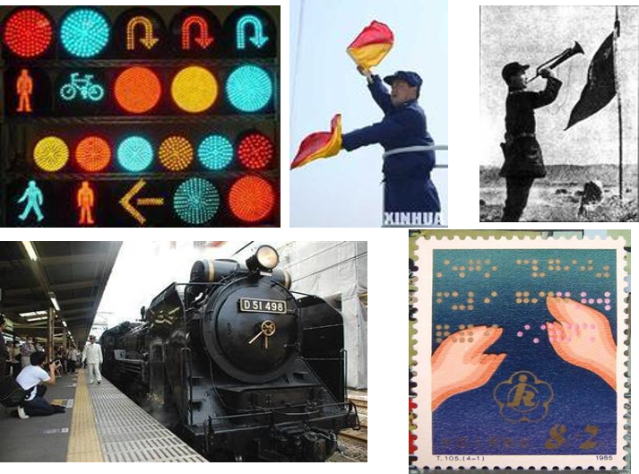
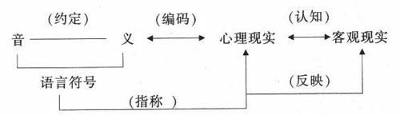
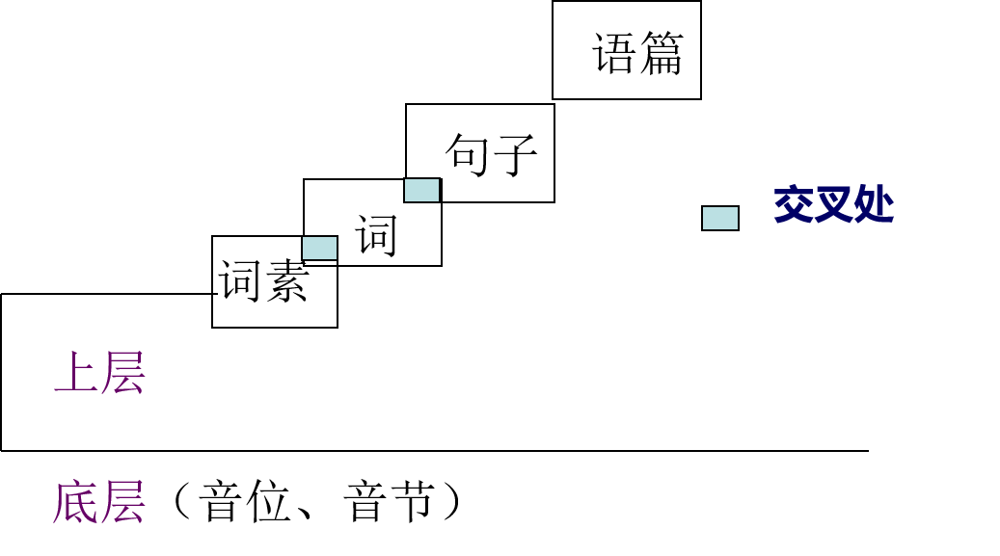
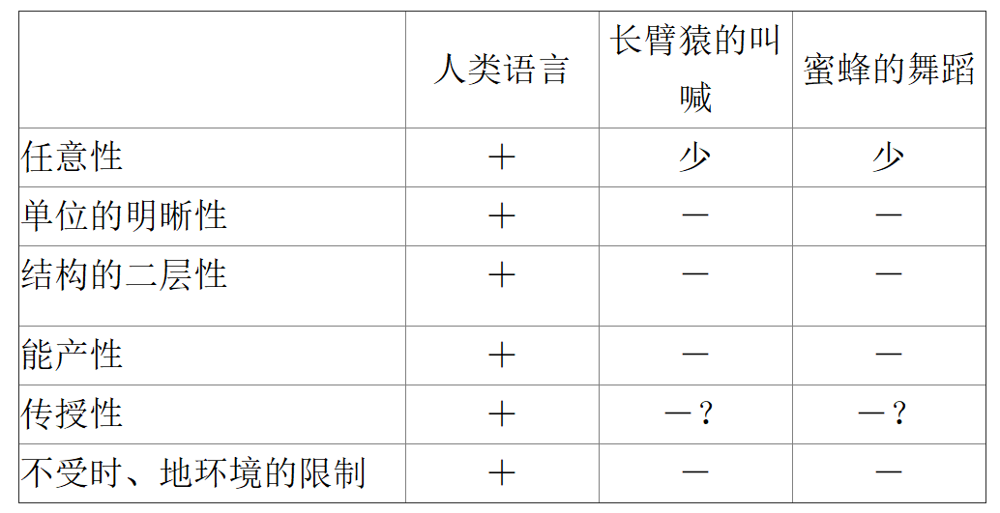

## 第二章 语言是符号系统

主讲教师：朱波

@@@
### 第一节 语言的符号性质
~~~~
#### 一、语言和说话

要探究语言本身的性质，需要透过具体的语言现象明确究竟什么是语言。
~~~~
- 看书。
- 看一本书。
- 看一本有趣的书。
- 看昨天买来的一本有趣的书。
- 看图书馆昨天买来的一本有趣的书。
- 李晓明看图书馆昨天买来的一本有趣的书。
- 李晓明喜欢看图书馆昨天买来的一本有趣的书。
- ……
~~~~
句子是由不同的词使用相同的规则组合构成的。有限的词和规则组合出无限的句子，学习语言就是掌握这套材料和规则。人在交际过程中可以自由讲话，但不能杜撰词语，违反规则，必须服从社会的语言习惯。
~~~~
语言研究就是把语言材料和规则找出来，这是非常复杂和细致的任务。
~~~~
#### 二、语言与符号
从语言内部结构特征看，语言在本质上是一种音义结合的符号系统。
~~~~
#### 符号的概念
- 符号是具体事物的标记或代号。包括：
	1. 视觉符号 
	2. 听觉符号 
	3. 触觉符号
~~~~

~~~~
语言是符号系统，概括了语言本身的性质和特点。

符号的形式和意义是不可分离的，二者的结合才构成符号，没有无意义的符号形式。
- 交通信号灯拿来照明，不再用作指示交通，就只是具体的物质材料，和普通的灯没有差别，不再是符号形式的载体，也失去了符号作用。
~~~~
#### 符号的特点
1. 符号的形式和意义都是一般性的。
- 红绿黄灯表示禁止通行、准许通行和警示。
2. 符号的形式和意义之间没有本质上的、自然属性上的必然联系。
- 符号和自然的征候（发生某种情况的迹象与征兆）不同，例如，船-水浪-通信信号灯。
~~~~
通过认知转化为主观化的信息必须有一套符号

~~~~
#### 语言符号与其他符号的区别	
1. **产生时间不同，语言符号第一性，其他符号第二性。**
	- 语言是人类社会产生中约定俗成的，其他符号是在语言符号基础上认为规定的。
2. **运用空间不同，语言符号开放性，其他符号封闭性。**
	- 语言符号则是具有巨大潜能的开放性体系，活动范围几乎是无限的。
3. **信息容量不同，语言符号多义性, 其他符号单义性。**
	- 语言符号多义性，而实物符号是单义的。同一符号可能规定和两个意义联系，但在这种情况下，我们并不认为这是一个多义符号，而是两个不同的符号。

@@@
### 第二节 语言符号的系统性
~~~~
语言在本质上是一种音义结合的符号系统。
~~~~
#### 一、语言符号的任意性和线条性

1.任意性
- 语言符号最突出的特点就是它的音义结合的任意性。
~~~~
#### 任意性等于随意性吗？
语言符号音和义的关系是任意的，但这并不意味着用什么声音表示什么意义，对使用者来说是随意的，不受制约的。事实上，语言符号具有强制性，每个人都要遵守社会的约定俗成，不能任意的改变，否则就无法交际。
~~~~
2.线条性
- 语言符号的线条性体现在具体的交际过程中。在语言交际中，不管你要表述的思想感情是简单的，还是复杂的，语言符号都只能一个一个地按次序出现，不但众多音节不可能、也无法同时共现，就是两个音节也不能同时共现。

*我→们→学→习→语→言→学*
~~~~
语言符号的线条性特征可以使离散的语言符号得以构成大大小小的音义结合体，可以使单个的语言符号组合成连续的语流。

*语→们→学→学→我→习→言*
~~~~
除此之外，语言符号还具有稳定性、可变性、生成性等特点。 

~~~~
#### 二、语言符号的层级体系
语言要素的各个单位，在语言结构中并非处在同一个平面上，而是分为不同的层和级，语言是由各个单位在不同的层和级构成的一个层次装置，这就是语言的层级关系。
~~~~

~~~~

~~~~

#### 三、组合关系和聚合关系
1. 组合关系
- 符号和符号按照一定规则组合起来的关系就是语言的组合关系。
~~~~

~~~~
2. 聚合关系
- 是语言结构某一位置上能够互相替换的具有某种相同作用的单位之间的关系，简单说就是符号与符号之间的替换关系。
~~~~

~~~~
语言的组合关系和聚合关系是语言的两种根本关系，是语言系统的纲，把握了这个纲，就基本上把握了语言系统。

~~~~
#### 语言系统的要素和基础（补充）
关于语言构成要素问题

传统语言学把**语音**、**词汇**和**语法**作为语言结构系统的三要素，而把**语义**附在词汇学中。这种观点的合理性是，语言中的意义绝大部分是由词语承载的。但问题是，不光词语有意义，词组、句子也有意义，而且有些意义是语法形式和语音形式所赋予的，所以单靠词汇来研究语义是远远不够的。
~~~~
现代语言学把**语音**、**语义**和**语法**作为语言结构系统的三要素，而把**词汇**分解到语义和语法中去。这种观点的合理性是，这样一来，所有的语言单位既有语音又有语义，还都涉及语法问题；反过来语音、语义、语法都既管词素、词组、句子，也管词和语。
~~~~
但这种观点的缺陷是：
1. 语义部分实际上管不了所有意义，如虚词的意义、结构关系意义等，只能看作是语法现象。
2. 词和语在语言中的地位举足轻重，这一点在这一理论中没有得到反映。
~~~~
综合上述两种观点，本课暂时采用一种变通方法：把**语音**、**语义**、**词汇**、**语法**都看作语言结构系统的要素。

- 语言是由词汇和语法构成的系统，在这个系统中，每个构成成分都是语音和语义的结合体。
~~~~
基本词汇和语法是语言的基础
1. 从基本词汇和语法在语言系统中的重要性看，基本词汇和语法是语言的基础。
2. 基本词汇和语法的稳定性决定了语言发展的稳定性，使语言能够成为人们千百年来共同使用的交际工具。
3. 基本词汇和语法决定着语言的基本面貌。

@@@
### 第三节 语言符号系统是人类特有的

#### 一、人类语言符号和其他动物“语言”的根本区别
- 人是社会性的。语言符号是人类社会形成和发展的必要前提。
- 很多动物群体内部都有特定的交际方式，这就是一般所谓的动物“语言”。
~~~~
人类语言符号和其他动物的交际方式的区别：

1．任意性
2. 单位的明晰性
3．结构的二层性
4．能产性
5．传授性
6．不受时、地环境的限制

~~~~

~~~~
#### 二、语言是其他动物和人类之间无法逾越的鸿沟

- 所谓动物的“语言”并不具有典型的符号特征，与人类语言相比有本质的不同。
- 语言能力是人类特有的，人类以外的动物还不具备像人类这样的语言能力。
~~~~
- 人类能够把各种智力（如感觉的能力，分析的能力，记忆的能力等）结合成一体加以利用。
- 人类的发音生理结构决定了人类有灵活发音的能力。
- 人类具有抽象思维的能力并能够和灵活发音的能力相结合，表现为人类的语言能力。

@@@
请同学们思考下列问题:
1. 为什么说语言是一种符号系统？
2. 除了任意性和线条性之外，语言符号还有哪些特点？
3. 简述语言符号和一般符号的区别。
4. 语言符号系统性表现在哪些方面？
5. 任何一种语言所包含的句子的数量是无限的，那么人类为什么能在有限的时间内掌握语言呢？
6. 为什么说组合关系是现实的，聚合关系是潜在的？
