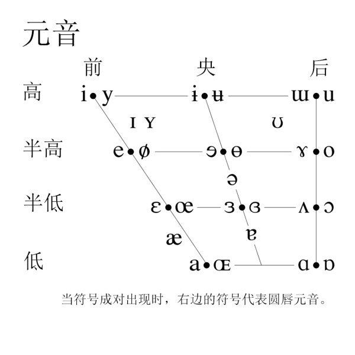

## 第三章 语音和音系

@@@
#### 什么是语音？
~~~~
语音是语言的物质外壳，是由人的发音器官发出的代表一定意义的声音。
~~~~
#### 语音与其他声音的区别：

1. 语音是人的发音器官发出的声音。
2. 语音是代表一定意义的声音，它同语义紧密地联系在一起。它有别于也是人的发音器官发出而无意义的声音，如咳嗽、喷嚏、呼噜、哈欠等。
3. 语音与其所代表的意义之间的联系是使用语言的社会全体成员约定俗成的。因此语音是一种社会现象，而语音之外的其他声音则是一种自然现象。

~~~~
### 第一节　语音和音系的区别与联系
#### 一、语音学和音系学
~~~~
1. 语音学
- 语音学是研究语音系统的科学，它研究语音成分、语音构成、语音发展演变的规律、语音理论的运用等，并训练人们学会并掌握听音、发音、辨音、记音的技术。

- 语音学研究语音的成分、语音的结构、语音的发展、演变和研究方法的一门学科。
~~~~
从使用语言进行交际的过程可以分为“发音→传递→感知”三个阶段，语音学根据这三个阶段又分为以下三个分支：
- **生理语音学**：研究发音器官在发音阶段的生理特征。
- **声学语音学**：研究语音传递阶段的声学特征。
- **感知语音学**：研究语音感知阶段的生理和心理特征。

~~~~
学术史上对语音的研究由来已久，如我国“小学”对字的形、音、义的研究，远在汉代就开始了，汉以后出现的音韵学更是专门研究语音的学科。在古印度，对语音的研究也有一些专著，不过当时的语音研究都是关于某种具体语言的语音，至于全面，深入研究人类语音，那只是近百年以来的事情。
~~~~
实验语音学大致经历了三个发展阶段

（20世纪40年代以前）以生理实验研究为主。
（20世纪40年代—60年代）以声学实验研究为主。
（20世纪70年代—现在）语音的全面实验研究。

~~~~
实验语音学的作用
1. 验证和补充了传统语音学的研究成果。
2. 解决了传统语音学的一些疑难问题。
3. 揭示了传统语音学无法发现的语音现象。

~~~~
语音学的分类
~~~~
根据研究对象的不同，语音学可分为：
**普通语音学**研究人类语言的语音的总的特征。如罗常培、王均的《普通语音学纲要》，语言学概论中的语音部分也属这类。又叫一般语音学。
**个别语音学**研究某一具体语言语音系统的学科，又叫专语语音学,如汉语语音学。
~~~~
根据**研究方法**的不同，语音学可分为：
- **共时语音学**　研究某一时期语言语音系统的学科，又叫静态语音学、描写语音学,如现代汉语语音学。
- **历时语音学**研究语音历史演变及其发展规律的学科，又叫历史语音学。
- **比较语音学**用比较的方法研究两种或几种有亲属关系语言的语音异同和对应规律，或对一种语言不同时期的语音进行研究。
~~~~
语音学的分类
~~~~
- **应用语音学**研究语音在各个领域中的实际应用的学科。这是一个总称，其中包括光学语音学、病理语音学、军事语音学等。这门学科又分为广义、狭义两种。狭义应用语音学专指把语音理论应用于语音教学；广义应用语音学泛指把语音研究的成果应用于各个部门，解决其他学科提出的有关问题。
- **实验语音学**使用仪器和电子设备进行语音实验研究的一门学科，又叫仪器语音学。
~~~~
实验语音学是近三四十年来获得迅速发展的国际上的热门学科，也是语言学领域中与其他学科横向联系最多的一门学科，其研究手段和研究方法也是广泛多样的，是一门综合性的边缘学科。
~~~~
实验语音学是通过物理声学实验、生理实验和心理实验等方法来研究语音的发音、传送、听觉感受等等。 
~~~~
语音学的功用
1. 理论意义
2. 实用价值
~~~~
- 理论意义
1. 语音研究是语言学的重要组成部分
2. 语音学是研究汉语音韵学的必要工具
3. 语音学在确定语言的亲属关系上，在语源学和语言史的研究上，也有重要意义。
~~~~
- 实用价值
1. 语音学是从事方言研究的重要工具
2. 有利于汉语普通话的推广
3. 可以帮助学习外语
4. 有助于其他学科的研究

~~~~
#### 音系学
- 音位学是从语言社会功能的角度，研究语音的辨义功能和语音系统，也叫音系学。 
~~~~
#### 音系学和语音学既各自独立又相互交叉
~~~~
音系学和语音学的区别：
- 音系学研究语音在语言系统中的组织方式，属于语言学的核心部分；语音学研究语音自身的自然属性或听觉反映，与语言学的核心部分是间接联系。
~~~~
音系学和语音学的联系：
- 音系学研究的就是有自然属性的语音在语言系统中的作用，需要了解语音的自然属性；
- 语音学研究的是语言中的声音和发出语言时的肌体动作，在研究中必然关注语音自然属性在语言系统中的作用。

~~~~
#### 二、语音和音系的最小线性单位——音素与音位
~~~~
- 音节是语音结构的基本单位，是听觉上自然感到的最小的语音单位。
- 比如，社会（shè huì），俄语общество，法语société，英语society。
- 但音节还不是线性音流的最小单位。
~~~~
- 例如汉语的“大”（dà）和“杜”（dù）中，辅音均为d,不考虑声调的话，a,u是最小的语音片段。
- 语音学（研究语音的自然属性和人类语音共性）称其为“音素”
- 音系学（研究语音的社会属性和语音在具体语言中的作用）称其为“音位”
- 音节都是这些最小线性单位按照一定的结构规则组合而成。
~~~~
- 音素是从音质的角度切分出来的最小的语音单位。（音质一种声音区别于其他声音的个性或特征。）
~~~~
- 音素和字母不同：
1. 字母是书写的最小单位，音素是语音的最小的单位。
2. 一个音素可以用一个字母表示，也可以用几个字母表示。[i:]-ee  ea
3. 一个字母可以表示几个音素 。c-[k]/car,alice[s] 
~~~~
音位是一种语言或方言中能区别意义的最小的语音单位。
~~~~
音位和音素不同：
1. 划分的角度不同;
2. 两者作用不同;
3. 音素和音位不是一一对应的（一个音位可以在不同地方中发出不同的音素）。 
~~~~
- 音位phoneme，指的是人类某一种语言中能够区别意义的最小语音单位。一个音位可以有数种不同的发音，但是语言使用者心理上认定这几种发音是等同的。音位用宽式音标表示，国际音标外加//，不记录音位变体或其他非本质的伴随现象。

- 音素phone，是语音中的最小的单位。音素用严式音标表示，国际音标外加[ ]。在国际音标里一个音素对应一个符号。
~~~~
#### 普通话音位/a/的主要音位变体及其出现的条件
- 音位/a/出现在a、ia、ua里读音素[A]，出现在无韵尾的音节；如音节他ta中的a就是出现在无韵尾的音节中，为音位变体[A]。；
- 音位/a/出现在ai、uai、an、uan里读音素[a]，出现在韵尾[-i]或[-n]之前；如爱ài和含hán中的就是这一音位变体的具体运用和体现。；
- 音位/a/出现在ian里读音素[ε]，出现在韵头[i-]或[-n]之间。如音节天tian中的a；
- 音位/a/出现在ao、iao、ang、iang、uang里读音素[ɑ]，出现在韵尾或之前；音节唐tang和套tao中的a就是这一音位变体。
~~~~

~~~~
#### 三、国际音标
~~~~
国际音标是目前国际上最为通行的一种音标。它是国际语音学会（最初叫语音学教师协会）于1888年8月公布并开始使用，后来经过多次增补、修订，最近的一次修订是在2005年。
~~~~
- 汉语的注音
1. 直音（根，读如跟）
2. 反切（东，德红切）
3. 注音符号（山，ㄕㄢ）

@@@
第二节　从声学看语音
#### 一、语音四要素
#### 二、音质的声学分析
#### 三、声学分析的仪器和软件

### 第三节　从发音生理看语音

#### 一、发音器官
#### 二、两类音素：元音和辅音
#### 三、元音
#### 四、辅音

### 第四节　音位与音系

#### 一、对立和互补
#### 二、音位和音位变体
#### 三、音质音位和非音质音位

### 第五节　音位的聚合

#### 一、区别特征
#### 二、音位聚合群

### 第六节　语音单位的组合

#### 一、音节
#### 二、语流音变
#### 三、韵律层级