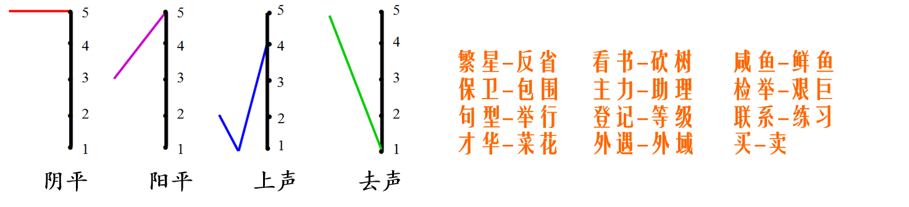

## 第三章 语音和音系

@@@
#### 什么是语音？
~~~~
语音是语言的物质外壳，是由人的发音器官发出的代表一定意义的声音。
~~~~
#### 语音与其他声音的区别：

1. 语音是人的发音器官发出的声音。
2. 语音是代表一定意义的声音，它同语义紧密地联系在一起。它有别于也是人的发音器官发出而无意义的声音，如咳嗽、喷嚏、呼噜、哈欠等。
3. 语音与其所代表的意义之间的联系是使用语言的社会全体成员约定俗成的。因此语音是一种社会现象，而语音之外的其他声音则是一种自然现象。
@@@
### 第一节　语音和音系的区别与联系
~~~~
#### 一、语音学和音系学
~~~~
1. 语音学
- 语音学是研究**语音系统**的科学，它研究语音成分、语音构成、语音发展演变的规律、语音理论的运用等，并训练人们学会并掌握听音、发音、辨音、记音的技术。

- 语音学研究语音的成分、语音的结构、语音的发展、演变和研究方法的一门学科。
~~~~
从使用语言交际的过程可分为“发音→传递→感知”三个阶段，语音学根据这三个阶段又分为以下三个分支：
- **生理语音学**：研究发音器官在发音阶段的生理特征。
- **声学语音学**：研究语音传递阶段的声学特征。
- **感知语音学**：研究语音感知阶段的生理和心理特征。

~~~~
学术史上对语音的研究由来已久，如我国“小学”对字的形、音、义的研究，远在汉代就开始了，汉以后出现的音韵学更是专门研究语音的学科。在古印度，对语音的研究也有一些专著，不过当时的语音研究都是关于某种具体语言的语音，至于全面，深入研究人类语音，那只是近百年以来的事情。
~~~~
实验语音学大致经历了三个发展阶段

（20世纪40年代以前）以生理实验研究为主。
（20世纪40年代—60年代）以声学实验研究为主。
（20世纪70年代—现在）语音的全面实验研究。

~~~~
实验语音学的作用
1. 验证和补充了传统语音学的研究成果。
2. 解决了传统语音学的一些疑难问题。
3. 揭示了传统语音学无法发现的语音现象。

~~~~
语音学的分类
~~~~
根据研究对象的不同，语音学可分为：
**普通语音学**研究人类语言的语音的总的特征。如罗常培、王均的《普通语音学纲要》，语言学概论中的语音部分也属这类。又叫一般语音学。
**个别语音学**研究某一具体语言语音系统的学科，又叫专语语音学,如汉语语音学。
~~~~
根据**研究方法**的不同，语音学可分为：
- **共时语音学**　研究某一时期语言语音系统的学科，又叫静态语音学、描写语音学,如现代汉语语音学。
- **历时语音学**研究语音历史演变及其发展规律的学科，又叫历史语音学。
- **比较语音学**用比较的方法研究两种或几种有亲属关系语言的语音异同和对应规律，或对一种语言不同时期的语音进行研究。
~~~~

- **应用语音学**研究语音在各个领域中的实际应用的学科。这是一个总称，其中包括光学语音学、病理语音学、军事语音学等。这门学科又分为广义、狭义两种。狭义应用语音学专指把语音理论应用于语音教学；广义应用语音学泛指把语音研究的成果应用于各个部门，解决其他学科提出的有关问题。
- **实验语音学**使用仪器和电子设备进行语音实验研究的一门学科，又叫仪器语音学。
~~~~
实验语音学是近三四十年来获得迅速发展的国际上的热门学科，也是语言学领域中与其他学科横向联系最多的一门学科，其研究手段和研究方法也是广泛多样的，是一门综合性的边缘学科。
~~~~
实验语音学是通过物理声学实验、生理实验和心理实验等方法来研究语音的发音、传送、听觉感受等等。 
~~~~
语音学的功用
1. 理论意义
2. 实用价值
~~~~
##### 理论意义

1. 语音研究是语言学的重要组成部分
2. 语音学是研究汉语音韵学的必要工具
3. 语音学在确定语言的亲属关系上，在语源学和语言史的研究上，也有重要意义。
~~~~
##### 实用价值

1. 语音学是从事方言研究的重要工具
2. 有利于汉语普通话的推广
3. 可以帮助学习外语
4. 有助于其他学科的研究
~~~~
#### 2.音系学
- 音系学是从语言社会功能的角度，研究语音的辨义功能和语音系统，也叫音位学。 

~~~~
音系学和语音学的区别：
- 音系学研究语音在语言系统中的组织方式，属于语言学的核心部分；
- 语音学研究语音自身的自然属性或听觉反映，与语言学的核心部分是间接联系。
~~~~
音系学和语音学的联系：
- 音系学研究的就是有自然属性的语音在语言系统中的作用，需要了解语音的自然属性；
- 语音学研究的是语言中的声音和发出语言时的肌体动作，在研究中必然关注语音自然属性在语言系统中的作用。
~~~~
#### 音系学和语音学既各自独立又相互交叉

~~~~
#### 二、语音和音系的最小线性单位——音素与音位
~~~~
1. 音素
- **音素**是从音质的角度切分出来的最小的语音单位。（音质一种声音区别于其他声音的个性或特征。）
~~~~
- 音节是语音结构的基本单位，是听觉上自然感到的最小的语音单位。
- 比如，社会（shè huì），俄语общество，法语société，英语society。
- 但音节还不是线性音流的最小单位。
~~~~
- 例如汉语的“大”（dà）和“杜”（dù）中，辅音均为d,不考虑声调的话，a,u是最小的语音片段。
- 语音学（研究语音的自然属性和人类语音共性）称其为“音素”
- 音系学（研究语音的社会属性和语音在具体语言中的作用）称其为“音位”
- 音节都是这些最小线性单位按照一定的结构规则组合而成。

~~~~
- 音素和字母不同：
1. 字母是书写的最小单位，音素是语音的最小的单位。
2. 一个音素可以用一个字母表示，也可以用几个字母表示。[i:]-ee  ea
3. 一个字母可以表示几个音素 。c-[k][s],car[k],alice[s] 
~~~~
音位是一种语言或方言中能区别意义的最小的语音单位。
~~~~
音位和音素不同：
1. 划分的角度不同;
2. 两者作用不同;
3. 音素和音位不是一一对应的（一个音位可以在不同地方中发出不同的音素）。 
~~~~
- 音位phoneme，指的是人类某一种语言中能够区别意义的最小语音单位。一个音位可以有数种不同的发音，但是语言使用者心理上认定这几种发音是等同的。音位用宽式音标表示，国际音标外加//，不记录音位变体或其他非本质的伴随现象。

- 音素phone，是语音中的最小的单位。音素用严式音标表示，国际音标外加[ ]。在国际音标里一个音素对应一个符号。
~~~~
#### 普通话音位/a/的主要音位变体及其出现的条件
- 音位/a/出现在a、ia、ua里读音素[A]，出现在无韵尾的音节；如音节他ta中的a就是出现在无韵尾的音节中，为音位变体[A]。；
- 音位/a/出现在ai、uai、an、uan里读音素[a]，出现在韵尾[-i]或[-n]之前；如爱ài和含hán中的就是这一音位变体的具体运用和体现。；
- 音位/a/出现在ian里读音素[ε]，出现在韵头[i-]或[-n]之间。如音节天tian中的a；
- 音位/a/出现在ao、iao、ang、iang、uang里读音素[ɑ]，出现在韵尾或之前；音节唐tang和套tao中的a就是这一音位变体。
~~~~

~~~~

#### 三、国际音标(IPA)

- 记录音素的标写符号叫做音标。
- 国际音标是目前国际上最为通行的一种音标。它是国际语音学会（最初叫语音学教师协会）于1888年8月公布并开始使用，后来经过多次增补、修订，最近的一次修订是在2005年。
~~~~
[国际音标](http://www.yorku.ca/earmstro/ipa/)的制定原则:一个音素只用一个[符号](http://westonruter.github.io/ipa-chart/keyboard/)代表，一个符号只代表一个音素。
~~~~
国际音标的优点：
1. 标音准确：音素与字母一一对应，避免了混淆和两可的现象。
2. 形体简单清晰：使用国际通用的拉丁字母小写印刷体为基础字母。
3. 符号完备，允许用其他方式补充。
4. 通行范围广。 
~~~~
##### 国际音标符号类型示例
- 两个拉丁字母合在一起成为一个符号。如:［æ］［œ］
- 用小写尺寸的大写字母。如:［E］［A］
- 把某些字母倒过来。如:［ɹ］[ɐ]
- 用草写体。如:［α］［x］
- 借用希腊字母。如:［β］［ө］［ø］
- 改造字母原型。如:［ŋ］［Ȿ］
- 另选新符号。如:［ɰ］［ʛ］
- 在原来符号上再添小符号。如:［b̰］［ã］
~~~~
##### 学习和使用国际音标注音时应注意以下几个问题： 
1. 宽式标音和严式标音 
2. 音标与字母的区别
3. 区分形体近似的音标 
4. 准确使用附加符号 

~~~~
1. 使用国际音标有宽式和严式两种形式：
- 宽式标音是一种不注意发音的细微特征和差别的、相对概括的标音方法，宽式标音位。
- 严式标音是一种精确详尽地反映发音的细微特征和差别的标音方法，严式标音素；

搬来高塔

/pan lai kau tʼa/

[pan lai kɑu tʼA]
~~~~
宽式标音法一般把音标放在//里，严式标音法一般放在[ ]里。在采用国际音标标音的语言学文献里，一般不必加双斜线或方括号，只需注明采用宽式还是严式标音法即可。 
~~~~
2. 音标与字母的区别 
国际音标没有大小写之分，也没有手写体和印刷体的区别，它同时采用拉丁字母中某些有显著差别的大写和小写形式作为不同的音标，但都要写成同样大小，即**大写字母要用小写尺寸**[A]-[a]、[G]-[g]、[R]-[r]等。
~~~~
3. 区分形体近似的音标
- [s]-[ʃ]：前者借自拉丁字母s，后者是s的拉长形式；
- [z]-[ʐ]-[ʑ]：第一个来自拉丁字母的z，第二个在z的右下角加钩，第三个是写完z后，回头绕一个小圈儿。  
~~~~
4.准确使用附加符号 
- 音标右上角“h”或“‘”：送气符号
- 音标下方“w”：园唇符号 
- 音标上方 “～”：鼻化符号
- 音标下方“。”：清化符号
- 音标右上角 “ˈ”：重音符号
- 音标右下角 “ˌ”：次重音符号
~~~~
##### 汉语的注音

1. 直音（根，读如跟）
2. 反切（东，德红切）
3. 注音符号（山，ㄕㄢ）
~~~~
#### 小结
1. 语音
2. 音系学和语音学
3. 音系和音位
4. 国际音标
@@@

### 第二节　从声学看语音
~~~~
#### 一、语音四要素

1. 音高
2. 音强
3. 音长
4. 音质
~~~~
**音高**声音的高低，它决定于音波的频率。

~~~~
   

~~~~

**音强**：声音的强弱，它决定于音波的振幅。

~~~~

**音长**：声音的长短，它决定于发音持续时间的长短。

~~~~
- seat［si:t］（座位）/sit［sit］（坐）
- おばさん［obαsaŋ］（伯母、婶母）/おばあさん［obααsaŋ］（祖母、外祖母）
- “街”［ka:i］/“鸡” ［kai:］
~~~~
**音质**：一种声音区别于其他声音的个性或特征。

~~~~

#### 二、音质的声学分析
~~~~
##### 形成不同音质的因素：
1. 发音体不同
2. 发音方法不同
3. 共鸣器的形状不同
~~~~
声音是由发音体发出的一系列振动复合而成的。这些振动中有一个频率最低的振动，由它发出的声音叫做基音。其他振动发出的声音叫陪音。由于陪音不同，基音与陪音的比例关系不同，即振动的形式不同，就形成了不同的音质。
~~~~
##### 声音可以分成两大类：
1. 乐音是由有规则的音波构成的。
2. 噪音是由许多不规则的音波凑合而成的声音。 

~~~~
- 语音的音质一般分为元音音质和辅音音质两大类。
- 语音中的元音是乐音，清辅音完全是噪音，浊辅音是混合音。

~~~~
#### 三、声学分析的仪器和软件
~~~~
[Praat](https://www.fon.hum.uva.nl/praat/):doing phonetics by computer
~~~~

~~~~

~~~~

~~~~

@@@
### 第三节　从发音生理看语音
~~~~
#### 一、发音器官
~~~~
- 发音器官分三大部分:
1. 动力（肺、支气管、气管组成）
2. 发音体（声带、喉头）
3. 共鸣腔（口腔、鼻腔、咽腔）
~~~~
动力区（动力器官）——由肺、支气管、气管组成。

~~~~
声源区 （发声器官）——由喉头和声带组成

~~~~
声带

~~~~
调音区 （共鸣器官）——由咽腔、鼻腔、口腔组成

~~~~

#### 二、两类音素：元音和辅音
- 发音时气流振动声带，在口腔或咽腔不受阻碍而形成的音素叫元音；
- 发音时气流在口腔或咽腔受到阻碍而形成的音素叫辅音。
~~~~
元音和辅音的区别：

| \ | 元音 | 辅音 |
| :-----:| :----: | :----: |
| 气流有无阻碍 | 无 | 有 |
| 发音器官紧张情况 | 均衡紧张 | 阻碍部位紧张 |
| 气流的强弱| 弱 | 强 |
| 声带振动情况| 全振动 | 浊辅音振动 |
| 响度大小| 大 | 小 |
~~~~
#### 三、元音
- 元音的分类
	- 分类要有依据，请同学们思考一下，元音分类的依据是什么？

元音——音素——音质
~~~~
形成音质不同的三个条件是什么？
~~~~
1. 发音体不同
	- 所有的元音发音体都是声带。
2. 发音方法不同
	- 所有的元音发音方法都是振动声带。
3. 共鸣器形状不同
~~~~
元音发音过程中的共鸣器形状主要表现在以下三个方面：
1. 舌位高低的变化或开口度大小的变化
2. 舌位前后的变化
3. 唇形的圆展
~~~~

~~~~
##### 1.舌面元音
发元音时，舌头收紧而隆起的最高点（即舌位）出现在舌面上，这种音叫舌面元音。
~~~~

~~~~
##### 2.舌尖元音和卷舌元音
1. 舌尖前元音:发音时，舌尖前伸上抬，接近上齿龈前部，声带振动。舌尖前元音[ɿ](不圆唇) [ʮ](圆唇)，例如，普通话“资”[tsɿ],宁波话“书”[sʮ]
2. 舌尖后元音:发音时，舌尖后翘，靠近硬腭前部，振动声带。例如[ʅ]不圆唇[ʯ]圆唇，例如，普通话“只”[tsʅ],湖北麻城话“鱼”[ʯ]
3. 卷舌元音：发音时舌尖向硬腭方向翘起，舌面和舌尖同时起作用，卷舌元音[-r]。卷舌元音主要用于儿化，例如“花儿”[xuɑr]

~~~~
##### 3.元音的变异
1. 鼻化元音
2. 长短元音
3. 松紧元音
4. 清化元音
~~~~
- **鼻化元音**：发元音时如果软腭下垂，气流同时从口腔鼻腔流出，口腔鼻腔同时共鸣，这样发出的音就是鼻化元音。其标音方法式在口元音上面加“˜”一般说来，所有口元音都可以鼻化，不过，实际上各种语言中鼻化元音的有无和多少是不同的。拉萨话中较多，汉语、英语中没有。
~~~~
由于元音鼻化程度是不同的，所以鼻化元音又可以分为纯鼻化元音和半鼻化元音两种。纯鼻化元音发音一开始软腭就下垂，气流同时从口腔鼻腔流出，鼻化完全融于整个元音里。半鼻化元音发音开始时软腭仍堵住鼻腔通路，到发音一半时才垂下，打开鼻腔通路，末尾还留有鼻音的痕迹。
~~~~
- **长短元音**：按照发音时间的长短分，有短元音和长元音两类。英语、日语中有。长元音用：表示。
~~~~
- **松紧元音**：根据喉头紧张与否，可以区分松紧元音。发音时器官始终保持均衡状态叫松元音；发音时如果喉头肌肉紧缩，气流也较强叫紧元音。紧元音国际音标没有表示的符号，我国一般在元音下加短横“\_”。哈尼语等有松紧对立的元音；汉语没有松紧元音对立。
~~~~
- **清化元音**：发元音时声带振动，如果只做元音口型，而声带不振动就形成清化元音，清化元音的表示是在元音下加“。”，维吾尔语有清化元音。
~~~~
#### 四、辅音
~~~~
- 辅音是气流在一个或几个部位受阻而发出的音。
- 它的发音过程有成阻、持阻、除阻三个阶段。
~~~~
- **成阻**：发音器官从静止状态进入为某个辅音而形成的某种阻碍状态。如发舌尖中音[t]时软腭上升，舌尖抵住上齿龈。
- **持阻**：发音器官保持成阻的状态。
- **除阻**：发音器官解除阻碍，恢复到原来的静止状态，如发舌尖中音[t]时，舌尖离开上齿龈。

~~~~
##### 1.根据发音部位分类
按照辅音形成阻碍的部位，可以分成十三类:

1. 双唇音:上下唇形成阻碍，如[p] [p'] [m] [ɸ]
2. 唇齿音:下唇上齿形成阻碍，如[f] [v] [ɱ]
3. 齿间音:舌尖和上下齿之间形成阻碍，如[θ] [ð] 
4. 舌尖齿背音:舌尖和上齿背形成阻碍，如[s] [z] [ts] [ts']
~~~~
5. 舌尖齿龈音:舌尖和上齿龈形成阻碍，如[t] [t'] [n] [l]
6. 舌尖硬腭音:舌尖和硬腭形成阻碍, 如[tʂ] [tʂ'] [ʂ] [ʐ]
7. 舌叶前腭音:舌叶和硬腭形成阻碍, 嘴唇略向前突，如 [ʃ] [ʒ]
8. 舌面前腭音:舌面前部贴近硬腭形成阻碍，如[tɕ] [tɕ'] [ɕ]
~~~~
9. 舌面中腭音:舌面中部贴近小舌形成阻碍，如[j]
10. 舌面后腭音（舌根音）:舌根靠近软腭形成阻碍，如[k] [k'] [x]
11. 小舌音:舌面后部靠近小舌形成阻碍，如[R] [q]
12. 喉壁音:舌根与喉壁形成阻碍，如[ħ] 
~~~~
13. 喉音: 喉下部靠近声门处紧缩，然后突然放开或声门留一狭小通道让气流擦过，就形成喉音，如[
ʔ] [h]
~~~~
2.根据发音方法分类
- 根据形成阻碍和克服阻碍的方式
- 根据发音时声带颤动与否
- 根据气流的强弱
~~~~
- 根据形成阻碍和克服阻碍的方式——阻塞音
1. 塞音：发音时软腭上升，堵住鼻腔通路，发音器官两个部位闭合，然后突然打开，让气流爆发冲出，发出声音。[p] [t] 
2. 擦音:发音时软腭上升，堵住鼻腔通路，发音器官两个部位靠近，留下缝隙，气流从缝隙中挤出，摩擦成声。[f] [v] [s] [z]
3. 塞擦音:先塞后擦,发音部位再形成阻碍是完全闭合，除阻时形成缝隙，气流从缝隙中挤出，摩擦成声。    [ts]  [ts']  [tɕ] 
~~~~
- 根据形成阻碍和克服阻碍的方式——响音
1. 鼻音：发音时发音部位完全闭合，软腭下降，打开鼻腔通路，气流从鼻腔流出，震动声带。[m] [n]  [ŋ]
2. 颤音：发音时气流忽塞忽通，舌尖或小舌连续颤动多次。 [r]舌尖颤音[R]小舌颤音
3. 闪音：发音原理与颤音相同，只是迅速轻轻颤动一下即止。如英语中very中的 [ɾ]
4. 边音：发音时舌尖与上齿龈或硬腭接触，在口腔中部或一边形成阻碍，然后气流从舌头两边或一边缝隙流出，发出声音。[l]
5. 边擦音：发边音时具有摩擦成分。[ɫ]
6. 半元音：发音时声带震动，开口度略大于擦音，阻碍很小，气流通过时只有极轻微的摩擦，是介于高元音和辅音之间的一种音。如英语中walk中的[w]
~~~~
- 根据发音时声带颤动与否
1. 清音 :发音时声带不震动，透出的气流不带音。[f] [s] [k] [p]
2. 浊音 :发音时声带震动，透出的气流带音。[v] [z] [ɡ] [b]
~~~~
- 根据气流的强弱
1. 送气音:塞音、塞擦音除阻时外出气流较强。[p'] [t'] [k'] [ts'] [tʂ'] [tɕ']
2. 不送气音：塞音、塞擦音除阻时外出气流较弱。
   [p] [t] [k] [ts] [tɕ] 
~~~~

###### 辅音音质的异化
1. 辅音音质的异化
2. 唇化辅音
3. 齿化辅音
4. 清化辅音
5. 浊化辅音
6. 紧喉化辅音
7. 吸气音
~~~~
- **腭化辅音**
 发辅音时，舌面同时向硬腭靠近，接触面较宽，这样发出的辅音叫腭化辅音，又称软音。通常在这个辅音音标的左边加一个“j”或在音标右下角加“J”来表示．不发生腭化的辅音又叫作非腭化音，又称硬音。辅音的腭化常常可以使音质发生变化。俄语中有软音和硬音的区别。
~~~~
- **唇化辅音**
发辅音时双唇拢圆，又叫圆唇辅音。通常在辅音音标的右边或下边加“w”表示。我国一些少数民族语言如桐语、壮语、傣语等有。
~~~~
- **齿化辅音**
发辅音时把舌尖向上齿靠拢，一般在音标下边加n来表示，如［t］［n］。
~~~~
- **浊化辅音**
清辅音在某种条件下发音时声带振动，叫浊化辅音。在音标下“.”。如北京话［kɣkɣ］（哥哥）。
~~~~
- **紧喉化辅音**
发辅音时，喉头肌肉特别紧张，叫紧喉化辅音，又叫紧辅音。在音标右上角加 ’表示，朝鲜语有松紧辅音的对立。
~~~~
- **紧喉化辅音**
发辅音时，喉头肌肉特别紧张，叫紧喉化辅音，又叫紧辅音。在音标右上角加 ’表示，朝鲜语有松紧辅音的对立。
~~~~
- **吸气音**
以吸入气流为动力的辅音，即吸气音，有如下几类：
1. 搭嘴音
2. 缩气音
3. 挤喉音
~~~~
#### 请同学们思考下列问题
1. 什么叫元音、辅音？其主要差异有哪些？
2. 元音可以根据什么再分类？你能否用层次来表示其类别？
3. 画出舌位图，在图上标记八个基本元音。
4. 辅音可以根据什么分类？
5. 根据辅音成阻和除阻的方式，可将辅音分成几类，简单描述各类辅音的发音特点。
6. 举例说出根据发音部位所分出的十三类辅音的名称。

@@@
### 第四节　音位与音系
~~~~

#### 一、对立和互补

语音的物理属性和生理属性合起来称为语音的自然属性。两部分都以最小的线性语音单位——音素作为考察对象。同样一个音素在不同语言中所起的作用却可以很不一样。
~~~~
例如不送气的[p]和送气的[p']在“标”和“飘”中，汉语母语者就可以听出它们是两个不同的词。
~~~~
两个音素在周围的音都相同的环境下独立承担区别词的语音形式的作用，叫做“对立关系”
~~~~
在英语里，[p]只出现在[s]的后面，[p']只出现在词的开头和其他位置，比方sport的p发成[p]，port的p发成[p']。如果你把它们换一下，别人只会感到你发音不地道，却知道你说的是什么，不会引起混淆。在英语里，[p]出现的位置不会出现[p']，[p']出现的位置不会出现[p]，它们的出现环境互相补充，这叫做“互补关系”
~~~~
对立与互补关系是音素音质上差别的两种性质。
~~~~
#### 二、音位和音位变体
~~~~
音位是一种语言或方言中能区别意义的最小的语音单位。
例如：[a][ɑ]在汉语中不区别意义。在法语中区别意义patte［pat］(爪子） pâte[pɑt]（浆糊）
~~~~
1. 音位是能区别意义的语音单位。
2. 音位是最小的语音单位。
3. 音位总是属于某种特定的语言或方言的。

~~~~
#### 三、音质音位和非音质音位
@@@
### 第五节　音位的聚合
~~~~
#### 一、区别特征
~~~~
#### 二、音位聚合群
@@@
### 第六节　语音单位的组合
~~~~
#### 一、音节
~~~~
#### 二、语流音变
~~~~
#### 三、韵律层级
