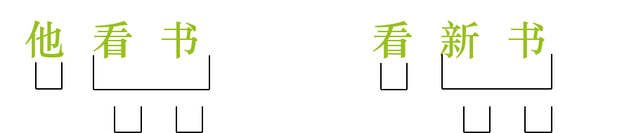
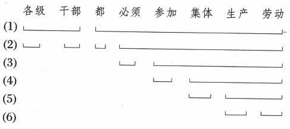

## 第四章 语法
~~~~
什么是语法?
~~~~
1. 张三找李四。
1. 李四找张三。
1. 张三找的李四。
1. 张三找李四的。
~~~~
语法：语言的结构规则，语言中由小的音义结合体构成大的音义结合体所依据的规则。
~~~~
- 词法和句法的关系
- 语法的性质
- 语法学和语法体系
- 语法学的分类
- 语法现象的分类
~~~~

词法和句法的关系

1. 词总是以确定的语法上的形式进入句子。例如，I/me,do/does/did/done
2. 词成句的某些特点决定于词法。例如,interesting book/ something interesting
3. 词法和句法互相补充。
~~~~

语法的性质

1. 抽象性
1. 生成性
1. 稳定性
1. 民族性
~~~~
抽象性

1. 任何一条语法规则都是从大量的语言现象中概括归纳而来的。
2. 具体的词、词组、句子是无限的，而语法规则是有限的。人们正是依赖这有限的、抽象的规则去驾驭无限的语言事实。
3. 语法中的意义也是高度抽象的。
~~~~
生成性

语法提供的是各种组合规则，在不改变组合的前提下，适当替换不同聚合中的成分，可以生成无数新的言语作品。
~~~~
稳定性

1. 语法的抽象性决定了语法的稳固性。
2. 语法与人的社会生活没有直接联系。
3. 语言作为交际工具要求语法相对地稳定。
~~~~
民族性

语法的民族性表现的是不同语言之间在语法上的区别性特征，是和语言的共性相对的。 
~~~~
语法学和语法体系
~~~~
语法学
- 语法学是研究语言结构规则的科学。
- 核心任务：词素构词，词构成词组，词和词组构句的规则。
~~~~
语法学的分类

1. 内部分类：词法学+句法学
2. 外部分类：
  - 普通语法学与个别语法学
  - 共时语法学与历时语法学
  - 理论语法与教学语法
~~~~
语法体系
- 客观的语法体系：任何语法结构中的组成要素相互联系、相互制约、互相依存，形成严整、规律的体系。
- 主观的语法体系：语法研究者对客观语法体系的表述体系；语法学说。
~~~~
语法现象分类

- 语法现象分类根据研究的需要，从不同角度对语法现象进行切分。
~~~~
语法现象分类

1. 词法和句法，这是传统语法学提出的一种切分方法。
- 词法，也叫形态学，主要研究词的形态特征和变化规则。
- 句法，也叫句法学，主要研究句子成分和句子类型。
~~~~
语法现象分类

2. 组合规则和聚合规则，这是结构主义语法学提出的一种切分方法。
- 组合规则是指语法成分相互组合搭配的规则。
- 聚合规则指的是在语言链的某一个环节上的语法成分相互替换的规则。
~~~~
语法现象分类

3. 核心语法和外围语法，这是现代形式语法学提出的一种切分方法。
- 核心语法指的是句法结构规则。又叫小语法。
- 外围语法指的是同语法相关的词语知识、语音和语义知识。又叫大语法。

@@@
### 第一节　语法和语法单位
~~~~
#### 一、语言结构是有规则的

语法由词法、句法两部分构成。
~~~~
- 词法指词的构成和变化的规则。词法的研究对象是词和比词小的语法单位。
- 句法指组词成句的规则，包括词组的构成、句子的构成、句子成分和句子类型等内容。句法的研究对象是词组和句子。
~~~~
#### 二、语法的组合规则和聚合规则

- 组合规则：语法单位相互连接起来构成更大的语言片断的规则叫做语法组合规则。

- 例如“我写字”“他开车”“小王打扫屋子”
~~~~
- 聚合规则：语法上能够出现在相同句法位置上的词形成一个聚合，如果用来替换的不是从这个聚合里选出的词，句子也不能成立。

- 例如“我买书”，“买”的位置换上“花儿”，“书”的位置上换上“低”句子不通。
~~~~
### 三、语法单位

语法单位分为四级，即语素、词、词组和句子。
~~~~
- 语素：语言中最小的音义结合体，构词材料。例如，民，伟，er/大 小 teach
~~~~
- 不同语言中，语素和语音单位的关联差异大。汉语基本是一个语素，只有少数例外“玻璃”“葡萄”，英语中book是一个音节，student两个音节，teacher中的er和books中的s不是一个音节。
~~~~
- 词：最小的能独立运用的音义结合体。
- 例如，好、蜻蜓、粮食、桌子、好、good
- 从上海中的“从”？
~~~~
- 词由一个或多个语素组成。
- 判定一个成分是否是词，取决于它是否是造句时自由运用的最小单位，而不在于它含有几个语素。
- 判定一个成分是否是词，看词的内部不能插入别的成分。例如，大衣、新大衣
- 从意义和作用看，词可以分为实词和虚词两大类，虚词是意义比较虚的词，它能帮助造句，但一般不能单说，不能作句子的主要成分。
~~~~
- 词组：是词的组合，比词大比句小的音义结合体。 
- 例如，高校学生，teach English
~~~~
- 词组由词构成，而词组和词组也可以构成新的词组。
- 句子里的词组必须属于句子的一个分段，跨段的词不能组成词组。
例如：“英语专业的新同学都学过英语”，可以被分为“英语专业的新同学”和“都学过英语”两段

~~~~

- 句子：是最大的语法单位，也是语言用于交际时最小的使用单位。表达相对完整的意义，带有语气语调的音义结合体，最基本的交际单位。

@@@
### 第二节　组合规则
~~~~
1. 语素组合成词的规则
1. 词组成词组和句子的规则
1. 组合的层次性
1. 组合的递归性和开放性
~~~~

#### 一、语素组合成词的规则
- 语素的定义：语言中最小的音义结合体。

- teach/-er/书/人/语/言
~~~~
- “马车的轱辘转动了。”  这句话包含几个语素？
~~~~
- 马/车/的/轱辘/转/动/了
~~~~

- 分辨语素的方法是替代法，它从两个方面进行：
1. 在相同的环境中能否被别的语素替代下去。

马车→牛车/驴车/电车/火车
~~~~
2. 这个单位能否以同样的意义同其他一系列语素进行组合。
- 马车→马尾/马鞍/马肉/马头
~~~~
⑴被替换的单位意义不能改变。

马车→马虎/马上/马达→不行！因为“马”的意义变了。

再如:沙发→沙漠/沙坑/沙粒
~~~~
- ⑵两个单位都要被替换，如果只有其中一个可以替换，那么整个语言单位还是一个语素。

- 例如:“蝴蝶”→彩蝶/凤蝶/飞蝶

- 但是“蝴”无法再组合了，所以“蝴”不是语素。“蝴蝶”是一个语素。
~~~~
##### 语素的分类

- 根据语素在词中的作用，可以分为词根语素和附加语素两种。词的词汇意义的主要表达者称为词根语素，是词的核心部分；粘附于词根之上，表示附加意义的语素称为附加语素，其中只表示语法意义的附加语素又叫词尾，其他叫词缀。

- 例如在英语“teachers”这个词中，“teach”是词根，“-er”是词缀，“-s”是词尾。词缀又根据在词中的位置，分为前缀、后缀和中缀。
~~~~
- 根据语素能否独立成词可以分为成词语素和不成词语素。

- 成词语素是能够独立成词，又能和别的语素组合成词的语素。例如：人/天/地/大/小/学
- 不成词语素是不能独立成词，只能与别的语素组合成词的语素。例如：习/语/言/视/阿/者/们
~~~~

#### 构词法与构形法（词法补充）
~~~~
- 什么是构词法

构词法指按照语法规则构成新词的方法
~~~~
- 构词法和构形法都表现为词的形式变化，但构词法是通过词形变化构造新词，构形法是同一个词通过形态变化表示不同的语法意义，而不是产生新词。
~~~~
- 词的构词变化可以改变词的词汇意义和语法意义，也可以不改变，而词的构形变化一定要表示不同的语法意义。因而，构形法完全属于语法现象，构词法既是词汇现象，也属于语法现象。 
~~~~
- 构词法和构形法都表现为词的形式变化。
- 构词法构造新词——构形法不产生新词。
- 构词变化可以改变词的词汇意义和语法意义，也可以不改变，而词的构形变化一定要表示不同的语法意义。
- 构形法完全属于语法现象，构词法既是词汇现象，也属于语法现象。 
~~~~
常见的构词法
1. 附加法（派生）
2. 复合法
3. 简缩法
~~~~
1. 附加法

在词根语素上附加词缀以构成新词的方法。用这种方法构成的词叫派生词。

- 汉语：老师、阿姨、第一、小王、车子、水儿、木头
- 英语：worker、unkind、import、writer
~~~~
2. 复合法

- 用两个或两个以上词根组合以构成新词的方法叫复合法。用复合法构成的词叫复合词。
- 例如：学习、汽车、说明、革命、地震
~~~~
3. 简缩法

- 简缩法就是把词组压缩为词的特殊的构词方法。

- 例如，微型计算机——微机、流行性感冒——流感、新型冠状病毒——新冠
~~~~
- 内部屈折、重叠、重音移位等既是构形法，也是构词法。

例如，买/卖、长/长、往/往往
~~~~
- 内部屈折—通过改变音位构成新词的一种构词法。 

例如，春风风人（名——动）  春雨雨人（名——动） 

缝衣服(动词) — 裂开一条缝（名词）

food(食物,名词)—feed(喂食,动词)
~~~~
- 重音、重叠构词

例如，
- 英语：content\[ˈkɑːntent](名词，内容)\[ kənˈtent] （形容词，满意的/动词，使满意）
- 汉语：往（动词）—往往（副词）

~~~~
- 什么是构形法？

词表示语法意义的形式变化，称为构形形态。      
~~~~
- 构形法是用词形变化来表示同一个词不同语法意义的方法。
- 语法手段中的综合性手段都可用于构形，即包括附加、内部屈折、重叠、异根、重音移位等。
- 构形法不是改变词的词汇意义，而是通过词形变化改变词的语法意义。
~~~~
#### 词的结构
以词内结构为标准分为单纯词和合成词
~~~~
##### 单纯词：由一个词根语素构成的词 

例如，人/蜻蜓/巧克力/盘尼西林/布尔什维克/dog/man/do/read
~~~~
- 合成词：复合词由词根构成

例如，daytime/handbag/大学/学生
~~~~
- 派生词由词根和词缀构成

例如，老师/木头/teacher/review/goodness
~~~~
多音节单纯词

1. 联绵词
1. 叠音词
1. 音译词
~~~~
1. 联绵词:两个音节联缀成义而不能拆开来解释的词。

- 双声的:惆怅、坎坷、忐忑、渺茫、琵琶、蜘蛛
- 叠韵的:腼腆、怂恿、徘徊、荒唐、逍遥
- 其他（非双声叠韵）:蝴蝶、芙蓉、牡丹、玻璃、磅礴、妯娌
~~~~
2. 叠音词

- 姥姥、迢迢、悄悄、猩猩、潺潺、饽饽、匆匆、妹妹、巍巍、栩栩、往往、孜孜
- 注意叠音词和重叠式合成词的区别

~~~~
重叠式合成词

- 叠音词是由一个语素构成的，不能单用。重叠式合成词是由两个相同的语素重叠而成的，可以单用
- 妈妈、哥哥、刚刚、偏偏、仅仅、爸爸、姐姐、常常、尝尝、稍稍、宝宝、星星、明明、渐渐、

~~~~
3. 音译词:

- 莫扎特（Mozart）、柯切托夫（Кочетов）、可口可乐（Coca-cola）、布达佩斯（BudaPest）

- 克隆、咖啡、拷贝、雷达、夹克、萨其马、三明治、海洛因、高尔夫、华尔兹、荷尔蒙、比基尼、马赛克、奥林匹克
- 拟声词也是单纯词：轰隆、哗啦

~~~~
#### 合成词

由两个和两个以上语素构成的词叫做合成词。
~~~~
1. 复合式,由两个不同词根构成的合成词。
2. 附加式,由词根附加词缀构成的合成词。
3. 重叠式,由两个相同的词根重叠而成的合成词。
~~~~
##### 1.复合式
至少要由两个不相同的词根结合在一起构成。

~~~~
⑴联合型

- 语言、群众、道路、改革——等列式
- 矛盾、开关、领袖、骨肉——对列式
- 国家、质量、人物、忘记——偏义式
~~~~
- 从构词语素类型看，联合型合成词两个语素的性质相同。

1. 名+名
1. 动+动
1. 形+形
~~~~
- 名+名：道路/泥土/语言/波浪/眉目/矛盾/口舌/骨肉/笔墨/皮毛/国家

- 动+动：斗争/裁判/研究/帮助/选择/停止/开关/收发/往来/忘记/思想 
~~~~
- 形+形：鲜艳/丰富/美丽/优良/端正/温柔/深浅/是非/高低/长短/动静
~~~~
- 联合型的特点：
1. 没有中心，如“房屋”中的“房”与“屋”意义相近，地位平等并列；
1. 两个词根的词性一致，“房屋”是名+名，“离别”是动+动，“冷暖”是形+形，“斤两”是量+量。
~~~~
⑵偏正型

- 白菜、皮鞋、象牙、真理
- 微笑、游击、急救、倾销
- 笔直、雪亮、火红、葱绿

~~~~
从构词语素类型看

- 名+名
- 形+名
- 动+名
- 数+X
- 名+动
- 名+形
~~~~

- 名+名：火车/壁画/晚会/课桌/黑板/草图
- 注意：这类偏正型中间可加“的”,联合型中间可加“和”
~~~~
- 形+名：红旗/黄油/新潮/高级
- 动+名：爱情
- 形+动：小说/热爱/高论/狂欢/朗读/微笑/深入/美观/难听
~~~~
- 数+ ：一概/一向/一致/二胡/三角/四季/五官 
- 名+动：肩负/体验/狐疑 
- 名+形：笔直/火红/雪白/漆黑  
~~~~
- 偏正型的特点：
- 中心在后。整个词义的主要意义体现在后一个词根上。
- “京胡”前一个词根从表示地区的角度修饰限制后一个词根
- “动力”的前一个词根是从性质的角度修饰限制后一个词根 
- “雷鸣”“雀跃”的前一个词根是运用比喻的方式来修实现之后一个词根，“雷鸣”是指像雷那么响，“雀跃”是指“高兴得像雀儿一样的跳跃” 。
~~~~
⑶补充型

- 前一语素为动词性，可以用“因A而B”的格式判断。
1. 动+形：阐明/扩大/延长/降低/削弱/改正/提高/放大
1. 动+动：推翻/推动/揭露/压缩/说服/打倒
~~~~

- 前一语素名词性，可以用颠倒语素顺序，在前面加“一”的方式判断。
- 房间、花朵、人口、船只、纸张、车辆、书本、枪支、马匹、羊群、稿件  

~~~~
- 补充型的特点：
1. 中心在前，“更新”“推翻”没有前一个词根的动作行为，就没有后一个词根的结果；“布匹”“房间”的词义主要说的是“布”和“房”；
2. 两个词根的词性三种情形：
    - 动+形，如“更新”；
    - 动+动，如“推翻”；
    - 名+量，如“布匹，房间”。
~~~~
- 联合型与补充型的区别
1. 离别——推翻，从词根的词性上看都是动+动，从意义上看，“离别”两个词没有中心，意义相同，地位平等，是联合型；“推翻”是中心在前，没有“推”的动作行为，就没有“翻”的结果，是补充型。
2. 房屋——房间，从词根的词性上看，“房屋”是名+名，没有中心，两个词根意义相近，是联合型；“房间”是名+量，中心在前，是补充型 。
~~~~
⑷动宾型（前一语素动词性，后一语素名词性。）

司机/司令/管家/出席/得罪/革命/带头/放心/毕业/注意/挂钩/伤心/动员/示威/播音/提纲/顶针/理事/化身/知己/垫肩/卧铺/绑腿/主席/化石/站岗/美容/投资/有限/达标/承包/干事

~~~~
- 动宾型的特点：
1. 没有中心，如“起草”“动人”前一个词根支配后一个词根；
1. 两个词根的词性是动+名。 
~~~~
- 偏正型与动宾型的区别：

动力——动人，从词根的词性上看，都是动+名 ，但从意义上看，“动力”是指“推动的力量”，有中心，中心在后，是偏正型；而“动人”是指“感动人”的意思，没有中心，前一个词根支配后一个词根，是动宾型。

~~~~
⑸主谓型（前一语素名词性，后一语素谓词性。）
- 名+动：法定/神往/祖传/雪崩/耳鸣/地震/霜降
- 名+形：面熟/心虚/胆怯/性急/眼花/肉麻/眼红
~~~~

- 主谓型的特点：
1. 没有中心，“目击，胆大”的后一个词根陈述前一个词根；
2. 两个词根的词性是名+动，如“目击，耳鸣”；代+动，如“自尊”，名+形，如“胆大”。 
~~~~

- 名+动、名+形可以是主谓型，也可以是偏正型。能导入“用……方式”“像……一样”格式的是偏正型，否则是主谓型

例如：肩负/体验/狐疑/笔直/火红/雪白/漆黑/雷鸣/法定/神往/祖传/雪崩/耳鸣/地震/霜降/面熟/心虚/胆怯/性急/眼花/肉麻/眼红

~~~~
##### 2.附加式：
1. 前缀+词根：
阿姨、老乡、阿姨、第一、可以、小姐
1. 词根+后缀：
椅子、柱子、瓶子、棍子、木头、石头、苦头、念头、花儿、鸟儿、盖儿
1. 词根+中缀+词根：
窝里窝囊、土里土气、古里古怪
~~~~
##### 3.重叠式
妈妈/哥哥/刚刚/偏偏/仅仅/爸爸/姐姐/常常/尝尝/稍稍/叔叔/宝宝/星星/明明/渐渐/恰恰
~~~~

#### 二、词组成词组和句子的规则
~~~~
词与词可以组成词组和句子。
~~~~
##### 句法单位
句法单位=词组+句子。
~~~~
##### 词组
- 词和词按照一定的语法规则和语义规则组合起来，构成比词大比句子小的语法单位，也称短语。
~~~~
词组的分类

- 内部：考察词组构成成分之间的结构关系，即结构类；
- 外部：考察其在更大句法结构中的句法功能，即功能类。

- 这是从不同的角度及标准对词组进行分类
~~~~
词的定义：能够独立运用的最小的音义结合体。
- 独立运用：单独回答问题+单独起语法作用
- 最小：“学”不可切分；“蜻蜓”切分后仅是音节
~~~~
- 词的判定：与语素和词组区分（剩余法）
- 词与语素：独立运用——可以单用的是词，例如，伟——大
- 词与词组：扩展方法——可以扩展的是词组，例如，黑板——黑布
~~~~
- 词组常见的基本结构类型可以归纳为主谓、述宾、偏正、联合、述补五种。
- 因为词组和句子的基本结构类型具有平行性，统一放到句子结构类型中分析。

~~~~
- 主谓结构

主谓结构反映主体与主体的动作、状态、性质的关系。
~~~~
- 述宾结构

反映动作（述语）和受动作支配的事物（宾语）的关系。
~~~~
- 偏正结构

这种结构反映修饰和被修饰的关系。
~~~~
- 联合结构

联合结构的构成成分在语法上是平等的。
~~~~
- 述补结构

述补结构是讨论汉语语法时常提到的一种结构类型。
~~~~
- 主谓结构、述宾结构、偏正结构和联合结构是语言里普遍存在的基本结构格式，述补结构则一般被认为是汉语的特点。
~~~~
词组的功能类可以依据词组充当句法成分的能力，划分三类：
1. 体词性词组
1. 谓词性词组
1. 其他词组
~~~~
- 体词性词组，也有人称为名词性词组或名词词组。体词性词组和体词的语法功能基本相同，主要作主语、宾语，一般不作谓语。汉语中的体词性词组具有顺序义时可以充当谓语。

例如，他家/老张和大李/两万元/这个/开车的/星期天/John and Mary/this book and that note 
~~~~
- 谓词性词组和谓词的语法功能基本相同，主要作谓语。

- 例如，看小说/说清楚/清楚得很/个子高/一定去/非常快/调查研究/read a novel/speak it clearly/very good

~~~~
- 其他词组一般只能作修饰语或补语。汉语的介词词组、动量词组以及一些特殊的习用词组属于此类：

例如，向后面/对学生/多次/一个劲儿/三番五次/无条件/按理说/飞一样/从那以后
~~~~
#### 句子
~~~~
- 句子是言语交际的基本单位，是能表达相对完整的意思，带有一定语气、语调的语法单位。
~~~~
##### 句子的构成：词或词组只要带上语调，就成为一个句子。
~~~~
##### 句子的特征：       
1. 句子表达相对完整的意思。
1. 句子是最基本的言语单位。
1. 句子有特定的语调。

~~~~
##### 词组和句子的关系
1. 句子有语调，词组没有语调；
1. 不是所有的词组都可以成句，如粘着词组；
1. 句子成分多于词组的构成成分，如独立语。
~~~~
##### 句子的分类
1. 从结构的角度分出的是句型；
1. 从功能的角度分出的是句类。
~~~~
##### 句型

根据句子的结构特点分出的类为句型，可分单句和复句。
~~~~
单句：一个词或词组构成，可分主谓句和非主谓句。
1. 主谓句  谓词性谓语句/体词性谓语句
1. 非主谓句  体词性非主谓句/谓词性非主谓句/叹词句

补充示例
~~~~
复句：由两个或更多的分句构成的句子是复句，可分并列类复句、因果类复句和转折类复句。
~~~~
##### 句类
- 句子从功能的角度分出的类型，简称句类。
- 句类基本的标志：不同的语调。
- 基本的句类有四种：陈述句、疑问句、祈使句、感叹句
~~~~
##### 句法结构
- 句法结构指的是句法成分之间相互联系、相互作用的方式以及句法结构关系的类型。

1. 祖国伟大：话题+陈述的组构方式—主谓结构关系
1. 伟大祖国：修饰+被修饰组构方式—偏正结构关系
~~~~
###### 句法结构的基本类型 
句法结构的类型是按照构成句法结构的句法成分之间的结构关系归纳出来的。一般认为，主谓、动宾、补充、偏正、联合是大多数语言共有的结构类型。
~~~~
1. 主谓结构

- 主语+谓语：陈述对象—陈述内容（说明性主从关系）
    - 他‖读研究生了     
    - 太阳‖升起来了
    - He‖is a doctor.    
    - The sun‖is rising. 
~~~~
2. 动宾结构（支配结构）

- 动语+宾语：支配者—支配对象（支配性主从关系） 
    - 学习∣语言学
    - 玩∣游戏
    - study∣linguistics
    - play∣a game
- 双宾语结构
    - 给他一本书
    - give him a book 
~~~~
3. 偏正结构
- 修饰限制性成分+中心语（主从关系）
- 偏正结构以句法功能为标准，分为两类：
    - 以体词性成分为中心语的定中结构
        - 我的祖国/绿色食品/我爸
        - bank of China /a stone bridge /my dady
    - 以谓词性成分为中心语的状中结构
        - 飞快地跑/慢慢地说/仔细地想
        - run fast/speak slowly/think hard 

~~~~
4. 联合结构
- 联合结构是由句法功能相近、语义地位等同的两个或多个成分构造的句法结构，也称并列结构。
    - 勤劳勇敢    
    - 北京、天津、上海   
    - 桌椅板凳
    - 听说读写
    - teachers and students   
    - Landon and Paris 
~~~~
5. 补充结构
- 中心语+补语：补语对中心语进行补充说明，一般是说明中心语的程度、结果、趋向、情态等。
    - 讲<得清楚 /讲<不清楚  
    - 红<得发紫 /好<得要命     
    - 好<极了  /好<了去了   
    - 坏<透了  /坏<死了
~~~~
#### 句法分析
句法结构分析方法是 把句子中的词或词组划分为句法成分，明确句法成分间 的结构语义关系，以及不同句法结构之间的变换关系，简称句法分析。
~~~~
1. 句子成分分析法
1. 直接成分分析法
1. 变换分析法
~~~~
句子成分分析法是传统语法学分析句法结构的方法，因为它以寻找中心词为基本分析程序，所以也叫中心词分析法；因为对句子成分进行多分，所以还叫多分法。
~~~~
- 句子成分分析法的基本操作程序 
    - 首先，找到句子的主语和谓语—主要成分
    - 其次，找到动词的宾语 ————连带成分
    - 再次，找到定语、状语和补语—附加成分

（他家）的门前||[被两座大山]<u>挡<u>住了|去路
~~~~
- 句子成分分析法的主要观点：
    - 主语和谓语是主要成分，其他成分是次要成分；
    - 只有词可以作句法成分，词组不能充当句法成分。
~~~~
- 句子成分分析法的优点与局限
~~~~
- 优点
    - 能清晰地反映句子的基本结构：主/谓-宾-定/状/补
    - 易于归纳句型：依次找到句子主干，句型归纳显得简便
    - 易于反映词类的功能和作用：词类和句子成分一一对应
~~~~
- 局限
    - 轻视句子的层次结构
    - 轻视词组的句法作用
    - 轻视形式，偏重语义（“宾语前置”“主语后置”说）
~~~~
直接成分分析法（ICA）是结构主义语法学的句法分析方法，因为它要分析句子的层次，所以也叫层次分析法；因为它倡导层层二分的方式，亦称二分法。
~~~~
- 层次分析法的实施
    - 基本操作手段：切分+定性
    - 基本操作程序：逐层二分，找直接成分，直到不能切分
    - 基本操作要求：结构成分；结构关系；语义相等 
~~~~

~~~~
- 直接成分分析法的优点：
    - 能够揭示句子构造的层次性，科学地解释了句子的构造。
    - 它能区分歧义结构。
~~~~
- 试分析句子：
- The boy saw the girl with a telescope.
~~~~
- 直接成分分析法的缺点：
    - 直接成分分析法只注重揭示句子的结构层次，不重视说明直接成分间的结构关系，因而不能区分一些层次相同但结构不同的语法结构，例如：

    - 直接成分分析法的应用有局限性，如汉语中的兼语结构、双宾语、连谓结构等就无法二分。
    - 直接成分分析法忽视意义在句法结构中的作用，在句法分析中排斥意义，是不科学的，也是不能完全做到的。
~~~~
两种析句法的结合

~~~~
变换分析法

- 产生背景
变换分析法是20世纪50年代提出的语法研究的方法论原则，是针对直接成分分析法的不足而提出的一种研究方法。 
~~~~
- 基本思想
不同的句型或句类之间有时可以相互变换，例如主动句和被动句，陈述句和疑问句，肯定句和否定句以及一些特定句式之间，都有变换关系。
~~~~
句法变换的方法
- 删除：去掉句子的某些成分
    - 他把书都看完了→他书都看完了
        - 句型发生变化：把字句变换成为主谓谓语句。
    - 从教室里跑出一群学生→教室里跑出一群学生
        - 动词性非主谓句变成主谓句
~~~~
- 移位：改变词语的先后位置
    - a小王骑走了自行车。→自行车小王骑走了。
    - b你怎么了？ → 怎么了，你？ 
        - a一般动词谓语句变为主谓谓语句；
        - b原式句变换为变式句 
~~~~
- 添加：句式变换时插入某些词语，一般是虚词
    - 他打破了杯子。 →他把杯子打破了。 
    - 老鼠猫吃了。   →老鼠被猫吃了。
    - You know him.  → Do you know him?
~~~~
- 替代：用一个词语替换句子中另一个或一些词语或语调
    - 我请了老张，可老张不肯来。→我请了老张，可他不肯来。
    - 他讲过这个故事了。→他讲过这个故事了？
~~~~
- 复写：句法变换时重复某些词语 
    - 他去北京。    → 他去不去北京？
    - 听说你要去上海，还去不去了？ 
    - You have no classes today, have you? 
~~~~
- 句法变换的作用
    - 解释某些同形异义的歧义现象
        - 鸡不吃了  （添加）
    - 分化某些同构异义现象 
        - 他卖了一盆花。—他把一盆花卖了。(一盆花他卖了。（移位、添加）) 
        - 他死了一盆花。

~~~~
### 三、组合的层次性
~~~~
词构成词组，但任何一个词组都还可以和其他的词或词组再组合而构成更大的词组。词或词组加上语气等成句范畴的表达形式（比如语调）就可以构成句子。不论句子多复杂，都是由上述5中结构类型构成的。在每一个层次上除联合结构外都体现为两个结构成分的组合，所以在分析句子的时候要确定这两部分是什么结构类型，然后逐层进行分析。
~~~~

- 该句子共分了六次分析到词，说明这个句子的构造有六层。每一层中直接组合起来构成一个更大的语法单位的两个组成成分叫做直接组成成分。
- 例如“各级干部”和“都必须参加集体生产劳动”是第一层的两个直接组成成分，它们的结构关系是主谓；“各级”和“干部”的结构关系是偏正。
~~~~
### 四、组合的递归性和开放性
~~~~
句子的结构是可以多层次的。在这些基本结构的层层套用中，同样的结构类型是可以重复使用的。
~~~~

~~~~
一层述宾结构：
- （6）的偏正结构作为中心语包含在（5）的偏正结构之中；
- （5）的偏正结构作为宾语包含在（4）的述宾结构之中；
- （4）的述宾结构作为中心语包含在（3）的偏正结构之中；
- （3）的偏正结构又作为中心语而包含在（2）的偏正结构之中；
- （2）的偏正结构又作为谓语而包含在（1）的主谓结构之中。

- 这种嵌套结构就是“递归行”
~~~~
花 红了

玫瑰花 红了

围栏里的玫瑰花 红了

那个围栏里的玫瑰花 红了

左边那个围栏里的玫瑰花 红了

院子里左边那个围栏里的玫瑰花 红了

张三家院子里左边那个围栏里的玫瑰花 红了

我家隔壁的张三家院子里左边那个围栏里的玫瑰花 红了
~~~~
“花红了”是主谓结构，通过偏正结构的递归性可以对其中的主语“花”进行扩展,理论上讲可以是无穷尽的，而且不论如何扩展，“红”之前的那个成分的作用还是等于“花红了”里面的“花”，仍然是主谓结构的主语成分。
@@@
### 第三节　聚合规则
~~~~
#### 一、词类
~~~~
- 语言里面的词分虚、实两大类。虚词为数有限，专门起语法作用，是体现结构关联的重要语法手段，语法特征比较明显。
- 例如汉语中起连接作用的连词（和、或者、虽然），表示语气的语气词（呢、吗、吧、嘛），黏附在实词后面表示时态或某种关系的助词（了、着、过、的）等等都是虚词的类。又如英语中的连词（if、though、and、or）、介词（in、on、at）等也都属于虚词。
~~~~
组合规则的时候总结了基本的结构类型，基本结构中的主、谓、宾、定、状、补等成分，也就是这些结构里的不同组合位置。每个位置上可能出现的词要到有关的聚合里去选择。这种聚合就是词类。所以词类是按照词在结构中所能起的作用，即词的句法功能分出的类。在一种语言里，凡是能在同样的组合位置中出现的词，它们的句法功能相同，就可以归成一类。
~~~~
1. 关于词的分类
1. 词类划分的办法
1. 词类概况
2. 关于汉语的词类划分
~~~~
1. 关于词的分类

词的分类有意义分类和语法分类两种
- 词的意义分类
  - 表示人、事物、时间、地点的词是名词
  - 表示动作、行为的词是动词
- 词的语法功能分类
  - 以语法功能作为主要标准，同时以意义标准作为辅助标准，对世界各种语言都有可操作性。
~~~~
2. 词类划分的办法
  - 词类的界定：词类是指词的语法分类，概括地说，就是从形态、分布，即语法功能的角度给词分出的类别。
  - 三种标准：语法功能、形态变化、语法意义
~~~~
- 语法功能标准：根据词的语法功能划分词类是普遍有效的分类方法
  - 操作办法：
    - a.词语充当句法成分的能力,汉语名词作主语、宾语、定语是比较自由的，作谓语 则需要相应的条件。
    - b.组合能力及组合关系,汉语名词能与数量词组合，但与副词组合则需要相应的条件；汉语形容词修饰名词很自由，副词修饰名词则需要一定条件。
    - c.起什么语法作用,汉语时体助词“着”“了”“过”能附着在动词后面    
      表示时体特征。
~~~~
语法功能标准的评价：
- 语法功能标准不仅对形态不丰富的语言有效，对于形态变化丰富的语言也同样有效。语法功能是语法意义的体现，形态变化是语法功能的标记，语法功能标准把语法意义标准和形态变化标准联系在一起，共同起作用。
~~~~
语法意义标准
  - 传统的做法：名词-事物/动词-行为动作。形容词-性质状态
  - 评价：语法意义比较抽象，不易把握，在词类划分中问题比较多。“高兴”“担心”“担忧”：行为动作与性质状态界限不清。
~~~~
形态标准
- 在形态变化不丰富的语言中作用不大
- 在形态丰富的语言中，也并非所有的词都有形态变化作用有限

~~~~
3. 词类概况
- 词可以进行多级分类，词首先分为实词和虚词
- 实词能够充当句法成分；虚词不单独充当句法成分，一般只能在句子中起某种语法作用。
- 实词可分为体词、谓词和其他词 
- 体词一般能充当主语、宾语、定语；
- 谓词的主要语法功能是充当谓语；
- 其他词充当定语、状语、补语的实词。
- 虚词可分为介词、连词、助词、冠词、语气词等。
~~~~
- 4 关于汉语的词类划分
    - 意义标准
    - 句法标准
    - 形态标准
    - 词汇•语法范畴标准
    - 语法功能兼顾词汇意义标准
~~~~
- 意义标准
- 以马建忠的《马氏文通》为代表。吕叔湘的《中国文法要略》、王力的《中国现代语法》、《汉语语法纲要》等也采用这种方法。
~~~~
- 句法标准
以黎锦熙的《新著国语文法》 为代表。依句辨品，离句无品，《新著国语文法》是第一本现代汉语语法专著。

~~~~

- 形态标准

胡附、文炼在20世纪50年代提出广义形态说。广义的形态除词形变化以外，还包括构词形态及词之间的组合关系。从严格意义上说，形态应指词本身的形式变化，所以我们认为形态只包括构形形态。
~~~~
- 词汇•语法范畴标准

    - 《暂拟汉语教学语法系统》使用的标准。
    - 意义不能作为词类划分的主要标准，特别是词的词汇意义，更不能作为词类划分的标准，因为词类是词的语法分类，词汇意义没法确定词的语法类别。
    - “词汇•语法范畴”术语费解。
~~~~
- 语法功能兼顾词汇意义标准

    - 1981年哈尔滨会议提出。这是对词汇•语法范畴标准的修订。

~~~~

#### 二、形态
在有些语言中，词与词组合时形式要发生变化。同一个词与不同的词组合就有不同的变化。这些不同的变化形成一个聚合，叫做词形变化，或者叫做形态。
~~~~
- 例如：
- The report was good.（这个报告是好的）
- The reports were good.（这些报告是好的）
~~~~
英语的词形变化还算是比较简单的。动词最多有五个形式，如give、gives、gave、given、giving（be是唯一的例外，有八个形式）；名词最多有四个形式，如man、man's、men、men's；代词也有四个形形式，如I、me、my、mine；形容词有三个形式，如slow、slower、slowest。词形变化的多数形式是变更屈折后缀，也有一些是使词根内部的元音、辅音发生变化，如foot—feet、bring—brought、see—saw、think—thought、go—went。这些都是一些公认的不规则变化。
~~~~
#### 三、语法范畴
词形变化是语法形式，每种变化都表示一定的语法意义。词形变化所表现的语法意义的聚合就叫做“语法范畴”。
~~~~
- 比方俄语名词карандаш（铅笔），книга（书），леро（钢笔尖）的末尾分别是辅音、元音-а和-о，表示这三个名词分属阳性、阴性、中性。
~~~~
俄语每个名词有单数、复数两种形式，而单、复数又各有六种不同的变化，所以像книга这样的阴性名词就有十二种变化形式，表示十二种语法意义，包括单数和复数的主格、属格、与格、宾格、工具格、前置格。
~~~~
- 阳性、阴性、中性三种语法意义概括成一类，叫做“性”的范畴；
- 把单数和复数两种语法意义概括成一类，叫做“数”的范畴；
- 把六个格的意义概括成一类，叫做“格”的范畴
~~~~
常见的语法范畴有性、数、格、时、体、态、人称等
~~~~
- 性
    - 性是某些语言里的名词的分类，也会在句法上与之相关的其他词上反映出来。
    - 名词具有的性范畴是词在入句前就确定的，如法语中的名词有性范畴，bowl（碗）是阳性，pomme（苹果）是阴性。而冠词和形容词常常修饰名词，它们也会随着有关的名词而有性的变化，但只有进入句法结构中才能确定是阴性还是阳性，如，une grande amie（一位好朋友），这里amie是阴性的，所以修饰它的冠词une和形容词grande也都是阴性的。
~~~~
“性”是一个语法的概念，它和生物学的性别的概念不一定一致。例如德语的“das Weib”（妇女），“das Mädchen”（少女）在语法上是中性。至于表示人、动物以外的事物的名词也分成各种性，就更找不到根据了。例如，太阳在法语里是阳性，在德语里是阴性，在俄语里是中性，这些都是语言的习惯。
~~~~
- 数 　
- 许多语言都有数的语法范畴。数这个范畴一般包括单数和复数两种意义。
~~~~
- 如英语的名词，俄语的名词都有单数和复数的变化。我国景颇语、佤语的人称代词有单数、双数和复数的区别。还有的语言有单数、双数、三数和复数。和性范畴一样，数范畴也会在句法中和名词相关的词中体现出来。如法语修饰名词的形容词和冠词会有相应的数的变化
des belles fleurs“一些漂亮的花儿”
，很多语言中名词作主语时，谓语动词会有相应的数的变化，这都体现出语法范畴和句法功能的密切关联。
~~~~
- 格
- 格表示名词、代词在句中和其他词的关系，它的意义是直接和句法相关的。例如下面的拉丁语句子：

- Petrus　　filio　　pauli　　librum　　dat
- 彼得　　   儿子　　  保罗　　 书　　　　给
主格　　   与格　　  生格　　 宾格
（彼得给保罗的儿子一本书。）
~~~~
- 体 　
- 体表示动作行为进行的各种阶段和状态，是动词特有的语法范畴。
~~~~
不同语言的体的范畴的表现各不一样。在俄语等斯拉夫语中，有完成体和未完成体的对立。完成体把行为状态作为整体表示，不再分析其内部的时间进展，而未完成体与前者相反，表示的是一个完整行为的一部分。英语动词有普通体、进行体和完成体。动词的简单形式表示普通体（如“I write”我写），“be＋动词的现在分词”表示进行体（如“I am writing”），“have＋动词的过去分词”表示完成体（如“I have written”）。
~~~~
- 时
- 时也是动词的语法范畴，表示行为动作发生的时间。
~~~~
这时间往往以说话的时刻为准，分为现在、过去、未来。有些语言，动词用不同的形式来表示行为动作是发生在说话的时刻，还是在说话的时刻之前，或在说话的时刻之后。例如英语“I write”（我写，现在时），“I wrote”（过去时），“I shall write”（将来时）。英语语法中通常说的“现在进行时”实际上包括时和体两个方面：现在时，进行体；“过去完成时”则是：过去时、完成体。
~~~~
- 人称
- 不少语言的动词随着主语的人称不同而有不同的形式。俄语、法语都有三种人称。英语动词只在现在时单数的时候有第三人称和其他人称的对立。例如：
- He（she）　writes
- I　write
- You　write
- They　write
~~~~
- 态 　
- 态，也称语态，表示动作和主体的关系。它是动词所具有的语法范畴，一般分为主动态和被动态两种。主动态表示主体是动作的发出者，被动态表示主体是动作的承受者，谓语动词会有相应的变化，比较：
- John is writing a letter.（约翰正在写信）
- A letter is being written by John.（信正由约翰写着）
~~~~
- 一般说来，“性”“数”“格”是名词所具有的语法范畴，形容词因为要随着名词的变化而变化，所以也有这些范畴；
- “时”“体”“人称”“态”是动词所具有的语法范畴。
~~~~
- 每一种语法范畴都具有如下的一些特点：
    - 第一，有共同的意义领域。单数与复数不同，但都是数。现在时、过去时、将来时不同，但都是时。
    - 第二，同一语法范畴中的各个变化形式是互相对立的、排斥的。在组合的时候，选择甲就排斥选择乙或丙。
    - 第三，同一语法范畴中各个项所表示的意义不仅取决于它本身，而且也取决于它和其他项之间的相互制约的关系。某个项的意义发生了变化，其他项的意义也会随之发生相应的改变。

@@@
### 第四节　变　换
~~~~
#### 一、变换和句型
语法单位的组合和聚合总结出来的句子格式并不是孤立的，句子格式之间还存在着内在的联系。这种情况要求我们跳出一个语法格式的范围去考察几个格式之间的关系。考察这种关系的途径就是变换。变换可以揭示句型之间的关联。
~~~~
句子按表达的语气可以分为不同的类型，有陈述句、疑问句、祈使句等。其实，每一个句型内部还可以进行细分，例如陈述句又可分为肯定句和否定句，主动句和被动句等，这些句子类型之间存在着内在的联系，相互间可以变换。
~~~~
在汉语中，肯定句变换为否定句时，最常见的规则是在要否定的那个词前面加“不”或“没”（或“没有”），什么时候用“不”，什么时候用“没”，还有好些细致的规则限制。例如：
- 这衣服干净。/这衣服不干净。
- 我洗衣服。/我不洗衣服。
- 我洗了衣服。/我没洗衣服。
- 我会洗衣服，过去洗过。/我不会洗衣服，过去没洗过。
~~~~
- 英语多在be动词或助动词do后加not
- John is writing a letter./John isn\'t writing a letter.
- James will come tomorrow./James won\'t come tomorrow.
- Ruth was a beautiful girl./Ruth wasn\'t a beautiful girl.
- His father walked home./His father didn\'t walk home.
- The car runs well./The car doesn\'t run well.
~~~~
- 主动句和被动句之间也存在着一定的变换关系。
- 英语中主动句与被动句变换的规则是：主动句的动词用主动态而被动句的动词用被动态；在主动句中做宾语的那个成分在被动句中做主语；在主动句中做主语的那个成分在被动句中出现在动词后并必须用介词“by”引导。例如：
- John saw Mary./Mary was seen by John.
~~~~
汉语里也有与此类似的变换办法，不同的是在主动句中做主语的那个成分在汉语的被动句中是出现在动词之前，引导它的介词用“被、让、给、叫”都可以，如：
- 猫逮住了耗子。/耗子被猫逮住了。
~~~~
陈述句和疑问句的变换有好几种形式。例如：“他昨天到天津去了”，可以有下面一些变换：
~~~~
1. 他昨天到天津去了？ （变语调）
1. 他昨天是到天津去了吗？  （加“吗”）
1. 他昨天是不是到天津去了？ （加“是不是”）
1. 谁昨天到天津去了？  （把“他”变为“谁”）
1. 他什么时候到天津去了？  （把“昨天”变为“什么时候”）
1. 他昨天到哪儿去了？  （把“天津”变为“哪儿”）
~~~~
#### 二、变换和句法同义
~~~~
我们看下面的几个句子：
1. 我打破了杯子。
1. 杯子被我打破了。
1. 杯子我打破了。
1. 我把杯子打破了。
~~~~
上面四个句子具有很大相关性，意义上很接近。四个句子的格式不同，语法结构关系不同，但是都表示了“施事（我）—动作（打破）—受事（杯子）”这样的动—名语义关系。如果把“我”换成“张三、小猫、灭火机……”，把“打破”换成“撕、吃、扑灭……”，把“杯子”换成“扇子、鱼、火焰……”，我们同样可以造出四句一组的表示相同的动—名语义关系的句子来。可见上述同义关系不是具体句子间的关系，而是句子格式间的关系。几种句子格式表示相同或相近的动—名语义关系，称为句法同义。
~~~~
处在句法同义关系中的格式，按照一定的规则互相变换，表示相同动—名语义关系的各个句式形成一个聚合，它们可以按照一定的规则互相变换，在变换的时候可以使用移位、添加、删除和替代等手法：
~~~~
- 添加
- 1变换成2的规则是：把宾语“杯子”提到句首，并在原主语前加一个表示被动意义的介词“被”（或“叫、让、给”等）。这是汉语主动句变为被动句的规则之一。这条规则使用了两种手法，一是挪动句子成分的位置（移位），一是增加介词“被”。
~~~~
- 删除
- 1变换成3的规则是把“杯子”提到句首，让它从宾语变为主语。这里只使用了移位一个手法。如果把3中的“我”去掉（删除），句子虽然不再反映出施事是谁，但“杯子”仍是受事。“我打破了”和“杯子打破了”都是主谓句，但一个是主动式，一个是被动式。这说明主语既可以是施事，也可以是受事。受事（杯子）后面不一定加“被”，甚至往往不能加“被”。这是汉语的特点。
~~~~
- 替代
- 1变换成4的规则是用“把”将“杯子”提到“打破了”的前面。这里也使用了移位和添加两种手法。“把”字句是汉语特有的一种句式。
~~~~
#### 三、变换和句法多义
@@@
### 第五节　语言的结构类型和普遍特征
~~~~
#### 一、语言的语法结构类型

- 较传统的结构分类是根据词法的区别把世界上的语言分成孤立语、黏着语、屈折语、复综语四种类型。

- 组词造句的几种基本结构关系在各种语言中差不多都有。
~~~~
汉语        俄语
- 我读书。  Я читаю книгу.
- 你读书。  Ты читаешь книгу.
- 他读书。  Он читает книгу.
- 我们读书。 Мы читаем книгу.
- 你们读书。 Вы читаете книгу.
- 他们读书。 Они читают книгу.
~~~~
俄语这样的语言，主语与谓语，形容词修饰语与中心语的组合要求有严格的一致关系，动词对它所支配的宾语也有特定的要求。词在组合中的这种多种多样的词形变化，在汉语中是没有的。
~~~~
- 孤立语的主要特点是缺乏词形变化，所有的词几乎都由词根语素构成。孤立语中词的次序很严格，不能随便更动。

- 比方“父亲的书”，“父亲”和“书”之间的领属关系是通过虚词“的”表示的。这种关系在俄语里就通过变格来表示：“книга отца”中的отца是отец（父亲）的属格。
~~~~
汉语          日语
- 我是老师    私は先生です
- 我不是学生   私は学生ではありません 
~~~~
### 二、语法结构不能分优劣
过去有人在结构类型里面分优劣。比较流行的说法是屈折语比黏着语进步，黏着语比孤立语进步。
~~~~
#### 三、语言的普遍特征
语言最一般的共同特点是语言结构的基本原理，这跟语言的功能有直接联系。
~~~~
所有语言结构的共同性之一在于语言的两层性，在于分为两层的组合、聚合关系。人类语言都用声音作为语言符号的物质载体，几十个音位按照一定的规则分级组合起来构成音步、停延段、语调段等音系层面上由小到大的单位。它们为音义结合的语法层面提供了表达形式。在语法层面上，最小的音义结合体语素按照一定的规则分级组合起来构成词、词组、句子等语法层面由小到大的单位。除最小单位外，各级单位各有自己的组合位置，各有各不相同的种种聚合，为各个组合位置提供选择的可能。整个语言就依靠这样分为两层的大小单位不同的聚合关系和组合关系在那里运转。
~~~~
- 除了语言结构的基本原理外，人类语言还有一些“普遍特征”。
1. 一切语言都有名词性词语和动词性词语的基本区分，尽管不一定有形态的标记。
2. 一切语言至少有由名词性词语和动词性词语构成的句子（鸟儿飞）。
3. 一切语言都有形容词性词语修饰名词性词语（小鸟儿），副词性词语修饰形容词性词语（很小）的词组。
~~~~
4. 一切语言都有办法把动词性词语的全部或一部分转成名词性词语（调查农村→农村调查，飞→飞的，写→写的、所写的）；把动词性词语转成形容词性词语（fly→a flying bird, speak→spoken language）。
5. 一切语言都有办法把几个名词性词语连在一起（鸟儿和虫子），把几个动词性词语连在一起（适应并改造环境）。
6. 一切语言都有否定句（鸟儿不飞了）和疑问句（鸟儿还能飞吗），都能够把某些句子变成祈使句（快飞吧！）。
7. 一切语言的名词性词语和动词性词语都至少有两种发生关系的方式（鸟儿飞〔自动〕，鸟儿吃虫子〔他动〕）。
~~~~
请同学们思考下列问题

1. 什么是语素？语素的分类标准有哪些？ 
1. 词是最小能独立运用的单位，如何理解“独立运用”？ 
1. 构形法和构词法的关系如何？ 
1. 语法功能、语法意义和形态之间的关系如何？
1. 词类的层级分类如何？ 
