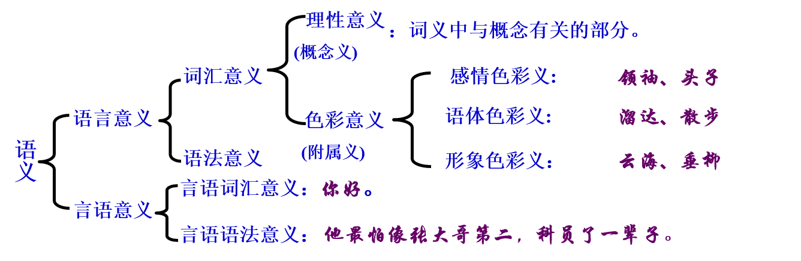
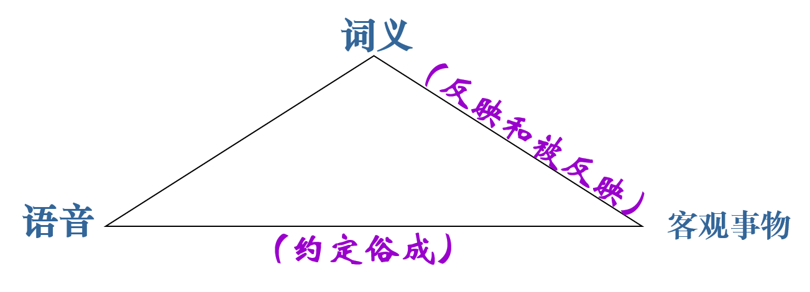
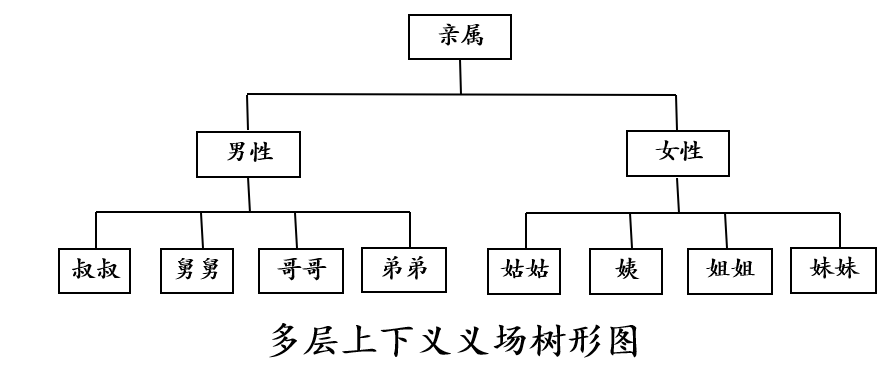
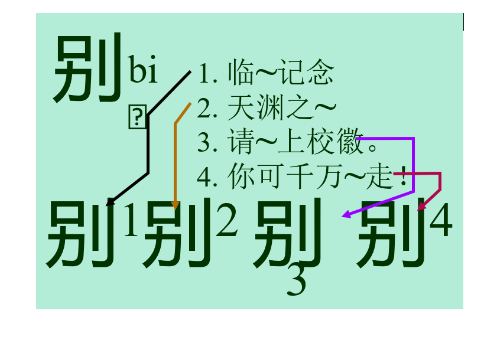
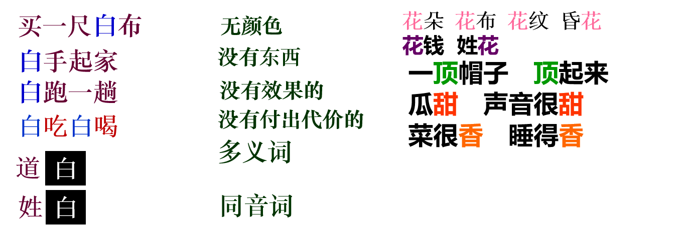
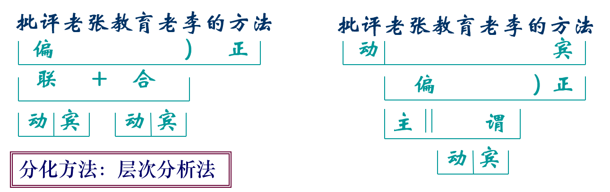
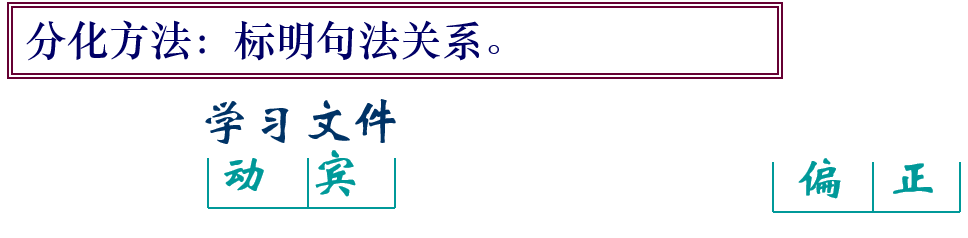
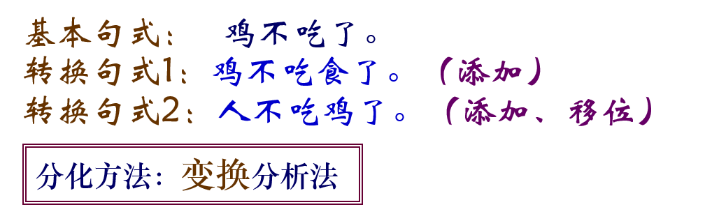

## 第五章　语义和语用
~~~~

### 第一节 词汇
~~~~
#### 一、词汇概说
1. 什么是词汇
1. 词汇的特征
1. 词汇研究
~~~~
词汇是一定语言中词和固定词组构成的系统。
1. 词汇是属于“一定”语言的，而不是同时对所有语言而言。“一定”指的是某一种语言，还可以指某一个人、某一部（一些）作品。
2. 词汇和词是两个不同的概念，词汇不是指单个的词。
3. 词汇成员不仅仅是词，还包括作用相当于词的固定词组。
~~~~
- 词汇在语言系统中的地位 
1. 词汇与语音
2. 词汇与语法 
3. 词汇最能反映语言的发展状态
4. 词汇是语言的建筑材料。
~~~~
##### 词汇的特征
1. 词汇的音义关系既有任意性又有理据性。
2. 词汇在发展变化中既有活跃性又有稳定性。
3. 词汇对客观事物概念的反映既有普遍性，又有民族性。
~~~~
- 词汇的民族特征
1. 什么样的意义和什么样的语音结合在一起构成一个词，在不同语言词汇中是不同的。
2. 不同语言中相应的词的词义之间有着错综复杂、交叉参差的情况。
3. 甲语言用词来表示的事物，乙语言可能会用词组来表示。
~~~~
- 不仅不同语言词汇是不同的系统，就是同一语言词汇在不同的历史时期也是不同的系统。
- 例如，古代汉语单音节词占优势，现代汉语双音节词占优势。
~~~~
##### 词汇研究
- 以词和词汇为研究对象的学科叫词汇学。
1. 根据研究对象不同，分为个别词汇学和普通词汇学。
1. 根据研究方法不同，分为共时词汇学和历时词汇学。
1. 根据研究内容不同，分为广义词汇学和狭义词汇学。
~~~~
词汇研究的意义
1. 对语言学科的意义。
2. 对文学创作与鉴赏的意义
3. 对社会文化历史研究的意义。
~~~~
#### 二、词汇的构成
~~~~
##### 词的定义
1. 词是一定的意义和一定的语音组合联系的结果，它具有一定的语法用途。（法国，梅耶）
1. 一个词是一个最小的自由形式。（美国，布龙菲尔德）
1. 词是从句子分解成的，具有孤立意义的最小的叫人完全满意的片段。（美国，萨丕尔）
~~~~
由于词的定义是比较复杂的问题，有的语言学家就不肯给词下一个普遍的定义。如瑞士语言学家索绪尔说：“对词下任何定义都是徒劳的。”这种看法未必正确，但也说明了要给词下一个确切的完整的定义是不容易的。 
~~~~
|  定义   | 出处  |
|  ----  | ----  |
| 词是意义单位。  | 吕叔湘、朱德熙《语法修辞讲话》 |
| 语言的最小意义单位叫做词。  | 王力《中国现代语法》 |
| 词，就是谈话的时候表示观念的一个词语。  | 黎锦熙、刘世儒《汉语语法教材》 |
| 词是语言建筑的单位，它表示一个概念，而有一个语音形式。  | 高名凯《汉语语法论》 |
~~~~
|  定义   | 出处  |
|  ----  | ----  |
| 分析语言片段而发现其中能自由活动的最小单位，那才是词。  | 陆志韦《汉语构词法》 |
| 词是语言中最基本的造句单位。| 黄伯荣、廖序东主编《现代汉语》|
| 词是语言中能够独立运用的最小符号。| 叶蜚声、徐通锵主编《语言学纲要》|
~~~~
- 语言中能够独立运用的最小的音义结合单位
- 关键词：
	- 音义结合   区分了词和语音单位；
	- 独立运用   区分了词和词素；
	- 最小的     区分了词和词组。
~~~~
##### 词的特征
1. 形式的定型性 
	- 词具有相对固定的语音形式和语法结构。 
	- 词在结构上是一个不可分割的整体。 
2. 意义的整体性。
3. 功能的备用性 
~~~~
##### 词与非词
1. 词与词素的区分：词素不能独立运用
	- 独立运用：独立成句；独立回答问题；独立作句子成分。（人/人民）
2. 词与词组的区分
- 从意义上看，词表示的是比较单纯的概念，词组表示的是比较复杂的概念。但所谓简单和复杂只是相对概念，无法精确区分。
- 从语音形式看，词的语音结构具有整体性，内部不允许有停顿，而词组则可以有内部的语音停顿。
- 从语法结构看，词是最小的，词组是由词构成的，它比词大。
- 从分辨方法看，词不具有扩展性，而词组的结构可以扩展。
~~~~
- 分辨词和词组的方法是扩展法，又叫插入法。

如果一个语言片段插入别的成分使其扩展后，不改变原意，这个语言片段就是词组；如果意义改变了，或者没有意义了，这个语言片段就是词。

|  原式   | 扩展式  |
|  ----  | ----  |
| 铁路  | 铁的路× |
| 眼热  | 眼很热× |
| 杀青  | 杀了青× |
| 说明  | 说得明× |
~~~~
|  原式   | 扩展式  |
|  ----  | ----  |
| 铁门  | 铁的门 |
| 手热  | 手很热 |
| 杀鸡  | 杀了鸡 |
| 说清  | 说得清 |

~~~~
- 他喜欢读小说。
1. 他（很）喜欢读小说。  “他喜欢”是词组
1. 他喜（）欢读小说。      “喜欢”是词
1. 他喜欢（夜里）读小说。“喜欢读”是词组
1. 他喜欢读（古典）小说。“读小说”是词组
1. 他喜欢读小（）说          “小说”是词
~~~~
黑板——黑色的板子（词）/黑布——黑色的布（词组）

白菜——白色的菜（词）/白马——白色的马（词组）
~~~~
- 运用扩展法来区分词与词组，要有一定条件限制: 
1. 插入的必须是同一结构层次的直接成分。 “商人”—插入“店和游” 
1. 即使符合第一个条件，还要看能否继续插入别的语言成分，使它进一步扩展，如果不能，那么，第一次有效插入也不能成为确定词组的依据。
	- 写信                    看见
	- 写一封信                看得见 看不见
	- 写一封家信              看得很见×
	- 写一封很长的家信         看得比过去见×
1. 扩展之后的直接成分的结构关系，跟原来的结构关系相同的是词组，否则是词。如：
- 写信（动宾关系）——写一封家信（动宾关系）
- 商人（偏正关系）——商店和游人（联合关系） 
~~~~
某些合成词在使用中可以扩展，变成了词组。这种结合在一起时是词，扩展后是词组的合成词，叫离合词。
~~~~
##### 1 动宾式
- 革命'$\rightarrow$'革落后观念的命
- 理发'$\rightarrow$'理了一回发
- 生气'$\rightarrow$'生了十分钟气
- 帮忙'$\rightarrow$'帮不上多大的忙
- 鞠躬'$\rightarrow$'鞠了个九十度的躬
- 结亲'$\rightarrow$'结了一门亲
- 站岗'$\rightarrow$'站了一班岗
- 伤心'$\rightarrow$'伤了我的心
~~~~
##### 2 偏正式
- 迟到'$\rightarrow$'迟了一回到
- 同学'$\rightarrow$'同过一年学
~~~~
##### 3 补充式
- 达到'$\rightarrow$'达得到  达不到
- 推翻'$\rightarrow$'推得翻  推不翻
- 看见'$\rightarrow$'看得见  看不见
- 打倒'$\rightarrow$'打得倒  打不倒
~~~~
##### 固定词组
- 定义：固定词组是词与词的固定组合。
~~~~
##### 结构的定型性
1. 构成成分次序不能随意颠倒。南征北战 牛头马面  
1. 构成成分不能随意替换。    半斤八两 —半斤五两
1. 不能随意增减成分。        胸无点墨—胸中没有一点墨
~~~~
2. 意义的整体性
	
	- 具有特殊的引伸义和比喻义。
	- 理解真实含义必须了解形成的文献典故和历史事件。（鹤立鸡群  胸有成竹  怒发冲冠）

3. 功能的备用性
~~~~
##### 固定词组的类型
- 固定词组可以分为两大类：专名和熟语
- 专名是指用复杂词组形式表达的事物名称。如国名、地名、书名、机构名、人名。
- 熟语主要有成语、惯用语、谚语、歇后语和格言等。
~~~~
- 成语是一种相沿习用的具有书面语色彩的固定词组。（刻舟求剑、四面楚歌）
- 惯用语是一种表达习惯性比喻含义的具有口语色彩的固定词组。（挖墙脚、不管三七二十一    扣帽子
- 谚语是流传于民间的一种通俗语句。（人要实心、火要空心）
- 歇后语是由近似于谜面、谜底的两部分组成的带有隐语性质的固定词组。（大路上电线杆—靠边站）
- 格言是出于名人或名文带有哲理性的固定词组。（岁不寒，无以知松柏；事不难，无以知君子。《荀子》）

~~~~
#### 三、词汇的分类
1. 基本词汇和一般词汇
1. 新词语和旧词语
1. 通用词和专用词
1. 外来词和方言词
1. 网络词语和流行语
~~~~
##### 基本词汇和一般词汇

- 基本词汇定义：基本词汇是语言中全体基本词的总和。
~~~~
1. 有关自然界事物的：天、地、风、云、水、火、雷、电
1. 有关指称、代替的：你、我、他、这、那、谁、什么、怎样
1. 有关数量的：十、百、千、万、斤、两、尺、寸
1. 有关人体各部分：心、头、牙、手、脚、眼睛
1. 有关动作行为的：走、想、跑、跳、吃、学习、喜欢
1. 有关性质、状态的：大、小、多、少、好、坏、苦、甜
1. 有关生活、生产资料的：米、面、菜、布、车、船
1. 有关亲属称谓的：爸爸、妈妈、哥哥、姐姐、妹妹
1. 有关程度、范围、关联的：就、很、最、都、把、和、跟、因为、所以、但是
~~~~
###### 基本词汇的特点
1. 全民常用性
2. 历时稳固性 
3. 构词能产性
~~~~
- 基本词汇的核心——根词

	- 根词是词汇中最原始、最单纯、最基本的词，是再也不能划分为词素的，只有一个词汇成分而不包括附加成分和词尾的词，如 “人、马、车、树”等。 
~~~~
- 基本词汇包括所有的根词，即所有的根词都是基本词，但基本词汇并不只是根词的总和，除了根词外，基本词汇中还有非根词的基本词。

	- 人民、马车、树林”是基本词，但不是根词
	- “人、马、车、树”既是基本词，又是根词

~~~~
- 根词的特征是：
1. 是基本词汇的核心和根基；
1. 它的意义最原始、最单纯；
1. 它的结构最简单、不能分割；
1. 它是构词的重要词素，在不作构词材料时，又可独立成词。
~~~~
- 根词和词根的区别

根词是基本词汇的核心，词根是词的结构中最重要的根基部分，是表达词的词汇意义的主要部分，因此，根词是词，词根是词的结构中的组成部分，从构词材料看，它是词素。
~~~~
- 一般词汇定义：一般词汇是指语言中基本词汇以外词的总汇。
- 一般词汇的特点：
1. 非全民性
2. 发展变化快
3. 构词能力弱
~~~~
- 基本词汇和一般词汇的关系
互相区别
互相联系
互相补充
互相转化

~~~~
##### 新词语和旧词语
- 新词语定义：新词是指适应社会发展需要新创造出来的词。

软着陆 房改 下岗 待业 互联网 网虫 网友 光盘 液晶  内存 兼容  
数据库 扩招 定向生 高职 博士后  远程教育 反腐倡廉 盗版 走穴
后现代主义 微波炉 方便面 绿色食品  数码相机 手机  轻轨 动车  
快餐店  网民  电子邮件  裸婚 低碳 官二代 云计算
~~~~
- 狭义的新词语只指利用原有词素按照通常的构词方式创造出来的词。

“网民”就是用原有的词“网”和“民”作为语素，并按照偏正形式构造的一个新的复合词  。
- 广义的新词语也包括原有词语在使用过程中产生了新的意义和新的用法。

“山寨”用来表示仿造、假冒、模仿的意思，具有动词的用法。

~~~~
- 旧词语定义：相对于新产生的词语，某种语言中原来已有的词语称为“旧词语”。
1. 传承词，由于语言的渐变性和继承性，前一时期的词语有很大一部分会继续使用而延续到现代，这些词语称为“传承词”。 
	- 人、身、耳、高、低、打、美、丑、一、十、百、千、天、地    

2. 古语词，在现代语言的词汇中，存在着一些产生并广泛使用于古代、近代时期的旧词语，这些词语带有明显的古旧色彩，偶尔因为特殊的用途而出现在现代语言交际中，这些词语称为“古语词”。
~~~~
- 古语词包括文言词和历史词两种。
1. 文言词是古代流传下来而现代不常用的词语。来源于古代书面语的词语，具有浓重的古代书面语色彩，它所表示的事物在古代有，现代也有。例如，若干（一些）、拂晓（天刚亮时）、面（脸）、足（脚）、目（眼睛）、国（国家）、皆（都） 
2. 历史词是表示历史上已消失的事物、现象或关系的词，例如，戈、君、尚书、 刺史、进士、朝拜、车裂、登基、驸马
~~~~
- 文言词和历史词的区别：

文言词所表示的事物现象，现在还存在，只不过换了一个新词；而历史词所表示的事物现象，现在已经不存在了。
~~~~
##### 通用词和专用词
- 通用词指不受语体限制，可以在各种语体中使用的词语。 例如，男、女、大、小、谁、什么 
- 专用词指某类语体专门、经常的词语，也叫语体词。 例如，转发、请示、报批、商调（公文语体词）， 纬度、函数、引力（科技语体词）
~~~~
##### 外来词和方言词
- 外来词是指从外族语言中吸收进入本民族语言中的词，又叫借词。 

吸收外来词的方法（音译词类型）
1. 音译，例如，巧克力(chocolate)、咖啡(coffee)、夏威夷(Hawaii) 
2. 一半音译一半意译（音译兼意译），例如，马克思主义(Marxism)、浪漫主义(romanticism)
3. 音译加意译，例如，啤酒（beer）、吉普车（jeep）    
4. 音意兼译，例如，可口可乐(Coca-Cola)、家乐福(Carrefour) 　
5. 借形词，例如，经济、革命、交通、教授（日语中直接借用汉字字形，但不借它的读音）
~~~~
- 方言词包括地域方言和社区方言词两种。
- 地域方言词是通行某一地区内部的词，主要是该地区的人们所使用，带有一定的方言色彩。
	- 在东北，有一种发火，叫急眼；
	- 在东北，有一种直爽，叫敞亮；
	- 在东北，有一种喜欢，叫稀罕；
	- 在东北，有一种讨厌，叫各应；
	- 在东北，有一种丑，叫磕碜；
	- 在东北，有一种美，叫带劲；
	- 在东北，有一种回答，叫嗯哪。
~~~~
- 社会方言词是为一定社会性区域的人们所经常使用的词。包括社会习惯语、行业词、术语等。 
1. 社会习惯语，社会习惯语是个别社会集团为了自己的利益或偏好，企图在语言方面特殊化而创造出来的词。社会习惯语主要包括阶级习惯语、隐语等。 
2. 行业词，行业词是指某一行业内运用的词，是各种行业的从业者为了适应自己特殊的需要而使用的词语。 
3. 术语，术语是用来表达科学技术特有概念的词。 
~~~~
##### 网络词语和流行语
- 网络词语有广义和狭义之分：
1. 狭义的网络语言是指网民在互联网上进行交际的词语。
1. 广义的网络词语，除了包括狭义的网络词语外，还包括与网络有关的技术性词语。例如，鼠标、浏览器、防火墙
~~~~
- 网络词语构词方式
1. 说明法，利用语言中已有的词素和语法规则，从不同角度对事物进行说明的方法来创制网络词语。例如，犀利哥、微博
2. 修辞法，运用各种修辞手段创制网络词语。例如，楼上、神马 
3. 简缩法，将多音节短语压缩成形式相对简短的词语。例如，电邮、网管 
4. 别解法，对已有词语进行歪曲理解而形成新意义。例如，耐看（耐着性子看） 
5. 引申法，通过对已有词语用法的引申创制网络词语。例如，雷（原为名词，网络上用作动词或形容词）  
6. 摹形法，运用符号摹拟形状、情态等表达意义，从而创制网络词语。 例如，:-) 表示高兴 
~~~~
- 网络词语的特点
1. 专业性
1. 简约性
1. 随意性
1. 创新性
~~~~
- 流行语是在一定时段内高频使用的新奇的语言形式。
- 流行语主要特征：时段性、新奇性、高频性、违规性 
- 流行语的流行理据：社会因素、文化因素、语言内部因素、使用者的因素、传媒因素 

@@@
### 第二节 语义

1. 语义概说
1. 词的词汇意义
1. 义素
1. 语义关系
1. 语义和语境
~~~~
#### 1 语义概说
1. 什么是语义
1. 语义单位
1. 语义类型
1. 语义学的发展
1. 语义学的分类
~~~~
- 语义是以语音形式为载体所表现出来的语言和言语的信息内容。 
- 或者说语义就是通过语言的各级单位和这些单位的组合所表达出来的意义。
~~~~
- 语义单位包括词素、词、词组、句子、句群

1. 词素是语言中最小的音义结合体，是构成词语的要素，它是最小的语义单位。
1. 词是能够自由运用的最小的语言单位，也是最基本的语义单位，词组、句子、句群都是以词为基本单位组合而成的。
1. 词组，又叫词组，是比词大一级的语言单位，它是由若干词构成的造句单位，是语义上和语法上都能逐层搭配起来的没有一个语调的一组词。
1. 句子是能够表达一个相对完整意义而且有一个特定语调的语言单位。
1. 句群是由两个或几个意义有密切联系、结构上各自独立的单句或复句组成的，又叫语段。

~~~~
##### 语义类型
- 语言意义是语言当中固有的、全民约定俗成、共同理解的意义。 
- 言语意义是在一定的语境中对语言的使用所表现出来的具体的、特定的意义。 

~~~~

~~~~
- 利奇（Leech）的语义类型

- 概念意义是表达概念的部分，是人脑对客观世界的概括反映，也叫理性意义。 
- 感情意义附于概念意义之上的人们对客观事物的主观评价和态度。 
- 内涵意义是不同的个人或集团赋予一个词以不同的内涵意义。
- 风格意义语言单位在使用过程中因语境的不同而产生的附加意义。 
- 连带意义是一种能引起听众或读者联想的附加意义。 
- 搭配意义是语言单位与语言单位具有固定组合关系而产生的意义。 
- 主题意义是通过语序和各种强调方式表达出来的意义。

~~~~
- 概念意义属于语言意义。
- 其他六种意义是对概念意义的运用结果，属于言语意义 

~~~~
##### 语义学的发展

- 以语义作为专门研究对象的学科叫语义学。 
- 语义学可以分为三种：语言学的语义学（linguistic semantics），逻辑学的语义学（logical semantics），哲学的语义学（philosophical semantics），即语义哲学，它是一些哲学流派，这些流派认为语言、语义是哲学分析的唯一的或主要的对象
~~~~
- 语言学的语义研究分为语文学、传统语义学和现代语义学三个时期。
1. 语文学的语义研究主要有古希腊、古印度注释古书及我国的训诂学。
1. 传统语义学时期从19世纪开始的。传统语义学的研究还主要是在研究词义，把语义学纳入到词汇学的范畴。
	- 1839年,德国学者雷西格(Reisig)主张把词义研究建成一门独立的学科。他把这门学科叫做意义学。
	- 1893年法国语言学家布雷阿尔首先使用语义学这个术语，并于1897年出版了《语义学探索》一书。
~~~~
- 同语音学、语法学相比较，传统语义学的缺陷：

1. 传统语义学研究的单位是单一的，只局限于词义，而语音学和语法学研究的单位则是多元的。
1. 传统语义学研究的方向是单向的，只是静态地研究语言中词义纵向的聚合。而语音学、语法学的研究方向是双向的。
1. 传统语义学的研究思想，从宏观上说没有把词义视为一个整体系统。观点多是孤立、分散的、原子主义的，有较强的心理倾向。而语音学、语法学则是系统论，它们把研究单位抽象出一个系统。
1. 传统语义学的研究方法，没有充分运用分析法，只是把词义当作一个一元整体。而语音学分析出音素，语法学分析出语素、形素。
~~~~
- 现代语义学时期。20世纪二三十年代，产生了现代语义学的第一个流派—结构语义学。此后，形成了众多的流派或理论模式
1. 结构语义学
	- 代表人物  德国语言学家特里尔，他提出了语义场的理论。
2. 解释语义学
	- 代表人物美国语言学家乔姆斯基，是转换生成语言学的一个组成部分。
3. 生成语义学
	- 代表人物  乔姆斯基的学生莱可夫、麦考莱、罗斯、波斯塔等。这是转换生成语言学的一个分支，是对标准理论的一种修正方式。
~~~~
4. 菲尔默的语义理论
	- 《关于现代的格理论》（1966）、《“格”辨》（1968）提出了一套用来说明句子语义的理论，即格语法。格语法属于生成语义学，但它修正了标准理论中的深层结构，提出了语义深层结构。
5. 切夫的语义理论
	- 生成语义学中派生出来的，它根据动词和名词的关系确定语义的构成。
~~~~
#### 2 词的词汇意义
1. 词义的性质
1. 词义的构成
~~~~
##### 词义的性质
词义的定义：由词的语音形式固定下来的人们对客观事物或它们之间关系的认识与评价。

~~~~
“语义三角”理论是美国学者奥克登(Ogden)和里查兹(Richards)在《意义之意义》一书中首次提出的。他们认为词义、语音、客观事物三者之间是一种相互制约、相互作用的三角关系。

~~~~
- 词义的形成 
1. 客观事物是词义形成的基础
2. 受人们认识的制约
3. 受特定词汇系统制约
~~~~
请同学们思考：

词义的形成受制于人们对客观事物的认识和反映。那么，客观世界中不存在的“上帝”“天堂”“神”“鬼”之类词义又是怎么来的呢？

~~~~
- 词义的特点：
1. 概括性
	- 词义是人脑对客观事物的概括反映。词义不可能一对一地、具体地反映客观事物。
2. 模糊性
	- 词义具有概括性的同时，也带有不同程度的模糊性，这是因为词所指称的事物的外延往往是游移的、不确定的反映到词义上就是词义所概括的事物、现象或关系在性质状态上的弹性或相对性。
3. 民族性
	- 不同民族的人在文化传统、文化心理等方面存在差异，这种差异会在对同一客观事物进行概括的反映时体现出来。
~~~~
1. 不同民族的语言，词义概括的范围可能不同。
	- 伯父、叔父、姑父、姨夫、舅父/uncle
	- 伯母、婶母、姑母、姨母、舅母/aunt
	- 哥哥、弟弟/brother       
2. 不同民族语言的词，在指称同一事物时会有感情色彩的不同。
	- 狗——落水狗   狐朋狗友   猪狗不如
	- Dog——big dog（大亨） a lucky dog（幸运儿）
3. 基本意义相同的词在不同语言中可能引申义不同。
	- 开——open
4. 同样的语义内容在不同语言中用不同声音表达。 
	- 水/water
~~~~
- 词义的构成
1. 理性意义:人们对客观事物、现象或关系的指称或理性认识在语言中的反映，是词义的基础内容。
~~~~
- 词的理性意义与概念的关系
1. 词义和概念有一致性：
	- 概念必须借助于一定的语言材料而存在，必须在词或词组种固定下来；
	- 词义也离不开概念，词义来源于概念，概念是词义的基础，不表示概念的词义是没有的。
	- 词义和概念都与客观事物有密切联系。
2. 词义和概念的区别：
	- 所属范畴不同。
	- 形成过程不同。
	- 对应关系不同。 
	- 词义有理性意义，还可能有非理性意义，而概念没有非理性意义。

~~~~
2. 色彩意义：反映着人们对世界认识的价值观念、立场态度和语言使用上的一些看法。
	- 感情色彩，对于同样客观事物、现象或关系，人们会有不同的反映。在反映时加上说话人的主观态度，便形成了词义的感情色彩。在感情色彩中，最重要的是褒贬色彩。
		- 褒义：勉励  果断  坚定  机智  自豪    
		- 贬义：怂恿  武断  顽固  狡诈  骄矜     
		- 中性：鼓动  坚固  牡丹  焦点  结合
	- 语体色彩，语体色彩是词用于不同的语体时产生的一种非理性意义。语体色彩一般分为口语语体色彩和书面语体色彩两类。
		- 书面语体色彩：斡旋  囹圄  润笔  
~~~~
	- 形象色彩，词的理性意义附带的由词的构成成分引起的对事物视觉形象或听觉形象的联想。
		- 形态色彩是以某事物的外在形态给另一事物命名。鹅卵石、美人鱼
		- 声音色彩就是摹拟自然界或人的声音。布谷鸟、乒乓球
		- 感觉色彩以由人的器官获取的  感觉来描绘事物的情态。冰冷、酸溜溜
		- 动态色彩就是以动物或事物  的动作、声响来描绘其他事物。牵牛花、垂柳
~~~~
#### 3 义素
1. 义素理论
1. 义素分析

~~~~
1. 义素理论

- 词（多义词）义的项目叫义项，也叫义位。例如浅：①深度小 ②间短③程度不深④颜色淡薄 
- 义素是对词的义项加以进一步分析后得到的语义特征，是最小的语义单位。
- 义素是义位的构成成素，它是从义位中分解出来的最小语义单位。

|  词   |义素   |  义素 |义素 |义素 |
|  ----  | ----  |----  |----  |----  |
| 灌木  | +矮小  | +丛生 | +木本  | +植物 |
| 乔木  | -矮小  | -丛生 | +木本  | +植物 |
~~~~
- 义素分析，是通过一组义项的对比，进而分析提取出最小的语义单位—义素，并描写义素之间的关系。 
- 义素分析的方法：对义素分析，一般采用对比的方法，即通过对不同的词义（义项）的对比找出义素。
~~~~
- 义素分析的具体步骤是：
1. 确定语义场，明确分析对象。如：哥哥、姐姐、弟弟、妹妹
2. 通过比较分析找出相同和不同义素。

|  词   |  义素 |义素 |义素 |义素 |
|  ----  | ----  |----  |----  |----  |
| 哥哥  | +亲属 | +男性  | +同胞 |+年长 |
| 姐姐  | +亲属 | +女性  | +同胞 |+年长 |
| 弟弟  | +亲属 | +男性  | +同胞 |+年幼 |
| 妹妹  | +亲属 | +女性  | +同胞 |+年幼 |
~~~~
3.对分析获得的义素进行整理，列出语义结构式或语义矩阵图

~~~~
- 在进行义素分析时，应注意以下几点：
1. 要抓住反映事物本质特征义素，舍弃非本质性义素。
2. 检验分析的语义单位是不是最小的，能否再分。
3. 检查分析后的一群词中是否存在两个词义素完全相同情况。

~~~~
- 义素分析的作用
1. 便于比较词与词之间理性意义的同异。
2. 能够使语义描写形式化，有利于语义的计算机输入。
3. 义素分析有助于分析同义词、近义词、反义词在词义方面的细微差别。
4. 义素分析还有助于说明语法上不能说明的某些词语的搭配条件。

~~~~
- 素分析存在的问题
1. 由于缺乏客观的分析标准和依据，义素分析多少带有一些主观随意性。
2. 一种语言的语义系统究竟需要用多少数量的义素才能没有遗漏地描写清楚，目前尚无法预见。
3. 语义研究的历史还不长，理论、方法有待逐步充实、完善。 

~~~~
#### 语义关系
1. 语义的聚合关系
2. 语义的组合关系
~~~~
- 语义之间的关系只要表现在聚合关系和组合关系两方面。
	- 语义的聚合关系指的是语言系统中各个语义成分在对立的基础上，由于相似或差异形成联想的关系。这些语义成分在一定的语境中可以相互替代，它们之间的关系就是聚合关系。
	- 语义的组合关系是指语义单位在动态使用过程中按照一定条件所进行的搭配。

~~~~
##### 语义的聚合关系
1. 同义聚合
1. 反义聚合
1. 上下义聚合
1. 单义聚合与多义聚合
1. 多义词与同音词
~~~~
- 关于语义场:具有共同语义特征，在语义上处于互相联系和制约关系中的一群词的聚合。

- 金属场:金、银、铜、铁、铅、铝
- “忍”义场:忍耐、忍让、忍受、容忍、忍气吞声、忍辱负重 
- 亲属场:父亲、母亲、姑姑、舅舅、哥哥、姐姐、弟弟、妹妹      
- 颜色场:赤、橙、黄、绿、青、蓝、紫
~~~~
- 语义场的特点：       
1. 系统性
2. 层次性
3. 变化性
4. 民族性

~~~~
- 语义场研究的意义
1. 有助于人们更全面深入地了解词义之间的关系。
2. 有助于义素分析的科学性、严密性和准确性。
3. 为词义体系的建立提供了一种基本模式。
4. 为认识不同语言之间的语义对应关系提供一种可供选择的理论和途径。

~~~~
##### 同义聚合
- 同义聚合是指语音不同而意义相同或相近的词的聚合。例如“关怀、关心” 
- 意义完全相同的词叫等义词，又叫绝对同义词。 演讲/讲演、玉米/苞米
- 意义相近的同义词叫近义词，又叫相对同义词。 
	- 看＝［＋用眼　＋往一定方向］
	- 见＝［＋用眼　＋往一定方向　＋有结果］
	- 望＝［＋用眼　＋往一定方向  ＋向远处］
	- 盯＝［＋用眼　＋往一定方向　＋视力集中］ 
~~~~
- 形成同义词的原因主要是：
1. 语言历史发展变化的结果。例如，目/眼睛、消息/信息、措施/举措 
1. 各种不同的方言。例如，土豆/马铃薯 
1. 借用外来词。例如，激光/镭射 
1. 由术语、行话和习惯语造成的。例如，重曹/苛性碱、花冠/花瓣 

~~~~
- 同义词构成的形式
1. 构成成分不同。例如，立即/马上、冷静/镇定
1. 构成成分部分相同。例如，帮助/赞助、策划/策动
1. 构成成分相同，顺序不同。例如，合适/适合、感情/情感
~~~~
- 近义词之间的差异表现在：
- 理性意义方面：
1. 词义所指范围不完全相同。例如，边疆—边境
1. 词义在语义的轻重程度上不完全相同。例如，蔑视—轻视
1. 搭配对象不同。例如，发挥——作用、威力、力量、创造性/发扬——精神   作风、传统、民主 
1. 个体和集体的不同。例如，词汇—词
~~~~
- 色彩意义方面：
1. 词义的感情色彩不同。团结/勾结
1. 词义的语体色彩不同。脑袋/头部
- 词性方面：
	- 拘泥（形、动）/拘谨（形）
	- 申明（动）/声明（动、名）
	- 壮大（形、动）/强大（形）
	- 愿望（名）/希望（名、动）

~~~~
##### 反义聚合
- 意义相反的词的聚合。意义上相反或相对的一组词叫反义词。 例如，积极/消极、胜利/失败、主观/客观
~~~~
- 反义词形成的原因
1. 客观上存在着矛盾对立的事物和现象。
	- 有性质状态的矛盾对立：新/旧、整齐/凌乱
	- 有动作行为的矛盾对立：来/去、超前/滞后
	- 事物名称的矛盾对立：战争/和平、主观/客观
	- 时间、方位的矛盾对立：现在/将来、前/后　 

1. 言语交际时经常对比并举而形成的。日/月、春/秋、首/尾
~~~~
- 反义关系的类型
1. 绝对反义关系：生/死、曲/直、反/正
1. 相对反义关系：反对/拥护、胖/瘦

~~~~
- 辨别反义词时应注意：
1. 反义词是就词与词的关系而言，词与词组构不成反义词。例如，好/不好、乱/井井有条
2. 反义词词性应当相同。例如，聪明（形）/傻子（名）、安静（形）/吵闹（动）
3. 反义词在结构上应对应，音节具有对称性。例如，轻飘飘/沉甸甸
4. 构成反义的两个或两个以上的词属于同一个意义范畴的。例如，长/短（度量范畴）、快/慢（速度范畴）
5. 逻辑上对立的词，在语言习惯上不常对举，不是反义词。例如，浪费—吝啬× ，浪费/节约、吝啬/慷慨

~~~~
##### 上下义聚合
- 上下义关系指抽象义位与具体义位之间包含与被包含的关系。
- 具有抽象义位的词叫上位词，具有具体义位的词叫下位词。 

~~~~
##### 单义聚合与多义聚合
- 单义是一个词只有一个意义。
- 单义词主要有以下三类：
1. 常见事物的名称。桌子、茶杯、自行车、电视机
2. 科技术语和专有名词。电子、函数、锦州、中文系
3. 新词。给力、闪婚、工薪族、大款
~~~~
- 多义是一个词具有两个以上有联系的意义。
- 词由单义发展为多义的原因：
1. 客观对象之间的各种联系是词语多义化的现实基础。
2. 语言的经济原则是促使词语多义化的直接原因。
~~~~
- 多义词总是一个词含有几个义项，最常用、最主要的义项是其基本义，有基本义发展转化来的其他意义叫转义，也叫派生义。 
- “基本义”不同于“本义”。 
	- “大夫”：古代一种官名（本义）、医生（基本义） 
~~~~
- 一词多义引申的途径：隐喻和转喻
- 词义的派生是有现实基础的，在派生义与被派生义所指的事物、现象或关系之间，相似性和相关性是最主要的联系纽带。前者基于人类认知的隐喻方式，后者基于人类认知的转喻方式， 
~~~~
- 认知范畴的“隐喻”指的是基于对象间的相似性，将一个认知模型投射到另一个认知模型。
- 包袱： ①包东西用的布②影响思想或行动的负担

- 认知范畴的“转喻”指的是基于对象间的相关性，在同一个认知模型内表述和理解部分与整体关系时，可用一个部分来认识另一个部分或整体，或者是相反。
~~~~
- 下列句子通过隐喻或者转喻产生的派生意义是哪些？
1. 这块布料颜色太深了。
1. 他正处于事业的巅峰状态。
1. 由于家里穷，他没有读过一天书。
1. 三十而立 ，四十不惑。
~~~~
1. 深——颜色浓，隐喻。
1. 巅峰——很高的状态，隐喻。
1. 读(书)——学习、上学，转喻。
1. 而立——三十岁，转喻。
~~~~
词的多义来源：
1. 使用范围的转移。to fire点燃—射击  
1. 不同领域中词具有特殊专业意义。前卫（军事—体育）
1. 由于修辞用法而产生多义。包袱（思想负担）
1. 同音词的重新解读。ear（耳朵）—ear of corn（玉米穗）中的ear（穗）
~~~~
##### 多义词与同音词
- 某一语言词汇中语音相同而意义不同的一组词，叫同音词。

~~~~
- 注意多义词和同音词的区别
1. 同音词意义之间没有联系，而多义词内部各意义之间有联系。
2. 同音词是不同的词，只是语音的聚合，与词义聚合无关，而多义词是一个词含有几个相互联系的意义，是词义在一个词内部的聚合，属于词义的一种聚合方式。

~~~~
- 同音词的类型
1. 异形同音词,九/酒/久/韭
1. 同形同音词,站(站立/车站)
~~~~
- 同音词产生的原因
1. 多义词的分化，雕刻/时刻
2. 偶然同音，灯/登、九/久、早/枣
3. 语音的演变，青[ts‘]/轻[k‘]、焦[ts]/骄[k]
4. 借用其他语言的词语，车站/站立、ball（球—舞会）
5. 形态变化的结果，left(leave过去式\过去分词)/left(左边)，saw(see的过去式)/saw(格言)
~~~~
- 同音词的作用是构成谐音的双关语和歇后语。

1. 孔夫子搬家—净是书（输）
1. 小葱拌豆腐—一青（清）二白

- 注意：应该把同音词和同形词区分开
- 同形词是书写形体相同的词，它可以是同音词，也可以不是同音词。
~~~~
##### 语义的组合关系
- 语义组合：是指语义单位在动态使用过程中按照一定条件所进行的搭配。也叫词语搭配。
~~~~
- 语义组合的制约：语义组合要受语法规则、语义条件和语言实际三个方面的制约。
1. 语法规则的制约 
	- 孩子吃饭/吃孩子饭（意义改变）、孩子饭吃（×）
2. 语义条件的制约 
	- 不同义位的相关义素 
	- 不同义位的功能特征 
	- 不同义位的色彩义，褒义和贬义的对立、口语和书面语的对立、隐含义素间的对立 
3. 语言实际的制约 
	- 合乎情理、合乎习惯、合乎词义本身的相互关系、修辞性组合要切合题旨情境 
~~~~
##### 句子的语义结构
- 句义就是一个句子所包含的意义，句义是言语中最小的独立的语义单位，因而也是基本的单位。 
~~~~
- 句子语义结构的形成 
	- 句义的形成与表现，既要依靠语序、虚词、语调等语法手段，也要依靠词义、上下文和语境等非语法手段。
1. 语调的作用，吃饭。吃饭？吃饭!
2. 语序的作用,老张说服老李/老李说服老张(施受关系不同)
3. 虚词的作用,在海上，经常可以看到繁星满天。 虚词“在”表现了“海上”的空间意义。 
4. 词义的作用,一锅饭能吃三个人。吃,够吃
5. 语境的作用,上课去。
~~~~
##### 句子语义结构的类型 
1. 简单句义,简单句义与逻辑中的判断相应，表现为一个命题。简单句义通常包含一个谓词（或并列谓词），也可以不包含谓词。 
	- 我去上课。
2. 复杂句义,复杂句义指的是句义的一个或一些成分也是句义或引出一个句义的情况，即一个句义中又包含着句义。 
	- 七班的作业**我已经批完了**。 
3. 复合句义,两个或两个以上的简单句义，按照某种语义关系紧密地联结在一起，共同表达一个比较复杂的意思，这就是复合句义。 
	- 由于天太冷，不少人都穿了大衣。 
~~~~
##### 同义句式及其转换
- 语义结构相同或相似的句子称为同义句式。 
	- 他明白了这个道理（施事—动作—受事）
	- 这个道理他明白了（受事—施事—动作）
	- 他这个道理明白了（施事—受事—动作）
~~~~
- 按照一定规则，把一种句式转换为另外一种句式，叫转换，也叫变换。
- 转换规则主要有移位、删除、添加、复写、替换。
1. 移位： 移动词语在句子中的位置。（XY—YX ）
	- 我们消灭了敌人。（主动句）→敌人被我们消灭了。（被动句）
2. 添加：在句子中增加某些词语。（ X——XY ）
	- 我们消灭了敌人。（主动句）→敌人被我们消灭了。（被动句）
3. 删除：删减句子中的某个或某些词语。（X—∞ ）
	- 敌人被我们消灭了。（被动句） →我们消灭了敌人。（主动句）
4. 复写：重复句中的某个词或某些词。（X—XX ）
	- 我们明天去北京。（一般陈述）→我们明天去北京，明天。（强调）
5. 替换：用某个词代替句中的一个词。（ XY—XZ ）
	- 我们消灭了敌人。（陈述句）→谁消灭了敌人？（疑问句）
~~~~
- 乡里的农民卖完了刚采下的鲜果。
1. 把字句    
	- 乡里的农民把刚采下的鲜果卖完了。（移位、添加）
1. 被字句
	- 刚采下的鲜果被乡里的农民卖完了。（移位、添加）
1. 主谓谓语句
	- 刚采下的鲜果乡里的农民卖完了。   （移位）
1. 名词性非主谓句
	- 卖完了刚采下的鲜果的乡里的农民。（移位、添加）
1. 特指疑问句
	- 乡里的农民卖完了什么？（替换）
~~~~
##### 歧义句式及其分化
- 句式多义是同一形式表达了不同的内容。多义在交际中如果得不到限制，就会产生歧义。
~~~~
- 歧义产生的原因及其分化方法
1. 一种线性序列，多种组合层次，多种深层意义。

~~~~
2. 一种线性序列，一种组合层次，多种句法关系，多种深层意义。

~~~~
3. 一种线性序列，一种组合层次，一种句法关系，多种深层意义。
~~~~

~~~~
#### 语义和语境
1. 语境和语境研究
2. 语境对语义的作用
3. 语义在语境中的变化模式
~~~~
- 语境:使用语言的环境。
- 狭义语境: 具体交际中的口语的前言后语或书面语的上下文；
- 广义语境: 交际时的具体环境，还包括社会、民族、文化、时代、经济、政治、风俗习惯等。
~~~~
- 语境学:以语境为研究对象的一门学科。 
	- 语境学说是20世纪60年代伦敦功能学派代表人物弗斯在采用人类学家马林诺夫斯基的研究成果的基础上发展起来的。 
	- 弗斯认为，语言既有由语言因素构成的“上下文”，又有由非语言因素构成的“情景的上下文”。 
	- 1964年，韩礼德继承弗斯的语言理论，提出了“语域”的概念。他把语域分为话语的范围、话语的方式和话语的风格三个方面，这三方面的综合相当于言语环境。 
	- 1965年，美国社会语言学家费什曼也提出“语域”这一概念，他着眼于语言变体产生的社会因素，认为语域是受共同行为规则制约的社会情境，包括地点、身份和主题。 
~~~~
	- 1968年，美国社会语言学家海姆斯进一步发展了语境学说，把它提到相当重要的地位。海姆斯把语境分为十几个组成部分，例如说话者、听话者、信息形式、内容、场合、心理环境、目的、风格等等。 
	- 20世纪30年代，陈望道在《修辞学发凡》中说：“修辞应以适应题旨情境为第一义”，他在该书中提出的“六何”说（何时、何地、何人、何事、何故、何如），就是构成语境的因素。
	- 20世纪60年代张弓的《现代汉语修辞学》从修辞的原则和修辞的要件两方面进行分析，提出修辞原则即“结合现实语境，注意实际效果”。 
~~~~
##### 语境对语义的作用
1. 确定词语的具体意义。例如，没油了！
1. 帮助选择同义词，限制说话人的说话方式。
1. 影响词语的感情色彩。
1. 填补丰富词语意义。
~~~~
##### 语义在语境中的变化模式
- 反义:借助情景故意说反话。
- 转义:受语言环境的影响使词语的原来意义发生了转化，具有了新的不同于原来的意义，但又并非完全不同或相反。中国的牛顿、当代的花木兰
- 言外之意：字面上看不出来的意义。

@@@
### 第三节 语用

1. 语用概说
1. 语境和意义
1. 指示和指示语
1. 言语行为
1. 会话含意和会话原则
1. 语用预设
1. 会话结构
1. 关联与顺应 
~~~~
#### 语用概说
1. 什么是语用
1. 语用研究
1. 语用学和相关学科
~~~~
- 语用是人们在具体的语言环境中使用语言进行交际、并产生相应的交际效果的行为。

~~~~
##### 语用研究
- 语用学是研究语用及其规律的科学。
~~~~
- 语用学的形成与发展 
	- 20世纪30年代后期，美国哲学家查尔斯·莫里斯（Charles Morris）在其所著的《符号理论基础》一书中把符号学分为语形学、语义学和语用学三个部分，首先使用了“语用学”这个术语。 
	- 1977年荷兰正式出版发行《语用学杂志》，标志语用学作为一门新兴学科得到了认可。 
	- 1985年9月在意大利召开了国际语用学研讨会，1986年初成立了国际语用学会，确定《语用学杂志》、《语用学和其他学科》为国际语用学会的学术刊物。 
	- 1980年，胡壮麟在《国外语言学》发表了论文《语用学》。
~~~~
- 21世纪以来，语用学在中国发展的特点：
1. 研究的本土化受到重视。
1. 更加深入，范围扩大。
1. 与其他学科更多的交叉。
~~~~
##### 语用学的类型
- 形式语用学，研究语用的形式和范畴，语用形式化最恰当的方法，从意义与文化、语言与逻辑、语言行为与模式等方面探索语言在人类活动中的表现。 
- 描写语用学，描写语用学着力对各种语用现象进行详细描写，主要研究人们来自经验的有关自然语言的应用原则，分析自然语言如何同语言环境相关联。 
- 应用语用学，语用研究和理解话语有关的领域结合形成的分支学科。 
~~~~
##### 语用学和相关学科
- 语用学和语义学都研究语言的意义，但是，语义学研究的意义是不受语境影响的的静态意义即语言意义，而语用学研究的则是在具体语境中才能确定的意义即言语意义。

- 屋里真冷。

~~~~
- 语用学和修辞学的研究中心都是语言运用，修辞学主要是从表达的角度研究语音、词汇、语法等语言要素的运用。这些内容当然也语用学所要研究的，但是，就研究的广度和深度而言，语用学要大大超过修辞学。

~~~~
#### 2 语境和意义
1. 语境和语境研究
1. 语境对语义的作用
1. 语义在语境中的变化模式
~~~~
- 语境就是使用语言的环境
- 狭义语境:具体交际中的口语的前言后语或书面语的上下文；
- 广义语境:交际时的具体环境，还包括社会、民族、文化、时代、经济、政治、风俗习惯等。
- 用“月圆”表示“亲人团聚”、“姻缘美满”，用“鸳鸯”表示“爱情伴侣形影不离”，用“比翼鸟”、“连理枝”表示夫妻关系，都有文化传统的背景。 
~~~~
- 语境学是以语境为研究对象的一门科学。 

~~~~
- 语境学说是20世纪60年代伦敦功能学派代表人物弗斯在采用人类学家马林诺夫斯基的研究成果的基础上发展起来的。 弗斯认为，语言既有由语言因素构成的“上下文”，又有由非语言因素构成的“情景的上下文”。 
- 1964年，韩礼德继承弗斯的语言理论，提出了“语域”的概念。他把语域分为话语的范围、话语的方式和话语的风格三个方面，这三方面的综合相当于言语环境。 
- 1965年，美国社会语言学家费什曼（Fishman）也提出“语域”这一概念，他着眼于语言变体产生的社会因素，认为语域是受共同行为规则制约的社会情境，包括地点、身份和主题。
~~~~ 
- 1968年，美国社会语言学家海姆斯进一步发展了语境学说，把它提到相当重要的地位。海姆斯把语境分为十几个组成部分，例如说话者、听话者、信息形式、内容、场合、心理环境、目的、风格等等。 
- 早在20世纪30年代，陈望道在《修辞学发凡》中说：“修辞应以适应题旨情境为第一义”，他在该书中提出的“六何”说（“何故”“何事”“何人” “何地”“何时”“何如”），就是构成语境的因素。
- 20世纪60年代张弓的《现代汉语修辞学》从修辞的原则和修辞的要件两方面进行了分析，提出修辞的原则即“结合现实语境，注意实际效果”。 

~~~~
##### 语境对语义的作用

1. 确定词语的具体意义。
2. 帮助选择同义词，限制说话人的说话方式。
3. 影响词语的感情色彩。
4. 填补丰富词语意义。

~~~~
##### 语义在语境中的变化模式
1. 反义
1. 转义
1. 言外之意
~~~~
- 反义也就是借助情景故意说反话。
- 有几个慈祥的老板到菜场去搜集一些菜叶，用盐一浸，这就是他们难得的佳肴。 《包身工》

~~~~
- 转义:受语言环境的影响使词语的原来意义发生了转化，具有了新的不同于原来的意义，但又并非完全不同或相反。
- 当代的花木兰/中国的牛顿

~~~~
- 言外之意:字面上看不出来的意义。
- 向别人提问时说“我的一个朋友……”——“无中生友”
~~~~
#### 3 指示和指示语
1. 指示的含义 
1. 指示语的类型
~~~~
- 较早使用“指示”这一术语的是德国心理学家比勒，认为指示是用某一词语直接指称某一事物。
- 直接讨论指示问题的是巴尔·希勒尔。
- 莱昂斯是深入研究指示问题的专家 。 
~~~~
- 指示的含义：具有指示功能的成分其指称对象随说话人、说话时间、说话地点等语境要素而变化，是一种依赖语境的指称，也称相对指称。 

~~~~
- 指示语的类型

1. 时间指示语，时间指示语可以由时间名词、方位名词、时间副词、时间词组、指示代词和时间词的组合充当。 
1. 空间指示语，空间指示语主要由代词、副词、方位名词、含有移动义的动词、介词词组等充当。 
1. 人称指示语，人称指示语主要由人称代词构成，也可以由部分指示代词充当。 
1. 语篇指示语，多是由连词的语言成分充当。   
1. 事物指示语，主要由代词“它”“这”“那”“这个”“那个”“这些”“那些”“这些个”“那些个”等构成。 
~~~~
#### 4 言语行为
1. 什么是言语行为
1. 奥斯汀的言语行为理论
1. 塞尔的言语行为理论 
~~~~
- 言语行为指人们为实现交际目的而在具体的语境中使用语言的行为。
- 言语行为并非“言语的行为”，而是一种交际活动，涉及说话者说话时的意图和他在听话者身上所达到的效果。 

~~~~
##### 奥斯汀的言语行为理论 
1. 表述句与施为句之分
	- 有真假之分的句子即为表述句。
	- 有适当不适当之分的句子即为施为句。 
2. 言语行为的完成条件
	- 说话者必须具备实施某一行为的条件，且存在实施这个行为的合适的对象；
	- 说话人必须具有诚意，缺乏诚意则不能有所为；
	- 说话人对自己所说的话不能反悔。
	- 合适的程序、合适的言说者、合适的场合等也是施为句发挥作用的条件。 
~~~~
- 言语行为三分说

1. 以言指事，泛指一切用声音说出的有意义的话语，又称言内行为；
2. 以言行事，涉及说话者的意图，如“断定、疑问、命令、描写、解释、道歉、感谢、祝贺”等，又称言外行为；
3. 以言成事，涉及说话者在听话者身上所达到的效果，如使听话者高兴、振奋、发怒、恐惧、信服等，又称言后行为。 

~~~~
##### 塞尔的言语行为理论 
- 言语行为的原则
1. 制约人类使用语言的规则主要包括调节规则和构成规则：
1. 调节规则调节先前存在的行为形式，这种活动的存在逻辑上独立于规则的存在；
1. 构成规则不仅调节而且创造或规定新的行为方式，这种活动在逻辑上依赖于规则的存在而存在。 
~~~~
- 言语行为的分类 
1. 断言类，描述世界上的状况或事件的言语行为，如断言、报告等；
2. 指示类，说话者想使听话者做某事，如建议、请求、命令等；
3. 承诺类，指说话人表示将要做某事的言语行为，如许诺、恐吓等；
4. 表达类，说话者表达自己对某事的情感和态度，如道歉、祝贺等；
5. 宣告类，能改变世界上某种事态的言语行为. 

~~~~
##### 间接言语行为
- 间接言语行为是与直接言语行为相对的。说话人通过话语形式的字面意义来实现其交际意图是直接的言语行为；当一个言语行为取得了话语本身之外的效果时，这就是间接言语行为。 
- 规约性间接言语行为就是那些已被约定俗成地表达的间接言语行为，其中语句的字面意义与说话人的言外之意之间的联系较为固定，只要对语句的字面意义作一般的推断，我们就可以按习惯确定说话者间接表达的言外之意。 
- 非规约性间接言语行为主要依靠说话双方共知的语言信息和所处的语境来推断。 

~~~~
#### 5 会话含意和会话原则
1. 会话含意
1. 合作原则
1. 礼貌原则
~~~~
##### 会话含意
- 会话含意理论是由美国语言哲学家格赖斯提出的。 
- 会话含意的性质
1. 可撤销性 
2. 不可分离性 
3. 不确定性
4. 可推导性
5. 非规约性
~~~~
- 会话含意的类型

1. 不需要特殊语境就能推导出的含义是一般会话含意。 
1. 需要特殊语境的会话含意是特殊会话含意。 

~~~~
##### 合作原则 
- 合作原则是格赖斯在20世纪60年代提出的语用学理论。 
~~~~
- 合作原则的内容：
1. 数量准则
	- 使自己所说的话达到现时交际目的所要求的详尽程度；
	- 不能使自己所说的话比所要求的更详细。
2. 质量准则
	- 不要说自己认为是不真实的话；
	- 不要说自己缺乏足够证据的话。
3. 关联准则
	- 说话要有关联，要贴切。
4. 方式准则
	- 避免晦涩的词语；
	- 避免歧义；
	- 说话要简洁；
	- 说话要有条理。
~~~~
- 合作原则的应用，合作原则的违反一般在下面几种情形下发生： 
1. 说话人在交际中不愿意合作，不遵守合作原则的某些准则；
2. 转移话题，违反相关准则；
3. 维护某一准则而违反其他准则；
4. 说话人故意不遵守某一准则，并让对方知道他违反了某一准则，从而产生语用推理。
~~~~
##### 礼貌原则
- “礼貌原则”是利奇在《语用学原则》中作为“合作原则”的“援救”原则提出来的。 

~~~~
- 礼貌原则的内容:
1. 得体准则,减少表达有损于他人的观点，主要用于指使和宣布：
	- 尽量少让别人吃亏；
	- 尽量多使别人受益。
2. 慷慨准则,减少表达利己的观点，主要用于指使和宣布：
	- 尽量少使自己受益；
	- 尽量多让自己吃亏。
3. 赞扬准则,减少表达对他人的贬损，多用于表情和表态：
	- 尽量少贬低别人；
	- 尽量多赞扬别人。
~~~~
4. 谦虚准则,减少对自己的夸耀，多用于表情和表态：
	- 尽量少赞誉自己；
	- 尽量多贬低自己。
5. 一致准则,减少自己与别人在观点上的分歧，多用于阐述：
	- 尽量减少双方的分歧；
	- 尽量增加双方的一致。
6. 同情准则,减少自己与他人在情感上的对立，多用于阐述：
	- 尽量减少对方的反感；
	- 尽量增加对方的同情。
~~~~
- 礼貌原则的运用
1. 礼貌的语境约束性
2. 礼貌原则的级别
3. 礼貌的语用悖论

~~~~
- 合作原则与礼貌原则的关系
1. 礼貌原则是对合作原则的补充；
2. 在特定的语言环境中，合作原则可以表现得比礼貌原则更加突出。 

~~~~
#### 6 语用预设
1. 语用预设的含义
1. 语用预设的特征
1. 语用预设触发语 
~~~~
- 预设问题是一百多年前由德国哲学家弗雷格首先提出来的。 
- 语用预设的含义:预设又称“前提”“先设”，是推导会话含意必需的已知信息。 预设可分为语义预设和语用预设。语义预设建立在真值条件基础上，是语句命题本身静态和抽象的意义。
~~~~
语用预设是指那些对语境敏感的，与说话人（有时包括说话对象）的信念、态度、意图有关的前提关系。语用预设把预设和说话人联系在一起，与语境密切相关，是动态的、具体的。 

~~~~
- 语用预设的特征
1. 语境依赖性
1. 可撤消性

~~~~
- 语用预设触发语
1. 指称表达语
1. 叙实动词 
1. 含蓄动词
1. 状态变化动词 
1. 评判动词
1. 重复意义的词语 
1. 序数词
1. 时间词组或从句
1. 比较和对比结
1. 非限制性定语从句
1. 分裂句
1. 非真实性条件从句
~~~~
#### 7 会话结构
1. 会话结构的含义
1. 会话结构的组成
1. 会话结构的分类 
~~~~
- 会话结构的含义:一次会话中由会话前阶段、会话实施阶段和会话后阶段构成的完整结构。 

~~~~
- 会话结构的组成
1. 会话结构的最小单位——话轮 
	- 话轮是说话人连续的谈话，在其说话之前之后都以沉默为标准。 
2. 会话结构的基本单位——毗邻对
	- 两个相邻的话段。 
3. 会话结构的三个阶段 
	- 1会话前阶段，会话前阶段即会话的准备阶段。
	- 2会话实施阶段，会话实施阶段是会话的进行过程，包括建立期、持续期和终止期，
		- （1）会话建立，会话建立通常是通过发话人指定受话人的形式完成。
		- （2）会话持续，会话持续是会话实施的核心，也是会话结构的中心，由话轮保持、话轮变换、话轮平行、空话轮等构成。 
		- （3）会话终止，会话终止通常由预示会话结束的话轮构成。
	- 3会话后阶段，会话后阶段是指交际各方停止会话以后的阶段。

~~~~
##### 会话结构的分类
- 简单会话结构 
1. 简单会话结构是两人会话时的结构形式 
1. 话轮缺省是指在一次二人会话中其中一人话轮没有出现的情形。 
1. 话轮岔断是会话的一方偏离了会话的话题而插入一个话轮形成的结构。 
1. 话轮内嵌是指一组会话中连续的两个话轮没有构成引发-应答关系，但与其他话轮构成引发-应答关系的情形。 
1. 话轮共享是在一连串的对话中，依次展开的会话有时是由递相发生联系的话轮构成的，其中一个话轮既是上一个话轮的应答语，同时又是下一个话元的引发语。 
~~~~
- 复合会话结构

复合会话结构是多人会话形成的结构形式，是简单形式的复合。 

~~~~
#### 关联与顺应 
1. 关联的内涵与特征
1. 顺应的内涵与特征 
~~~~
- 关联理论的形成与发展 
	- 1979年，威尔逊在《现代语言学——乔姆斯基革命的成果》中首次阐述关联性思想的一些内容。 
	- 1981年，威尔逊和斯波伯提出用关联原则统括格赖斯的合作原则及其各项准则。 
~~~~
- 关联理论的基本观点 
1. 明示推理交际观,“明示”和“推理”是交际过程的两个方面：
	- 明示是对说话人而言的，推理是对听话人而言的。
2. 关联性的定义
	- 关联性可以从语境、交际个体、现象三个角度进行界定。
3. 关联原则
	- 最佳关联设想：
		- 1发话人意欲向听话人显映的假设集具有足够的关联，使听话人值得努力去处理该明示的刺激信号。
		- 2这一明示刺激信号，是发话人传递假设集时所能运用的最大关联的信号。
	- 最佳关联原则：任何一个明示交际行为，必须保证自身的最大关联。 
		- 1话语的语境效果足以引起听话人的注意；
		- 2听话人为获得语境效果付出了努力。
~~~~
##### 顺应的内涵与特征
1. 顺应理论的形成 
	- 语言顺应论是由国际语用学协会秘书长维索尔伦在1987年首次提出。 
2. 顺应论的基本观点
	- 做出选择、变异性、商讨性和顺应性是语言顺应论的四个关键概念。 

