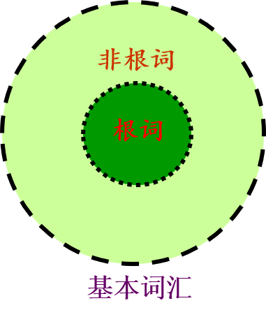
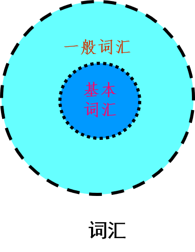

## 第五章　语义和语用
~~~~

### 第一节 词汇
~~~~
#### 一、词汇概说
1. 什么是词汇
1. 词汇的特征
1. 词汇研究
~~~~
词汇是一定语言中词和固定词组构成的系统。
1. 词汇是属于“一定”语言的，而不是同时对所有语言而言。“一定”指的是某一种语言，还可以指某一个人、某一部（一些）作品。
2. 词汇和词是两个不同的概念，词汇不是指单个的词。
3. 词汇成员不仅仅是词，还包括作用相当于词的固定词组。
~~~~
- 词汇在语言系统中的地位 
1. 词汇与语音
2. 词汇与语法 
3. 词汇最能反映语言的发展状态
4. 词汇是语言的建筑材料。
~~~~
##### 词汇的特征
1. 词汇的音义关系既有任意性又有理据性。
2. 词汇在发展变化中既有活跃性又有稳定性。
3. 词汇对客观事物概念的反映既有普遍性，又有民族性。
~~~~
- 词汇的民族特征
1. 什么样的意义和什么样的语音结合在一起构成一个词，在不同语言词汇中是不同的。
2. 不同语言中相应的词的词义之间有着错综复杂、交叉参差的情况。
3. 甲语言用词来表示的事物，乙语言可能会用词组来表示。
~~~~
不仅不同语言词汇是不同的系统，就是同一语言词汇在不同的历史时期也是不同的系统。例如 古代汉语单音节词占优势，现代汉语双音节词占优势。
~~~~
##### 词汇研究
- 以词和词汇为研究对象的学科叫词汇学。
1. 根据研究对象不同，分为个别词汇学和普通词汇学。
1. 根据研究方法不同，分为共时词汇学和历时词汇学。
1. 根据研究内容不同，分为广义词汇学和狭义词汇学。
~~~~
- 词汇研究的意义
1. 对语言学科的意义。
2. 对文学创作与鉴赏的意义
3. 对社会文化历史研究的意义。
~~~~
#### 二、词汇的构成
~~~~
##### 词的定义
1. 词是一定的意义和一定的语音组合联系的结果，它具有一定的语法用途。（法国，梅耶）
1. 一个词是一个最小的自由形式。（美国，布龙菲尔德）
1. 词是从句子分解成的，具有孤立意义的最小的叫人完全满意的片段。（美国，萨丕尔）
~~~~
由于词的定义是比较复杂的问题，有的语言学家就不肯给词下一个普遍的定义。如瑞士语言学家索绪尔说：“对词下任何定义都是徒劳的。”这种看法未必正确，但也说明了要给词下一个确切的完整的定义是不容易的。 
~~~~
|  定义   | 出处  |
|  ----  | ----  |
| 词是意义单位。  | 吕叔湘、朱德熙《语法修辞讲话》 |
| 语言的最小意义单位叫做词。  | 王力《中国现代语法》 |
| 词，就是谈话的时候表示观念的一个词语。  | 黎锦熙、刘世儒《汉语语法教材》 |
| 词是语言建筑的单位，它表示一个概念，而有一个语音形式。  | 高名凯《汉语语法论》 |
| 分析语言片段而发现其中能自由活动的最小单位，那才是词。  | 陆志韦《汉语构词法》 |
| 词是语言中最基本的造句单位。| 黄伯荣、廖序东主编《现代汉语》|
| 词是语言中能够独立运用的最小符号。| 叶蜚声、徐通锵主编《语言学纲要》|
~~~~
- 语言中能够独立运用的最小的音义结合单位
- 关键词：
	- 音义结合   区分了词和语音单位；
	- 独立运用   区分了词和词素；
	- 最小的     区分了词和词组。
~~~~
##### 词的特征
1. 形式的定型性 
	- 词具有相对固定的语音形式和语法结构。 
	- 词在结构上是一个不可分割的整体。 
2. 意义的整体性。
3. 功能的备用性 
~~~~
##### 词与非词
1. 词与词素的区分：词素不能独立运用
	- 独立运用：独立成句；独立回答问题；独立作句子成分。（人/人民）
2. 词与词组的区分
- 从意义上看，词表示的是比较单纯的概念，词组表示的是比较复杂的概念。但所谓简单和复杂只是相对概念，无法精确区分。
- 从语音形式看，词的语音结构具有整体性，内部不允许有停顿，而词组则可以有内部的语音停顿。
- 从语法结构看，词是最小的，词组是由词构成的，它比词大。
- 从分辨方法看，词不具有扩展性，而词组的结构可以扩展。
~~~~
- 分辨词和词组的方法是扩展法，又叫插入法。

如果一个语言片段插入别的成分使其扩展后，不改变原意，这个语言片段就是词组；如果意义改变了，或者没有意义了，这个语言片段就是词。
|  原式   | 扩展式  |
|  ----  | ----  |
| 铁路  | 铁的路× |
| 眼热  | 眼很热× |
| 杀青  | 杀了青× |
| 说明  | 说得明× |
~~~~
|  原式   | 扩展式  |
|  ----  | ----  |
| 铁门  | 铁的门 |
| 手热  | 手很热 |
| 杀鸡  | 杀了鸡 |
| 说清  | 说得清 |

~~~~
- 他喜欢读小说。
1. 他（很）喜欢读小说。  “他喜欢”是词组
1. 他喜（）欢读小说。      “喜欢”是词
1. 他喜欢（夜里）读小说。“喜欢读”是词组
1. 他喜欢读（古典）小说。“读小说”是词组
1. 他喜欢读小（）说          “小说”是词
~~~~
黑板——黑色的板子（词）/黑布——黑色的布（词组）

白菜——白色的菜（词）/白马——白色的马（词组）
~~~~
- 运用扩展法来区分词与词组，要有一定条件限制: 
1. 插入的必须是同一结构层次的直接成分。 “商人”—插入“店和游” 
1. 即使符合第一个条件，还要看能否继续插入别的语言成分，使它进一步扩展，如果不能，那么，第一次有效插入也不能成为确定词组的依据。
	- 写信                    看见
	- 写一封信                看得见 看不见
	- 写一封家信              看得很见×
	- 写一封很长的家信         看得比过去见×
1. 扩展之后的直接成分的结构关系，跟原来的结构关系相同的是词组，否则是词。如：
- 写信（动宾关系）——写一封家信（动宾关系）
- 商人（偏正关系）——商店和游人（联合关系） 
~~~~
某些合成词在使用中可以扩展，变成了词组。这种结合在一起时是词，扩展后是词组的合成词，叫离合词。
~~~~
1. 动宾式
- 革命'$\rightarrow$'革落后观念的命
- 理发'$\rightarrow$'理了一回发
- 生气'$\rightarrow$'生了十分钟气
- 帮忙'$\rightarrow$'帮不上多大的忙
- 鞠躬'$\rightarrow$'鞠了个九十度的躬
- 结亲'$\rightarrow$'结了一门亲
- 站岗'$\rightarrow$'站了一班岗
- 伤心'$\rightarrow$'伤了我的心
~~~~
2. 偏正式
- 迟到'$\rightarrow$'迟了一回到
- 同学'$\rightarrow$'同过一年学
~~~~
3.补充式
达到'$\rightarrow$'达得到  达不到
推翻'$\rightarrow$'推得翻  推不翻
看见'$\rightarrow$'看得见  看不见
打倒'$\rightarrow$'打得倒  打不倒
~~~~
##### 固定词组
- 定义：固定词组是词与词的固定组合。
~~~~
1. 结构的定型性
	- 构成成分次序不能随意颠倒。南征北战 牛头马面  
	- 构成成分不能随意替换。    半斤八两 —半斤五两
	- 不能随意增减成分。        胸无点墨—胸中没有一点墨
~~~~
2. 意义的整体性
	- 具有特殊的引伸义和比喻义。
	- 理解真实含义必须了解形成的文献典故和历史事件。（鹤立鸡群  胸有成竹  怒发冲冠）

3. 功能的备用性
~~~~
##### 固定词组的类型
- 固定词组可以分为两大类：专名和熟语
- 专名是指用复杂词组形式表达的事物名称。如国名、地名、书名、机构名、人名。
- 熟语主要有成语、惯用语、谚语、歇后语和格言等。
~~~~
- 成语是一种相沿习用的具有书面语色彩的固定词组。（刻舟求剑、四面楚歌）
- 惯用语是一种表达习惯性比喻含义的具有口语色彩的固定词组。（挖墙脚、不管三七二十一    扣帽子
- 谚语是流传于民间的一种通俗语句。（人要实心、火要空心）
- 歇后语是由近似于谜面、谜底的两部分组成的带有隐语性质的固定词组。（大路上电线杆—靠边站）
- 格言是出于名人或名文带有哲理性的固定词组。（岁不寒，无以知松柏；事不难，无以知君子。《荀子》）

~~~~
#### 三、词汇的分类
1. 基本词汇和一般词汇
1. 新词语和旧词语
1. 通用词和专用词
1. 外来词和方言词
1. 网络词语和流行语
~~~~
##### 基本词汇和一般词汇

- 基本词汇定义：基本词汇是语言中全体基本词的总和。
	- 有关自然界事物的：天、地、风、云、水、火、雷、电
	- 有关指称、代替的：你、我、他、这、那、谁、什么、怎样
	- 有关数量的：十、百、千、万、斤、两、尺、寸
	- 有关人体各部分：心、头、牙、手、脚、眼睛
	- 有关动作行为的：走、想、跑、跳、吃、学习、喜欢
	- 有关性质、状态的：大、小、多、少、好、坏、苦、甜
	- 有关生活、生产资料的：米、面、菜、布、车、船
	- 有关亲属称谓的：爸爸、妈妈、哥哥、姐姐、妹妹
	- 有关程度、范围、关联的：就、很、最、都、把、和、跟、因为、所以、但是
~~~~
- 基本词汇的特点
1. 全民常用性
2. 历时稳固性 
3. 构词能产性
~~~~
- 基本词汇的核心——根词

根词是词汇中最原始、最单纯、最基本的词，是再也不能划分为词素的，只有一个词汇成分而不包括附加成分和词尾的词，如 “人、马、车、树”等。 
~~~~
基本词汇包括所有的根词，即所有的根词都是基本词，但基本词汇并不只是根词的总和，除了根词外，基本词汇中还有非根词的基本词。

- 人民、马车、树林”是基本词，但不是根词
- “人、马、车、树”既是基本词，又是根词

~~~~
- 根词的特征是：
1. 是基本词汇的核心和根基；
1. 它的意义最原始、最单纯；
1. 它的结构最简单、不能分割；
1. 它是构词的重要词素，在不作构词材料时，又可独立成词。
~~~~
- 根词和词根的区别

根词是基本词汇的核心，词根是词的结构中最重要的根基部分，是表达词的词汇意义的主要部分，因此，根词是词，词根是词的结构中的组成部分，从构词材料看，它是词素。
~~~~
- 一般词汇定义：一般词汇是指语言中基本词汇以外词的总汇。
- 一般词汇的特点：
1. 非全民性
2. 发展变化快
3. 构词能力弱
~~~~
- 基本词汇和一般词汇的关系
互相区别
互相联系
互相补充
互相转化

~~~~
##### 新词语和旧词语
- 新词语定义：新词是指适应社会发展需要新创造出来的词。

软着陆 房改 下岗 待业 互联网 网虫 网友 光盘 液晶  内存 兼容  
数据库 扩招 定向生 高职 博士后  远程教育 反腐倡廉 盗版 走穴
后现代主义 微波炉 方便面 绿色食品  数码相机 手机  轻轨 动车  
快餐店  网民  电子邮件  裸婚 低碳 官二代 云计算
~~~~
- 狭义的新词语只指利用原有词素按照通常的构词方式创造出来的词。

“网民”就是用原有的词“网”和“民”作为语素，并按照偏正形式构造的一个新的复合词  。
- 广义的新词语也包括原有词语在使用过程中产生了新的意义和新的用法。

“山寨”用来表示仿造、假冒、模仿的意思，具有动词的用法。

~~~~
- 旧词语定义：相对于新产生的词语，某种语言中原来已有的词语称为“旧词语”。
1. 传承词，由于语言的渐变性和继承性，前一时期的词语有很大一部分会继续使用而延续到现代，这些词语称为“传承词”。 
	- 人、身、耳、高、低、打、美、丑、一、十、百、千、天、地    

2. 古语词，在现代语言的词汇中，存在着一些产生并广泛使用于古代、近代时期的旧词语，这些词语带有明显的古旧色彩，偶尔因为特殊的用途而出现在现代语言交际中，这些词语称为“古语词”。
~~~~
- 古语词包括文言词和历史词两种。
1. 文言词是古代流传下来而现代不常用的词语。来源于古代书面语的词语，具有浓重的古代书面语色彩，它所表示的事物在古代有，现代也有。例如，若干（一些）、拂晓（天刚亮时）、面（脸）、足（脚）、目（眼睛）、国（国家）、皆（都） 
2. 历史词是表示历史上已消失的事物、现象或关系的词，例如，戈、君、尚书、 刺史、进士、朝拜、车裂、登基、驸马
~~~~
- 文言词和历史词的区别：

文言词所表示的事物现象，现在还存在，只不过换了一个新词；而历史词所表示的事物现象，现在已经不存在了。
~~~~
##### 通用词和专用词
- 通用词指不受语体限制，可以在各种语体中使用的词语。 例如，男、女、大、小、谁、什么 
- 专用词指某类语体专门、经常的词语，也叫语体词。 例如，转发、请示、报批、商调（公文语体词）， 纬度、函数、引力（科技语体词）
~~~~
##### 外来词和方言词
- 外来词是指从外族语言中吸收进入本民族语言中的词，又叫借词。 

吸收外来词的方法（音译词类型）
1. 音译，例如，巧克力(chocolate)、咖啡(coffee)、夏威夷(Hawaii) 
2. 一半音译一半意译（音译兼意译），例如，马克思主义(Marxism)、浪漫主义(romanticism)
3. 音译加意译，例如，啤酒（beer）、吉普车（jeep）    
4. 音意兼译，例如，可口可乐(Coca-Cola)、家乐福(Carrefour) 　
5. 借形词，例如，经济、革命、交通、教授（日语中直接借用汉字字形，但不借它的读音）
~~~~
- 方言词包括地域方言和社区方言词两种。
- 地域方言词是通行某一地区内部的词，主要是该地区的人们所使用，带有一定的方言色彩。
	- 在东北，有一种发火，叫急眼；
	- 在东北，有一种直爽，叫敞亮；
	- 在东北，有一种喜欢，叫稀罕；
	- 在东北，有一种讨厌，叫各应；
	- 在东北，有一种丑，叫磕碜；
	- 在东北，有一种美，叫带劲；
	- 在东北，有一种回答，叫嗯哪。
~~~~
- 社会方言词是为一定社会性区域的人们所经常使用的词。包括社会习惯语、行业词、术语等。 
1. 社会习惯语，社会习惯语是个别社会集团为了自己的利益或偏好，企图在语言方面特殊化而创造出来的词。社会习惯语主要包括阶级习惯语、隐语等。 
2. 行业词，行业词是指某一行业内运用的词，是各种行业的从业者为了适应自己特殊的需要而使用的词语。 
3. 术语，术语是用来表达科学技术特有概念的词。 
~~~~
##### 网络词语和流行语
- 网络词语有广义和狭义之分：
1. 狭义的网络语言是指网民在互联网上进行交际的词语。
1. 广义的网络词语，除了包括狭义的网络词语外，还包括与网络有关的技术性词语。例如，鼠标、浏览器、防火墙
~~~~
- 网络词语构词方式
1. 说明法，利用语言中已有的词素和语法规则，从不同角度对事物进行说明的方法来创制网络词语。例如，犀利哥、微博
2. 修辞法，运用各种修辞手段创制网络词语。例如，楼上、神马 
3. 简缩法，将多音节短语压缩成形式相对简短的词语。例如，电邮、网管 
4. 别解法，对已有词语进行歪曲理解而形成新意义。例如，耐看（耐着性子看） 
5. 引申法，通过对已有词语用法的引申创制网络词语。例如，雷（原为名词，网络上用作动词或形容词）  
6. 摹形法，运用符号摹拟形状、情态等表达意义，从而创制网络词语。 例如，:-) 表示高兴 
~~~~
- 网络词语的特点
1. 专业性
1. 简约性
1. 随意性
1. 创新性
~~~~
- 流行语是在一定时段内高频使用的新奇的语言形式。
- 流行语主要特征：时段性、新奇性、高频性、违规性 
- 流行语的流行理据：社会因素、文化因素、语言内部因素、使用者的因素、传媒因素 

~~~~

### 第二节 语义

~~~~

### 第三节 语用