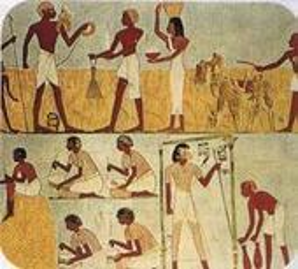
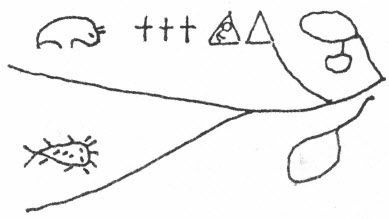
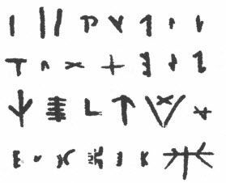
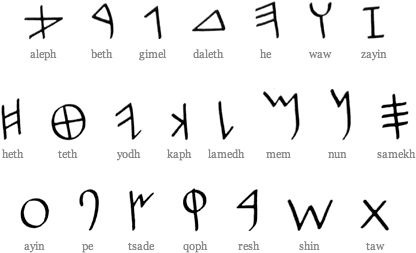
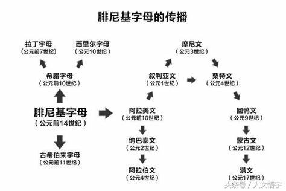
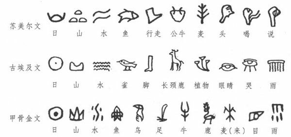

## 第六章　文字
~~~~
### 文字及其构成要素

- 文字是记录语言的书写符号系统。
	- 文字是记录语言的,录音机也记录语言，但它不是书写符号。
	- 文字是一个系统。
~~~~
#### 文字的构成要素
- 传统观点：文字具有形、音、义三个要素。
- 有人认为：形、音、义三方面，只有形是属于文字本身的，音和义都是属于语言的东西。 

@@@
### 第一节　文字和语言
“文字”一词有两个意思，一是指一个一个的字，一是指语言的视觉符号体系。这一章所讲的文字，指的是后面一个意思。
~~~~
#### 文字的特点和重要作用

1. 文字的发明克服了语言传达信息在时间和空间上的局限。
1. 文字使人类文化得以积累。
1. 文字能促进思维的发展。
~~~~
#### 文字与语言的关系
1. 文字依附于语语言
- 文字是记录语言的符号。
- 文字与语言的结构特点、基本词汇和发音特点紧密相连并适应着，语言要素特点决定着一种语言文字的状况。
~~~~
2. 文字和语言是两种现象
- 从起源看，语言是第一性的；文字是第二性的。
- 从发展看，语言不能创制和改革，文字可以创制和改革。
- 从存在形式看，语言是以语音为物质材料，文字是通过形体表达声音和意义。

~~~~
#### 文字的功能
1. 文字突破有声语言时间和空间的局限性，扩大语言交际的范围。
1. 文字是人类积累知识的工具和传播科学的媒介。
1. 文字导致了书面语的产生，促进了语言的规范发展。 
1. 文字是研究古代社会生活的绝好的材料，是文化的活化石。

~~~~
#### 文字学及其分类
- 文字学是研究文字系统的科学。 
	- 从研究对象的范围看，文字学可以分为普通文字学和具体文字学。
	- 从研究内容的时限看，文字学可以分为共时文字学和历时文字学。
	- 针对文字学的历史，可以分为传统文字学和现代文字学。
~~~~
#### 关于文字学的学科地位问题 
- 一种看法认为：文字与语言不同，不是语言系统的构成要素，因此文字学和语言学不同，不是语言学的分支学科，而是和语言学平行的学科，就像语言学和文学一样。但是这两个学科的关系十分密切，所以经常并称为“语言文字学”。
- 另一种看法认为：语言包括口头语言和书面语言两种形式，口头语言的形式是语音，书面语言的形式是文字。所以文字学是语言学的分支学科。 

@@@

### 第二节　文字的基本性质与文字的产生
~~~~
一、实物记事

比较普遍的实物记事的办法是结绳。

~~~~
我国境内的瑶族曾经用禾秆记录一年的收成，用木板刻点和玉米来记工分。云南陇川县的景颇族有一种以实物代替信息的习惯。假如小伙子爱上了一个姑娘，他就用树叶包上树根、大蒜、火柴梗、辣椒，再用线精巧地包扎好送给女方。
实物能够表达的信息很少，与文字的产生没有直接的关系。
~~~~
二、图画记事

图画在古时候也是用来记事的一种重要方法。用图画记事、交流思想，可以用印第安人奥基布娃（Ojibwa）部落的一个女子的情书来说明：

~~~~
三、刻划符号

原始社会尚未发现有成篇的文字记录，但原始社会末期大多已经开始使用类似文字的某些个体化符号。

~~~~
四、早期文字：原始的图画文字

判定文字系统产生的三个基本的条件：
1. 具有数量足够多的与某种语言里的语素或词相对应的小图形，这些小图形可以按这种语言的音读出来；
1. 这些小图形可以重复使用而所表达的音义不变；
1. 这些小图形的排列规则足以反映这种语言说话时语素或词的排列次序，小图形排列的顺序不同，所反映的语言单位的排列次序也就不同，表达的意思也因此不同。

- 也就是说，文字形体所表达的信息一定是与某种语言的音义结合体及其排列相对应的信息，而不是直接描画现实。

~~~~
##### 早期文字
- 公元前4000多年前，出现苏美尔文字，又叫 “楔形文字”。
- 公元前3000多年前，古埃及文字产生，有碑铭体、僧侣体和人民体三种字体。
- 公元前14世纪到公元前11世纪的商代后期出现甲骨文、金文。
~~~~
##### 早期文字的两个主要特点
1. 它们像记事图画似的，不过是记录语词罢了。
1. 它们不是拼音的，而是同时使用了表形、表意、表音的造字方法。
~~~~
最早的表音文字

- 公元前1000多年，居住在西方两大文化中心之间叙利亚·巴勒斯坦一带的腓尼基人，在古埃及文字基础上创造了人类最早的拼音文字。

~~~~

@@@
### 第三节　共时文字系统的特点及分类

文字可以从不同的角度分类。比如，从形体上分，可以有“图画文字”、“象形文字”、“楔形文字”（又称“钉头字”）、“方块字”等等。这里我们只讨论根据文字单位与语言单位的关系而做的分类。要讨论这一角度的分类，首先要谈谈文字系统中单位的层级问题。
~~~~
#### 一、从文字的次小单位看文字的共性和分类
任何文字系统都有一级单位对应于语言中的音义结合体。这一级单位一定不是最小的文字单位，它在文字文本中的排列次序对应于语言符号的出现次序，由此文字才可以有效地通过语言的符号义表达信息。从这一级单位观察文字与语言的关系，可看出所有文字的共性。
~~~~
比如汉文中的“方块字”和英文中的“（文字）词”。汉文中的“字”以一个方块的形体出现，几乎都对应于汉语中的音义结合体——语素，汉文文本中一个一个方块字的出现次序对应着汉语中语素的出现次序，通过形体单元及其空间次序表达了语素组合的意义。英文中的一个“词”，以前后有空格的一串字母的形体出现，对应于英语的音义结合体——词，文本中一个一个前后有空格的字母串的出现次序对应于英语词的出现次序，由此来表达英语词与词组合表达的意义。
~~~~
汉文的一个方块字在语法层面上大多对应语素，在音系层面上大多对应音节，所以可叫做“语素一音节文字”；英文的文字词（前后有空格的字母串）大多在语法层面对应语法词（最小的自由造句单位），在音系层面上对应音系词（符合词重音模式的一段语音），可以叫“语法词—音系词文字”，简称“表词文字”。
~~~~
#### 二、从文字的最小单位看文字的不同类型
与语言中的音义结合体相对应的那一级文字单位（字或文字词），一定还可以拆分为更小的形体单元。比如，英文的词可拆分为“字母”，汉文的方块字可拆分为“字元”（传统称为“偏旁”、“部首”），下面我们把所有文字的最小单元统称为“字符”
~~~~
- 根据字符与所记录的语言的关系，可以把文字分为表音文字和意音文子。表音文字，又叫做“拼音文字”或“字母文字”，它们的最小文字单位——字符只表示语言符号的音，而不表示语言符号的意义。
~~~~
- 表音文字还可以根据所表示的语音单位的性质分为更小的类。比如：
1. 音位文字：有的字符表元音，有的字符表辅音，字符可以记录语言中所有的音位。如拉丁字母。英文就是使用拉丁字母作为字符的音位文字。
1. 辅音文字：字符只表示语言中的辅音，元音没有专门的字符表示。如阿拉伯文。
1. 音节文字：字符表示语言中的音节。如日本的假名。
1. 意音文字则是有的字符提示语言符号的音，有的字符只提示语言符号的意义。提示音的字符叫做声符，与音无关只与意义有关的字符叫做义符。汉文是典型的意音文字。
@@@
### 第四节　文字的发展与传播
~~~~
文字的创造有两种方式。一种是在某种语言的基础上自发产生并逐步完善的文字，叫做“自源文字”。另一种是部分或全部、借用或参考其他民族文字的字形，再根据本民族语言的特点做或多或少的改动而形成的文字，叫做“他源文字”。
~~~~
##### 一、早期自源文字：不完善的意音文字
- 自源文字有四种：中东两河流域的苏美尔古文字、埃及地区的埃及古文字、中国中原地区的甲骨文和美洲的玛雅文字。这些早期的自源文字都是不完善的意音文字，字形的象形程度也都很高。
~~~~
早期古苏美尔文、古埃及文和中国甲骨文中都有很多跟实物形体相像的图形，用来表示现实中某些常见的事物。由于与现实事物有相似性联系，所以这几种古文字有不少形体十分相似，形体与语言音义结合的方式也不出我国传统文字学所说“六书”中的象形、会意、指事、假借、形声这五种
~~~~

~~~~
二、自源文字的发展

- 古埃及文逐渐发展出与辅音有严格对应关系的固定的表音字符：单辅音字符24个，后增加到30个；双辅音字符75个，其中常用的50个。而埃及语中的一个词，就根据词中音节和辅音数目的多少，用一个或多个单、双辅音字符来表示，最后再加上一个义符，义符同时也起到为词分界的作用。通过辅音字符和义符的逐渐固定，埃及文也逐渐成为完善的意音文字：一段固定的形体单位只对应语言中的一个词，同音不同义或同义不同音的语词在文字形体上都有了区别。辅音字符在埃及文中之所以这么重要，是因为古埃及语是一种以辅音表示词根义、元音表示形态范畴的多音节语。
~~~~
汉字的发展与古埃及文有所不同。汉字的发展也是在表示语素义的象形、会意、指事字的基础上发展出只表示音的假借字，但由于汉语的基本语素都是一音节一义的，所以汉语的假借字一定也是单音节的。这之后大量运用了形声的手段：或者在单音节假借字的基础上增加形旁（义符），区分开同音不同义的单音词；或者在象形、会意、指事字的基础上增加声旁（声符），区分开同义不同音的单音词。而声符与单音词的音始终没有形成—符对一音的关系。比如，“溅”与“箭”用了不同的声符“贱”和“前”，但表示的语音却完全相同。
~~~~
汉字通过形声的手段，大致达到了一个方块的形体只对应当时汉语中的一个单音词。但声符表示的是音节而不是辅音，表示的是语音相近而不是语音相同，在表语音相同的同时有的还兼表词族的归属，这都与埃及文不同。汉文独特的发展方向与汉语的词根都是单音节的、同音语素较多、古代常用改变音节的某一个成分来孳生意义相关的新词有密不可分的关系。
~~~~
苏美尔古文字使用的时间大约有一千多年，在公元前3500—前2300年左右的两河流域。这一千多年中苏美尔古文字一直停留在不完善的意音文字阶段，既没有发展出—符对一音的固定声符，也没有像汉语那样出现大量新创的形声字，直至两河流域被其他民族侵占。据研究，苏美尔语属于黏着语，有不少单音节的词，与古埃及语、古汉语的语言类型都不相同，这可能是苏美尔文字的发展与另外两种文字不同的重要原因。
~~~~
#### 三、他源文字的创新与文字的换用
##### 意音表词文字
- 苏美尔人生活的两河流域后来先后为阿卡德人（公元前约2350—前2000年）、巴比伦人（公元前19—前18世纪）、亚述人（公元前14—前6世纪，中间有过衰落）所统治，他们都继承了与苏美尔后期文字相似的形体 (14) （钉头字，或称楔形文字）记录自己的语言。这一系统的文字后来又由两河流域向外传播，为不同的国家、不同的民族所使用，如埃兰人、赫梯人、波斯人、迦兰人等。
~~~~
##### 辅音文字
- 生活在地中海东岸的腓尼基人，处于两河流域文明与古埃及文明的交界处，在苏美尔、埃及两系文字的影响下，于公元前1700年左右创立了北闪米特字母。这一体系用22个字符表示语言中所有的单个辅音，弃用了表义字符和双辅音声符。这一看来不大的创新给文字的性质带来了根本的变化：大大减少了字符的数量，也更好地达到了字符与辅音的一一对应。腓尼基语属于北闪米特语，也是辅音表词根义的多音节语。现代的阿拉伯文、波斯文等属于辅音文字，但增加了一些加在辅音字母上的附加符号来表示元音。
~~~~
##### 音位文字
- 大约在公元前1100年左右，希腊人从腓尼基借来北闪米特字母记录自己的语言。希腊语与腓尼基语不是同一类型的语言，希腊语也是多音节语，但词根义是由辅音和元音的序列来表示的。为适应标写自己的语言，希腊人把北闪米特字母中几个自己用不着的辅音字母改为表示元音，并通过字形分化的方法增加了几个字母，最后定型为26个字母。希腊字母沿用至今。英、法、德、西班牙等现代语言使用的拉丁字母体系，是对希腊字母进行了一些形体的改造而形成的。
~~~~
日语、朝鲜／韩语属于多音节黏着语，在实义词干之后有丰富的接尾成分，而且词干与接尾成分结合时要发生音变。用汉字记录实词词干，用表音字符记录接尾成分及其与词干结合时的音变，的确比仅用汉字更适合于这些语言的特点。越南语则跟汉语一样属于单音节孤立语，少有词形变化，所以他们新创的文字也是一音节一义一方块形体的意音型文字。
~~~~
#### 四、文字适应语言和文字的相对独立性

- 文字是记录语言的，所以每一种文字，无论是自源的还是他源的，都有适应自己所记录语言的内在发展动力。
- 文字的产生、自源文字的发展还是他源文字的创新或换用，都说明了文字是对有声语言再编码的视觉符号系统，说明了文字既有适应语言特点的一面也有相对独立的一面。
~~~~
#### 五、汉字与汉语拼音
- 汉字是意音文字，它的字符较多，字符与语言单位的对应不是一对一式的，和拼音文字相比，要难写、难记一些。
- 汉族的居住地区幅员辽阔，方言分歧，有的不能通话；汉族有悠久的文化传统，有大量用汉字记载的文献典籍。
~~~~
- 新中国成立后，全国人大全体会议于1958年正式通过公布汉语拼音方案。拼音方案的设计经过专家的长期研究和反复讨论，既能准确地反映普通话的音位系统，又跟国际上通用的拉丁字母一致，比以前的所有方案都前进了一大步。现在，它已经在汉字注音、识字教育、型号标写、资料检索、通信技术和信息处理等方面得到应用，我国的人名、地名在国际上也以拼音方案的写法作为标准。
@@@
### 第五节　书面语

- 书面语不是文字问题，而是语言问题。为了叙述的方便，放在这里一并讨论。

~~~~
- 我国通常用“话”表示语言的口头形式（中国话、英国话、法国话），用“文”表示语言的书面形式（中文、日文、英文）。
- 这里所谓的“话”和我们在第一章中所说的一句一句的“话”不是一个东西；
- 这里所谓的“文”（书面语）和作为书写符号的文字也是两回事。