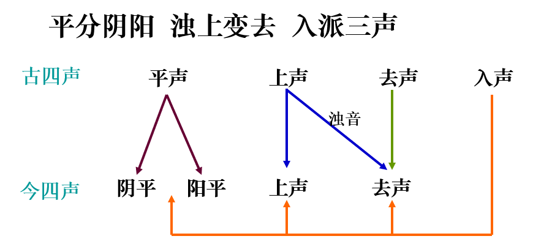

## 语言演变与语言分化
@@@
### 语言的起源
~~~~
#### 语言的起源问题界说 
- 语言的起源指的是人类从什么时候和怎样开始发出自觉意义上的声音的。
~~~~
- 语言的起源研究不是某种具体的语言产生的时间和过程。

~~~~
- 语言的起源和婴儿学话也不同。
- 语言的起源和文字的产生不是一回事。
- 研究语言的起源问题不是要追寻最先产生的是哪种语言。
~~~~
#### 语言起源研究的作用和途径
- 作用

1. 是阐明语言的本质特征和发展特征的必要前提。
1. 语言的起源和语言的发展过程是源和流的关系。
1. 不仅是语言学的研究对象，而且其他相关学科也在研究。在语言学领域所取得的研究成果必定对其他相关学科具有借鉴意义。
~~~~
- 途径
1. 广泛地调查和研究了美洲、非洲、澳洲等地的语言，并把他们的语言作为推断原始语言的依据。
2. 广泛开展了动物学的研究，试图从智力相对发达的动物的身上寻找人类起源的根据。
3. 语言既然是人类特有的符号系统，是社会的交际工具，其起源的研究便应当与人类起源和社会起源的研究密切联系起来。
~~~~
#### 语言起源的各种假设和学说
- 神授说
- 人创说
- 进化说
~~~~
##### 神授说
- 观点：语言是上帝或神赐予人类的。
- 《圣经·创世纪》：上帝用泥土造人，取名亚当，把语言传授给亚当，亚当便给万事起了名字。
- 我国苗族也有传说：山神造人并传授人语言。
~~~~
##### 人创说
- 观点：语言是人类自己创造的。
拟声说、
感叹说、
社会契约说、
劳动叫喊说、
手势说、
~~~~
- 拟声说
- 以德国生物学家赫德尔（J·C·Herder）为代表，他在《论语言的起源》（1772）一书中提出这一主张。
- 观点：有声语言是人类模拟自然界的各种声音而逐步演化而成的，然后就用该声音作为这个事物的名称。
~~~~
- 假自然之声为徵征，假徵征为事物之代表，凡此诸词，皆发生最早者也……即足而鸣者呼之曰雀，错错而鸣者呼之曰鹊，亚亚而鸣者呼之曰鸦，岸岸者谓之岸，他如猫，狗，鹅，鸭，蟋蟀之类，皆以其物自身所发之声为其物之名。（杨树达《高等国文法》）
~~~~
- 拟声说的局限性
1. 拟声词只是造词的一种方法。
1. 如果语言起源于拟声，那么世界上的各种语言的读音应该是相同的。
1. 语言中拟声词的数量极少, 客观世界的绝大多数事物，概念都无声可拟 。
1. 模仿自然界的各种声音必须具备比较灵活的发音器官。
1. 单纯的拟声词是不能构成语言的。
~~~~
- 感叹说
- 这是18世纪普遍流行的一种语言起源于情感的学说。代表人物是卢梭。
- 卢梭：“最初的语言是充溢热情的歌唱的语言，只是后来才变为普遍的，有条理的语言。”
- 观点有声语言是从抒发感情的各种声音演变而来的。
- 这种观点的提出者根据现代语言中有叹词这一现象进行的推想。
~~~~
- 身有所感，则心有所知，有知而后有情，有情而后有意，情动于中，则形于言，所以吐露真情，发抒其志意，以示他人者也。此即语言之起源。（刘师培）
- 人类的言语，起源叹词。（黎锦熙《新著国语文法》）
- 感叹说注意到了原始人用表达情绪的声音逐渐转化为表达思想的语音。
~~~~
- 感叹说的局限
1. 语言中感叹词数量少。
1. 感叹词只用于直接表示感情，并不能作为表示这种感情的名称。
1. 感叹的声音并不是语言，而是对外界刺激的生理反应。
~~~~
- 社会契约说
- 流行于十八世纪中叶，以英国的亚当•史密斯为代表。
- 亚当•史密斯在《语言起源论》中说：“他们觉得有必要创造出一些人为的符号，大家经过相互的同意，把这些符号的意义确定下来。”
- 主张：语言产生于人们互相商定的契约。
- 观点：原始人在没有语言之前，通过互相约定，规定了一些事物的名称，这样就创造了语言，也就是说：语言是原始人互相商量后创造出来的。
~~~~
- 社会契约说的局限
- 这一提法不合逻辑，既然没有语言，没有交际工具，彼此又怎么可能商量约定事物的名称呢？
- 这一假说认为思维的存在先于语言，这也是值得商榷的。
~~~~
- 劳动叫喊说
- 流行于19世纪70年代，以法国哲学家诺瓦雷为代表。
- 观点：原始人在集体劳动中，由于肌肉紧张过度，可能发出一些伴随劳动的叫喊声，这种声音变成了某种劳动操作的信号：一种特定的叫喊表达一种大家公认的动作。随后，在这个基础上产生了语言。
~~~~
我们的祖先的原始人原是连话也不会说的，为了共同劳作，必须发表意见，才渐渐练出复杂的声音来。假如那时大家抬木头，都觉得吃力了，却想不到发表。其中有一个叫道‘杭育杭育’，那么这就是创作，大家也要佩服、应用的。（鲁迅《且介亭杂文·门外文谈》）
~~~~
- 劳动叫喊说的局限
- 仅仅是肌肉活动的节奏化的要求是不能促使语言产生的。
- 很难解释喊声如何变为动词，如何演化为交际工具及人类语言多样性的问题。
~~~~
- 手势说
- 最早由英国的贝杰特、德国的冯德、荷兰的金纳根等人提出。代表人物是苏联的马尔。
- 观点：人类最初没有声音语言的，只能使用手势或姿态互相表达思想。就像现在语言不通的人碰到一起，不得不使用手势比划一样，这就是所谓语言起源的“手势说”。
~~~~
- 手势说的主要依据：
1. 考古上的证据  至今出土的一些石器时代的化石人没有舌骨的； 
2. 先天聋哑人用手势进行交际
~~~~
- 手势说的局限
1. 考古发现原始人没有舌骨，最多只能证明原始人不能发出清晰的声音，但不能发出清晰的声音，并不等于没有语言；
1. 和事物接触的东西并不一定就变成事物的符号；
1. 手势不具有声音材料和意义要素相结合的基本结构；
1. 把手势语作为第一性的语言，有声语言作为第二语言，这是本末倒置。
1. 手势语应用起来很不方便。
~~~~
##### 进化说
1. 语言起源和人类起源的关系
	- 语言和人类一起产生，语言的起源是与人类本身的起源分不开的。
~~~~
2. 语言起源的过程
	- 劳动决定了语言产生的需要和可能。
	1. 原始人共同的劳动决定了他们创造语言的需要。
	2. 劳动是使原始人能够具备足够的声音材料和意义要素的决定因素：劳动促进了人的发音器官的改进，使原始人具备语言所必需的声音材料；劳动促进了人类思维的产生，使语言所必需的意义要素得以形成。
~~~~
- 直立行走——扩大了视野；
- 手脚分工——手的神经系统受到多样化的刺激；
- 移居地面——获得多种多样的营养材料。
~~~~
#### 现代科学对语言起源的推测
- 语言的起源必须具备三个条件：
1. 心理条件，人类的思维能力必须发展到一定的水平。即人类已经具备了分类、概括、记忆、想象、判断、推理等能力。
1. 生理条件，人类的发音器官必须进化到能够发出各种清晰的声音。即人类已经具备了能发出各种声音的喉头、口腔等发音器官。
1. 社会条件，人类社会必须发展到有使用语言的渴求阶段。即在这个阶段,人类已经到了彼此间非说不可的地步了。

~~~~
- 现代科学研究表明，人类有声语言大约产生于距今四五万年的旧石器时代。人类语言的前身是体态、叫唤等。
@@@
### 第一节　语言演变的原因和特点

~~~~
#### 语言发展的原因
1. 社会发展是语言发展的基本条件
1. 语言要素的相互影响促进语言的发展
~~~~
##### 社会发展是语言发展的基本条件
1. 社会的进步推动语言的发展
1. 社会的分化和统一推动语言的分化和统一
1. 社会之间的接触推动语言的发展
1. 社会推动思维的发展，而思维的发展又给语言一定的影响
~~~~
##### 语言要素的相互影响促进语言的发展
1. 语言某个要素内部各个因素互相影响。 
1. 语言各要素间相互影响。

~~~~
##### 语言发展的规律
- 语言发展规律是同类语言现象按照同样公式或法则向前发展是语言的发展规律。 
~~~~
###### 语言发展规律有两种四类:
1. 语言外部发展规律，分化和统一是语言发展的基本进程
，语言随着社会的发展而发展 
1. 语言内部发展规律，包括普遍规律及特殊规律

~~~~
###### 语言发展的普遍规律
1. 渐变性规律，指的是语言的发展是非常缓慢的，它的变化在当时是很难被感知的。即语言的发展变化是一种逐渐变化的过程。
2. 不平衡性规律，（三个方面）各种语言的发展速度是不一致;语言各要素发展速度是不平衡;某个语言要素内部发展不平衡。
~~~~
###### 语言发展的特殊规律
- 反映一种语言发展特点的规律叫做语言发展的个别规律。
1. 浊音清化规律
1. 韵尾辅音消失规律
1. 词的双音化规律
1. 声调演化规律

~~~~

@@@
### 第二节　语言的分化
~~~~
- 语言的分化是指一个统一的语言产生方言差别或者方言差别进一步扩大形成不同的语言。
~~~~
#### 语言随着社会的分化而分化
- 社会分化是语言分化的前提。
	- 蒙古语——蒙古语、莫戈勒语（阿富汗）、布里亚特语、东乡语、达斡尔语、土族语等
	- 拉丁语——意大利语、法语、西班牙语、葡萄牙语、罗马尼亚语等
- 语言分化形成的两种结果是方言和亲属语言。
~~~~
##### 方言
- 方言是全民语言在不同阶层、不同地域的变体，是不同阶层、不同地域的人所使用的语言。包括地域方言和社会方言两种。 
~~~~
- 地域方言
- 同一种语言的地域分支，它是某一地区成员使用的语言地方变体。
~~~~
##### 地域方言的成因
1. 人口的集体迁徙、地理的阻隔是导致地域方言形成的基本原因。
2. 社会、政治、经济、文化等因素是形成地域方言的重要条件。
	- 德意志民族在历史上曾经分裂为许多封建公国，各公国之间的政、经、文联系逐渐减弱，统一的德语逐渐发生分化，方言随之形成。
3. 异族的相互接触也可能成为形成地域方言差异的因素。
	- 广州话“恤衫”（shirt 衬衫）“的士”（taxi）“巴士”（bus 公共汽车）
~~~~
- 东北方言中的满语词语

1. 哈尔滨（满语“晒网场”）
1. 齐齐哈尔（满语 “边疆”）
1. 佳木斯（满语 “驿丞村”或“站官屯”）
1. 伊春（满语 “皮毛之乡”）
1. 穆丹乌拉（牡丹江）“乌拉”满语“江”
~~~~
|  词   | 词  |
|  ----  | ----  |
| 邋遢（衣履不整洁不利索）  | 大马哈（大马哈鱼） |
| 挨剋（受指责训斥）   | 别扭（不自在，不舒服，感觉奇怪） |
|  恩哪（是的，行）   | 妞妞（小女孩）  |
|  呸（唾弃或斥责）  | 蝲蝲蛄（蝼蚁）  |
|  磨即（磨蹭）  | 拇们（我们、咱们）  |
|  勒勒（胡说）  | 胳肢窝（腋下）  |

~~~~
##### 地域方言的差异
1. 语音
1. 词汇
1. 语法
~~~~
- 语音，方言之间的差别主要表现在语音上。如，
	- 现代汉语方言中，在声母方面，吴方言和部分湘方言有浊塞音、浊塞擦音。
	- 其他方言一般只有清塞音、清塞擦音。
	- 在韵母方面，北方方言和吴方言没有鼻音[m]和塞音韵尾，粤方言和客家方言都有。

~~~~
- 词汇：方言之间在词汇和词义方面也存在差异。
	- 北京话：家具、下雪、冰箱、冰棍儿、洗澡、顶嘴、一把刀
	- 广州话：家私、落雪、雪柜、雪条、冲凉、驳嘴、一张刀

~~~~
- 语法：方言间在语法上的差异要比语音和词汇小很多。
- 汉语不同方言语法上差别主要表现在语序上。
	- 北京话：你先走、你先吃、左转、客人、生鱼、拥挤
	- 广州话：你走先、你食先、转左、人客、鱼生、挤拥
~~~~
- 北方方言：火车比汽车快
- 客家方言：火车比汽车过快
- 粤方言：火车快过汽车

~~~~
##### 地域方言和共同语的关系
- 部分和整体的关系。方言是共同语的分支，是共同语的地方变体，方言从属于共同语。  
~~~~
##### 方言的发展
1. 继续保持自己特征，与共同语长期共存，作为该语言的方言。
1. 特征逐渐消失，自身逐渐消亡，为共同语所代替。
1. 方言特征进一步扩大，逐渐发展成独立语言。 

~~~~
##### 社会方言

生活在同一社会的人们由于性别、年龄、职业、社会地位以及受教育程度的差别而形成的不同群体所使用的语言。
它是在全民语言基础上建立起来的，是全民语言的社会变体。
~~~~
###### 社会方言特点：

1. 没有特殊的语音系统，基本词汇和语法构造，只有一些特殊的词和词组。没有虚词。
1. 只限于集团内部使用，与集团外交际时仍然使用全民语言。 

~~~~
###### 在社会方言中，比较常见的是阶层习惯语、行业语、隐语。

1. 阶层习惯语：不同社会阶层使用的特殊的语言形式。
1. 行业语：一个行业内部成员使用的特殊用语，一般也称为“行话”。
1. 隐语：是特有的社会集团秘密使用的一种社会方言，也叫黑话。
~~~~
###### 地域方言与社会方言的区别

1. 确定的范围不同
1. 表现的特点不同
1. 发展的方向不同   

~~~~
##### 亲属语言
- 亲属语言是从同一种语言分化出来，具有同源关系的几种语言。
~~~~
###### 亲属语言的产生
- 由于统一的社会完全解体，原来属于这个社会的各个地区成了独立的政治实体，这些地区原来使用的同一种语言也就随着分化成为独立的语言。
~~~~
##### 语言的谱系分类

课外阅读
 