## 语言研究的历时回顾 

~~~~
1. 传统语言学（古代语言研究）
2. 现代语言学
3. 现代语言学的特点与发展趋势
~~~~
传统语言学（公元前4世纪—19世纪末）
- 传统语言学大体包括语文学和历史比较语言学两个阶段。
~~~~

语文学（公元前4世纪—18世纪末）
- 学界认为希腊与罗马、印度、中国等是语言研究的发源地。
~~~~
古代希腊的语言研究

1. 词和物关系的讨论
2. 柏拉图的词类划分
3. 亚里士多德的词法研究
4. 特拉克斯的《希腊语法》
5. 狄斯考鲁的《论句法》
~~~~
古代罗马的语言研究

1. 瓦罗的《拉丁语研究》
2. 多纳图斯的《语法术》
3. 普利西安的《语法原理》
~~~~
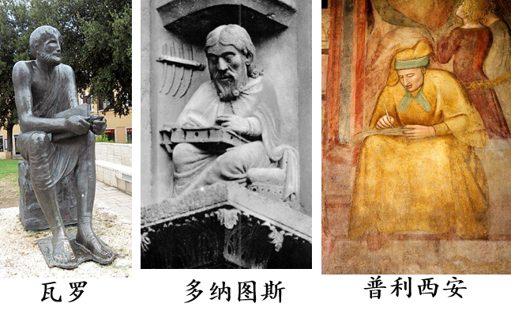
~~~~
古代印度的语言研究

1. 巴尼尼的《梵语语法》
2. 吠陀（Veda）
~~~~
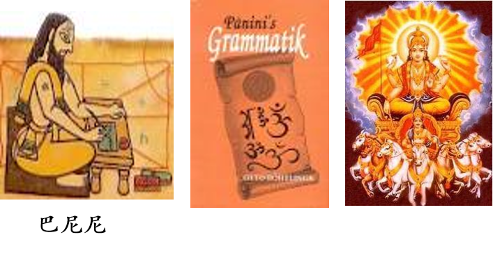
~~~~
吠陀（Veda），又译为韦达经、韦陀经、围陀经等，大约形成于公元前1000年，在口头上传诵了好几个世纪，到了公元前8世纪，才用文字记载下来。是婆罗门教和现代印度教最重要和最根本的经典。它是印度最古老的文献材料，主要文体是赞美诗、祈祷文和咒语，是印度人世代口口相传、长年累月结集而成的。“吠陀”的意思是“知识”、“启示”的意思。“吠陀”用古梵文写成，是印度宗教﹑哲学及文学之基础。
~~~~
古代阿拉伯的语言研究

1. 西巴维希的《书》（Al-kitabu）
2. 哈里尔编出了第一部阿拉伯语词典，建立了阿拉伯诗律的体系

~~~~
《书》是第一部有系统的阿拉伯语语法，首谈词类，确定名动形的定义，叙述了主格、属格、宾格、呼格的形式，助词、代词、数词的用法和名词、动词的构词法，然后谈句法，之后举出一些阿拉伯语的语音现象和词源现象。
~~~~
古代中国的语言研究

1. 语言哲学方面的探讨 
2. 方言研究
3. 小学研究
4. 中国语言学的建立
~~~~
语言哲学方面
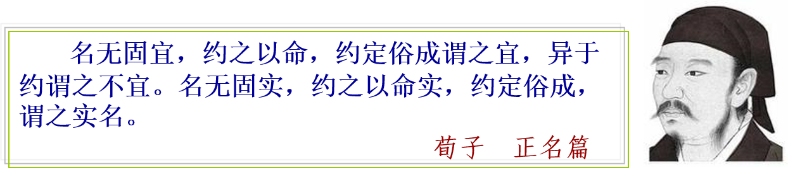
~~~~
方言研究方面
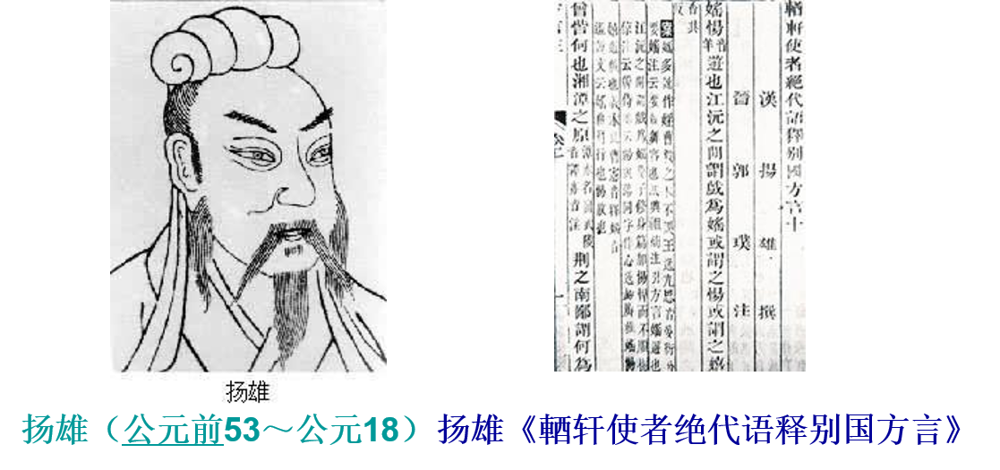
~~~~
小学研究 
1. 以字义研究为主的训诂学
2. 以字音研究为主的音韵学
3. 以字形研究为主的文字学
~~~~
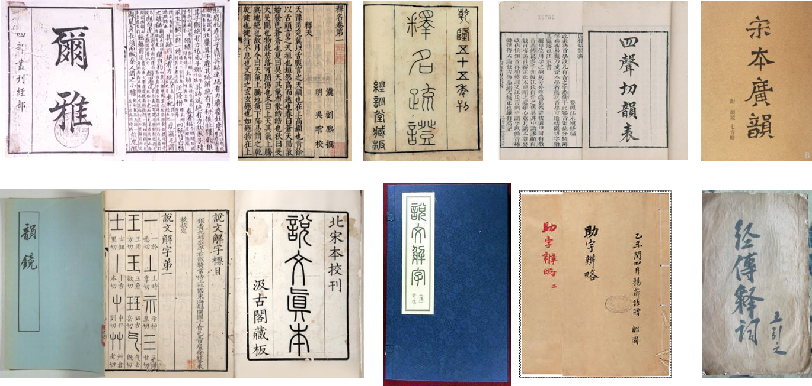
~~~~~
《马氏文通》是中国第一部体系完整的语法书
~~~~
语文学阶段的语言研究的特点：
1. 不是从语言的角度为语言而研究语言，语言研究是其他学科的附庸，还没有成为一门独立的科学。
2. 只局限于某一种语言的研究，而且大多是本族语。
3. 只研究书面语，对口语不予重视。
4. 研究方法上多失之于零散、静止和片面，缺乏系统的、全面的、发展的观点。
~~~~
### 历史比较语言学（19世纪）
19世纪初，西方语言学者开始运用历史比较法研究有亲属关系的语言，产生了历史比较语言学，从这时起，语言学开始走上独立的科学的道路。
~~~~
#### 历史比较语言学的发展

1. 初始阶段（19世纪前期）
2. 发展阶段（19世纪中期）
3. 成熟阶段（19世纪后期）
~~~~
初始阶段（19世纪前期）
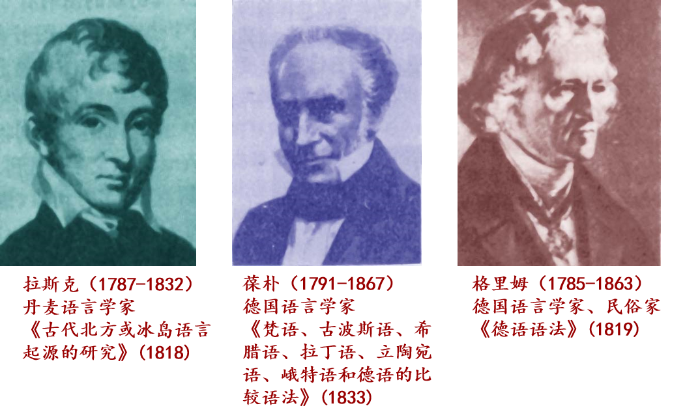
~~~~
发展阶段（19世纪中期）
- 19世纪中期，最有代表性的人物是德国的施莱赫尔(August Chleicher)，其代表作是《印度日耳曼语系语言比较语法纲要》。初期的比较语言学者已经认识到历史上有亲属关系的语言具有共同的原始母语，而这一母语已不再存在。到了中期施莱赫尔则开始具体“构拟”这种原始母语的形式。他受到生物学物种分类的启发，为亲属语言的历史演变过程设计了一种树形谱系图，使语言之间的亲属关系以直观的形式呈现在人们的面前。
~~~~
成熟阶段（19世纪后期）
- 19世纪的后25年是历史比较语言学的“青年语法学派”时期。这个学派的代表人物是奥斯特霍夫(H·0sthoff)和勃鲁格曼(K·Brugmann)。
~~~~
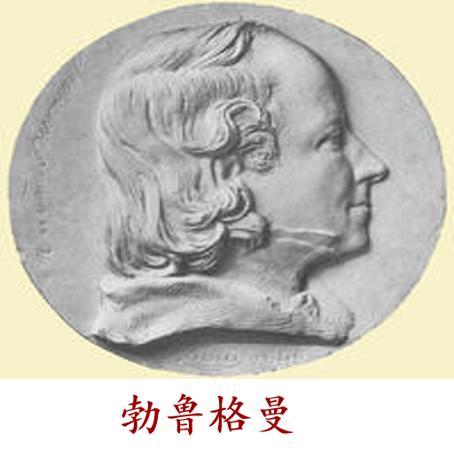
~~~~
青年语法学派有两大主张，一是语音演变规律无例外，如果有例外，也是由于交叉规律或其他因素引起的。二是类推在新的语言形式产生中起着重要作用。 
~~~~
历史比较语言学的基本观点

1. 每种语言均有与其他语言不同的特点，这些特点可以通过比较而被认识。
2. 比较可以揭示某些具有共同来源的语言的亲属关系，亲属语言可以组成语族和语系。
3. 语言的历史变化具有不平衡性，其中语音变化最快，而且是遵循严格的规律进行的，而语言中的其他，如词根、词缀、形态变化、则具有较强的稳固性。
4. 原始的基础语可以通过比较而得以重建和构拟，重建和构拟是历史比较语言学的灵魂。
~~~~
#### 普通语言学的建立
历史比较语言学由于涉及多种语言，这就为普通语言学的建立奠定了基础。19世纪中叶，普通语言学逐步形成，开始对人类语言进行系统的理论研究。德国洪堡特的《论人类语言结构的差异及其对人类精神发展的影响》比较全面系统的阐述了语言的一般理论，标志着普通语言学的建立，洪堡特为普通语言学的创始人。
~~~~
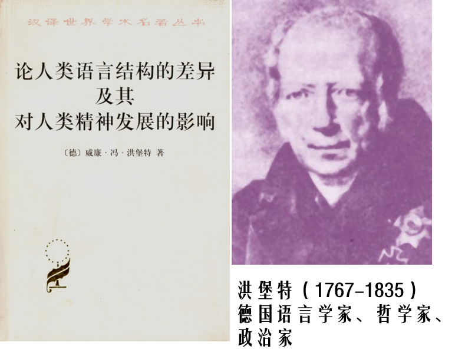
~~~~
### 现代语言学
1. 外国现代语言学研究
2. 国内现代语言学研究
~~~~
#### 外国现代语言学研究
20世纪初期，以瑞士语言学家费尔迪南·德·索绪尔的语言学说出现为标志，开始了现代语言学时期，这个时期大体分为结构主义语言学、转换生成语言学、功能主义语言学等阶段。 
~~~~~
##### 结构主义语言学
20世纪初，索绪尔的结构主义语言学的出现，给昌盛了一百多年的历史比较语言学画上了句号，人们将“现代语言学之父”这顶桂冠赠给了瑞士的这位杰出的语言学家。
~~~~
费尔迪南·德·索绪尔（1857-1913）原本是从事历史比较语言学的研究的，而且取得了令人称道的成果。但从20世纪初开始，他在语言的研究上开始走上了与历史比较语言学完全不同的道路。1906-1911年在日内瓦大学讲授普通语言学课程。1913年，56岁的索绪尔英年早逝。他的两个学生查尔斯·巴利和阿尔伯特·薛施埃根据学生的听课笔记，整理出了《普通语言学教程》这本不朽的著作，并于1916年出版。
~~~~
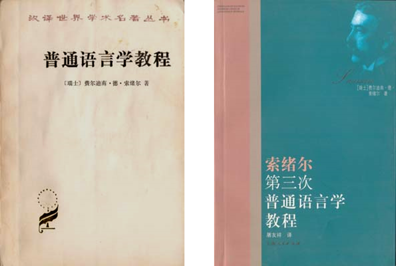
~~~~
##### 索绪尔《普通语言学教程》基本观点：
1. 区分了语言和言语两个重要概念。他认为，人的言语行为分为语言和言语两部分，语言学的研究对象是语言。
2. 把语言学分为内部语言学和外部语言学。内部语言学研究语言体系，外部语言学研究语言同社会、民族、政治、文化等因素的关系。
3. 区分了语言的共时性和历时性，进而，把语言学又分为共时语言学和历时语言学。共时就是静态的，历时就是演化的。
~~~~
4. 提出语言是一种表示意念的符号系统，认为语言符号能指和所指的联系是任意的。
5. 强调在语言中，各个要素及其构成成分都处于组合关系和聚合关系之中。
6. 区别了词语的意义和价值。索绪尔认为，每个语言单位都具有意义，在语言系统中各个单位有连带关系，其中每个语言单位的价值都是因为与其他单位同时存在的结果。
7. 认为语言是形式而不是实体。
~~~~
##### 结构主义语言学的分支流派
1. 布拉格学派，又称功能学派。   
2. 哥本哈根学派，又称语符学派。
3. 美国学派，又叫描写语言学派
~~~~
###### 1 布拉格学派
1. 创始人是马德修斯，代表人物是特鲁别茨科依、雅各布逊等。
2. 主要成就是发展了索绪尔的语言社会观，重视语言的社会功能，认为语言结构在很大程度上取决于语言功能。他们最突出的成果是音位学研究。
3. 代表作是特鲁别茨科伊的《音位学原理》1939
~~~~
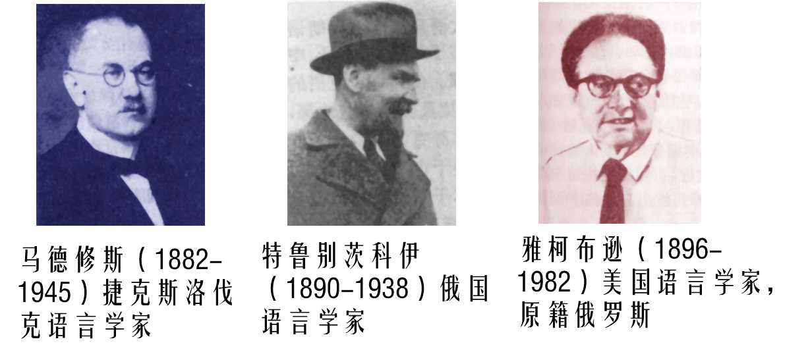
~~~~
######  2 哥本哈根学派
1. 代表人物:布龙达尔和叶尔姆斯列夫
2. 主要成就:把索绪尔的语言符号说发展到极端，认为语言只是一种语音和语义构成的符号
3. 代表作:布龙达尔的《结构语言学》（1939）、叶尔姆斯列夫的《语言理论导论》（1943）
~~~~
######  3 美国学派
1. 奠基人是鲍阿斯和萨丕尔，代表人物是布龙菲尔德。
2. 代表作:布龙菲尔德的《语言论》和萨丕尔的《语言论》，其中布龙菲尔德的《语言论》被称为美国描写语言学派的“圣经”。
~~~~
##### 美国学派主要特点：
1. 主张行为主义，反对心灵主义。他们认为语言就是可以观察到的言语行为的话语，语言研究应该客观描写人们的言语行为和话语，反对用内省方法研究语言。
2. 重视形式分析，忽视意义问题，也不考虑语言以外的事实，例如心理过程、社会和文化因素等。
3. 研究方法采用归纳法和结构分析法。他们运用分布和替代的理论方法从话语中切分出音位、语素和词，然后归纳出若干形式类，并用直接成分分析法分析语言的结构。
4. 注重口语和共时描写。
~~~~
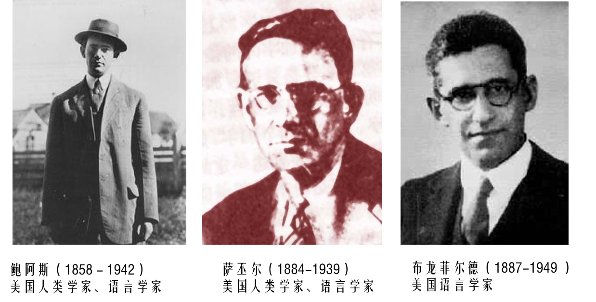
~~~~
##### 美国学派在布龙菲尔德后的三个分支
1. 以海里斯、霍凯特、特雷泽等为代表的耶鲁派，他们排斥意义因素，主张从音位学、词素首位学层次上分析语言；
2. 以派克、奈达等为代表的密执安派，他们继承了布龙菲尔德的研究方法，主要进行北美印第安语言的调查研究；
3. 以乔姆斯基为代表的麻省派，注重语义研究，给语言学带来了一场意义深刻的革命，开始了一个自然语言形式化研究的新时期。 
~~~~
##### 转换生成语言学
转换生成语言学产生于20世纪50年代末，以美国乔姆斯基《句法结构》一书的出版为标志。其活动中心是在美国麻萨诸塞州的麻省理工学院。在欧洲有一个专门研究转换一生成语法的学术组织，称为“旧大陆生成语言学协会”，它是一个国际性的生成学派的组织，于1975年秋成立于荷兰。 
~~~~
乔姆斯基，1928年生于美国宾西法尼亚州费城，中学毕业后，就读于宾西法尼亚大学，专攻语言学、数学和哲学，是描写语言学派后期主要代表人物海里斯的学生。1951年起开始语言研究，运用结构主义方法研究现代希伯莱语。在研究中他发现结构主义有很大的局限性，于是就试图建立一种新的语言研究方法和理念。1957年出版了《句法结构》一书。该书的问世，标志着转换生成语言学的建立。
~~~~
##### 转换生成语言学的基本观点
1. 结构主义采用归纳的方法，目标是描写，它研究语言事实；转换生成语言学采用演绎的方法，目标是解释，它研究造成语言事实的原因。转换生成语言学的研究对象是内在的语言能力，而不是外在的语言行为。 
2. 结构主义区分了语言和言语，强调研究语言；转换生成语言学区分了语言能力和语言行为，强调研究人类的语言能力。
3. 批评结构主义只注重表层描写，提出了“深层结构”的概念，认为表层结构说明语音，深层结构说明语义。
4. 反对结构主义一味排斥语义，主张在语法分析中引进语义。
5. 从研究目的上看，转换生成语言学试图建立一种人类语言共同的普遍原则—普遍语法，并且试图解释人们生成和理解话语的心理机制和过程，为此，乔姆斯基认为语言学在本质上应该是认知心理学的分支。
~~~~
##### 转换生成语言学的发展
- 第一阶段古典理论(Classical Theory)简称CT阶段 (1957—1965） 以1957年出版的《句法结构》一书为代表。
- 第二阶段标准理论(Standard Theory ) ，简称ST阶段 （1965—1970） 以1965年出版的《句法理论概要》一书为代表。
- 第三阶段扩展的标准理论(Extended Standard Theory，简称EST)阶段 （1970—1979） 以1970年发表的《深层结构、表层结构和语义解释》和1972年出版的《生成语法中的语义研究》为代表。
~~~~
- 第四阶段管辖与约束理论(简称“管约论”，Government and Binding The-ory ) ，简称GB阶段 （1979—1993）以1981年出版的《支配和约束讲演集》和1982年出版的《支配和约束理论的某些概念和结果》为代表。特点是研究重点从规则系统转到原则系统。
- 第五阶段最简方案(Minimalist Program)阶段。（ 1993—现在）.代表作是《极纯短语结构》(1994年)、《最简方案》(1995年)等
~~~~
上述五个阶段归并为两大时期：
 1957年到1979年是标准理论时期，包括古典理论、标准理论、扩展的标准理论三个阶段；
20世纪80年代初至今是“原则与参数理论”(Principles and Parameters Theory)时期，分为管约论和最简方案两个阶段。
~~~~
##### 转换生成语言学的主要贡献：
1. 区分了“语言能力”与“语言行为”
	- 语言能力指所有说本族语的人具有理解和说出从来没有听过或说过的句子的能力。语言行为是语言能力的外在表现，即话语本身。强调语言学家的主要任务是探索语言能力。
2. 区分了“深层结构”和“表层结构”
	- 深层结构即深藏在人们头脑里的逻辑语义结构，表层结构即句子用语音形式表现出来的结构。深层结构决定句子的意义，表层结构决定句子的形式。
3. 采用现代数理逻辑的形式化方法，引进数理逻辑“递归”的方法，根据有限的公理化的规则系统和原则系统，用演绎的方法生成无限的句子，以此来解释人类的语言能力。
~~~~
转换一生成语言学无论是在研究目的、研究对象，还是在研究方法上，都和传统语言学、结构主义语言学有着本质的区别。它为语言研究开辟了一条新的道路，展现了一个全新的发展方向，使语言学以新的面貌呈现于世。
~~~~
##### 功能主义语言学
功能主义语言学是在非主流结构主义语言学学派—伦敦学派的基础上发展演化而成的一个语言学流派，形成于20世纪70年代后期，其发源地在英国。       
~~~~
1. 代表人物是英国的韩礼德（MAK．Halliday )。
2. 主要成就：是重视语言的社会功能，主张把语言放到社会环境中去研究。
3. 主要特点：是强调语言的社会功能，与以乔姆斯基为代表的转换生成语言学分庭抗礼。  
4. 代表作：韩礼德的《语言功能的探索》《作为语言符号的语言:对语言和意义的社会理解》 《语法理论的范畴》《英语中的及物性和主位札记》《功能语法导论》
~~~~
系统、形式和功能是现代语言学中的三个基本概念。由于不同流派、不同学说研究语言系统的切入点有很大的不同，对形式和功能的理解、重视程度不同，导致研究范围、对语言性质的认识即语言观和研究方法的不同，从而形成了不同的研究模式。不同的研究模式之间尽管存在各种差别，但从总体上可以把它们归入形式主义语言学和功能主义语言学两大阵营。 
~~~~
形式语言学与功能语言学的主要分歧:
1. 功能主义与转换生成的根本区别在于对语言的自足性的看法不同。转换生成认为语言是自足的，因此只需要从语言内部去寻找对语言现象的解释，不需要考虑语言的外部因素。而功能主义否认语言的自足性，认为语言的结构形式是由语言的社会功能决定的，主张联系社会文化和语言环境等外部因素来解释语言现象。 
2. 形式语言学认为，句法是语法和语言的核心，是体现人类语言能力的最重要的方面；而系统功能语言学关注一切语言现象，并不把句法的地位看得那么重要。
3. 形式语言学重视“内省的语料”，不重视或不相信实际语料；而系统功能语言学比较重视交际中的实际语料，尽量少地使用个人的内省语料，而且对不同语体。不同风格的语料也要分别研究。
4. 形式语言学力求用数理逻辑对句法及其生成过程进行形式化的描写，因为他们认为句法的核心部分可由一组概括性极强的具有普遍性的规则、原则或制约条件来生成；而系统功能语言学则不强求语言描写的形式化，因为他们认为，许多语用因素和认知因素等，是难以形式化的。
5. 在对待语言共性的问题上，形式主义语言学把普遍语法看作是人类共有的语言能力，是其研究的目标。功能主义语言学承认语言共性的存在，但只把语言共性看作一种“柔性”的趋势，这种趋势在不同的语言中有深浅不同的体现.而适应于所有语言的不变的共性原则几乎认为是不存在的。
~~~~
##### 认知语言学
从功能主义语言学发展的总体趋势来看，可以把重视功能研究的不同语言学流派归入两个主要流派：一是功能语言学，一是认知语言学。
~~~~
- 认知语言学以第2代认知科学和体验哲学为理论背景，在反对转换生成语言学的基础上诞生，大约在20世纪80年代后期开始成型。
- 认知语言学的创立者普遍被认为是乔治·莱考夫、马克·约翰逊及朗奴·兰艾克。其中莱考夫及约翰逊专门研究语言中的隐喻及其与人类认知的关系；而兰艾克的专长在于认知语法。
~~~~
#### 国内现代语言学研究
1. 研究对象和目的更加明确，研究内容更加全面系统，对汉语事实和特点的探讨不断深化。 
2. 对国外语言理论由单向模仿到多元借鉴
3. 语言学学科内部分工日益明确，学科门类不断健全。 
~~~~
#### 国内现代语言学研究不足
1. 基于汉语事实的语言理论的建设关注不够。 
2. 没有形成较有影响的学派。 
~~~~
### 现代语言学的特点与发展趋势
~~~~
- 现代语言学的特点
1. 从研究目的看，人们开始从纯语言的角度研究语言，语言学真正成为现代科学体系中一门独立的学科。
2. 从研究对象看，不仅仅局限于本族的书面语，而且也研究现代口语，包括方言土语；不仅仅研究古代语言，也探讨现代语言；不仅仅研究自然语言，而且也研究人工语言、计算机程序语言等。
3. 从研究方向看，不再局限于描写语言中某些个别的、零散的问题，或某一方面的问题，而是从个别到一般、从局部到整体、从具体到抽象、从语言实际到语言理论，把语言作为一个形式系统和意义系统来研究。
4. 从研究程序看，不再是零散无序的经验主义的研究方式，而是具有了一些跟其他科学尤其是自然科学相同的特点，即先观察事实，再作出假设，然后通过论证进行系统研究，逐渐形成语言学的典型研究程序，这种程序从根本上否定了传统语言学的主观硬性规定的做法。
~~~~
- 现代语言学的发展趋势
1. 从语言系统的研究到语言使用的研究。
2. 从侧重形式研究到重视语义研究。
3. 从一家独尊到诸说纷呈。
4. 从本体研究到边缘学科的建立。
5. 语言学的重心从结构转入建构。
~~~~
在现代科学体系中（包括社会科学、自然科学），语言学是一门领先的，关键的学科。
~~~~
### 请同学们思考下列问题
1. 古代希腊和罗马、印度、阿拉伯、中国的语言研究各自的主要贡献是什么？
2. 比较语文学阶段国内和国外在语言研究中的异同。
3. 语文学阶段语言研究的主要特点是什么？
4. 历史比较语言学在语言学史中的重要作用是什么？
5. 简述索绪尔语言理论的基本观点，并加以评价。
6. 结构主义语言学主要分支学派有哪些？其主要观点是什么？
7. 概述转换生成语言学的发展过程。
8. 系统功能语言学的主要理论是什么？
9. 中国的语言研究有哪些特点？今后应该如何发展？
10. 现代语言学的发展特点是什么？谈谈现代语言学的发展趋势。 
