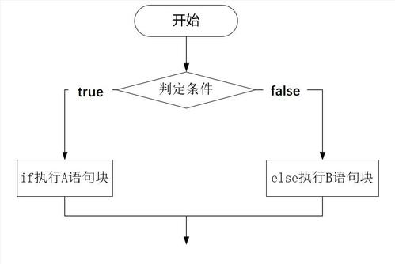
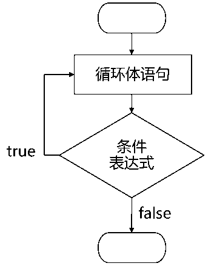

# 自然语言处理基础

<br>
渤海大学文学院

朱波

----

我们能够很容易地得到数百万数量级的文本。假设我们会写一些简单的程序，那可以用它来做些什么？本章将解决以下几个问题。

（1）通过将技术性较简单的程序与大规模文本结合起来，我们能实现什么？

（2）如何自动地提取出关键字和词组，用来总结文本的风格和内容？

（3）Python编程语言为上述工作提供了哪些工具和技术？

（4）自然语言处理中有哪些有趣的挑战呢？

[<](#/)

----

1. [Python入门](#/2)
2. [NLTK](#/3)
3. [结构化NLP程序](#/4)
4. [中文自动分词](#/5)
5. [词性标注](#/6)
6. [NLP中的概率图模型](#/7)
7. [句法理论与自动分析](#/8)
8. [NLP中的深度学习](#/9)

---

## Python入门

Python安装配置及基本语法

[<](#/)

----
## Python安装配置

* Anaconda介绍
* Anaconda安装配置
* Anaconda常用操作命令
* Sublime安装配置

----

### Anaconda介绍
Anaconda指的是一个开源的Python发行版本，其包含了conda、Python等180多个科学包及其依赖项。 

----
### Anaconda安装

1. Anaconda下载链接：https://www.anaconda.com/download/
2. 添加环境变量,勾选 <font color=yellow>Add Anaconda to the system PATH environment variable</font>
3. 测试是否安装成功, 在控制台输入命令<font color=yellow> conda --version</font>

----
### Anaconda配置
1. 创建虚拟环境，<font color=yellow> conda  create -n py36  python=3.6</font>
2. 切换虚拟环境，<font color=yellow> activate py36 </font>

----
### Anaconda常用操作命令
命令     | 功能
-------- | ---
<font color=yellow>conda env list</font> | 查询已创建虚拟环境
<font color=yellow>conda install name</font> | 安装第三方包
<font color=yellow>pip install name</font> | 安装第三方包
<font color=yellow>pip uninstall  name</font> | 卸载第三方包
<font color=yellow>conda list</font> | 查看环境包信息
<font color=yellow>conda remove -n name --all</font>    | 删除指定虚拟环境下所有包
<font color=yellow>conda remove --name --all</font>    | 删除已创建虚拟环境

----
### Sublime介绍
A sophisticated text editor for
code, markup and prose

----
### Sublime安装
1. Sublime下载链接：https://www.sublimetext.com/3
2. 安装Package Control,安装方法链接：https://packagecontrol.io/installation
3. 按ctrl+shift+p，在打开的文本框中输入Anaconda,并点击安装

----
### Sublime配置
选择<font color=yellow>Preferences-package Setting-Anaconda-Settings-Users</font>选项，键入以下json数据。

```json
{
	"python_interpreter": 
	"C:/Users/Administrator/.conda/envs/kpy3.6/python.exe",
	"suppress_word_completions":true,
	"suppress_explicit_completions":true,
	"completions_parameters":true,
	"anaconda_linting": false,
}
```

----
### Python介绍
Python is a <font color=yellow>programming language</font> that lets you work quickly and integrate systems more effectively.
----
### Python基本语法


----
第一个Python程序

对于大多数程序语言，第一个入门编程代码便是"Hello World！"，以下代码为使用Python输出"Hello World！"：
```python
#!/usr/bin/python3
 
print("Hello, World!")
```

----

 Python保留字
```python
>>> import keyword
>>> keyword.kwlist
['False', 'None', 'True', 'and', 'as', 'assert', 
'break', 'class', 'continue', 'def', 'del', 'elif', 
'else', 'except', 'finally', 'for', 'from',
'global', 'if', 'import', 'in', 'is', 'lambda', 
'nonlocal', 'not', 'or', 'pass', 'raise', 
'return', 'try', 'while', 'with', 'yield']
```

----
字符串(String)

字符串是 Python 中最常用的数据类型。我们可以使用引号( ' 或 " )来创建字符串。  
创建字符串很简单，只要为变量分配一个值即可。


----
单行注释
```python
#!/usr/bin/python3
 
# 第一个注释
print ("Hello, Python!") # 第二个注释
```
----


多行注释

可以用多个 <font color=yellow>#</font> 号，还有 <font color=yellow>''' </font>和 <font color=yellow>"""</font>：
```python
#!/usr/bin/python3
 
# 第一个注释
# 第二个注释
'''
第三注释
第四注释
'''
"""
第五注释
第六注释
"""
print ("Hello, Python!")
```

----
字符串运算符

字符串可以用运算符"<font color=yellow>+</font>"连接在一起，用运算符"<font color=yellow>*</font>"重复。
----
```python
#!/usr/bin/python3
 
str='Trump'
print(str + '你好')        # 连接字符串

print(str*3)

```
----
字符串连接结果
```python
Trump你好
```
字符串重复结果
```python
TrumpTrumpTrump
```
----
字符串索引
- Python 中的字符串有两种索引方式，从左往右以 0 开始，从右往左以 -1 开始。
- Python中的字符串不能改变。
- Python 没有单独的字符类型，一个字符就是长度为 1 的字符串。
- 字符串的截取的语法格式如下：变量[头下标:尾下标:步长]
----
Python访问字符串中的值
```python
#!/usr/bin/python3
 
var1 = 'Hello World!'
var2 = "Runoob"
 
print ("var1[0]: ", var1[0])
print ("var2[1:5]: ", var2[1:5])
```
----
访问结果
```python
var1[0]:  H
var2[1:5]:  unoo
```
----
练习
```python
#!/usr/bin/python3
 
str='Runoob'
 
print(str)                 # 输出字符串
print(str[0:-1])           # 输出第一个到倒数第二个的所有字符
print(str[0])              # 输出字符串第一个字符
print(str[2:5])            # 输出从第三个开始到第五个的字符
print(str[2:])             # 输出从第三个开始的后的所有字符
print(str * 2)             # 输出字符串两次
print(str + '你好')        # 连接字符串
```
----
输出结果

```python
str: Runoo
str[0:-1]: R
str[2:5]: noo
str[2:]: noob
str * 2: RunoobRunoob
str + '你好': Runoob你好
```
----
Python字符串运算符

下表实例变量a值为字符串 "Hello"，b变量值为字符串 "Python"：

操作符 | 描述 | 实例 | 输出结果
---|---|--- | --- 
+| 字符串链接 | a + b | HelloPython
\* | 重复输出字符串 | a\*2 | HelloHello
[] | 通过索引获取字符串中字符 | a[1] | e
[:] | 截取字符串中的一部分，遵循左闭右开原则，str[0,2] 是不包含第 3 个字符的。 | a[1:4] | ell
in | 成员运算符 - 如果字符串中包含给定的字符返回 True | 'H' in a | True
not in | 成员运算符 - 如果字符串中不包含给定的字符返回 True | 'M' not in a | True

----
Python转义字符

转义字符 | 描述
---|---
\\ | 反斜杠符号
\' | 单引号
\" | 双引号
\t | 横向制表符
\n | 换行
\r | 回车
----
转义字符在Python中的使用
```python
print('hello\nrunoob')      # 使用反斜杠(\)+n转义特殊字符
print('hello\trunoob')      # 使用反斜杠(\)+t转义特殊字符
```

----
输出结果
```python
"hello\nrunoob":
hello
runoob
"hello\trunoob":hello	runoob
```

----
Python字符串格式化
```python
#!/usr/bin/python3
 
print ("我叫 %s 今年 %d 岁!" % ('小明', 10))
```
----
输出结果
```python
我叫 小明 今年 10 岁!
```
----
python字符串格式化常用符号:

符号 | 描述
---|---
%s |  格式化字符串
%d | 格式化整数

----
Python的字符串内建函数

序号 | 方法及描述
---|---
1 | endswith(suffix, beg=0, end=len(string))方法用于判断字符串是否以指定后缀结尾，如果以指定后缀结尾返回 True，否则返回 False。可选参数 "start" 与 "end" 为检索字符串的开始与结束位置。
2 | startswith(substr, beg=0,end=len(string)) 方法用于检查字符串是否是以指定子字符串开头，如果是则返回 True，否则返回 False。如果参数 beg 和 end 指定值，则在指定范围内检查。
3 | len(string) 返回字符串长度

----
Python的字符串内建函数

序号 | 方法及描述
---|---
4 | find() 方法检测字符串中是否包含子字符串 str ，如果指定 beg（开始） 和 end（结束） 范围，则检查是否包含在指定范围内，如果指定范围内如果包含指定索引值，返回的是索引值在字符串中的起始位置。如果不包含索引值，返回-1。
5 | index() 方法检测字符串中是否包含子字符串 str ，如果指定 beg（开始） 和 end（结束） 范围，则检查是否包含在指定范围内，该方法与 python find()方法一样，只不过如果str不在 string中会报一个异常。
6 |  join() 方法用于将序列中的元素以指定的字符连接生成一个新的字符串。

----
Python的字符串内建函数

序号 | 方法及描述
---|---
7 | replace() 方法把字符串中的 old（旧字符串） 替换成 new(新字符串)，如果指定第三个参数max，则替换不超过 max 次。
8 | split() 通过指定分隔符对字符串进行切片，如果第二个参数 num 有指定值，则分割为 num+1 个子字符串。
9 |  strip() 方法用于移除字符串头尾指定的字符（默认为空格）或字符序列。

----
Python列表

序列是Python中最基本的数据结构。序列中的每个元素都分配一个数字，即元素的位置，或索引，第一个索引是0，第二个索引是1，依此类推。

列表是最常用的Python数据类型，它可以作为一个方括号内的逗号分隔值出现。

列表的数据项不需要具有相同的类型

----
Python列表示例
```python
list1 = ['Google', 'Runoob', 1997, 2000];
list2 = [1, 2, 3, 4, 5 ];
list3 = ["a", "b", "c", "d"];
```
----
访问列表中的值

使用<font color=yellow>下标索引</font>来访问列表中的值，同样你也可以使用方括号的形式截取字符，如下所示
```python
#!/usr/bin/python3
 
list1 = ['Google', 'Runoob', 1997, 2000];
list2 = [1, 2, 3, 4, 5, 6, 7 ];
 
print ("list1[0]: ", list1[0])
print ("list2[1:5]: ", list2[1:5])
```
----
输出结果：
```python
list1[0]:  Google
list2[1:5]:  [2, 3, 4, 5]
```

----
更新列表
```python
#!/usr/bin/python3
 
list = ['Google', 'Runoob', 1997, 2000]
 
print ("第三个元素为 : ", list[2])
list[2] = 2001
print ("更新后的第三个元素为 : ", list[2])
```

----

以上实例输出结果：
```
第三个元素为 :  1997
更新后的第三个元素为 :  2001
```
----
删除列表元素
```python
#!/usr/bin/python3
 
list = ['Google', 'Runoob', 1997, 2000]
 
print ("原始列表 : ", list)
del list[2]
print ("删除第三个元素 : ", list)
```
----
以上实例输出结果：
```
原始列表 :  ['Google', 'Runoob', 1997, 2000]
删除第三个元素 :  ['Google', 'Runoob', 2000]
```
----
#### Python列表函数&方法

Python函数与方法的区别
1. 形式方面
	- 函数：通过“函数名（）”的方式进行调用。

	- 方法：通过“对象.方法名”的方式进行调用。
2. 作用域方面
	- 函数执行完成后使用的空间会自动释放
	- 通过实例化的对象进行方法的调用，调用后开辟的空间不会释放
----
Python包含以下函数:

序号 | 函数 | 功能
---|---|---
1 | len(list) | 列表元素个数
2 | max(list) | 返回列表元素最大值
3 | min(list) | 返回列表元素最小值
4 | list(seq) | 将元组转换为列表
----
Python包含以下方法:

序号 | 方法 | 功能
---|---|---
1 | list.append(obj) | 在列表末尾添加新的对象
2 | list.count(obj) | 统计某个元素在列表中出现的次数
3 | list.index(obj) | 从列表中找出某个值第一个匹配项的索引位置
4 | list.insert(index, obj) | 将对象插入列表
----
Python包含以下方法:

序号 | 方法 | 功能
---|---|---
5 | list.remove(obj) | 移除列表中某个值的第一个匹配项
6 | list.reverse() | 反向列表中元素
7 | list.sort(cmp=None, key=None, reverse=False) | 对原列表进行排序
8 | list.clear() | 清空列表
----
Python 字典

字典是另一种可变容器模型，且可存储任意类型对象。

字典的每个键值(key=>value)对用冒号(:)分割，每个对之间用逗号(,)分割，整个字典包括在花括号({})中 ,格式如下所示：
```python
d = {key1 : value1, key2 : value2 }
```
----
Python 字典

键必须是唯一的，但值则不必。

值可以取任何数据类型，但键必须是不可变的，如字符串，数字或元组。
一个简单的字典实例：
```python 
dict = {'Alice': '2341', 'Beth': '9102', 'Cecil': '3258'}
```
也可如此创建字典：
```python
dict1 = { 'abc': 456 };
dict2 = { 'abc': 123, 98.6: 37 };
```
----
访问字典里的值
把相应的键放入到方括号中，如下实例:
```python
#!/usr/bin/python3
 
dict = {'Name': 'Runoob', 'Age': 7, 'Class': 'First'}
 
print ("dict['Name']: ", dict['Name'])
print ("dict['Age']: ", dict['Age'])
```
----
以上实例输出结果：
```
dict['Name']:  Runoob
dict['Age']:  7
```
----
如果用字典里没有的键访问数据，会输出错误如下：
```python
#!/usr/bin/python3
 
dict = {'Name': 'Runoob', 'Age': 7, 'Class': 'First'};
 
print ("dict['Alice']: ", dict['Alice'])
```
----
以上实例输出结果：
```
Traceback (most recent call last):
  File "test.py", line 5, in <module>
    print ("dict['Alice']: ", dict['Alice'])
KeyError: 'Alice'
```
----
修改字典
向字典添加新内容的方法是增加新的键/值对，修改或删除已有键/值对如下实例:
```python
#!/usr/bin/python3
 
dict = {'Name': 'Runoob', 'Age': 7, 'Class': 'First'}
 
dict['Age'] = 8;               # 更新 Age
dict['School'] = "渤海大学"  # 添加信息
 
print ("dict['Age']: ", dict['Age'])
print ("dict['School']: ", dict['School'])
```
----
以上实例输出结果：
```
dict['Age']:  8
dict['School']:  渤海大学
```
----
删除字典元素
```python
#!/usr/bin/python3
 
dict = {'Name': 'Runoob', 'Age': 7, 'Class': 'First'}
 
del dict['Name'] # 删除键 'Name'
dict.clear()     # 清空字典
del dict         # 删除字典
 
print ("dict['Age']: ", dict['Age'])
print ("dict['School']: ", dict['School'])
```
这会引发异常，因为执行 del 操作后字典不再存在：
```
Traceback (most recent call last):
  File "test.py", line 9, in <module>
    print ("dict['Age']: ", dict['Age'])
TypeError: 'type' object is not subscriptable
```
----
字典内置函数&方法
----
字典包含以下函数:

序号 | 函数及描述 | 功能
---|---|---
1 | len(dict) | 计算字典元素个数
2 | str(dict) | 输出字典
3 | type(var) | 返回输入的变量类型
----
字典包含以下主要方法:

序号 | 方法及描述 | 功能
---|---|---
1 | key in dict | 如果键在字典dict里返回true，否则返回false
2 | radiansdict.items() | 以列表返回可遍历的(键, 值) 元组数组
3 | radiansdict.keys() | 返回一个迭代器，可以使用 list() 来转换为列表
4 | radiansdict.values() | 返回一个迭代器，可以使用 list() 来转换为列表
5 | pop(key[,default]) | 删除字典给定键 key 所对应的值，返回值为被删除的值。key值必须给出。 否则，返回default值。
----
#### Python 条件控制语句

Python条件语句是通过一条或多条语句的执行结果（True或者False）来决定执行的代码块。

可以通过下图来简单了解条件语句的执行过程:


----
 if 语句
Python中if语句的一般形式如下所示：

```python
if condition_1:
    statement_block_1
elif condition_2:
    statement_block_2
else:
    statement_block_3
```
----
<font color=yellow>注意：</font>

1. 每个条件后面要使用冒号<font color=yellow>:</font>，表示接下来是满足条件后要执行的语句块。
2. 使用缩进来划分语句块，相同缩进数的语句在一起组成一个语句块。
3. 在Python中没有switch – case语句。
----
以下是一个简单的 if 实例：
```python
#!/usr/bin/python3
 
var1 = 100
if var1>10:
    print ("var1>10 - if 表达式条件为 true")
    print (var1)
 
var2 = 0
if var2>10:
    print ("var2>10 - if 表达式条件为 true")
    print (var2)
print ("Good bye!")
```
----
执行以上代码，输出结果为：

```
var1>10 - if 表达式条件为 true
100
Good bye!
```
----
if语句中常用的操作运算符:

操作符 | 描述
---|---
< | 小于
<= | 小于或等于
\> | 大于
\>= | 大于或等于
== | 等于，比较对象是否相等
!= | 不等于
----
实例
```python
#!/usr/bin/python3
 
# 程序演示了 == 操作符
# 使用数字
print(5 == 6)
# 使用变量
x = 5
y = 8
print(x == y)
```
----
以上实例输出结果：
```
False
False
```

----
#### Python 循环语句


循环语句的控制结构图如下所示：


Python中的循环语句有 for 和 while。
----
while 循环

Python中while语句的一般形式：
```python
while 判断条件：
    语句
```
同样需要注意冒号和缩进。

另外，在Python中没有do..while循环。
----
以下实例使用了 while 来计算 1 到 100 的总和：
```python
#!/usr/bin/python3
 
n = 100
 
sum = 0
counter = 1
while counter <= n:
    sum = sum + counter
    counter += 1
 
print("1 到 %d 之和为: %d" % (n,sum))
```
----
执行结果如下：
```
1 到 100 之和为: 5050
```
----
for 语句

Python for循环可以遍历任何序列的项目，如一个列表或者一个字符串。

for循环的一般格式如下：
```python
for variable in sequence:
	statements
else:
    statements
```
----
for循环实例
```python
languages = ["C", "C++", "Perl", "Python"] 
for x in languages:
	print (x)
```
----
执行结果如下：
```
C
C++
Perl
Python
```
----
以下 for 实例中使用了 break 语句，break 语句用于跳出当前循环体：
```python
#!/usr/bin/python3
 
sites = ["Baidu", "Google","Runoob","Taobao"]
for site in sites:
    if site == "Runoob":
        print("菜鸟教程!")
        break
    print("循环数据 " + site)
else:
    print("没有循环数据!")
print("完成循环!")
```
----
执行以上脚本输出结果为：
```
当前字母为 : R
当前字母为 : u
当前字母为 : n
当前字母为 : o
当前字母为 : o
当期变量值为 : 10
当期变量值为 : 9
当期变量值为 : 8
当期变量值为 : 7
当期变量值为 : 6
Good bye!
```

----
continue语句被用来告诉Python跳过当前循环块中的剩余语句，然后继续进行下一轮循环。
```python
#!/usr/bin/python3
 
for letter in 'Runoob':     # 第一个实例
   if letter == 'o':        # 字母为 o 时跳过输出
      continue
   print ('当前字母 :', letter)
 
var = 10                    # 第二个实例
while var > 0:              
   var = var -1
   if var == 5:             # 变量为 5 时跳过输出
      continue
   print ('当前变量值 :', var)
print ("Good bye!")
```
----
执行以上脚本输出结果为：
```
当前字母 : R
当前字母 : u
当前字母 : n
当前字母 : b
当前变量值 : 9
当前变量值 : 8
当前变量值 : 7
当前变量值 : 6
当前变量值 : 4
当前变量值 : 3
当前变量值 : 2
当前变量值 : 1
当前变量值 : 0
Good bye!
```
----
#### Python File(文件) 方法
open() 方法

open() 方法用于打开一个文件，并返回文件对象，在对文件进行处理过程都需要使用到这个函数，如果该文件无法被打开，会抛出 OSError。

<font color=yellow>使用 open() 方法一定要保证关闭文件对象，即调用 close() 方法。</font>
----
open() 函数常用形式是接收两个参数：文件名(file)和模式(mode)。
```python
open(file, mode='r')
```
完整的语法格式为：
```python
open(file, mode='r', buffering=-1, encoding=None, errors=None, newline=None, closefd=True, opener=None)
```
----
- file: 必需，文件路径（相对或者绝对路径）。
- mode: 可选，文件打开模式
- buffering: 设置缓冲
- encoding: 一般使用utf8
- errors: 报错级别
- newline: 区分换行符
- closefd: 传入的file参数类型
- opener:

----
mode 参数有：

模式 | 描述
---|---
t | 文本模式 (默认)。
\+ | 打开一个文件进行更新(可读可写)。
r | 以只读方式打开文件。文件的指针将会放在文件的开头。这是默认模式。
w | 打开一个文件只用于写入。如果该文件已存在则打开文件，并从开头开始编辑，即原有内容会被删除。如果该文件不存在，创建新文件。
w+ | 打开一个文件用于读写。如果该文件已存在则打开文件，并从开头开始编辑，即原有内容会被删除。如果该文件不存在，创建新文件。
----
file 对象

file 对象使用 open 函数来创建，下表列出了 file 对象常用的函数：

序号 | 方法 | 描述
---|--- | ---
1 | file.close() | 关闭文件。关闭后文件不能再进行读写操作。
2 | file.next() | 返回文件下一行。
3 | file.readline([size]) | 读取整行，包括 "\n" 字符。

----

序号 | 方法 | 描述
---|--- | ---
4 | file.readlines([sizeint]) | 读取所有行并返回列表
5 | file.write(str) | 将字符串写入文件，返回的是写入的字符长度。
6 | file.writelines(sequence) | 向文件写入一个序列字符串列表。


---


## NLTK

Live happily ever after.

[<](#/)

---

## 结构化NLP程序

Live happily ever after.

[<](#/)

---

## 中文自动分词

Live happily ever after.

[<](#/)

---

## 词性标注

Live happily ever after.

[<](#/)

---

## 句法理论与自动分析

Live happily ever after.

[<](#/)

---

## NLP中的深度学习

Live happily ever after.

[<](#/)