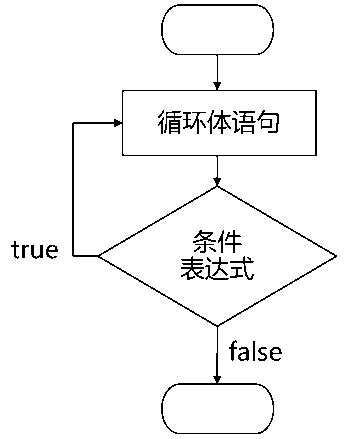

## 第一章 Python入门

1. Python安装配置
2. Python基础语法

~~~~
### Python安装配置

* Anaconda介绍
* Anaconda安装配置
* Anaconda常用操作命令
* Sublime安装配置

~~~~

#### Anaconda介绍
Anaconda指的是一个开源的Python发行版本，其包含了conda、Python等180多个科学包及其依赖项。 

~~~~
### Anaconda安装

1. Anaconda下载链接：https://www.anaconda.com/download/
2. 添加环境变量,勾选 <font color=yellow>Add Anaconda to the system PATH environment variable</font>
3. 测试是否安装成功, 在控制台输入命令<font color=yellow> conda --version</font>

~~~~
### Anaconda配置
1. 创建虚拟环境，<font color=yellow> conda  create -n py36  python=3.6</font>
2. 切换虚拟环境，<font color=yellow> activate py36 </font>

~~~~
### Anaconda常用操作命令
命令     | 功能
~~~~~~~~ | ---
<font color=yellow>conda env list</font> | 查询已创建虚拟环境
<font color=yellow>conda install name</font> | 安装第三方包
<font color=yellow>pip install name</font> | 安装第三方包
<font color=yellow>pip uninstall  name</font> | 卸载第三方包
<font color=yellow>conda list</font> | 查看环境包信息
<font color=yellow>conda remove -n name --all</font>    | 删除指定虚拟环境下所有包
<font color=yellow>conda remove --name --all</font>    | 删除已创建虚拟环境

~~~~
### Sublime介绍
A sophisticated text editor for
code, markup and prose

~~~~
### Sublime安装
1. Sublime下载链接：https://www.sublimetext.com/3
2. 安装Package Control,安装方法链接：https://packagecontrol.io/installation
3. 按ctrl+shift+p，在打开的文本框中输入Anaconda,并点击安装

~~~~
### Sublime配置
选择<font color=yellow>Preferences-package Setting-Anaconda-Settings-Users</font>选项，键入以下json数据。

```json
{
	"python_interpreter": 
	"C:/Users/Administrator/.conda/envs/kpy3.6/python.exe",
	"suppress_word_completions":true,
	"suppress_explicit_completions":true,
	"completions_parameters":true,
	"anaconda_linting": false,
}
```

### sublime代理设置


1、软件设置位置

Preferences > Package Settings > Package Control > Settings - User

2、设置代理

 添加

"http_proxy": "http://127.0.0.1:8123",
"https_proxy": "http://127.0.0.1:8123"

3、设置仓库位置，一下位置可用

"channels": [
        "http://cst.stu.126.net/u/json/cms/channel_v3.json"
    ]

~~~~
### Python介绍
Python is a <font color=yellow>programming language</font> that lets you work quickly and integrate systems more effectively.
~~~~
### Python基础语法


~~~~
第一个Python程序

第一个编程代码"Hello World！"，以下代码为使用Python输出"Hello World！"：
```python
#!/usr/bin/python3
 
print("Hello, World!")
```

~~~~

 Python保留字
```python
>>> import keyword
>>> keyword.kwlist
['False', 'None', 'True', 'and', 'as', 'assert', 
'break', 'class', 'continue', 'def', 'del', 'elif', 
'else', 'except', 'finally', 'for', 'from',
'global', 'if', 'import', 'in', 'is', 'lambda', 
'nonlocal', 'not', 'or', 'pass', 'raise', 
'return', 'try', 'while', 'with', 'yield']
```

~~~~
字符串(String)

字符串是 Python 中最常用的数据类型。我们可以使用引号( ' 或 " )来创建字符串。  
创建字符串很简单，只要为变量分配一个值即可。


~~~~
单行注释
```python
#!/usr/bin/python3
 
# 第一个注释
print ("Hello, Python!") # 第二个注释
```
~~~~


多行注释

可以用多个 <font color=yellow>#</font> 号，还有 <font color=yellow>''' </font>和 <font color=yellow>"""</font>：
```python
#!/usr/bin/python3
 
# 第一个注释
# 第二个注释
'''
第三注释
第四注释
'''
"""
第五注释
第六注释
"""
print ("Hello, Python!")
```

~~~~
字符串运算符

字符串可以用运算符"<font color=yellow>+</font>"连接在一起，用运算符"<font color=yellow>*</font>"重复。
~~~~
```python
#!/usr/bin/python3
 
str='Trump'
print(str + '你好')        # 连接字符串

print(str*3)

```
~~~~
字符串连接结果
```python
Trump你好
```
字符串重复结果
```python
TrumpTrumpTrump
```
~~~~
字符串索引
- Python 中的字符串有两种索引方式，从左往右以 0 开始，从右往左以 -1 开始。
- Python中的字符串不能改变。
- Python 没有单独的字符类型，一个字符就是长度为 1 的字符串。
- 字符串的截取的语法格式如下：变量[头下标:尾下标:步长]
~~~~
Python访问字符串中的值
```python
#!/usr/bin/python3
 
var1 = 'Hello World!'
var2 = "Runoob"
 
print ("var1[0]: ", var1[0])
print ("var2[1:5]: ", var2[1:5])
```
~~~~
访问结果
```python
var1[0]:  H
var2[1:5]:  unoo
```
~~~~
练习
```python
#!/usr/bin/python3
 
str='Runoob'
 
print(str)                 # 输出字符串
print(str[0:-1])           # 输出第一个到倒数第二个的所有字符
print(str[0])              # 输出字符串第一个字符
print(str[2:5])            # 输出从第三个开始到第五个的字符
print(str[2:])             # 输出从第三个开始的后的所有字符
print(str * 2)             # 输出字符串两次
print(str + '你好')        # 连接字符串
```
~~~~
输出结果

```python
str: Runoo
str[0:-1]: R
str[2:5]: noo
str[2:]: noob
str * 2: RunoobRunoob
str + '你好': Runoob你好
```
~~~~
Python字符串运算符总结

下表实例变量a值为字符串 "Hello"，b变量值为字符串 "Python"：

操作符 | 描述 | 实例 | 输出结果
---|---|--- | --- 
+| 字符串链接 | a + b | HelloPython
\* | 重复输出字符串 | a\*2 | HelloHello
[] | 通过索引获取字符串中字符 | a[1] | e
[:] | 截取字符串中的一部分，遵循左闭右开原则，str[0,2] 是不包含第 3 个字符的。 | a[1:4] | ell
in | 成员运算符 - 如果字符串中包含给定的字符返回 True | 'H' in a | True
not in | 成员运算符 - 如果字符串中不包含给定的字符返回 True | 'M' not in a | True

~~~~
Python转义字符

转义字符 | 描述
---|---
\\ | 反斜杠符号
\' | 单引号
\" | 双引号
\t | 横向制表符
\n | 换行
\r | 回车
~~~~
转义字符在Python中的使用
```python
print('hello\nrunoob')      # 使用反斜杠(\)+n转义特殊字符
print('hello\trunoob')      # 使用反斜杠(\)+t转义特殊字符
```

~~~~
输出结果
```python
"hello\nrunoob":
hello
runoob
"hello\trunoob":hello	runoob
```

~~~~
Python字符串格式化
```python
#!/usr/bin/python3
 
print ("我叫 %s 今年 %d 岁!" % ('小明', 10))
```
~~~~
输出结果
```python
我叫 小明 今年 10 岁!
```
~~~~
python字符串格式化常用符号:

符号 | 描述
---|---
%s |  格式化字符串
%d | 格式化整数

~~~~
Python字符串内建函数与方法
~~~~
Python函数与方法的区别
1. 形式方面
  - 函数：通过“函数名（）”的方式进行调用。

  - 方法：通过“对象.方法名”的方式进行调用。
2. 作用域方面
  - 函数执行完成后使用的空间会自动释放
  - 通过实例化的对象进行方法的调用，调用后开辟的空间不会释放
~~~~
字符串内建函数

序号 | 函数|功能
---|---|---
1 | len(string) |返回字符串长度

~~~~
字符串内建方法

序号 | 方法|功能
---|---|---
1 | endswith(suffix)|用于判断字符串是否以指定后缀结尾，返回True或False
2 | startswith(substr) |用于检查字符串是否是以指定子字符串开头，返回True或False
3 |  strip()  |移除字符串头尾指定的字符（默认为空格）或字符序列
~~~~

字符串内建方法

序号 | 方法| 功能
---|---|---
4 | replace() |把旧字符串替换成新字符串
5 | split()  |通过指定分隔符对字符串进行切片
6 |  join() |用于将序列中的元素以指定的字符连接生成一个新的字符串
~~~~

字符串内建方法

序号 | 方法|功能
---|---|---
7 | find() |检测字符串中是否包含子字符串 str ，如果包含指定索引值，如果不包含索引值，返回-1。
8 | index() |检测字符串中是否包含子字符串 str ，该方法与 python find()方法一样，只不过如果str不在 string中会报一个异常。


~~~~
Python列表

- 序列是Python中最基本的数据结构。序列中的每个元素都分配一个数字，即元素的位置，或索引，第一个索引是0，第二个索引是1，依此类推。

- 列表是最常用的Python数据类型，它可以作为一个<font color=yellow>方括号</font>内的<font color=yellow>逗号</font>分隔值出现。

- 列表的数据项不需要具有相同的类型

~~~~
Python列表示例
```python
list1 = ['Google', 'Runoob', 1997, 2000];
list2 = [1, 2, 3, 4, 5 ];
list3 = ["a", "b", "c", "d"];
```
~~~~
访问列表中的值

使用<font color=yellow>下标索引</font>来访问列表中的值，同样你也可以使用方括号的形式截取字符，如下所示
```python
#!/usr/bin/python3
 
list1 = ['Google', 'Runoob', 1997, 2000];
list2 = [1, 2, 3, 4, 5, 6, 7 ];
 
print ("list1[0]: ", list1[0])
print ("list2[1:5]: ", list2[1:5])
```
~~~~
输出结果：
```python
list1[0]:  Google
list2[1:5]:  [2, 3, 4, 5]
```

~~~~
更新列表
```python
#!/usr/bin/python3
 
list = ['Google', 'Runoob', 1997, 2000]
 
print ("第三个元素为 : ", list[2])
list[2] = 2001
print ("更新后的第三个元素为 : ", list[2])
```

~~~~

以上实例输出结果：
```
第三个元素为 :  1997
更新后的第三个元素为 :  2001
```
~~~~
删除列表元素
```python
#!/usr/bin/python3
 
list = ['Google', 'Runoob', 1997, 2000]
 
print ("原始列表 : ", list)
del list[2]
print ("删除第三个元素 : ", list)
```
~~~~
以上实例输出结果：
```
原始列表 :  ['Google', 'Runoob', 1997, 2000]
删除第三个元素 :  ['Google', 'Runoob', 2000]
```
~~~~
#### Python列表函数&方法
~~~~
Python包含以下函数:

序号 | 函数 | 功能
---|---|---
1 | len(list) | 列表元素个数
2 | max(list) | 返回列表元素最大值
3 | min(list) | 返回列表元素最小值
4 | list(seq) | 将元组转换为列表
~~~~
Python包含以下方法:

序号 | 方法 | 功能
---|---|---
1 | list.append(obj) | 在列表末尾添加新的对象
2 | list.count(obj) | 统计某个元素在列表中出现的次数
3 | list.index(obj) | 从列表中找出某个值第一个匹配项的索引位置
4 | list.insert(index, obj) | 将对象插入列表
~~~~
Python包含以下方法:

序号 | 方法 | 功能
---|---|---
5 | list.remove(obj) | 移除列表中某个值的第一个匹配项
6 | list.reverse() | 反向列表中元素
7 | list.sort(cmp=None, key=None, reverse=False) | 对原列表进行排序
8 | list.clear() | 清空列表
~~~~
Python 字典

- 字典是另一种可变容器模型，且可存储任意类型对象。

- 字典的每个键值(key,value)对用<font color=yellow>冒号(:)</font>分割，每个对之间用<font color=yellow>逗号(,)</font>分割，整个字典包括在<font color=yellow>花括号({})</font>中 ,格式如下所示：

```python
d = {key1 : value1, key2 : value2 }
```
~~~~
Python 字典

- 键必须是唯一的，但值则不必。

- 值可以取任何数据类型，但键必须是不可变的，如字符串，数字或元组。

- 一个简单的字典实例：
```python 
dict = {'Alice': '2341', 'Beth': '9102', 'Cecil': '3258'}
```
- 也可这样创建字典：
```python
dict1 = { 'abc': 456 };
dict2 = { 'abc': 123, 98.6: 37 };
```
~~~~
访问字典里的值

把相应的键放入到方括号中，如下实例:
```python
#!/usr/bin/python3
 
dict = {'Name': 'Runoob', 'Age': 7, 'Class': 'First'}
 
print ("dict['Name']: ", dict['Name'])
print ("dict['Age']: ", dict['Age'])
```
~~~~
以上实例输出结果：
```
dict['Name']:  Runoob
dict['Age']:  7
```
~~~~
如果用字典里没有的键访问数据，会输出错误如下：
```python
#!/usr/bin/python3
 
dict = {'Name': 'Runoob', 'Age': 7, 'Class': 'First'};
 
print ("dict['Alice']: ", dict['Alice'])
```
~~~~
以上实例输出结果：
```
Traceback (most recent call last):
  File "test.py", line 5, in <module>
    print ("dict['Alice']: ", dict['Alice'])
KeyError: 'Alice'
```
~~~~
修改字典
向字典添加新内容的方法是增加新的键/值对，修改或删除已有键/值对如下实例:
```python
#!/usr/bin/python3
 
dict = {'Name': 'Runoob', 'Age': 7, 'Class': 'First'}
 
dict['Age'] = 8;               # 更新 Age
dict['School'] = "渤海大学"  # 添加信息
 
print ("dict['Age']: ", dict['Age'])
print ("dict['School']: ", dict['School'])
```
~~~~
以上实例输出结果：
```
dict['Age']:  8
dict['School']:  渤海大学
```
~~~~
删除字典元素
```python
#!/usr/bin/python3
 
dict = {'Name': 'Runoob', 'Age': 7, 'Class': 'First'}
 
del dict['Name'] # 删除键 'Name'
dict.clear()     # 清空字典
del dict         # 删除字典
 
print ("dict['Age']: ", dict['Age'])
print ("dict['School']: ", dict['School'])
```
这会引发异常，因为执行 del 操作后字典不再存在：
```
Traceback (most recent call last):
  File "test.py", line 9, in <module>
    print ("dict['Age']: ", dict['Age'])
TypeError: 'type' object is not subscriptable
```
~~~~
字典内置函数&方法
~~~~
字典包含以下函数:

序号 | 函数及描述 | 功能
---|---|---
1 | len(dict) | 计算字典元素个数
2 | str(dict) | 输出字典
3 | type(var) | 返回输入的变量类型
~~~~
字典包含以下主要方法:

序号 | 方法及描述 | 功能
---|---|---
1 | key in dict | 如果键在字典dict里返回true，否则返回false
2 | radiansdict.items() | 以列表返回可遍历的(键, 值) 元组数组
3 | radiansdict.keys() | 返回一个迭代器，可以使用 list() 来转换为列表
~~~~
字典包含以下主要方法:

序号 | 方法及描述 | 功能
---|---|---
4 | radiansdict.values() | 返回一个迭代器，可以使用 list() 来转换为列表
5 | pop(key[,default]) | 删除字典给定键 key 所对应的值，返回值为被删除的值。key值必须给出。 否则，返回default值。
~~~~
#### Python 条件控制语句

Python条件语句是通过一条或多条语句的执行结果（True或者False）来决定执行的代码块。

可以通过下图来简单了解条件语句的执行过程:


~~~~
 if 语句
Python中if语句的一般形式如下所示：

```python
if condition_1:
    statement_block_1
elif condition_2:
    statement_block_2
else:
    statement_block_3
```
~~~~
<font color=yellow>注意：</font>

1. 每个条件后面要使用冒号<font color=yellow>:</font>，表示接下来是满足条件后要执行的语句块。
2. 使用缩进来划分语句块，相同缩进数的语句在一起组成一个语句块。
3. 在Python中没有switch – case语句。
~~~~
以下是一个简单的 if 实例：
```python
#!/usr/bin/python3
 
var1 = 100
if var1>10:
    print ("var1>10 - if 表达式条件为 true")
    print (var1)
 
var2 = 0
if var2>10:
    print ("var2>10 - if 表达式条件为 true")
    print (var2)
print ("Good bye!")
```
~~~~
执行以上代码，输出结果为：

```
var1>10 - if 表达式条件为 true
100
Good bye!
```
~~~~
if语句中常用的操作运算符:

操作符 | 描述
---|---
< | 小于
<= | 小于或等于
\> | 大于
\>= | 大于或等于
== | 等于，比较对象是否相等
!= | 不等于
~~~~
实例
```python
#!/usr/bin/python3
 
# 程序演示了 == 操作符
# 使用数字
print(5 == 6)
# 使用变量
x = 5
y = 8
print(x == y)
```
~~~~
以上实例输出结果：
```
False
False
```

~~~~
#### Python 循环语句


循环语句的控制结构图如下所示：


Python中的循环语句有 for 和 while。
~~~~
while 循环

Python中while语句的一般形式：
```python
while 判断条件：
    语句
```
同样需要注意冒号和缩进。

另外，在Python中没有do..while循环。
~~~~
以下实例使用了 while 来计算 1 到 100 的总和：
```python
#!/usr/bin/python3
 
n = 100
 
sum = 0
counter = 1
while counter <= n:
    sum = sum + counter
    counter += 1
 
print("1 到 %d 之和为: %d" % (n,sum))
```
~~~~
执行结果如下：
```
1 到 100 之和为: 5050
```
~~~~
for 语句

Python for循环可以遍历任何序列的项目，如一个列表或者一个字符串。

for循环的一般格式如下：
```python
for variable in sequence:
	statements
else:
    statements
```
~~~~
for循环实例
```python
languages = ["C", "C++", "Perl", "Python"] 
for x in languages:
	print (x)
```
~~~~
执行结果如下：
```
C
C++
Perl
Python
```
~~~~
以下 for 实例中使用了 break 语句，break 语句用于跳出当前循环体：
```python
#!/usr/bin/python3
 
sites = ["Baidu", "Google","Tencent","Ali"]
for site in sites:
    if site == "Google":
        print("This is Google")
        break
    print("循环数据:" + site)
else:
    print("没有循环数据!")
print("完成循环!")
```
~~~~
执行以上脚本输出结果为：
```
当前字母为 : R
当前字母为 : u
当前字母为 : n
当前字母为 : o
当前字母为 : o
当期变量值为 : 10
当期变量值为 : 9
当期变量值为 : 8
当期变量值为 : 7
当期变量值为 : 6
Good bye!
```

~~~~
continue语句被用来告诉Python跳过当前循环块中的剩余语句，然后继续进行下一轮循环。
```python
#!/usr/bin/python3
 
for letter in 'Runoob':     # 第一个实例
   if letter == 'o':        # 字母为 o 时跳过输出
      continue
   print ('当前字母 :', letter)
 
var = 10                    # 第二个实例
while var > 0:              
   var = var -1
   if var == 5:             # 变量为 5 时跳过输出
      continue
   print ('当前变量值 :', var)
print ("Good bye!")
```
~~~~
执行以上脚本输出结果为：
```
当前字母 : R
当前字母 : u
当前字母 : n
当前字母 : b
当前变量值 : 9
当前变量值 : 8
当前变量值 : 7
当前变量值 : 6
当前变量值 : 4
当前变量值 : 3
当前变量值 : 2
当前变量值 : 1
当前变量值 : 0
Good bye!
```
~~~~
#### Python File(文件) 方法
open() 方法

open() 方法用于打开一个文件，并返回文件对象，在对文件进行处理过程都需要使用到这个函数，如果该文件无法被打开，会抛出 OSError。

<font color=yellow>使用 open() 方法一定要保证关闭文件对象，即调用 close() 方法。</font>
~~~~
open() 函数常用形式是接收两个参数：文件名(file)和模式(mode)。
```python
open(file, mode='r')
```
完整的语法格式为：
```python
open(file, mode='r', buffering=-1, encoding=None, errors=None, newline=None, closefd=True, opener=None)
```
~~~~
- file: 必需，文件路径（相对或者绝对路径）。
- mode: 可选，文件打开模式
- buffering: 设置缓冲
- encoding: 一般使用utf8
- errors: 报错级别
- newline: 区分换行符
- closefd: 传入的file参数类型
- opener:

~~~~
mode 参数有：

模式 | 描述
---|---
t | 文本模式 (默认)。
\+ | 打开一个文件进行更新(可读可写)。
r | 以只读方式打开文件。文件的指针将会放在文件的开头。这是默认模式。
w | 打开一个文件只用于写入。如果该文件已存在则打开文件，并从开头开始编辑，即原有内容会被删除。如果该文件不存在，创建新文件。
w+ | 打开一个文件用于读写。如果该文件已存在则打开文件，并从开头开始编辑，即原有内容会被删除。如果该文件不存在，创建新文件。
~~~~
file 对象

file 对象使用 open 函数来创建，下表列出了 file 对象常用的函数：

序号 | 方法 | 描述
---|--- | ---
1 | file.close() | 关闭文件。关闭后文件不能再进行读写操作。
2 | file.next() | 返回文件下一行。
3 | file.readline([size]) | 读取整行，包括 "\n" 字符。

~~~~

序号 | 方法 | 描述
---|--- | ---
4 | file.readlines([sizeint]) | 读取所有行并返回列表
5 | file.write(str) | 将字符串写入文件，返回的是写入的字符长度。
6 | file.writelines(sequence) | 向文件写入一个序列字符串列表。
---

## 结构化NLP程序

Live happily ever after.

[<](#/)
~~~~
1. 函数/方法
2. Python代码风格
3. 程序开发
4. 算法设计
~~~~
### 函数/方法
函数提供了程序代码打包和重用的有效方法，假设要从HTML文件中读取文本。包括以下几个步骤：

1. 打开文件;
2. 将它读入
3. 规范化空白符号;
4. 去除HTML标记。
~~~~
我们可以将这些步骤集中到一个函数，并给它取一个名字，如get_text()。

```python
import re
def get_text(file):
　　 """Read text from a file, normalizing whitespace and stripping HTML markup."""
　　 text = open(file).read()
　　 text = re.sub('\s+', ' ', text)
　　 text = re.sub(r'<.*?>', ' ', text)
　　 return text
```
~~~~
在任何时候要从HTML文件得到某文本，只要用文件的名字作为唯一的参数调用get_text()即可。返回字符串，并指定变量，例如：
```python
contents = get_text("test.html")
```
再次进行该操作时，只需要调用这个函数即可。

~~~~
使用函数可以为程序节约空间。

更重要的是：为函数选择名称可以提高程序可读性。

在上面的例子中，任何时候需要从文件读取某文本，都不必弄乱这4行代码，只需要调用get_text()即可。这种命名方式能提供一些“语义解释”——可以帮助读者理解程序的“意思”。

~~~~
函数有助于提高工作的可重用性和可读性。它还益于提高程序的可靠性。当重用已开发和测试过的代码时，可以更放心，因为它已经正确处理过各种案例。还可以避免忘记一些重要步骤，或引入bug的风险。调用函数程序也提高了可靠性。该程序的作者可以处理一个较短的程序，其组成成分也更透明地运行。
~~~~
### 函数/方法的输入和输出
~~~~
打印输出
```python
def hello() :
   print("Hello World!")
hello()
```
~~~~
输出结果为：
```
Hello World!
```
~~~~

带参数的打印输出
```python
 
def print_welcome(name):
    print("Welcome", name)

print_welcome("Tom")
```
~~~~
输出结果为：
```
Welcome Tom
```
~~~~
返回值输出

```python
#!/usr/bin/python3
 
# 计算面积函数
def area(width, height):
    return width * height
print("width =", w, " height =", h, " area =", area(w, h))

```
~~~~
输出结果
```
width = 4  height = 5  area = 20
```
~~~~
使用函数的参数传递信息给函数，这些参数是用括号括起的变量和常量的列表，在函数定义中跟在函数名称之后。下面是一个完整的例子。


```python
def repeat(msg, num):　
    return ' '.join(msg * num)

monty = 'Monty Python'

repeat(monty, 3) 

```
~~~~
输出结果为：
```
'Monty Python Monty Python Monty Python'
```
~~~~
在上面的示例中，首先定义函数的两个参数：msg和num。然后调用函数，并传递给它两个参数：monty和3 ；这些参数填补了参数提供的“占位符”，给函数体中出现的msg和num赋值。
---
### Python代码风格

~~~~
分号

不要在行尾加分号, 也不要用分号将两条命令放在同一行.

~~~~
行长度

每行不超过80个字符
~~~~

例外:
1. 长的导入模块语句
2. 注释里的URL
~~~~

不要使用反斜杠连接行。

Python会将圆括号, 中括号和花括号中的行隐式的连接起来 。如果需要, 可以在表达式外围增加一对额外的圆括号.

```Python
     if (width == 0 and height == 0 and
         color == 'red' and emphasis == 'strong'):
```
~~~~

如果一个文本字符串在一行放不下, 可以使用圆括号来实现隐式行连接:
```Python
x = ('This will build a very long long '
     'long long long long long long string')
```

~~~~

在注释中，如果必要，将长的URL放在一行上。

```Python
# See details at
# http://www.example.com/us/developer/documentation/api/content/v2.0/csv_file_name_extension_full_specification.html
```

No:  
```Python
# See details at
     # http://www.example.com/us/developer/documentation/api/content/\
     # v2.0/csv_file_name_extension_full_specification.html
```


宁缺毋滥的使用括号

除非是用于实现行连接, 否则不要在返回语句或条件语句中使用括号. 不过在元组两边使用括号是可以的.

```Python
     if foo:
         bar()
     while x:
         x = bar()
     if x and y:
         bar()
     if not x:
         bar()
     return foo
     for (x, y) in dict.items(): ...
```
```Python
No:  if (x):
         bar()
     if not(x):
         bar()
     return (foo)
```

缩进

不要tab和空格混用. 
~~~~

空行

顶级定义之间空两行, 方法定义之间空一行

顶级定义之间空两行, 比如函数或者类定义. 方法定义, 类定义与第一个方法之间, 都应该空一行. 函数或方法中, 某些地方要是你觉得合适, 就空一行.
~~~~

空格

按照标准的排版规范来使用标点两边的空格

括号内不要有空格.

Yes: 
```Python
spam(ham[1], {eggs: 2}, [])
```
No:  
```Python
spam( ham[ 1 ], { eggs: 2 }, [ ] )
```
~~~~
不要在逗号, 分号, 冒号前面加空格, 但应该在它们后面加(除了在行尾).

Yes: 
```Python
if x == 4:
         print x, y
     x, y = y, x
```

No:  
```Python
if x == 4 :
         print x , y
     x , y = y , x
```
~~~~

参数列表, 索引或切片的左括号前不应加空格.

Yes: 
```Python
spam(1)
```

no: 
```Python
spam (1)
```
~~~~

Yes: 
```Python
dict['key'] = list[index]
```
No:  
```Python
dict ['key'] = list [index]
```

~~~~

在二元操作符两边都加上一个空格, 比如赋值(=), 比较(==, <, >, !=, <>, <=, >=, in, not in, is, is not), 布尔(and, or, not). 至于算术操作符两边的空格该如何使用, 需要好好判断. 不过两侧务必要保持一致.

Yes: 
```Python
x == 1
```
No:  
```Python
x<1
```
~~~~
当’=’用于指示关键字参数或默认参数值时, 不要在其两侧使用空格.

Yes: 
```Python
def complex(real, imag=0.0): return magic(r=real, i=imag)
```

No:  
```Python
def complex(real, imag = 0.0): return magic(r = real, i = imag)
```
~~~~
不要用空格来垂直对齐多行间的标记, 因为这会成为维护的负担(适用于:, #, =等):

Yes:
```Python
     foo = 1000  # comment
     long_name = 2  # comment that should not be aligned

     dictionary = {
         "foo": 1,
         "long_name": 2,
         }
```
No:
```Python
     foo       = 1000  # comment
     long_name = 2     # comment that should not be aligned

     dictionary = {
         "foo"      : 1,
         "long_name": 2,
         }
```

~~~~

Shebang

大部分.py文件不必以#!作为文件的开始. 根据PEP-394, 程序的main文件应该以 #!/usr/bin/python2或者#!/usr/bin/python3开始.
~~~~

注: 在计算机科学中, Shebang (也称为Hashbang)是一个由井号和叹号构成的字符串行(#!), 其出现在文本文件的第一行的前两个字符. 在文件中存在Shebang的情况下, 类Unix操作系统的程序载入器会分析Shebang后的内容, 将这些内容作为解释器指令, 并调用该指令, 并将载有Shebang的文件路径作为该解释器的参数. 例如, 以指令#!/bin/sh开头的文件在执行时会实际调用/bin/sh程序。

~~~~
#!先用于帮助内核找到Python解释器, 但是在导入模块时, 将会被忽略. 因此只有被直接执行的文件中才有必要加入#!.

~~~~
注释

确保对模块, 函数, 方法和行内注释使用正确的风格

~~~~

文档字符串

    Python有一种独一无二的的注释方式: 使用文档字符串. 文档字符串是包, 模块, 类或函数里的第一个语句. 这些字符串可以通过对象的__doc__成员被自动提取, 并且被pydoc所用. (你可以在你的模块上运行pydoc试一把, 看看它长什么样). 我们对文档字符串的惯例是使用三重双引号”“”( PEP-257 ). 一个文档字符串应该这样组织: 首先是一行以句号, 问号或惊叹号结尾的概述(或者该文档字符串单纯只有一行). 接着是一个空行. 接着是文档字符串剩下的部分, 它应该与文档字符串的第一行的第一个引号对齐. 下面有更多文档字符串的格式化规范.

~~~~
模块

    每个文件应该包含一个许可样板. 根据项目使用的许可(例如, Apache 2.0, BSD, LGPL, GPL), 选择合适的样板.

~~~~
函数和方法

    下文所指的函数,包括函数, 方法, 以及生成器.

    一个函数必须要有文档字符串, 除非它满足以下条件:

        外部不可见
        非常短小
        简单明了
~~~~
    Args:
        列出每个参数的名字, 并在名字后使用一个冒号和一个空格, 分隔对该参数的描述.如果描述太长超过了单行80字符,使用2或者4个空格的悬挂缩进(与文件其他部分保持一致). 描述应该包括所需的类型和含义. 如果一个函数接受*foo(可变长度参数列表)或者**bar (任意关键字参数), 应该详细列出*foo和**bar.
    Returns: (或者 Yields: 用于生成器)
        描述返回值的类型和语义. 如果函数返回None, 这一部分可以省略.
    Raises:
        列出与接口有关的所有异常.
~~~~
类

    类应该在其定义下有一个用于描述该类的文档字符串. 如果你的类有公共属性(Attributes), 那么文档中应该有一个属性(Attributes)段. 并且应该遵守和函数参数相同的格式.

    class SampleClass(object):
        """Summary of class here.

        Longer class information....
        Longer class information....

        Attributes:
            likes_spam: A boolean indicating if we like SPAM or not.
            eggs: An integer count of the eggs we have laid.
        """

        def __init__(self, likes_spam=False):
            """Inits SampleClass with blah."""
            self.likes_spam = likes_spam
            self.eggs = 0

        def public_method(self):
            """Performs operation blah."""
~~~~
块注释和行注释

    最需要写注释的是代码中那些技巧性的部分. 如果你在下次 代码审查 的时候必须解释一下, 那么你应该现在就给它写注释. 对于复杂的操作, 应该在其操作开始前写上若干行注释. 对于不是一目了然的代码, 应在其行尾添加注释.
~~~~
```python
    # We use a weighted dictionary search to find out where i is in
    # the array.  We extrapolate position based on the largest num
    # in the array and the array size and then do binary search to
    # get the exact number.
````
~~~~

```python
    if i & (i-1) == 0:        # True if i is 0 or a power of 2.
```

为了提高可读性, 注释应该至少离开代码2个空格.

另一方面, 绝不要描述代码. 假设阅读代码的人比你更懂Python, 他只是不知道你的代码要做什么.
```python
# BAD COMMENT: Now go through the b array and make sure whenever i occurs
# the next element is i+1
```

~~~~

类

如果一个类不继承自其它类, 就显式的从object继承. 嵌套类也一样.

Yes: 
```python
    class SampleClass(object):
         pass
```
```python
     class OuterClass(object):

         class InnerClass(object):
             pass


     class ChildClass(ParentClass):
         """Explicitly inherits from another class already."""
```
No: 
```python
class SampleClass:
        pass


    class OuterClass:

        class InnerClass:
            pass
```
~~~~
继承自 object 是为了使属性(properties)正常工作, 并且这样可以保护你的代码, 使其不受 PEP-3000 的一个特殊的潜在不兼容性影响. 这样做也定义了一些特殊的方法, 这些方法实现了对象的默认语义, 包括 __new__, __init__, __delattr__, __getattribute__, __setattr__, __hash__, __repr__, and __str__ .
~~~~

字符串

即使参数都是字符串, 使用%操作符或者格式化方法格式化字符串. 不过也不能一概而论, 你需要在+和%之间好好判定.
~~~~
Yes: 
```python
x = a + b
     x = '%s, %s!' % (imperative, expletive)
     x = '{}, {}!'.format(imperative, expletive)
     x = 'name: %s; score: %d' % (name, n)
     x = 'name: {}; score: {}'.format(name, n)
```
No: 
```python
x = '%s%s' % (a, b)  # use + in this case
    x = '{}{}'.format(a, b)  # use + in this case
    x = imperative + ', ' + expletive + '!'
    x = 'name: ' + name + '; score: ' + str(n)
```
~~~~

避免在循环中用+和+=操作符来累加字符串. 由于字符串是不可变的, 这样做会创建不必要的临时对象, 并且导致二次方而不是线性的运行时间. 作为替代方案, 你可以将每个子串加入列表, 然后在循环结束后用 .join 连接列表. (也可以将每个子串写入一个 cStringIO.StringIO 缓存中.)
~~~~

Yes: 
```python
items = ['<table>']
     for last_name, first_name in employee_list:
         items.append('<tr><td>%s, %s</td></tr>' % (last_name, first_name))
     items.append('</table>')
     employee_table = ''.join(items)
```
No: 
```python
employee_table = '<table>'
    for last_name, first_name in employee_list:
        employee_table += '<tr><td>%s, %s</td></tr>' % (last_name, first_name)
    employee_table += '</table>'
```
~~~~
在同一个文件中, 保持使用字符串引号的一致性. 使用单引号’或者双引号”之一用以引用字符串, 并在同一文件中沿用. 在字符串内可以使用另外一种引号, 以避免在字符串中使用. GPyLint已经加入了这一检查.

(译者注:GPyLint疑为笔误, 应为PyLint.)

Yes:
     Python('Why are you hiding your eyes?')
     Gollum("I'm scared of lint errors.")
     Narrator('"Good!" thought a happy Python reviewer.')

No:
     Python("Why are you hiding your eyes?")
     Gollum('The lint. It burns. It burns us.')
     Gollum("Always the great lint. Watching. Watching.")

为多行字符串使用三重双引号”“”而非三重单引号’‘’. 当且仅当项目中使用单引号’来引用字符串时, 才可能会使用三重’‘’为非文档字符串的多行字符串来标识引用. 文档字符串必须使用三重双引号”“”. 不过要注意, 通常用隐式行连接更清晰, 因为多行字符串与程序其他部分的缩进方式不一致.

Yes:
    print ("This is much nicer.\n"
           "Do it this way.\n")

No:
      print """This is pretty ugly.
  Don't do this.
  """

文件和sockets

Tip

在文件和sockets结束时, 显式的关闭它.

除文件外, sockets或其他类似文件的对象在没有必要的情况下打开, 会有许多副作用, 例如:

    它们可能会消耗有限的系统资源, 如文件描述符. 如果这些资源在使用后没有及时归还系统, 那么用于处理这些对象的代码会将资源消耗殆尽.
    持有文件将会阻止对于文件的其他诸如移动、删除之类的操作.
    仅仅是从逻辑上关闭文件和sockets, 那么它们仍然可能会被其共享的程序在无意中进行读或者写操作. 只有当它们真正被关闭后, 对于它们尝试进行读或者写操作将会抛出异常, 并使得问题快速显现出来.

而且, 幻想当文件对象析构时, 文件和sockets会自动关闭, 试图将文件对象的生命周期和文件的状态绑定在一起的想法, 都是不现实的. 因为有如下原因:

    没有任何方法可以确保运行环境会真正的执行文件的析构. 不同的Python实现采用不同的内存管理技术, 比如延时垃圾处理机制. 延时垃圾处理机制可能会导致对象生命周期被任意无限制的延长.
    对于文件意外的引用,会导致对于文件的持有时间超出预期(比如对于异常的跟踪, 包含有全局变量等).

推荐使用 “with”语句 以管理文件:

with open("hello.txt") as hello_file:
    for line in hello_file:
        print line

对于不支持使用”with”语句的类似文件的对象,使用 contextlib.closing():

import contextlib

with contextlib.closing(urllib.urlopen("http://www.python.org/")) as front_page:
    for line in front_page:
        print line

Legacy AppEngine 中Python 2.5的代码如使用”with”语句, 需要添加 “from __future__ import with_statement”.
TODO注释

Tip

为临时代码使用TODO注释, 它是一种短期解决方案. 不算完美, 但够好了.

TODO注释应该在所有开头处包含”TODO”字符串, 紧跟着是用括号括起来的你的名字, email地址或其它标识符. 然后是一个可选的冒号. 接着必须有一行注释, 解释要做什么. 主要目的是为了有一个统一的TODO格式, 这样添加注释的人就可以搜索到(并可以按需提供更多细节). 写了TODO注释并不保证写的人会亲自解决问题. 当你写了一个TODO, 请注上你的名字.

# TODO(kl@gmail.com): Use a "\*" here for string repetition.
# TODO(Zeke) Change this to use relations.

如果你的TODO是”将来做某事”的形式, 那么请确保你包含了一个指定的日期(“2009年11月解决”)或者一个特定的事件(“等到所有的客户都可以处理XML请求就移除这些代码”).
导入格式

Tip

每个导入应该独占一行

Yes: import os
     import sys

No:  import os, sys

导入总应该放在文件顶部, 位于模块注释和文档字符串之后, 模块全局变量和常量之前. 导入应该按照从最通用到最不通用的顺序分组:

    标准库导入
    第三方库导入
    应用程序指定导入

每种分组中, 应该根据每个模块的完整包路径按字典序排序, 忽略大小写.

import foo
from foo import bar
from foo.bar import baz
from foo.bar import Quux
from Foob import ar
~~~~

语句

通常每个语句应该独占一行

不过, 如果测试结果与测试语句在一行放得下, 你也可以将它们放在同一行. 如果是if语句, 只有在没有else时才能这样做. 特别地, 绝不要对 try/except 这样做, 因为try和except不能放在同一行.

Yes:
```python
  if foo: bar(foo)
```
No:
```python
  if foo: bar(foo)
  else:   baz(foo)

  try:               bar(foo)
  except ValueError: baz(foo)

  try:
      bar(foo)
  except ValueError: baz(foo)
```

~~~~

应该避免的名称

        单字符名称, 除了计数器和迭代器.
        包/模块名中的连字符(-)
        双下划线开头并结尾的名称(Python保留, 例如__init__)
~~~~
命名约定

        所谓”内部(Internal)”表示仅模块内可用, 或者, 在类内是保护或私有的.
        用单下划线(_)开头表示模块变量或函数是protected的(使用from module import *时不会包含).
~~~~
        用双下划线(__)开头的实例变量或方法表示类内私有.
        将相关的类和顶级函数放在同一个模块里. 不像Java, 没必要限制一个类一个模块.
        
~~~~
        对类名使用大写字母开头的单词(如CapWords, 即Pascal风格), 但是模块名应该用小写加下划线的方式(如lower_with_under.py). 尽管已经有很多现存的模块使用类似于CapWords.py这样的命名, 但现在已经不鼓励这样做, 因为如果模块名碰巧和类名一致, 这会让人困扰.
~~~~

Python之父Guido推荐的规范


Modules   lower_with_under  \_lower\_with_under


Packages  lower_with_under   
Classes   CapWords  \_CapWords
~~~~

Exceptions  CapWords   
Functions   lower_with_under()  \_lower_with_under()
Global/Class Constants  CAPS\_WITH_UNDER   \_CAPS_WITH_UNDER
Global/Class Variables  lower_with_under  \_lower_with_under
Instance Variables  lower_with_under  \_lower_with_under (protected) or 
\_lower_with_under (private)
~~~~
Method Names  lower_with_under()  \_lower_with_under() (protected) or \_lower_with_under() (private)
Function/Method Parameters  lower_with_under   
Local Variables   lower_with_under
~~~~
Main函数
即使是一个打算被用作脚本的文件, 也应该是可导入的. 并且简单的导入不应该导致这个脚本的主功能(main functionality)被执行, 这是一种副作用. 主功能应该放在一个main()函数中.

在Python中, pydoc以及单元测试要求模块必须是可导入的. 你的代码应该在执行主程序前总是检查 if __name__ == '__main__' , 这样当模块被导入时主程序就不会被执行.

def main():
      ...

if __name__ == '__main__':
    main()

所有的顶级代码在模块导入时都会被执行. 要小心不要去调用函数, 创建对象, 或者执行那些不应该在使用pydoc时执行的操作.

