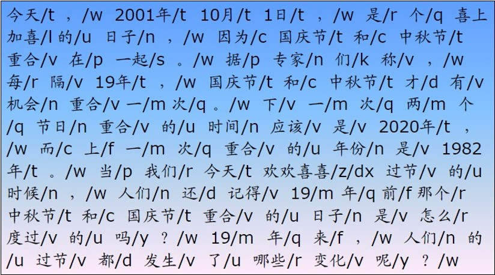
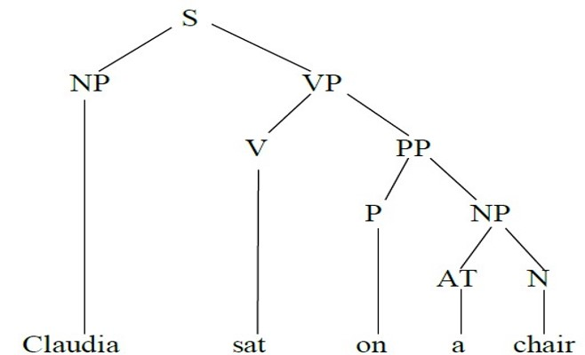
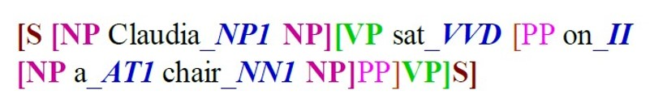
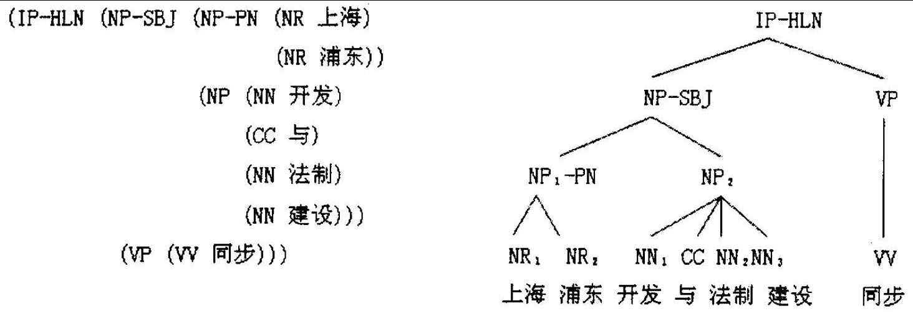
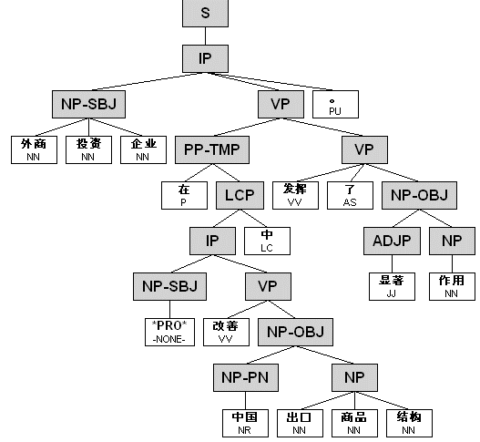
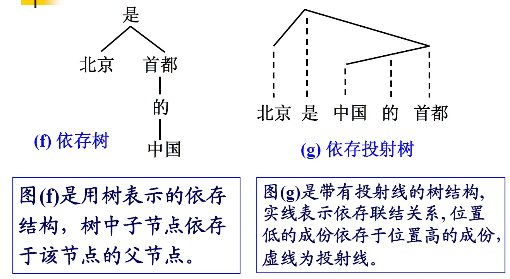
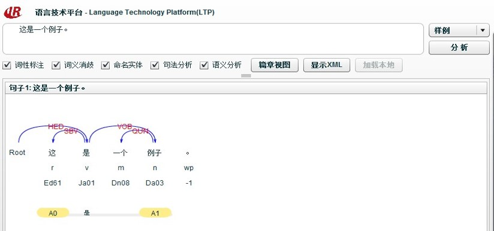
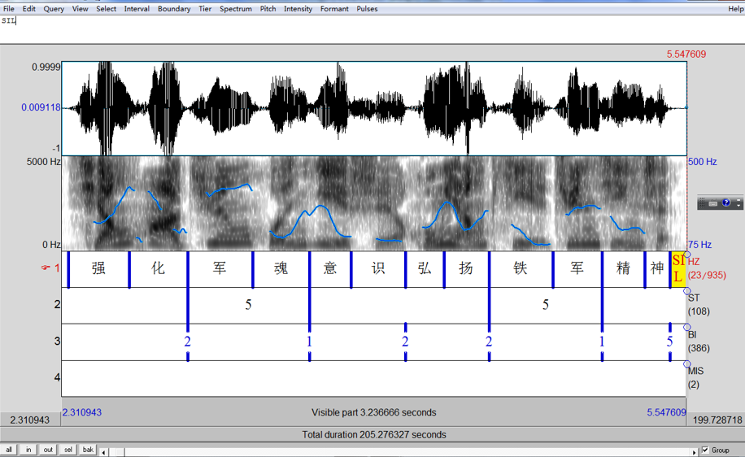
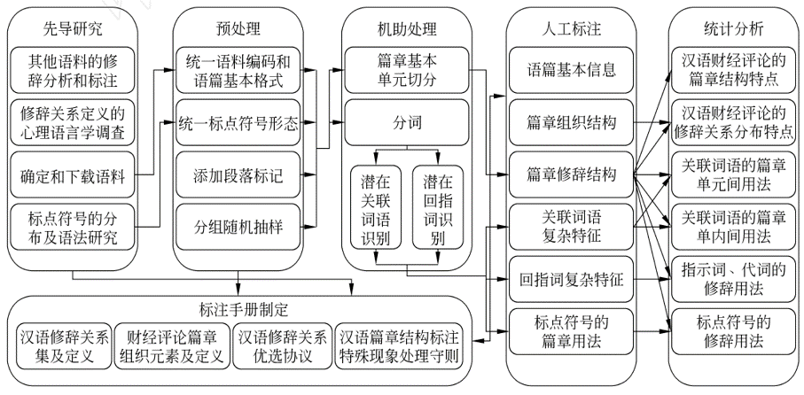
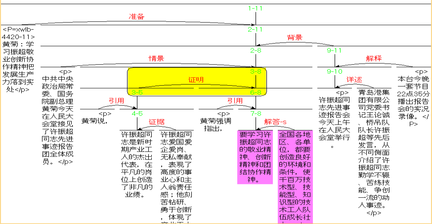

## 第二章 语料库与知识图谱

@@@
主要内容  
1. 语料库语言学概述
2. 语料库的数据采集加工
3. 语料库基本功能及实现
4. 基于语料库的研究：案例分析
5. 知识图谱简介

@@@
### 1 语料库语言学概述

#### 1.1 语料库语言学的定义

- “根据篇章材料对语言的研究称为语料库语言学。”（K.Aijmer & B.Aitenberg, 1991）
- “以语料为语言描写的起点或以语料为验证有关语言的假说的方法称为语料库语言学。”（D. Crystal, 1991）
- “基于现实生活中语言运用的实例进行的语言研究称为语料库语言学”（T.McEnery & A. Wilson, 1996）
~~~~
语料库是存放语言材料的数据库。而语料库语言学则是以语料库为基础的语言研究方法，其包含两层含义：

- 利用语料库对语言的某个方面进行研究，也就是说“语料库语言学”不是一个学科名称，而是一种研究手段。
- 依据语料库所反映出的语言事实对当前的语言学理论进行批判，提出新的观点或理论。

~~~~


#### 1.2 语料库的类型
- 用途：通用语料库、专用语料库；
- 介质：文字语料库、语音语料库；
- 语体：书面语语料库、口语语料库；
- 时间：共时语料库、历时语料库；
- 程度：生语料库、熟语料库；
- 语种：单语语料库、双语语料库（多语语料库）；

- 注：平行语料库（篇章，段落，语句进行对齐处理后的语言库）

~~~~
注：平行语料库（篇章，段落，语句进行对齐处理后的语言库）
~~~~
#### 1.3 语料库语言学的发展

语料库语言学的发展历史，大致可以分为两个阶段：

计算机应用以前，可称为传统语料库时期
计算机应用以后，可称为现代语料库时期
~~~~
##### 传统语料库
- 为词典编纂、语法研究而收集的语料库

例如，牛津英语词典（Oxford English Dictionary），1928年 引证400万条，卡片1100万张；韦伯斯特新国际词典（Webster's New International Dictionary），1961年第三版 新旧引证1000多万条
~~~~
- 为教学目的而编制的书面语料库和词表

例如，陈鹤琴《语体文应用字汇》 商务印书馆 1928年
	两次统计，第一次统计6种教材，包括554,478个汉字的语料，得出不同汉字4261个；第二次使用包含34,818个汉字的语料得出与4261个汉字相异的汉字458个
~~~~
- 为语言调查而收集的方言语料库

19、20世纪，英、美等国都做过大型的方言调查，调查结果形成几个大规模的方言语料库

在我国，运用语料的研究方法可以追溯到周秦，如我国汉语方言学的第一部著作《輶轩使者绝代语释别国方言》简称《方言》是扬雄历经27年完成的。
~~~~
1957年，乔姆斯基的《句法理论》(Syntactic Structures)及其以后的一系列论著的发表，语料库研究的发展被完全否定、受到剧烈震荡。
~~~~
乔姆斯基(Chomsky)认为，语言研究的主要目标是建立一种能够反映说话人心理现实的语言认知模式。……语料从本质上只是外在化的话语的汇集, 基于语料的研究所建立的经验模式充其量只能对语言能力作出部分解释, 因而语料不是语言学家从事语言研究的得力工具。

- 基于语料库的研究方法有误
~~~~
短语结构语法具有递归性：自然语言的句子是无限的，任何有限的语料都不能穷尽语言。
- 语料是不完整、不充分的
~~~~
- 英国伦敦大学学院(University College London )的语言学家夸克（Quirk）开创了新一代的语料库。他在1959年建立英国英语口语和书面语的“英语用法调查”（the Survey of English Usage，简称SEU）语料库的计划，目的是要对英语进行全面的描写。
- 1961年，弗朗西斯（N. Francis）和库塞拉（H. Kucera）为首的一批语言学家和计算机专家汇集在美国的布朗大学合作建成了世界上最早的机读语料库，即布朗语料库（Brown Corpus）。
- 1975年，斯沃特威克（Svartvik）与他在隆德大学的同事把SEU语料库中的口语部分转变为计算机可读的形式，最后建立了“伦敦—隆德英语口语语料库”（LLC）现代语料库
~~~~
现代语料库-第一代语料库（未加分析与标注）
1. 布朗语料库（Brown Corpus）
2. LOB语料库（The Lancaster-Oslo/Bergen Corpus）
3. LLC语料库（London-Lund Corpus of Spoken English）
4. 兰开斯特/IBM英语口语语料库（Lancaster /IBM spoken English corpus)
~~~~
现代语料库-第二代语料库（标注语料库）
1. COBUILD语料库（Collins Birmingham University International Language Database）
2. 英国国家语料库
3. 国际英语语料库
4. 朗文语料库(Longman Corpus Network)
~~~~
第三代语料库——特大型语料库

美国Lexis-Nexis 公司的机储文件已经达到15亿件，有1.5		万亿字符，并且以每周950万件的速度递增
~~~~

- 语料：从单语种到多语种。
- 数量：从百万级到千万级再到亿级和万亿级。
- 加工：从词法级到句法级再到语义和语用级。
- 文本：从抽样到全文。
~~~~
第三代语料库——动态监控语料库

互联网上，英国COBUILD语料库每周向电子邮件用户发送Word Watch（词语监察）的邮件，报告社会用语的动态变化情况
~~~~
第三代语料库——ACL-DCI

- 美国计算语言学学会(The Association for Computational Linguistics, 即ACL)倡议的数据采集计划(Data Collection Initiative, 即DCI)，其宗旨是向非赢利的学术团体提供语料，用标准通用置标语言SGML统一置标，以便于数据交换(Liberman, M.Y. 1990)
~~~~
第三代语料库-[语言资源联盟(Linguistic Data Consortium)](http://www.ldc.upenn.edu)
- 1992年在美国宾夕法尼亚大学(University of Pennsylvania)建立，它的目的是构建、收集和发布用于研发的语音和文本数据库、词典以及其他资源
- 该联盟提供了一种可供大规模发展和普遍的共享用于语言工程技术研究的资源的新机制，目前已经拥有超过100个公司、大学和政府机构会员单位。为197个会员机构和458个非会员机构提供了数据
~~~~
第三代语料库-UPenn树库（宾州树库）
- 由宾夕法尼亚（Pennsylvania）大学计算机系的M. Marcus主持，到1993年完成了近300万词的英语句子的句法结构标注。
- 2000年由LDC（语言数据协会）发行了UPenn的中文树库（规模较小，仅包含10万词，4185句）
~~~~
第三代语料库-ELRA——[欧洲语言资源学会(European Language Resources Association)](http://www.elra.info)
- 1995年在卢森堡成立，开展以语言技术为主的语言资源收集、监测、评估、鉴定、宣传、开发与利用工作，定期召开语言资源与评估国际学术会议(LREC, Language Resources and Evaluation Conference)，出版会刊《语言资源与评估》，力求语言资源建设和评估的科学化
~~~~
第三代语料库——TELRI——[跨欧洲语言资源基础建设学会(Trans-European Language Resources Infrastructure)](http://telri.nytud.hu) 

- 目的是为商业机构、研究团体和大学提供研发平台，为自然语言处理提供单语种和多语种的语言资源
- 主要任务是协调欧洲的多语言信息处理和多语言语料库的建设
- 已建成柏拉图（Plato）的《理想国》（Politeia）多语语料库、计算工具和资源的研究文档TRACTOR（Research Archive of Computational Tools and Resources）、以及欧洲语言词库EUROVOCA
~~~~
第三代语料库（国内）

- 北京语言文化大学还在1992年建成“当代北京口语语料库”，收录80年代北京口语录音（378人）转写语料170万字，其中40万字进行了分词和词性标记；
- 北京语言文化大学1995年完成“现代汉语语法研究语料库”，生语料2000万字，分词和词性标注语料200万字，其中还有部分句法标记；
~~~~
- 北京语言文化大学1995年完成“汉语中介语语料库系统”，从来自96个国家和地区的1635位留学生的5774篇语料中抽取740人的1731篇语料，共44218句，1041274字，语料进行了分词和词性标注及一些特殊的语言学标注；

- 中文语言资源联盟（ChineseLinguistic Data Consortium，缩写为ChineseLDC）——http://www.chineseldc.org/

- 国际中文语言资源联盟（Chinese Corpus Consortium, 缩写为CCC）——http://www.d-ear.com/ccc/index.htm
~~~~
北京语言大学语言BBC
- BCC汉语语料库，总字数约 150 亿字，包括：报刊（20 亿）、文学（30 亿）、微博（30 亿）、科技（30 亿）、综合（10 亿）和古汉语（20 亿）等多领域语料。


@@@

### 2 语料库的数据采集加工
~~~~
#### 2.1 文本采集与加工
- 文本采集
- 文本加工
~~~~
##### 文本采集
1. 报纸电子版
2. 网络新闻
3. 微博
4. 知乎
5. 豆瓣
6. 电子书

~~~~
引入所需模块
```Python
import requests
import bs4
import os
import datetime
import time
import json
import pandas as pd
```
~~~~
获取网页内容
```Python
def fetchUrl(url):
	'''
	功能：访问 url 的网页，获取网页内容并返回
	参数：目标网页的 url
	返回：目标网页的 html 内容
	'''
	headers = {
		'accept': 'text/html,application/xhtml+xml,application/xml;q=0.9,image/webp,image/apng,*/*;q=0.8',
		'user-agent': 'Mozilla/5.0 (Windows NT 10.0; WOW64) AppleWebKit/537.36 (KHTML, like Gecko) Chrome/68.0.3440.106 Safari/537.36',
	}
	r = requests.get(url,headers=headers)
	r.raise_for_status()
	r.encoding = r.apparent_encoding
	return r.text
```
~~~~
获取当天报纸的各版面的链接列表
```Python
def getPageList(year, month, day):
	'''
	功能：获取当天报纸的各版面的链接列表
	参数：年，月，日
	'''  
	url = 'http://paper.people.com.cn/rmrb/html/' + year + '-' + month + '/' + day + '/nbs.D110000renmrb_01.htm'
	html = fetchUrl(url)
	bsobj = bs4.BeautifulSoup(html,'html.parser')


	pageList = bsobj.findAll(id="pageLink")
	linkList = []
	
	for page in pageList:
		link = page.get('href')
		url = 'http://paper.people.com.cn/rmrb/html/'  + year + '-' + month + '/' + day + '/' + link
		linkList.append(url)
	
	return linkList
```
~~~~
获取报纸某一版面的文章链接列表
```Python
def getTitleList(year, month, day, pageUrl):
	'''
	功能：获取报纸某一版面的文章链接列表
	参数：年，月，日，该版面的链接
	'''
	html = fetchUrl(pageUrl)
	bsobj = bs4.BeautifulSoup(html,'html.parser')

	titleList = bsobj.find('div', attrs = {'class': 'news'}).ul.find_all('li')
	linkList = []
	
	for title in titleList:
		tempList = title.find_all('a')
		for temp in tempList:
			link = temp["href"]
			if 'nw.D110000renmrb' in link:
				url = 'http://paper.people.com.cn/rmrb/html/'  + year + '-' + month + '/' + day + '/' + link
				linkList.append(url)
	
	return linkList
```
~~~~
```Python
解析 HTML 网页，获取新闻的文章内容
def getContent(html):
	'''
	功能：解析 HTML 网页，获取新闻的文章内容
	参数：html 网页内容
	'''	
	bsobj = bs4.BeautifulSoup(html,'html.parser')
	
	# 获取文章 标题
	title = bsobj.h3.text + '\n' + bsobj.h1.text + '\n' + bsobj.h2.text + '\n'
	#print(title)
	
	# 获取文章 内容
	pList = bsobj.find('div', attrs = {'id': 'ozoom'}).find_all('p')
	content = ''
	for p in pList:
		content += p.text + '\n'	  
	#print(content)
	
	# 返回结果 标题+内容
	resp = title + content
	return resp
```
~~~~
抓取指定日期的新闻内容，并存储到指定路径
```Python
def download_rmrb(path,year, month, day):
	pageList = getPageList(year, month, day)
	print(pageList)
	for page in pageList:
		titleList = getTitleList(year, month, day, page)
		for url in titleList:
			html = fetchUrl(url)
			content = getContent(html)
			#print(content)
			temp = url.split('_')[2].split('.')[0].split('-')
			pageNo = temp[1]
			titleNo = temp[0] if int(temp[0]) >= 10 else '0' + temp[0]
			newsid = year + month + day + '-' + pageNo + '-' + titleNo
			date = year +'-'+ month+'-' + day
			newsid= newsid

			filePath= path+str(newsid)
			print(content)
			writer = open(filePath,"w",encoding="utf-8")
			writer.write(content)
			writer.close()
```
~~~~
入口函数
```Python
if __name__ == '__main__':
	path = "data/"
	datelist=['2020-12-12','2020-12-13']
	for datestr in datelist:
		dateArray= datestr.split("-")
		year=dateArray[0]
		month=dateArray[1]
		day=dateArray[2]
		download_rmrb(path,year,month,day)
```
~~~~
#### 2.2 语料库的标注
~~~~
- 标注（Annotation）?

An annotation is the fundamental act of associating some content to a region in a signal (Christophe Laprun et al. 2002)
~~~~
- 标注：
1. 是一种将隐含的（语言学）知识形式表示的过程；
2. 是将非结构化的文本转换为半结构化文本的重要环节；
3. 是将文本变为知识的过程。
~~~~
微博文本情绪标注样例
```
<?xml version="1.0" encoding="UTF-8"?>
<SampleData>
  <weibo id="1" emotion-type="none">
    <sentence id="1" emotion_tag="N">三八节下午路过中牟县~见到很多美女~手执鲜花[鲜花]~一打听~这里不仅美女如云~而且是千古笫一帅哥潘安的故里。。。</sentence>
    <sentence id="2" emotion_tag="N">[给力][萌]</sentence>
  </weibo>
  <weibo id="2" emotion-type="sadness">
    <sentence id="1" emotion_tag="Y" emotion-1-type="like" emotion-2-type="none">源海都学愤怒鸟的声音，好像好厉害…</sentence>
    <sentence id="2" emotion_tag="Y" emotion-1-type="sadness" emotion-2-type="none">还比愤怒鸟射击的动作，我为啥一千啊现在…</sentence>
    <sentence id="3" emotion_tag="Y" emotion-1-type="sadness" emotion-2-type="anger">海赫还悄悄话了刚才，怎么不是我四千二的时候啊哈哈，悲愤！</sentence>
  </weibo>
</SampleData>

```
~~~~
##### 2.2.1  标注的一般原则
~~~~
- 基本原则(1) (Leech, 1993)

1. 标注附码可以删除，可以恢复到原始语料
1. 所作的标注可以单独抽出，另外储存
1. 语料的最终使用者应该清楚标注的原则和附码的意义
1. 在语料的使用和说明文件中，应该说明标注者以及标注所使用的方法
1. 应向用户表明，语料的标注并非完美无缺，它只是一种可能有用的工具
1. 标注应该尽量采用被人们普遍接受的中立的模式
1. 任何标注模式都不能作为第一标准
~~~~
- 基本原则(2) (何婷婷，2003)

1. 原始语料和标记符号的数据独立性原则
1. 语料标注的公开性原则
1. 语料标注的通用性原则
1. 语料标注的折衷性原则
1. 语料标注的一致性原则
1. 标注符号的确定性原则
1. 用户知情权原则
~~~~
保证标注基本原则得到有效执行需要处理好几个关系
~~~~
1. 详细标注和简单标注的关系
- 标注工作的难度、工作量
- 制定标注原则的难度
~~~~
- 区别词＋名词，双音节组合，为一个切分单位，标注为名词（即n）
- 区别词＋名词，多音节组合，切分

```
红花/n，绿皮/n，牛皮/n 
红/j 袖章/n，绿/j 果子/n，山羊/n 皮/n
```
~~~~
从制定标注原则难度的角度出发，考虑上例中“红”字作形容词在语料库中出现的概率是多少？
语料库中出现的不同词条数有多少？常用词的出现频率如何？
```
红/j 花/n
绿/j 果子/n
```
~~~~
2. 通用性和专用性的关系

分词单位是汉语信息处理使用的、具有确定的语义或语法功能的基本单位，包括本规范的规则限定的词和词性。——《信息处理用现代汉语分词规范》

~~~~
3. 原则性和灵活性的关系
4. 绝对性和模糊性的关系


~~~~
##### 2.2.2  词性标注(Part-of-Speech tagging, POS)
~~~~
让计算机将连续的语流串自动转换为以词为单位的形式。


分词单位：汉语信息处理使用的、具有确定的语义或语法功能的基本单位。包括本规范的规则限定的词和词组，其中词和词组这两个概念与语言学中的相同。(国家标准《信息处理用现代汉语分词规范》)
~~~~
词的“真实境界”：清晰与模糊的混合体(孙茂松等，1997)


~~~~
- 标记集的确立

北大26个词类标记：
名词n、时间词t、处所词s、方位词f、数词m、量词q、区别词b、代词r、动词v、形容词a、状态词z、副词d、介词p、连词c、助词u、语气词y、叹词e、拟声词o、成语i、习用语l、简称j、前接成分h、后接成分k、语素g、非语素字x、标点符号w
~~~~
增加的3类标记：
1. 专有名词的分类标记，即人名nr，地名ns，团体机关单位名称nt，其他专有名词nz；
2. 语素的子类标记，即名语素Ng，动语素Vg，形容语素Ag，时语素Tg，副语素Dg等；
3. 动词和形容词的子类标记，即名动词vn（具有名词特性的动词），名形词an（具有名词特性的形容词），副动词vd（具有副词特性的动词），副形词ad（具有副词特性的形容词）。

~~~~

~~~~
- CLAWS标注示例
CLAWS是英语Constituent-LikelihoodAutomaticWord-taggingSystem（成分似然性自动词性自动标注系统）的简称，它是1983年玛沙尔(Mashall)在给LOB语料库（拥有各类文体的英国英语语料库，库容量为100万词）作自动词性标注时提出的一种算法。
~~~~
Further research is needed to determine the optimum inclusion level of sorghum DDGS in the diet, determine the effects of sorghum DDGS in a one phase feeding regime (grower or finisher only), as well as to better understand the effects of sorghum DDGS on rumen metabolism and protein digestibility.
~~~~
<s>Further_JJR research_NN1 is_VBZ needed_VVN to_TO determine_VVI the_AT optimum_JJ inclusion_NN1 level_NN1 of_IO sorghum_NN1 DDGS_NP1 in_II the_AT diet_NN1 ,_, determine_VV0 the_AT effects_NN2 of_IO sorghum_NN1 DDGS_NP1 in_II a_AT1 one_MC1 phase_NN1 feeding_VVG regime_NN1 (_( grower_NN1 or_CC finisher_NN1 only_RR )_) ,_, as_RG well_RR as_CSA to_TO better_RRR understand_VVI the_AT effects_NN2 of_IO sorghum_NN1 DDGS_NP1 on_II rumen_NN1 metabolism_NN1 and_CC protein_NN1 digestibility_NN1 ._. </s>
~~~~
##### 2.2.3  句法标注(Grammatical Parsing)

1. 句法标注的形式
2. 树库（存储句法分析结果的数据库）
~~~~
1. 句法标注的形式
	- 树形图
	- 短语标记
~~~~
(S=句子,NP=名词短语,VP=动词短语,PP=介词短语,N=名词,V=动词,P=介词,AT=冠词)
~~~~

~~~~
该句子的结构也可以用一横排的格式来表示（即与树形结构等价的线性序列）,例如,英国国家语料库(BNC)把上述句子标注为(其中包含词性标注):



~~~~
2. 树库（存储句法分析结果的数据库）
	- 短语结构树库
	- 依存结构树库
~~~~
短语结构树库一般采用句子的结构成分描述句子的结构。
~~~~

~~~~

宾州中文树库（PennCT）的标注体系最初的采用了骨架分析(Skelton Parsing)思想，形成比较扁平的句法结构树。其中，PennCT( Penn Chinese Treebank)由宾夕法尼亚大学计算机与信息科学学院组织标注。语料规模约1.9万句子、50.7万词语、82.5万汉字。PennCT对句子进行了分词、词性标注、短语结构句法树构建。其词性标注集包含33种词性。PennCT的短语结构采用了分层的标注体系，不但包含结构标记，而且还采用了功能标记。如右图，“外商投资企业”的短语类型为NP-SBJ，表示结构类型为NP，功能类型为SBJ（主语）
~~~~

~~~~
清华大学树库中的标注方法
- 输入句子:我/rN哥哥/n送/v给/v我/rN一/m本/qN很/d漂亮/a的/u书/n。/w
- 功能语块标注结果:[S我/rN哥哥/n][P送/v给/v][O我/rN][O一/m本/qO很/d漂亮/a的/u书/n]。/w
- 句法树分析和校对结果:[zj-XX[dj-ZW[np-DZ我/rN哥哥/n][vp-PO[vp-PO[vp-SB送/v给/v]我/rN][np-DZ[mp-DZ一/m本/qN][np-DZ[ap-ZZ很/d漂亮/a]的/u书/n]]]]。/w]
~~~~
(zj:整句dj:单句句型vp:动词短语np:名词短语ap:形容词短语
mp:数量短语XX:缺省关系ZW:主谓结构DZ:定中结构 PO:述宾结构 
SB:述补结构ZZ:状中结构)

~~~~
依存结构树库是根据句子的依存结构而建立的树库。

~~~~
依存语法通过分析语言单位内成分之间的依存关系揭示其句法结构，主张句子中核心动词是支配其它成分的中心成分，而它本身却不受其它任何成分的支配，所有受支配成分都以某种依存关系从属于支配者。
~~~~

~~~~
哈尔滨工业大学[LTP](http://ir.hit.edu.cn/demo/ltp)依存分析模块所使用的依存关系标记含义（共24个）
~~~~
1. 定中关系ATT（attribute）
1. 数量关系QUN（quantity）
1. 并列关系COO（coordinate
1. 同位关系APP（appositive）
1. 前附加关系LAD（left adjunct）
1. 后附加关系RAD（right adjunct）
1. 动宾关系VOB（verb-object）
1. 介宾关系POB（preposition-object）
1. 主谓关系SBV（subject-verb）
1. 比拟关系SIM（similarity）
1. 核心HED（head）
1. 连动结构VV（verb-verb）
~~~~
13. 关联结构CNJ（conjunctive）
1. 语态结构MT（mood-tense）
1. 独立结构IS（independent structure）
1. 状中结构ADV（adverbial）
1. 动补结构CMP（complement）
1. “的”字结构DE
1. “地”字结构DI
1. “得”字结构DEI
1. “把”字结构BA
1. “被”字结构BEI
1. 独立分句IC（independent clause）
1. 依存分句DC（dependent clause）

~~~~

##### 2.2.4  语义标注(Word sense tagging/Anaphoric annotation)
语义标注主要包括语言单位的语义特征以及语言单位之间的语义关系。所谓词的语义自动标注就是计算机利用逻辑运算和推理机制，对出现在一定上下文中的词语的义项进行正确的判别和标注。
~~~~
语义标注的步骤:
1. 每个需要进行义项标注处理的多义词，预先得有关于它的各个不同义项的清晰的区分
2. 对出现在具体语境中的每个多义词，给它确定一个合适的义项
~~~~
义项的标注:

这件衣服很<font>肥</font>。(宽大)
这块儿地真<font>肥</font>。(肥沃)
这头猪很<font>肥</font>。	(脂肪多)

~~~~

##### 2.2.5  语音/韵律标注(Prosodic Labeling/Annotation)

~~~~
韵律
- 韵律就是声韵和节律，指事物在不断地重复中变化、发展。
- 韵律广泛存在于艺术中，如错落有致的建筑、体操运动、音乐、诗歌等。
- 语音的韵律包括重音、停连、语气、节奏等。
- 重音——对话语焦点的凸显，借助时长和音高来实现
- 语调——语句音高变化的总体模式，依据TOBI定义，包括高调（H）、低调（L），分为语调短语边界调（%）、韵律短语边界调（-）、音高重音（\*），同时定义了辅助标记即相邻调（+）、降阶（！）
- 停顿——借助音高的断续、重置，以及无声段、边界前音节延长来实现。
- 节奏——语音中交替出现的有规律的强弱、长短的现象。
韵素音节音步,音步实现韵律词
- 汉语最基本的音步是双音节，例如“我们”、“北大”
- 音步是最小的节奏单元，必须是一个二分体，具有轻重结构。
- 双音节1+1，三音节1+2或2+1，例如“修马路、修建路”
~~~~
节律与语法并不一致

热 心肠$\rightarrow$热心 肠

瞧你 这暑假 忙得$\rightarrow$瞧你这 暑假 忙得

来 俩 火烧$\rightarrow$来俩 火烧
~~~~
语音标注
- 标注什么内容，取决于标注的目的。
- 一般研究需要，通常可以标注文字、拼音、声韵母、间断指数、重音、语调、说话人、副语言、非语音等信息。
~~~~
- 间断指数是韵律单位的边界层级描述，好比成分分析。韵律单位的层级结构从下到上可以分为韵律词$\rightarrow$韵律短语$\rightarrow$语调短语$\rightarrow$语调组群$\rightarrow$语段。
- 副语言，狭义的副语言是指笑声、咳嗽、不连贯等口语现象，广义的副语言还包括身体语言。

~~~~
韵律标注示例



~~~~


##### 2.2.6  [修辞结构理论](http://www.sfu.ca/rst/index.html
)
Mann, W.C., & Thompson, S.A. 1988. Rhetorical Structure Theory: Toward a functional theory of text organization. Text, Vol.8, No.3, pp. 243-281. 
~~~~
在RST理论中，篇章整体关系是由上层的整篇文本的结构框架(Schema)和基层的局部段落中句与句之间的连贯关系(Coherence relations)这两个层次搭建起来的:

1. 句子与句子形成具有基本连贯关系和复杂连贯关系的单元；
1. 这些单元再组织为一定的结构框架，从而叠床架屋地形成一个完整的篇章。
~~~~
基层篇章结构

- 篇章基本单位：span（片段）

篇章知识：
1. 有关联的两个span通常是相邻的；
1. 若A和B是两个有关联的span，A通常扮演着B的某个角色，或者扮演着A的某个角色；
~~~~
- 在span的基础上，可以定义两个span之间的关联（Relation）
- 一般来说，满足一定关系的两个span，一个居于核心地位（Nucleus），一个居于从属地位（Satellite）。
~~~~
修辞结构理论关系类型示例

- Concession(让步)：
	尽管他很有道理（B），但还是没有说服他的母亲（A）。
- Condition(条件)：
	只要他有道理（B），他就可以说服他的母亲（A）。
- Evidence(证明)：
	因为他说的有道理（B），所以他母亲相信了（A）。
~~~~


~~~~

~~~~
#### 2.3 语料分词标注

~~~~
Jieba安装

切换到当前anoconda的虚拟环境下
activate YOURNAME
~~~~
```Python
# encoding=utf-8
import jieba


seg_list = jieba.cut("我来到北京清华大学", cut_all=True)
print("Full Mode: " + "/ ".join(seg_list))  # 全模式

seg_list = jieba.cut("我来到北京清华大学", cut_all=False)
print("Default Mode: " + "/ ".join(seg_list))  # 精确模式

seg_list = jieba.cut("他来到了网易杭研大厦")  # 默认是精确模式
print(", ".join(seg_list))

seg_list = jieba.cut_for_search("小明硕士毕业于中国科学院计算所，后在日本京都大学深造")  # 搜索引擎模式
print(", ".join(seg_list))
```

#### 2.4 数据存储


@@@
### 3 语料库基本功能及实现
#### 3.1 语料库检索
#### 3.2 词表及其生成
#### 3.3 主题词表及其生成
#### 3.4 语料库常用统计方法
@@@


### 4 基于语料库的研究：案例分析

#### 4.1　词汇分析
4.1.1　基于语料库的词块分析
#### 4.2　句法结构及类联接研究
4.2.1　基于语料库的句法结构分析
4.2.2　类联接扩展及研究
#### 4.3　话语研究

4.3.1　话语与话语特征
4.3.2　语料库在话语研究中的应用
@@@
### 5 知识图谱简介

#### WordNet
#### HowNet
#### FrameNet
