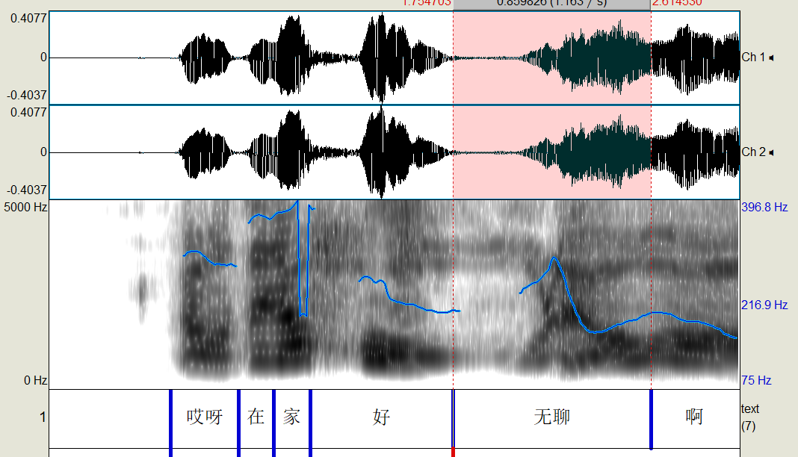

# 汉语语音情绪分析框架研究
@@@
## 1 研究背景

- 情绪识别作为人机交互 (HCI) 、人工智能（AI）的重要组成部分,并涉及图像、文本和语音情绪识别等领域。
- 有关图像情绪识别的技术在深度学习的当下有了长足的发展。[1,2]
- 文本和语音情感密切相关，但两种情感都有不同的挑战。文本情绪识别的挑战之一是多个维度语言信息缺失导致语义、情感信息传递准确 [3, 4]。
- <u>语音情绪识别（SER）在语音识别及人机交互 (HCI) 等领域具有重要作用。</u>

~~

## 2 相关技术

1. 特征抽取
2. 分类算法
3. 深度学习算法
4. 情绪表征方式
~~
### 1.特征抽取

1. 韵律特征
	- 语音特征提取是从语音波形中提取随时间变化的语音特征序列。
	- 音高、音长、音强、基频、共振峰、过零率
	- 特点是动态表达
2. 音质特征
	- 带宽、振幅扰动、相位、频率微扰、声门参数
3. 谱特征
	- 梅尔频率倒谱系数（Mel―Frequency Cepstrum Coefficients,MFCC）
	- 线性预测系数(Linear Predictive Cepstrum Coefficients,LPC)
	- 对数频率功率系数(Log Frequency Power Coefficients,LFPC)
	- 单边自相关线性预测系数(One-side Auto Correlation Linear Predictor Coefficient,OSALPC)

### 2.常用分类器

- 隐马尔可夫模型(Hidden Markov Model,HMM)
- 高斯混合模型(Gaussian Mixture Model,GMM)
- 支持向量机(Support Vector Machine,SVM)
- 卷积神经网络(Convolutional Neural Networks, CNN)
- 循环神经网络(Recurrent Neural Network,RNN)

### 3.语音情绪模型

- 端到端学习（End-to-End Learning）

端到端将分步解决的中间步骤连接整合在一起，成为一个黑箱，能看看到的只是输入的数据和输出的结果，就是从数据的端，到了结果的端。

与此相对的是，非端到端学习，例如，传统的文本分类，分为下面几个步骤：文本数据预处理，分词，特征提取（keywords等），构建文本矩阵，选择适合的分类器建模，利用分类器对测试数据进行分类。

其中每一步你都进行了设计，筛选，不是黑箱。而端到端的做法应该是输入文本数据，特征提取和分类器在黑箱中，最终得到的只有结果。

### 4.情绪表征方式
1. 离散型
2. 维度型

~~

~~
 常见离散型语音情感数据库

   | 数据库  | 语种   | 获取方式 | 情感数量 | 录音人数    | 语料内容                    |
   | ------- | ------ | -------- | -------- | ----------- | --------------------------- |
   | Belfast | 英语   | 表演     | 5        | 20 男 20 女 | 5 个段落，每段 7 ～8 个句子 |
   | EMO-DB  | 德语   | 表演     | 7        | 5 男 5 女   | 535 句                      |
   | AIBO    | 德语   | 自然     | 11       | 21 男 30 女 | 48401 个单词  9.2 小时      |
   | CASIA   | 汉语   | 表演     | 5        | 2 男 2 女   | 9600 句                     |
   | CHEAVD  | 汉语   | 表演     | 6        | 238 人      | 140 分钟                    |
   | 北航库  | 汉语   | 表演     | 5        | 4 男 3 女   | 1140 句                     |
   | EESDB   | 普通话 | 表演     | 7        | 11 人       | 427 句                      |
   | DES     | 丹麦语 | 表演     | 5        | 4           | 2 个字，9 段句子，2 篇短文  |
~~
 
常见维度型语音情感数据库

 | 数据库  | 场景   | 录音人数 | 情感维度 | 标签类型    | 工具                    |
   | ------- | ------ | -------- | -------- | ----------- | --------------------------- |
| VAM | 脱口秀   | 47     | AVD        | [-1,1]5间隔值 | SAM |
| RECOLA | 视频会议   | 46     | Vi,Au,Ph        | [-1,1]连续值 | SAM |
| IEMOCAP | 对话   | 10     | Vi,Au        | [1,5]整数值 | SAM |
| CreativeIT | 对话   | 16     | Vi,Au        | [-1,1]5间隔值 | FEELtrace |

~~

## 3 语音情绪分析框架

- 基本思想：从感知到认知
- 感知主题既包括人也包括计算机
~~
1. 定义汉语语音情感特征
	- 独立表达情感的最小语音单位
2. 建模方法MFFC+Vector(语音标注信息，语调/音高、音长、句末调、音色（个人），调域（个人相对值）语速（个人相对值）

~~

~~
## 4 数据处理流程

1. 影视剧视频中提取字幕数据
2. 根据情感因子筛选句子
3. 提取语音数据
4. 降噪
5. Praat标注（因子，音标，音节，文字，获取韵律特征）
6. 基于MFFC及韵律特征的混合向量，构建汉语语音情感语言模型（Vector）
7. End-to-End
~~

## 6 应用领域

1. 汉语语音情感语料库
2. Speaker Verification（未知汉语语音的情感/态度判断）

~~
## 7 问题
- 包含复杂情绪、态度的语音会影响常规的语音识别准确率
- 语音与文本之间信息的无损转换
- 语音中包含的情感要素的准确识别
~~
## 参考文献

1. D. Jeong, B.-G. Kim, S.-Y. Dong, Deep joint spatiotemporal network (djstn) for efficient facial expression recognition, Sensors 20(7) (2020) 1936.
2. J.-H. Kim, B.-G. Kim, P.P. Roy, D.-M. Jeong, Efficient facial expression recognition algorithm based on hierarchical deep neural network structure, IEEE Access 7 (2019) 41273–41285.
3. S. Singkul, B. Khampingyot, N. Maharattamalai, S. Taerungruang, T. Chalothorn, Parsing Thai social data: a new challenge for Thai nlp, in: 2019 14th International Joint Symposium on Artificial Intelligence and Natural Language Processing (iSAI-
   NLP), 2019, pp.1–7.
4. S. Singkul, K. Woraratpanya, Thai dependency parsing with character embedding, in: 2019 11th International Conference on Information Technology and Electrical Engineering (ICITEE), 2019, pp.1–5.
5. Mahdhaoui A，Chetouani M，Zong C.Motherese detection based on segmental and super-segmental features[C]//19th International Conference on Pattern Recognition，2008：1409-1412.